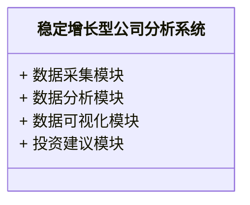
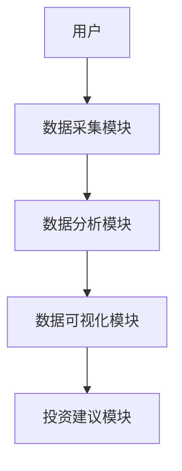
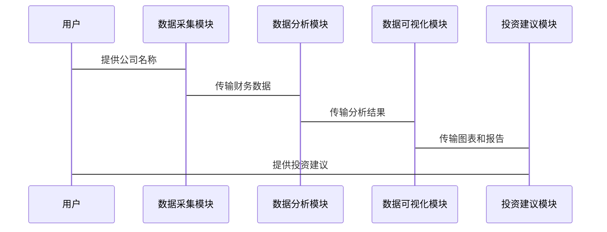

                 


# 稳定增长型公司：彼得·林奇的最爱

> 关键词：稳定增长型公司, 彼得·林奇, 投资策略, 算法原理, 数学模型

> 摘要：本文深入探讨了稳定增长型公司的定义、特点及其在彼得·林奇投资策略中的重要性。通过分析稳定增长型公司的核心概念、算法原理和数学模型，结合系统架构设计和实际案例，详细讲解了如何识别和评估这类公司。文章还提供了最佳实践建议，帮助读者在实际投资中应用这些知识。

---

# 第一部分：稳定增长型公司的背景与核心概念

## 第1章：稳定增长型公司的定义与特点

### 1.1 什么是稳定增长型公司

稳定增长型公司是指那些在较长时期内能够保持稳定且可持续的收入和利润增长的企业。这类公司通常在各自行业中占据领先地位，具有较强的市场竞争力和较高的管理效率。稳定增长型公司的核心特征包括稳定的收入增长、较高的利润率、良好的现金流和较低的财务风险。

### 1.2 彼得·林奇对稳定增长型公司的看法

彼得·林奇是全球著名的职业基金经理人，他的投资理念强调长期稳定的增长。他认为，稳定增长型公司是投资者的首选目标，因为它们能够在经济波动中保持稳定的收益，并为股东创造长期价值。

### 1.3 稳定增长型公司的市场定位

稳定增长型公司通常在各自的细分市场中占据领先地位，具有较高的市场占有率和品牌影响力。它们的产品或服务在市场上具有较强的竞争力，能够在不同经济周期中保持稳定的增长。

---

## 第2章：稳定增长型公司的核心概念与联系

### 2.1 稳定增长型公司的核心概念

稳定增长型公司的核心概念包括以下几个方面：
- **稳定的收入增长**：公司收入在较长时期内保持稳定的增长，通常每年增长率为5%至10%。
- **较高的利润率**：公司具有较强的盈利能力，净利润率较高。
- **良好的现金流**：公司现金流健康，能够支持持续的业务扩张和股息支付。
- **低财务杠杆**：公司负债水平较低，财务风险可控。

### 2.2 稳定增长型公司与其他类型公司的对比

通过对比分析，可以更好地理解稳定增长型公司的特点。以下是与成长型公司、防御型公司和周期性公司的对比：

#### 对比表格：

| 类型                | 收入增长 | 利润率 | 财务杠杆 | 风险 |
|---------------------|----------|--------|----------|------|
| 稳定增长型公司      | 稳定     | 较高    | 低       | 低   |
| 成长型公司          | 高速     | 中高    | 中       | 高   |
| 防御型公司          | 缓慢     | 高      | 低       | 低   |
| 周期性公司          | 波动     | 低      | 中       | 高   |

---

### 2.3 彼得·林奇的选股标准

彼得·林奇在选择稳定增长型公司时，注重以下几个方面：
- **合理的市盈率（P/E）**：市盈率应低于行业平均水平，表明股票价格合理。
- **稳定的收益增长**：公司过去几年的收益应保持稳定增长。
- **良好的管理团队**：公司管理层具有较强的管理能力和清晰的发展战略。
- **健康的财务状况**：公司资产负债表健康，现金流充裕。

---

## 第3章：稳定增长型公司的核心概念原理

### 3.1 稳定增长型公司的增长模型

稳定增长型公司的增长模型可以表示为：

$$ Growth\ Rate = \frac{Net\ Profit\ Growth}{Net\ Profit} $$

其中，净利润增长率是衡量公司增长能力的重要指标。净利润增长率越高，公司的增长潜力越大。

### 3.2 稳定增长型公司的估值模型

常用的估值方法包括市盈率法和股息率法。

#### 市盈率法：
$$ P/E = \frac{Price}{Earnings} $$

#### 股息率法：
$$ Dividend\ Yield = \frac{Dividend}{Price} $$

---

# 第二部分：稳定增长型公司的算法原理与数学模型

## 第4章：稳定增长型公司的算法原理

### 4.1 稳定增长型公司的估值算法

#### 4.1.1 市盈率计算
市盈率（P/E）计算公式：
$$ P/E = \frac{Price}{Earnings} $$

#### 4.1.2 市净率计算
市净率（P/B）计算公式：
$$ P/B = \frac{Price}{Book\ Value} $$

#### 4.1.3 股息率计算
股息率计算公式：
$$ Dividend\ Yield = \frac{Dividend}{Price} $$

### 4.2 稳定增长型公司的增长算法

#### 4.2.1 净利润增长率计算
净利润增长率计算公式：
$$ Growth\ Rate = \frac{Net\ Profit\ Growth}{Net\ Profit} $$

#### 4.2.2 营收增长率计算
营收增长率计算公式：
$$ Revenue\ Growth\ Rate = \frac{Revenue\ Growth}{Revenue} $$

---

## 第5章：稳定增长型公司的数学模型与公式

### 5.1 稳定增长型公司的估值公式

#### 5.1.1 市盈率公式
$$ P/E = \frac{Price}{Earnings} $$

#### 5.1.2 市净率公式
$$ P/B = \frac{Price}{Book\ Value} $$

#### 5.1.3 股息率公式
$$ Dividend\ Yield = \frac{Dividend}{Price} $$

### 5.2 稳定增长型公司的增长模型

#### 5.2.1 净利润增长率公式
$$ Growth\ Rate = \frac{Net\ Profit\ Growth}{Net\ Profit} $$

---

# 第三部分：系统分析与架构设计

## 第6章：稳定增长型公司分析系统的架构设计

### 6.1 问题场景介绍

为了帮助投资者识别和评估稳定增长型公司，我们设计了一个基于算法的分析系统。该系统能够根据公司的财务数据和市场表现，自动计算出公司的市盈率、净利润增长率等关键指标，并给出投资建议。

### 6.2 系统功能设计

系统功能包括数据采集、数据分析、数据可视化和投资建议生成。

#### 领域模型图：



---

## 第7章：系统架构设计

### 7.1 系统架构图



### 7.2 接口设计

系统提供以下接口：
- 数据采集模块：从数据库或API获取公司财务数据。
- 数据分析模块：计算市盈率、净利润增长率等指标。
- 数据可视化模块：生成图表和报告。
- 投资建议模块：根据分析结果给出投资建议。

---

## 第8章：系统交互流程图



---

# 第四部分：项目实战

## 第9章：稳定增长型公司分析系统实战

### 9.1 环境安装

#### 安装Python和相关库
```bash
pip install numpy pandas matplotlib
```

### 9.2 核心代码实现

#### 代码示例：

```python
import pandas as pd
import matplotlib.pyplot as plt

# 数据采集
data = pd.read_csv('company_data.csv')

# 数据分析
growth_rate = data['Net Profit Growth'].mean()
pe_ratio = data['Price'] / data['Earnings']

# 数据可视化
plt.plot(data['Company Name'], pe_ratio, 'ro')
plt.title('市盈率分布')
plt.xlabel('公司名称')
plt.ylabel('市盈率')
plt.show()

# 投资建议
if pe_ratio.mean() < 15:
    print("建议买入")
else:
    print("建议观望")
```

### 9.3 案例分析

以某公司为例，分析其市盈率和净利润增长率，得出投资建议。

---

# 第五部分：最佳实践、小结、注意事项和拓展阅读

## 第10章：最佳实践与小结

### 10.1 最佳实践

- **定期评估**：定期检查投资组合，确保所选公司仍符合稳定增长型公司的标准。
- **分散投资**：避免将所有资金投入到单一行业或公司，降低风险。
- **关注财务报表**：仔细阅读公司的财务报表，关注净利润增长率、市盈率等关键指标。

### 10.2 小结

本文详细介绍了稳定增长型公司的定义、特点及其在彼得·林奇投资策略中的重要性。通过算法原理和数学模型的讲解，结合系统架构设计和项目实战，帮助读者掌握如何识别和评估这类公司。

---

## 第11章：注意事项和拓展阅读

### 11.1 注意事项

- **市场风险**：即使是最稳定的公司，也可能受到市场波动的影响。
- **财务风险**：公司财务状况的变化可能影响其稳定增长的能力。
- **管理风险**：管理层决策失误可能导致公司增长受阻。

### 11.2 拓展阅读

建议读者进一步阅读彼得·林奇的著作，如《彼得·林奇的成功投资策略》和《股票投资策略》。

---

# 作者：AI天才研究院 & 禅与计算机程序设计艺术

