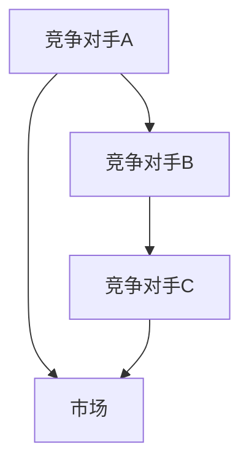
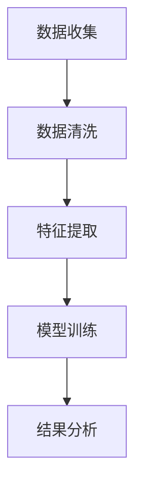
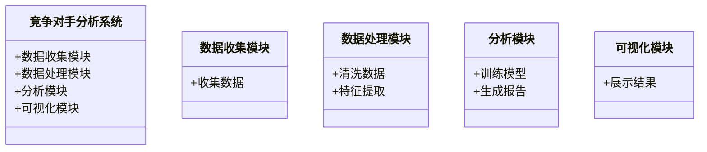
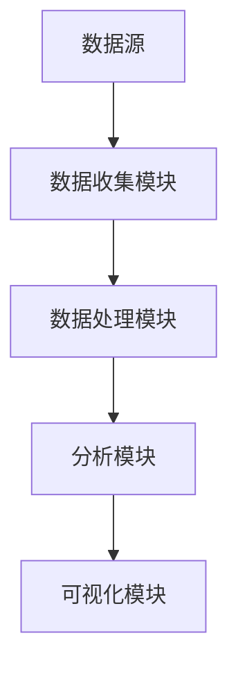
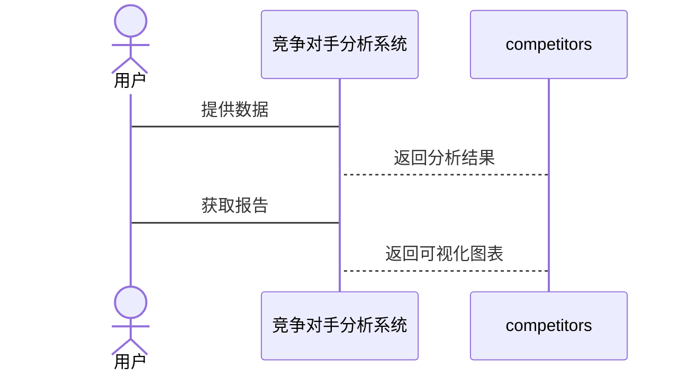

                 


# 竞争对手分析

## 关键词：竞争对手分析，商业策略，数据挖掘，自然语言处理，市场份额

## 摘要

竞争对手分析是企业在竞争激烈的市场中制定有效策略的重要工具。本文将从背景、核心概念、算法原理、数学模型、系统架构、项目实战等方面深入探讨竞争对手分析的各个方面。通过详细讲解信息收集、分析方法、系统设计和实际案例，本文旨在为企业提供科学的竞争对手分析方法，帮助企业在市场中占据优势地位。

---

## 第一部分：背景介绍

### 第1章：竞争对手分析概述

#### 1.1 问题背景

在当今快速变化的商业环境中，企业面临着来自国内外的激烈竞争。竞争对手的市场行为直接影响企业的市场份额和利润。有效的竞争对手分析能够帮助企业识别市场机会，优化产品策略，制定应对措施，从而在竞争中占据优势。

#### 1.2 核心概念与定义

- **竞争对手**：指在同一市场中提供相似产品或服务的企业。
- **竞争对手分析**：通过收集和分析竞争对手的数据，了解其市场行为、产品特点、优势和劣势，制定相应的竞争策略。

#### 1.3 分析的目的与意义

- **识别市场机会**：发现未被满足的市场需求，开发新产品或服务。
- **优化企业战略**：根据竞争对手的动向调整自身战略，增强竞争力。
- **降低风险**：通过了解竞争对手的策略，提前预判市场变化，降低经营风险。

---

## 第二部分：核心概念与联系

### 第2章：竞争对手分析的核心要素

#### 2.1 信息收集与处理

竞争对手分析的第一步是收集相关信息。数据来源包括公开的财务报告、市场调研报告、新闻报道、社交媒体数据等。收集到的数据需要进行清洗和预处理，以确保数据的准确性和可用性。

#### 2.2 分析方法对比

以下是几种常见的竞争对手分析方法对比：

| 分析方法       | 优点                                   | 缺点                                   |
|----------------|----------------------------------------|----------------------------------------|
| SWOT分析       | 全面分析竞争对手的优势和劣势           | 主观性较强，需结合具体情境使用           |
| 波特五力模型     | 从行业结构角度分析竞争环境             | 偏重行业分析，难以具体到单一竞争对手     |
| 市场份额分析     | 客观量化竞争对手的市场表现               | 仅反映市场表现，无法揭示竞争优势         |

通过对比分析方法，企业可以选择最适合自身需求的策略。

#### 2.3 实体关系图

以下是竞争对手分析的实体关系图：



该图展示了竞争对手之间的关系以及他们与市场的联系。

---

## 第三部分：算法原理

### 第3章：竞争对手分析的算法实现

#### 3.1 算法原理

竞争对手分析中常用的算法包括文本挖掘和聚类分析。文本挖掘用于从非结构化数据中提取有用信息，而聚类分析则用于将竞争对手分成不同的类别。

#### 3.2 代码实现

以下是竞争对手分析的Python代码示例：

```python
import numpy as np
from sklearn.cluster import KMeans

# 示例数据：竞争对手的市场份额和产品特点
data = np.array([[80, 20], [60, 25], [70, 18], [50, 30]])

# 使用K-means算法进行聚类分析
kmeans = KMeans(n_clusters=2, random_state=0)
kmeans.fit(data)

# 获取聚类结果
labels = kmeans.labels_
print("聚类结果:", labels)
```

#### 3.3 图形化展示

以下是竞争对手分析的算法流程图：



---

## 第四部分：数学模型

### 第4章：数学模型与公式

#### 4.1 市场份额计算

市场份额的计算公式为：

$$ \text{市场份额} = \frac{\text{销售额}}{\text{市场总量}} $$

例如，某企业在市场中销售额为1000万元，市场总量为5000万元，则市场份额为20%。

#### 4.2 竞争强度分析

竞争强度的计算公式为：

$$ \text{竞争强度} = \sum_{i=1}^{n} (\text{市场份额}_i \times \text{竞争力}_i) $$

其中，$\text{竞争力}_i$表示第i个竞争对手的竞争力指数，通常为1到5之间的数值。

---

## 第五部分：系统架构

### 第5章：系统设计与实现

#### 5.1 功能设计

以下是竞争对手分析系统的领域模型类图：



#### 5.2 系统架构

以下是竞争对手分析系统的架构图：



#### 5.3 接口设计

以下是竞争对手分析系统的接口设计：



---

## 第六部分：项目实战

### 第6章：实际案例分析

#### 6.1 项目背景

假设我们是一家互联网公司，需要分析竞争对手在市场份额、产品功能、市场推广等方面的策略。

#### 6.2 核心代码实现

以下是竞争对手分析项目的Python代码示例：

```python
import pandas as pd
import matplotlib.pyplot as plt

# 示例数据
data = {
    '竞争对手': ['A', 'B', 'C'],
    '市场份额': [30, 25, 45],
    '产品数量': [5, 7, 4]
}
df = pd.DataFrame(data)

# 绘制市场份额柱状图
df.plot(kind='bar', x='竞争对手', y='市场份额')
plt.title('市场份额分析')
plt.show()
```

#### 6.3 案例分析

通过对数据的分析，我们发现竞争对手C在市场份额和产品数量方面具有明显优势。因此，我们需要优化产品功能，提升市场推广力度，以缩小与竞争对手的差距。

---

## 第七部分：总结与扩展

### 第7章：最佳实践与注意事项

#### 7.1 最佳实践

- **数据收集**：确保数据的准确性和全面性。
- **工具选择**：根据需求选择合适的分析工具，如SPSS、Tableau等。

#### 7.2 注意事项

- **数据隐私**：确保在收集和分析数据时遵守相关法律法规。
- **结果解读**：避免仅凭数据表面现象，需结合实际情况进行分析。

#### 7.3 拓展阅读

- 推荐书籍：《竞争战略》（迈克尔·波特）
- 推荐资源：哈佛商学院竞争战略课程

---

## 小结

竞争对手分析是企业在市场中制定有效策略的重要工具。通过科学的方法和工具，企业可以深入了解竞争对手的优势和劣势，制定相应的竞争策略，从而在激烈的市场竞争中占据优势。

---

## 作者

作者：AI天才研究院/AI Genius Institute & 禅与计算机程序设计艺术 /Zen And The Art of Computer Programming

---

感谢您的阅读，希望本文对您在竞争对手分析方面有所帮助。

