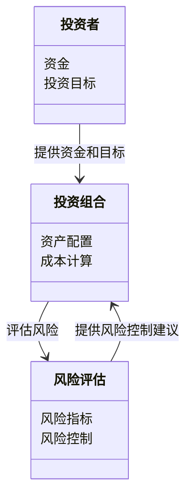
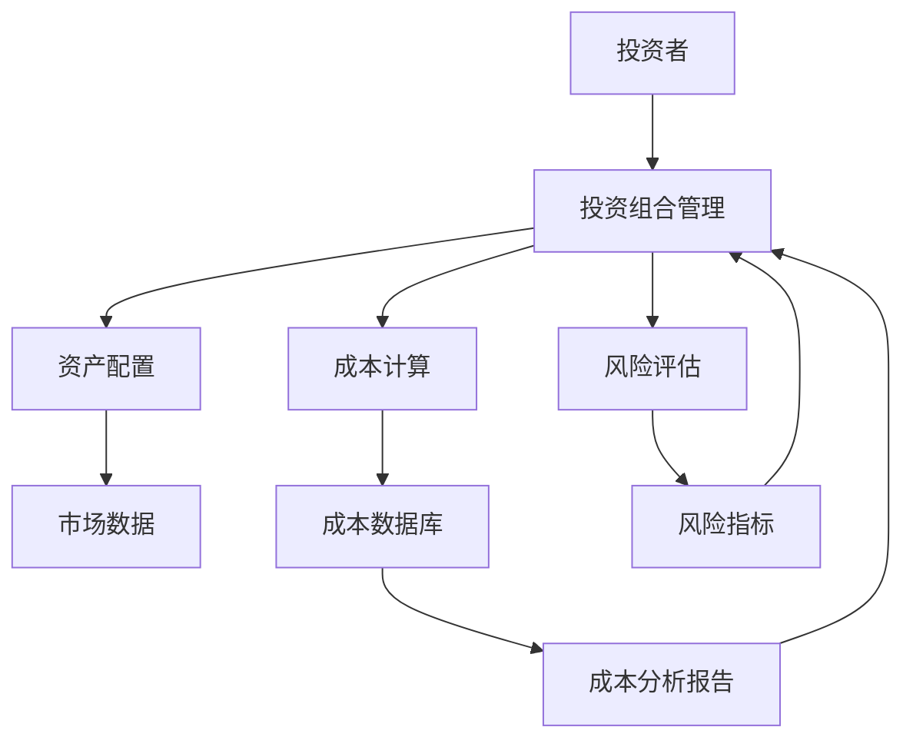

                 


# 约翰·伯格的成本控制投资理念

## 关键词：成本控制，投资理念，约翰·伯格，风险管理，长期收益

## 摘要：约翰·伯格的成本控制投资理念强调在投资过程中通过控制成本来优化收益和风险。本文将从概念、原理、系统分析到项目实战，详细阐述这一理念，并通过实例分析和代码实现，帮助读者深入理解如何在实际投资中应用这一理念。

---

## 第一部分: 成本控制投资理念的背景与核心概念

### 第1章: 成本控制投资理念的基本概念

#### 1.1 成本控制的定义与基本原理
- **1.1.1 成本控制的基本概念**
  成本控制是指在投资过程中，通过合理规划和优化资源配置，降低不必要的开支，从而提高投资收益的过程。成本控制不仅涉及显性成本（如交易费用、管理费用），还包括隐性成本（如时间成本、机会成本）。

- **1.1.2 成本控制的核心原理**
  成本控制的核心在于平衡投入与回报。通过分析和优化每一分钱的使用，确保资金用于最能产生收益的领域。这需要对投资组合进行细致的分析和持续的监控。

- **1.1.3 成本控制的边界与外延**
  成本控制的边界在于不损害投资的基本功能，即不因过度追求低成本而影响投资的流动性或收益性。外延则包括成本控制在不同投资策略中的应用，如股票投资、债券投资等。

#### 1.2 约翰·伯格投资理念的背景介绍
- **1.2.1 约翰·伯格的生平简介**
  约翰·伯格（John C. Bogle）是美国著名投资专家， Vanguard 集团的创始人。他以倡导低成本投资策略闻名，强调长期投资和价值投资的重要性。

- **1.2.2 伯格的成本控制投资理念的提出背景**
  在20世纪70年代，伯格观察到传统投资行业存在高额的管理费用和交易费用，这些费用严重侵蚀了投资者的长期收益。他提出成本控制理念，倡导通过降低费用来提升投资回报。

- **1.2.3 成本控制在投资中的重要性**
  成本控制是投资成功的关键因素之一。高成本的投资组合可能导致长期收益的大幅下降，而低成本的投资组合则能为投资者带来更高的净收益。

#### 1.3 成本控制与投资绩效的关系
- **1.3.1 成本控制对投资收益的影响**
  成本控制直接影响投资的净收益。长期来看，低成本投资组合的表现通常优于高成本的投资组合。

- **1.3.2 成本控制对投资风险的控制**
  通过降低成本，投资者可以增加可投资资金，从而分散风险，提高投资组合的稳定性。

- **1.3.3 成本控制与长期投资绩效的关联**
  长期投资绩效的核心是复利效应。低成本投资组合的复利效应更显著，能够为投资者创造更多的长期收益。

---

### 第2章: 成本控制投资理念的核心要素

#### 2.1 成本控制的核心要素分析
- **2.1.1 投资成本的构成要素**
  投资成本包括管理费用、交易费用、托管费用等。这些费用会直接减少投资的净收益。

- **2.1.2 成本控制的关键因素**
  成本控制的关键在于优化投资组合的结构，选择低成本的投资工具，如指数基金，避免频繁交易和高额佣金。

- **2.1.3 成本与收益的平衡点**
  成本控制不是一味追求最低成本，而是要在成本与收益之间找到最佳平衡点，确保在合理成本范围内实现最大收益。

#### 2.2 成本控制与投资策略的联系
- **2.2.1 成本控制在资产配置中的作用**
  通过成本控制，投资者可以优化资产配置，将更多资金分配到高收益、低成本的资产类别中。

- **2.2.2 成本控制对投资组合优化的影响**
  成本控制有助于提高投资组合的整体效率，减少不必要的开支，从而提升组合的收益表现。

- **2.2.3 成本控制与风险管理的结合**
  低成本投资策略通常具有更高的风险承受能力，因为它们能够分散投资风险，降低因高成本带来的流动性压力。

#### 2.3 成本控制的数学模型与公式
- **2.3.1 成本控制的数学表达式**
  投资的总成本可以用以下公式表示：
  $$ C = \sum_{i=1}^{n} c_i $$
  其中，\( c_i \) 是每个投资项目的成本，\( n \) 是投资项目总数。

- **2.3.2 投资收益与成本的关系公式**
  投资收益与成本的关系可以用以下公式表示：
  $$ R = R_{\text{市场}} - C $$
  其中，\( R \) 是投资净收益，\( R_{\text{市场}} \) 是市场基准收益，\( C \) 是投资总成本。

---

### 第3章: 成本控制投资理念的系统分析与架构设计

#### 3.1 系统分析与问题场景介绍
- **3.1.1 成本控制投资系统的功能需求**
  该系统需要具备成本计算、风险评估、资产配置等功能。

- **3.1.2 系统的输入与输出分析**
  输入包括投资金额、投资期限、市场数据等，输出包括投资成本、预期收益、风险评估等。

#### 3.2 系统架构设计
- **3.2.1 领域模型设计**
  使用 mermaid 类图表示系统的功能模块和交互关系。



- **3.2.2 系统架构设计**
  使用 mermaid 架构图展示系统的整体架构。



---

## 第4章: 成本控制投资理念的项目实战

### 4.1 环境安装与配置
- 需要安装 Python 和相关库（如 pandas、numpy、matplotlib）。

### 4.2 核心代码实现
- 使用 Python 实现一个简单的成本控制模型，计算不同成本下的投资收益。

#### 4.2.1 成本计算函数
```python
def calculate_cost(fees, transactions):
    return sum(fees * transaction for transaction in transactions)
```

#### 4.2.2 投资收益计算函数
```python
def investment_return(principal, rate, years):
    return principal * (1 + rate) ** years
```

#### 4.2.3 示例代码
```python
principal = 10000
annual_rate = 0.07
years = 10
transactions = 5
fees = 100

total_cost = calculate_cost(fees, transactions)
net_principal = principal - total_cost
return_amount = investment_return(net_principal, annual_rate, years)
print(f"净投资收益: {return_amount:.2f}")
```

#### 4.2.4 代码解读与分析
- 代码实现了基本的成本计算和投资收益计算，展示了低成本投资的优越性。

### 4.3 实际案例分析
- 以股票投资为例，分析不同成本下的投资收益差异。

### 4.4 项目小结
- 总结项目成果，强调低成本投资的重要性。

---

## 第5章: 成本控制投资理念的最佳实践

### 5.1 投资策略建议
- 选择低成本的指数基金，避免频繁交易。

### 5.2 风险管理建议
- 通过分散投资降低风险，定期评估和调整投资组合。

### 5.3 小结
- 总结全文，强调成本控制在投资中的核心作用。

### 5.4 注意事项
- 提醒投资者注意市场波动、投资期限和自身风险承受能力。

### 5.5 拓展阅读
- 推荐进一步阅读的书籍和资源，如《投资最重要的常识》。

---

## 作者：AI天才研究院 & 禅与计算机程序设计艺术

---

这篇文章系统地介绍了约翰·伯格的成本控制投资理念，从概念、原理到实际应用，通过详细的分析和代码实现，帮助读者全面理解这一理念。希望对您在投资领域有所帮助！

