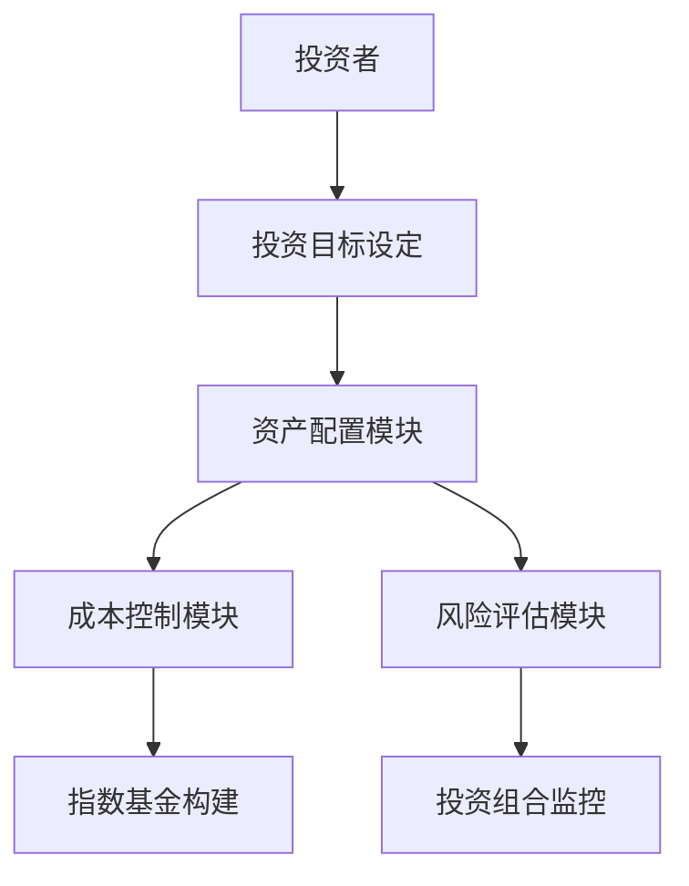

                 


# 约翰·伯格的被动投资哲学

## 关键词：
被动投资，约翰·伯格，指数基金，投资哲学，长期投资

## 摘要：
本文深入探讨了约翰·伯格的被动投资哲学，从被动投资的基本概念、核心原理到系统设计和项目实战，结合理论与实践，分析了被动投资的优势和应用场景，为投资者提供了全面的指导和启示。

---

# 第一部分: 被动投资的基本概念与背景

## 第1章: 被动投资的定义与背景

### 1.1 被动投资的定义
被动投资是一种投资策略，强调长期持有特定指数或资产组合，避免频繁交易和市场择时，追求市场平均收益。其核心在于通过分散投资降低风险，同时控制交易成本。

#### 1.1.1 投资的基本概念
投资是将资金投入到特定资产中，以期望获得收益的过程。投资可以分为主动投资和被动投资两大类，其中被动投资以指数基金为代表。

#### 1.1.2 被动投资的定义与特征
被动投资的定义是通过模仿特定市场指数或资产类别来构建投资组合，避免主动管理。其特征包括：
- **低成本**：被动投资通常具有较低的管理费用和交易成本。
- **长期视角**：强调长期持有，避免短期波动的影响。
- **分散风险**：通过广泛分散投资降低非系统性风险。

#### 1.1.3 被动投资与主动投资的区别
| 特性 | 被动投资 | 主动投资 |
|------|----------|----------|
| 管理方式 | 模仿指数 | 积极选股 |
| 成本 | 低 | 高 |
| 风险 | 分散 | 集中 |

### 1.2 约翰·伯格的被动投资哲学
#### 1.2.1 约翰·伯格的生平简介
约翰·伯格（John C. Bogle）是被动投资领域的先驱，创立了先锋集团（Vanguard Group），并发明了第一只指数基金——Vanguard 500 Index Fund。

#### 1.2.2 伯格的投资理念与方法
伯格认为，市场是不可预测的，主动管理很难长期跑赢市场，而被动投资通过分散投资和低成本可以为投资者带来稳定的收益。

#### 1.2.3 伯格对被动投资的贡献
伯格通过 Vanguard 基金公司推广了指数基金，使被动投资理念深入人心，并为投资者提供了低成本、高效率的投资工具。

---

## 第2章: 被动投资的背景与发展趋势

### 2.1 被动投资的兴起
#### 2.1.1 被动投资的历史发展
20世纪70年代，随着指数基金的出现，被动投资开始逐渐受到关注。尤其是互联网时代，信息透明化和低成本交易推动了被动投资的发展。

#### 2.1.2 被动投资在现代金融中的地位
被动投资已成为机构和个人投资者的重要选择，尤其是在市场波动加剧的背景下，被动投资因其稳定性和低成本吸引了大量投资者。

#### 2.1.3 被动投资的全球发展趋势
全球范围内，被动投资规模持续增长，特别是在美国市场，指数基金和ETF（交易所交易基金）占据了重要份额。

### 2.2 被动投资与市场效率
#### 2.2.1 市场有效性的假说
有效市场假说认为，市场价格反映了所有可获取的信息，因此主动投资难以获得超额收益。

#### 2.2.2 被动投资与市场效率的关系
被动投资通过跟踪指数实现市场平均收益，间接推动了市场的有效性和流动性。

#### 2.2.3 被动投资对市场的影响
被动投资增加了市场的流动性，降低了交易成本，同时减少了市场的波动性。

---

# 第二部分: 被动投资的核心概念与原理

## 第3章: 被动投资的核心概念

### 3.1 被动投资的核心要素
#### 3.1.1 指数基金的概念
指数基金是被动投资的主要工具，它通过跟踪特定指数（如标普500）来构建投资组合。

#### 3.1.2 被动投资的标的资产选择
选择标的资产时，被动投资者通常选择具有代表性的指数，如标普500、道琼斯指数等。

#### 3.1.3 被动投资的成本控制
被动投资的成本包括管理费、托管费和交易成本。通过规模效应和指数基金的低成本结构，被动投资显著降低了费用。

### 3.2 被动投资的长期视角
#### 3.2.1 长期投资的重要性
长期持有可以平滑短期市场波动，降低市场风险。

#### 3.2.2 被动投资的复利效应
复利效应使被动投资在长期中积累收益，实现财富增值。

#### 3.2.3 被动投资的风险管理
通过分散投资降低非系统性风险，同时利用市场的长期趋势降低整体风险。

---

## 第4章: 被动投资的核心原理

### 4.1 被动投资的数学模型
#### 4.1.1 投资收益的计算公式
投资收益可以通过以下公式计算：
$$
\text{收益} = \frac{\text{期末价值}}{\text{期初价值}} - 1
$$

#### 4.1.2 被动投资的成本模型
被动投资的总成本包括管理费和交易成本，可以通过以下公式计算：
$$
\text{总成本} = \text{管理费} + \text{交易成本}
$$

#### 4.1.3 被动投资的风险评估公式
风险可以通过波动率（标准差）来衡量：
$$
\sigma = \sqrt{\sum_{i=1}^{n} \frac{(x_i - \mu)^2}{n}}
$$
其中，$\mu$ 是平均值，$x_i$ 是每个观测值。

### 4.2 被动投资的组合管理
#### 4.2.1 指数基金的构建方法
指数基金通过复制目标指数的成分股和权重来构建投资组合。

#### 4.2.2 被动投资组合的优化策略
优化策略包括定期再平衡和成本控制。

#### 4.2.3 被动投资的再平衡机制
再平衡是通过调整投资组合的构成，使其保持与目标指数一致。

---

# 第三部分: 被动投资的系统分析与架构设计

## 第5章: 被动投资系统的功能设计

### 5.1 系统功能模块
#### 5.1.1 资产配置模块
资产配置模块负责根据目标指数分配资金。

#### 5.1.2 成本控制模块
成本控制模块监控并优化管理费用和交易成本。

#### 5.1.3 风险评估模块
风险评估模块计算投资组合的波动率和风险。

### 5.2 系统功能流程
#### 5.2.1 投资目标设定
投资者设定投资目标和风险偏好。

#### 5.2.2 资产分配策略
根据目标指数构建投资组合。

#### 5.2.3 投资组合监控
定期监控投资组合的表现并进行调整。

---

## 第6章: 被动投资系统的架构设计

### 6.1 系统架构图


### 6.2 系统接口设计
#### 6.2.1 用户接口设计
用户通过平台输入投资目标和资金。

#### 6.2.2 数据接口设计
系统从数据源获取指数数据和市场信息。

#### 6.2.3 第三方接口设计
与基金公司或交易所接口进行交易和结算。

---

# 第四部分: 被动投资的项目实战

## 第7章: 被动投资的环境与工具

### 7.1 被动投资的环境搭建
选择合适的指数基金和投资平台，如 Vanguard、iShares 等。

### 7.2 系统核心实现源代码
以下是被动投资系统的Python实现示例：

```python
import numpy as np

def calculate_return(prices):
    return (prices[-1] / prices[0]) - 1

def calculate_volatility(returns):
    return np.std(returns)

# 示例数据
prices = [100, 105, 110, 115, 120]
returns = [0.05, 0.0476, 0.0455, 0.0435]

# 计算收益和波动率
return_ = calculate_return(prices)
volatility = calculate_volatility(returns)

print(f"投资收益: {return_:.2%}")
print(f"波动率: {volatility:.2%}")
```

### 7.3 代码应用解读与分析
上述代码展示了如何计算投资收益和波动率，帮助投资者评估被动投资组合的表现。

### 7.4 实际案例分析
以标普500指数为例，分析指数基金的长期表现和成本结构。

### 7.5 项目小结
被动投资通过低成本和长期持有策略，为投资者提供了稳定的投资回报。

---

# 第五部分: 结论与建议

## 第8章: 结论与建议

### 8.1 最佳实践 tips
- **长期持有**：避免频繁交易，降低交易成本。
- **分散投资**：选择具有代表性的指数基金。
- **低成本优先**：选择管理费用低的基金。

### 8.2 小结
约翰·伯格的被动投资哲学强调长期持有和低成本，为投资者提供了简单有效的投资策略。

### 8.3 注意事项
- **市场波动**：被动投资不能完全规避市场波动风险。
- **选择基金公司**：选择信誉良好的基金公司和平台。

### 8.4 拓展阅读
推荐阅读约翰·伯格的《指数基金投资指南》以及《投资学原理》。

---

# 作者

作者：AI天才研究院/AI Genius Institute & 禅与计算机程序设计艺术 /Zen And The Art of Computer Programming

