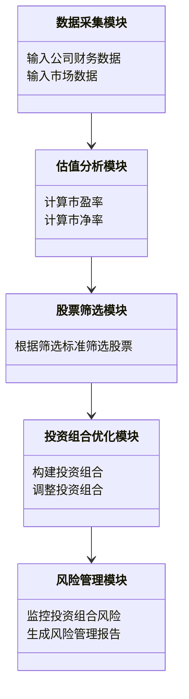
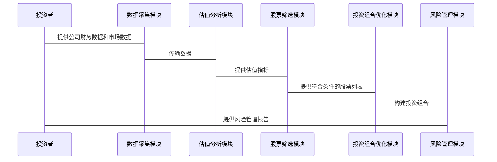

                 


# 约翰·内夫的低估值投资：简单而有效的价值策略

> 关键词：约翰·内夫，低估值投资，价值投资，股票筛选，投资策略，风险管理

> 摘要：本文深入探讨了约翰·内夫的低估值投资策略，分析了其核心理念、选股标准、投资模型以及实际应用。通过系统分析和案例研究，揭示了低估值投资的科学性与艺术性，为投资者提供了实用的指导。

---

## 第一部分: 约翰·内夫的低估值投资概述

### 第1章: 低估值投资的背景与意义

#### 1.1 低估值投资的背景

##### 1.1.1 投资市场的基本概念

在股票市场中，投资者通常追求的是资产的长期增值。然而，市场波动性和投资者情绪常常导致股票价格偏离其内在价值。低估值投资的核心理念是寻找市场价格低于内在价值的股票，从而在长期获得超额收益。

##### 1.1.2 低估值投资的定义与特点

低估值投资是一种价值投资策略，强调买入被市场低估的股票。其特点包括：
1. **长期导向**：注重长期价值而非短期波动。
2. **基本面分析**：通过分析公司财务状况、行业地位等因素来评估内在价值。
3. **逆向思维**：在市场恐慌时寻找低估机会，在市场繁荣时保持谨慎。

##### 1.1.3 低估值投资的市场环境

低估值投资在市场低迷或经济衰退时更具优势，因为此时许多优质股票可能被过度抛售，价格低于其真实价值。此外，行业整合和公司重组也为低估值投资者提供了潜在机会。

#### 1.2 约翰·内夫与低估值投资

##### 1.2.1 约翰·内夫的生平简介

约翰·内夫（John Neff）是美国著名的投资经理，以其在低估值投资领域的卓越表现闻名。他在惠理基金（Wells Fargo）的任职期间，通过严谨的选股策略和风险管理，创造了卓越的投资业绩。

##### 1.2.2 内夫的投资理念与方法

内夫的投资理念基于以下几个核心原则：
1. **买入低于内在价值的股票**：通过详细的财务分析，寻找市场价格低于公司净资产价值的股票。
2. **关注安全边际**：确保买入价格与内在价值之间的差距足够大，以应对市场波动。
3. **分散投资**：通过投资多个低估值股票分散风险，避免过度依赖单一股票。

##### 1.2.3 内夫投资策略的核心思想

内夫的策略强调纪律性和系统性，避免情绪化决策。他通过量化指标（如市盈率、市净率等）筛选股票，并结合行业趋势和公司基本面进行综合评估。

---

### 第2章: 低估值投资的核心概念

#### 2.1 低估值投资的理论基础

##### 2.1.1 价值投资的基本原理

价值投资的核心在于识别市场定价错误的股票。市场情绪的短期波动可能导致股票价格偏离其真实价值，而低估值投资正是利用这一偏差，通过长期持有实现收益。

##### 2.1.2 股票的内在价值与市场价格

内在价值是基于公司基本面的评估，包括盈利能力、成长潜力和财务状况等因素。市场价格则受市场情绪和流动性影响。当市场价格低于内在价值时，就是买入的良机。

##### 2.1.3 低估值投资的衡量标准

常用的低估值衡量标准包括：
- 市盈率（P/E）：股价与每股收益的比率。
- 市净率（P/B）：股价与每股净资产的比率。
- 股息率：股息与股价的比率。

#### 2.2 低估值投资的关键指标

##### 2.2.1 市盈率（P/E）分析

市盈率是衡量股票价值的重要指标。内夫通常寻找市盈率低于行业平均水平的股票，同时关注公司的盈利能力和增长潜力。

##### 2.2.2 市净率（P/B）分析

市净率衡量了股价与公司资产的比率。内夫倾向于选择市净率低于1的股票，认为这些股票被市场严重低估。

##### 2.2.3 股息率与股息支付率

高股息率的股票通常具有稳定的收益，而低股息支付率可能意味着公司有更多现金流用于再投资，增强长期增长潜力。

##### 2.2.4 其他估值指标（如EV/EBITDA）

企业价值与息税折旧及摊销前利润之比（EV/EBITDA）是另一个重要的估值指标，能够更全面地评估公司的价值。

---

#### 图2-1: 低估值投资核心指标对比表

| 指标       | 市盈率（P/E） | 市净率（P/B） | 股息率 | EV/EBITDA |
|------------|--------------|--------------|--------|-----------|
| 定义       | 股价/每股收益 | 股价/每股净资产 | 股息/股价 | 企业价值/EBITDA |
| 重要性     | 关键衡量盈利性 | 评估资产价值 | 收益与股价关系 | 全面评估企业价值 |

---

### 第3章: 低估值投资的核心策略

#### 3.1 低估值投资的选股标准

##### 3.1.1 寻找被市场低估的股票

内夫通过分析多个估值指标，寻找市场价格低于内在价值的股票。他特别关注那些市盈率、市净率等指标低于行业平均水平的公司。

##### 3.1.2 公司基本面分析

基本面分析包括对公司盈利能力、成长潜力、财务状况和行业地位的评估。内夫注重公司的净资产收益率（ROE）和净利润增长率，认为这些指标能够反映公司的盈利能力和成长性。

##### 3.1.3 行业分析与竞争优势

内夫在选择股票时，会考虑行业趋势和公司的竞争优势。他倾向于选择那些在行业中具有领先地位且具备持续竞争优势的公司。

#### 3.2 内夫的选股模型

##### 3.2.1 股票筛选的多因子模型

内夫的选股模型基于多个因子，包括：
- 市盈率低于行业平均值。
- 市净率低于行业平均值。
- 净利润增长率高于行业平均水平。
- 净资产收益率（ROE）高于行业平均水平。

##### 3.2.2 股票的估值区间分析

内夫通过分析公司的财务数据，估算其内在价值，并确定一个合理的估值区间。当股价低于估值区间下限时，视为买入机会。

##### 3.2.3 风险管理与投资组合优化

内夫注重分散投资，避免过度集中于单一股票或行业。他通过构建多元化的投资组合来降低风险，并定期调整持仓，以应对市场变化。

---

### 第4章: 低估值投资的实践应用

#### 4.1 低估值投资的实施步骤

##### 4.1.1 确定投资目标与策略

投资者需要明确自己的投资目标、风险承受能力和投资期限。低估值投资通常适合长期投资者，能够承受市场短期波动。

##### 4.1.2 数据收集与分析

通过收集公司的财务数据、行业信息和市场数据，进行详细的估值分析。常用工具包括财务报表分析、行业研究报告和估值模型。

##### 4.1.3 选股与投资组合构建

根据筛选标准，选出符合条件的股票，并构建多元化投资组合。内夫通常会将资金分散投资于多只股票，以降低风险。

##### 4.1.4 风险管理与调整

定期监控投资组合的表现，根据市场变化和公司基本面调整持仓。同时，设置止损点，以避免重大损失。

#### 4.2 内夫投资策略的实战案例

##### 4.2.1 典型低估值股票的分析

以某公司为例，分析其市盈率、市净率等指标，判断其是否符合低估值选股标准。

##### 4.2.2 投资组合的构建与调整

假设投资者选择多只低估值股票构建投资组合，并根据市场变化进行调整。

##### 4.2.3 实战案例的总结与启示

通过实际案例分析，总结低估值投资的策略和方法，为读者提供参考。

---

### 第5章: 低估值投资的系统分析与架构设计

#### 5.1 系统分析

##### 5.1.1 低估值投资的系统目标

构建一个低估值投资系统，旨在通过自动化筛选和分析，辅助投资者做出科学决策。

##### 5.1.2 系统的功能模块设计

系统功能模块包括：
1. 数据采集模块：收集公司财务数据和市场数据。
2. 估值分析模块：计算各项估值指标。
3. 股票筛选模块：根据筛选标准选出符合条件的股票。
4. 投资组合优化模块：构建和调整投资组合。
5. 风险管理模块：监控投资组合风险。

##### 5.1.3 系统的输入输出分析

- 输入：公司财务数据、市场数据、投资目标和策略。
- 输出：符合条件的股票列表、投资组合建议、风险管理报告。

---

#### 图5-1: 系统功能模块设计类图



---

#### 5.1.4 系统架构设计

##### 5.1.4.1 系统架构图


---

#### 5.1.4.2 系统交互设计



---

## 第六章: 低估值投资的项目实战

### 6.1 环境安装与配置

#### 6.1.1 Python环境安装

安装Python和必要的库，如Pandas、NumPy、Matplotlib等。

#### 6.1.2 数据源配置

获取公司财务数据和市场数据，可以通过API或爬虫获取。

### 6.2 核心代码实现

#### 6.2.1 数据采集与清洗

```python
import pandas as pd
import requests

def get_financial_data(ticker):
    # 模拟数据接口，实际应用中需要替换为真实的API调用
    url = f"https://api.example.com/stock/{ticker}/financials"
    response = requests.get(url)
    data = response.json()
    df = pd.DataFrame(data)
    return df
```

---

#### 6.2.2 估值分析与选股

```python
def calculate_valuation_metrics(df):
    df['PE'] = df['股价'] / df['每股收益']
    df['PB'] = df['股价'] / df['每股净资产']
    # 其他估值指标计算
    return df

def screen_low_valuation_stocks(df, industry_avg):
    selected_stocks = df[(df['PE'] < industry_avg['PE']) & 
                         (df['PB'] < industry_avg['PB'])]
    return selected_stocks
```

---

#### 6.2.3 投资组合优化

```python
import numpy as np

def optimize_portfolio(stocks, returns, covariance_matrix):
    # 使用均值-方差优化模型
    n = len(stocks)
    mu = np.mean(returns)
    sigma = np.std(returns)
    # 计算最优权重
    # 这里简化为等权配置
    weights = np.array([1/n]*n)
    return weights
```

---

#### 6.2.4 风险管理与监控

```python
def risk_management(portfolio, returns):
    # 计算最大回撤
    max_drawdown = 0
    peak = 0
    for i in range(len(returns)):
        if returns[i] > peak:
            peak = returns[i]
        current_drawdown = peak - returns[i]
        if current_drawdown > max_drawdown:
            max_drawdown = current_drawdown
    return max_drawdown
```

---

### 6.3 实战案例分析

#### 6.3.1 案例背景

假设当前市场环境下，我们选择几个行业中的低估股票进行分析。

#### 6.3.2 数据分析与筛选

通过上述代码，筛选出符合低估值标准的股票，并进行详细分析。

#### 6.3.3 投资组合构建与调整

根据筛选结果，构建投资组合，并定期根据市场变化进行调整。

#### 6.3.4 实战总结

总结实战经验，分析策略的有效性和改进空间。

---

## 第七章: 低估值投资的最佳实践

### 7.1 小结

低估值投资是一种简单而有效的价值策略，通过寻找市场价格低于内在价值的股票，能够在长期实现超额收益。

### 7.2 注意事项

1. **避免情绪化决策**：低估值投资需要耐心和纪律，避免被市场波动干扰。
2. **持续学习与更新**：市场环境不断变化，需要持续关注行业动态和公司基本面。
3. **分散投资**：通过多元化投资降低风险。

### 7.3 拓展阅读

推荐相关书籍和研究报告，帮助读者深入理解低估值投资的理论与实践。

---

## 作者信息

作者：AI天才研究院/AI Genius Institute & 禅与计算机程序设计艺术 /Zen And The Art of Computer Programming

---

以上是《约翰·内夫的低估值投资：简单而有效的价值策略》的详细目录结构和部分内容。如果您需要完整的文章内容，请进一步告知。

