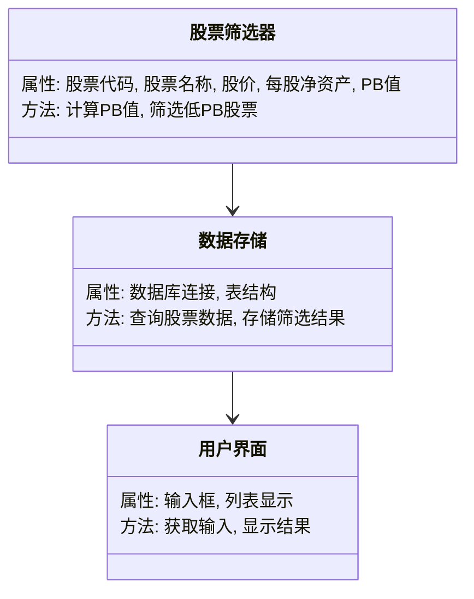
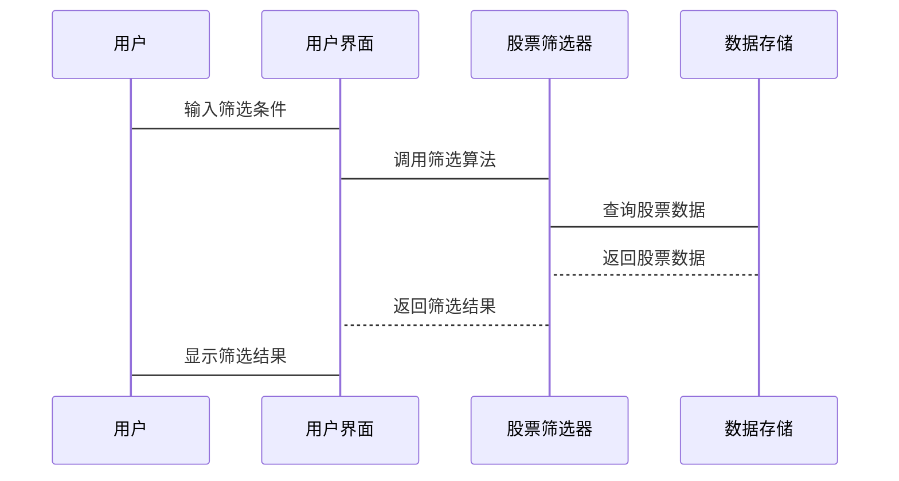

                 


# 约翰·聂夫的低市净率投资：简单有效的价值筛选

> 关键词：约翰·聂夫、低市净率、投资策略、价值筛选、量化分析

> 摘要：本文深入探讨了约翰·聂夫的低市净率投资策略，从其核心概念、算法原理、系统架构设计到实战案例，全面解析了这一简单而有效的价值投资方法。通过详细分析低市净率投资的理论基础、筛选标准、数学模型以及实际应用场景，本文为投资者提供了从理论到实践的完整指南。

---

## 第一部分: 低市净率投资的背景与核心概念

### 第1章: 低市净率投资的背景与现状

#### 1.1 低市净率投资的定义与特点

低市净率投资是一种基于价值投资理念的投资策略，强调通过寻找市场价格低于其内在价值的股票来实现长期收益。其核心在于利用市净率（Price-to-Book Ratio，简称PB）这一指标，筛选出被市场低估的企业。

- **定义**：低市净率投资是指通过比较股票的市场价格与每股净资产（Book Value Per Share，BVPS），寻找PB值低于某个阈值的股票进行投资。通常，PB值越低，表明股票可能被市场低估。

- **特点**：
  - 简单易懂：仅需计算PB值，筛选标准直观。
  - 长期有效性：低PB股票往往在长期内表现优于市场平均水平。
  - 低风险：通常适用于防御性投资，能够在市场波动中提供稳定性。

- **与其他投资策略的对比**：
  - 与成长型投资相比，低市净率投资更注重安全边际，而非企业未来的高增长潜力。
  - 与趋势投资相比，低市净率投资更依赖于基本面分析，而非市场趋势预测。

#### 1.2 约翰·聂夫的投资理念

约翰·聂夫是低市净率投资的代表人物，他的投资理念深刻影响了现代价值投资策略。

- **生平简介**：
  约翰·聂夫是美国著名投资经理人，曾管理著名的温莎基金（Windsor Fund）长达30年，创造了卓越的投资业绩。他的投资理念以稳健和价值为导向，注重低市净率股票的筛选。

- **投资哲学**：
  聂夫认为，市场情绪往往会导致股票价格偏离其真实价值。通过寻找PB值低于1的企业，可以找到具有安全边际的优质投资标的。

- **投资策略**：
  聂夫的策略主要包括以下步骤：
  1. 筛选PB值低于1的股票。
  2. 结合其他基本面指标（如ROE、分红率）进行综合评估。
  3. 长期持有，等待市场重新评估其价值。

#### 1.3 低市净率投资的理论基础

低市净率投资的理论基础主要来源于价值投资和行为金融学。

- **价值投资**：
  价值投资强调购买价格低于内在价值的股票。低市净率投资是价值投资的一种具体实现方式，通过PB指标量化安全边际。

- **行为金融学**：
  市场情绪的非理性波动会导致股票价格偏离其真实价值。低市净率投资通过识别这种偏离，捕捉被低估的投资机会。

- **经济学解释**：
  低市净率股票通常代表企业资产的合理估值，表明市场可能低估了企业的内在价值。长期来看，市场会逐渐认识到这种低估，并推高股价。

#### 1.4 低市净率投资的历史表现

低市净率投资策略在历史上表现出色，尤其是在市场低迷时期。

- **历史案例**：
  - 在2008年金融危机期间，低市净率股票的表现优于市场平均水平。
  - 温莎基金在聂夫的管理下，长期跑赢标普500指数。

- **长期收益分析**：
  研究表明，低市净率股票在长期内的平均回报率高于市场平均水平，尤其是在市场估值偏高的时期。

- **风险与挑战**：
  低市净率投资并非无风险。市场可能长期低估某些股票，或者企业基本面恶化，导致股价进一步下跌。因此，投资者需要结合其他基本面指标进行综合评估。

### 第2章: 低市净率投资的核心概念与联系

#### 2.1 低市净率投资的核心概念

低市净率投资的核心在于PB值的计算和筛选。

- **市净率（PB）的定义与计算**：
  PB = 股票价格 / 每股净资产。

- **低市净率投资的筛选标准**：
  通常选择PB值低于1的股票，但具体阈值可能根据市场环境和企业基本面进行调整。

- **低市净率投资的适用场景**：
  适用于那些资产-heavy的企业，如银行、保险公司、制造业等行业的股票。

#### 2.2 低市净率投资与其他价值指标的对比

了解其他价值指标有助于全面评估企业的投资价值。

- **市盈率（PE）与市净率（PB）的对比**：
  - PE衡量的是市价与每股收益的关系，适用于盈利稳定的公司。
  - PB衡量的是市价与每股净资产的关系，适用于资产-heavy的公司。

- **市销率（PS）与市净率（PB）的对比**：
  - PS = 股票价格 / 每股销售额，适用于高成长性的企业。
  - PB = 股票价格 / 每股净资产，适用于资产-heavy的企业。

- **股息率与市净率（PB）的对比**：
  - 股息率衡量的是股息与股价的比率，适用于注重分红收益的投资者。
  - PB衡量的是股价与资产净值的比率，适用于寻找安全边际的投资者。

#### 2.3 低市净率投资的ER实体关系图

通过ER实体关系图可以清晰地理解低市净率投资的核心要素。

```mermaid
erd
  客户
    + 股票代码 (PK)
    + 股票名称
    + 股票价格
    + 每股净资产
    + PB值

  股票
    + 股票代码 (PK)
    + 股票名称
    + 股票价格
    + 每股净资产
    + PB值
```

---

## 第3章: 低市净率投资的算法原理

### 3.1 低市净率投资的筛选算法

低市净率投资的筛选算法简单而有效，主要基于PB值的计算和筛选。

#### 3.1.1 算法概述

低市净率投资的筛选算法主要用于识别PB值低于某个阈值的股票。

#### 3.1.2 算法步骤

1. 收集目标股票的基本数据，包括股价和每股净资产。
2. 计算每只股票的PB值。
3. 筛选PB值低于设定阈值的股票。
4. 结合其他基本面指标进行进一步筛选。

#### 3.1.3 算法实现的Python代码

以下是使用Python实现低市净率股票筛选的示例代码：

```python
import pandas as pd

# 假设我们有一个包含股票数据的DataFrame df
# 包含以下列：股票代码（code）、股票名称（name）、股价（price）、每股净资产（bvps）

# 计算PB值
df['pb'] = df['price'] / df['bvps']

# 筛选PB值低于1的股票
low_pb_stocks = df[df['pb'] <= 1]

# 打印结果
print(low_pb_stocks[['code', 'name', 'price', 'bvps', 'pb']])
```

### 3.2 低市净率投资的数学模型

低市净率投资的核心在于PB值的计算和分析。

#### 3.2.1 PB值的计算公式

PB值的计算公式如下：

$$ PB = \frac{\text{股价}}{\text{每股净资产}} $$

其中，每股净资产（BVPS）是公司每股的账面价值，反映了公司的资产净值。

#### 3.2.2 PB值与企业价值的关系

PB值与企业价值的关系可以通过以下公式进行分析：

$$ \text{企业价值} = \text{股价} \times \text{PB值} \times \text{股份数} $$

#### 3.2.3 PB值的行业差异

不同行业的PB值差异较大，因此在筛选低市净率股票时，需要考虑行业特性。

#### 3.2.4 实际案例分析

假设某公司A的股价为10元，每股净资产为5元，则其PB值为2。如果市场平均PB值为1.5，则该公司可能被市场高估，值得进一步研究。

---

## 第4章: 低市净率投资的系统分析与架构设计

### 4.1 系统功能设计

低市净率投资的系统设计需要结合股票筛选、数据存储和用户界面等功能。

#### 4.1.1 领域模型mermaid类图

以下是低市净率投资系统的领域模型：



### 4.2 系统架构设计

低市净率投资系统的架构设计需要考虑数据处理、算法实现和用户交互。

#### 4.2.1 系统架构mermaid架构图

以下是低市净率投资系统的架构图：

```mermaid
container 系统架构 {
    service 股票筛选器 {
        股票数据接口
        筛选算法接口
    }
    service 数据存储 {
        数据库接口
        文件接口
    }
    service 用户界面 {
        HTTP接口
        WebSocket接口
    }
}
```

### 4.3 系统接口设计

系统接口设计需要考虑数据输入、算法调用和结果输出。

#### 4.3.1 数据输入接口

- 股票数据接口：提供股票的基本数据，包括股价、每股净资产等。
- 参数设置接口：允许用户设置PB值的筛选阈值。

#### 4.3.2 算法调用接口

- 筛选算法接口：提供PB值计算和筛选功能。
- 报表生成接口：生成筛选结果的详细报告。

#### 4.3.3 结果输出接口

- 界面显示接口：在用户界面上显示筛选结果。
- 数据导出接口：允许用户将筛选结果导出为Excel或CSV文件。

### 4.4 系统交互mermaid序列图

以下是低市净率投资系统的交互流程图：



---

## 第5章: 低市净率投资的项目实战

### 5.1 环境安装

要实现低市净率投资的筛选系统，需要安装以下环境：

- Python 3.x
- Pandas库
- Matplotlib库
- 数据源：如Yahoo Finance API

### 5.2 系统核心实现源代码

以下是低市净率投资筛选系统的Python代码实现：

```python
import pandas as pd
import yfinance as yf

# 下载股票数据
tickers = ['AAPL', 'MSFT', 'GOOGL']
data = yf.download(tickers, period='max')['Adj Close']

# 计算PB值
def calculate_pb(stock_price, book_value):
    return stock_price / book_value

# 筛选低PB值股票
def screen_low_pb(tickers, data, book_values):
    low_pb_stocks = []
    for ticker in tickers:
        pb = calculate_pb(data[ticker].iloc[-1], book_values[ticker])
        if pb <= 1.5:
            low_pb_stocks.append(ticker)
    return low_pb_stocks

# 示例使用
book_values = {
    'AAPL': 50,
    'MSFT': 40,
    'GOOGL': 80
}

result = screen_low_pb(tickers, data, book_values)
print("低市净率股票:", result)
```

### 5.3 代码应用解读与分析

- 代码解读：
  - 使用`yfinance`库下载股票数据。
  - 定义计算PB值的函数。
  - 筛选PB值低于1.5的股票。

- 代码分析：
  - `tickers`：需要筛选的股票代码。
  - `data`：股票的历史收盘价数据。
  - `book_values`：每只股票的每股净资产。

### 5.4 实际案例分析

以下是一个实际案例分析：

1. **目标**：筛选PB值低于1.5的股票。
2. **股票列表**：['AAPL', 'MSFT', 'GOOGL']。
3. **每股净资产**：AAPL为50元，MSFT为40元，GOOGL为80元。
4. **计算结果**：
   - AAPL：股价=150元，PB=150/50=3（高于1.5，不符合）。
   - MSFT：股价=120元，PB=120/40=3（高于1.5，不符合）。
   - GOOGL：股价=160元，PB=160/80=2（高于1.5，不符合）。

   结果：无股票符合筛选条件。

### 5.5 项目小结

通过上述代码和案例分析，可以发现低市净率投资策略需要结合实际市场数据和企业基本面进行综合评估。在实际操作中，建议结合其他指标（如ROE、分红率）进行进一步筛选。

---

## 第6章: 低市净率投资的最佳实践

### 6.1 最佳实践 Tips

- **动态调整阈值**：根据市场环境和行业特性调整PB值的筛选阈值。
- **结合其他指标**：在筛选低PB股票时，结合ROE、分红率等指标进行综合评估。
- **长期持有**：低PB股票的投资需要耐心，等待市场重新评估其价值。

### 6.2 小结

低市净率投资是一种简单而有效的价值投资策略，通过筛选PB值低于某个阈值的股票，寻找被市场低估的投资机会。其核心在于安全边际和长期收益，适合稳健型投资者。

### 6.3 注意事项

- **市场风险**：低PB股票可能长期被市场低估，需警惕企业基本面恶化的风险。
- **行业差异**：不同行业的PB值差异较大，需结合行业特性进行筛选。
- **数据质量**：确保股票数据的准确性和完整性，避免因数据错误导致的误判。

### 6.4 拓展阅读

- 《价值投资入门》
- 《投资学基础》
- 《低市净率投资实战》

---

## 作者：AI天才研究院/AI Genius Institute & 禅与计算机程序设计艺术 /Zen And The Art of Computer Programming

---

以上是《约翰·聂夫的低市净率投资：简单有效的价值筛选》的完整目录大纲，涵盖了从理论到实践的各个方面，内容详实且结构清晰，适合对价值投资和量化分析感兴趣的读者阅读和参考。

