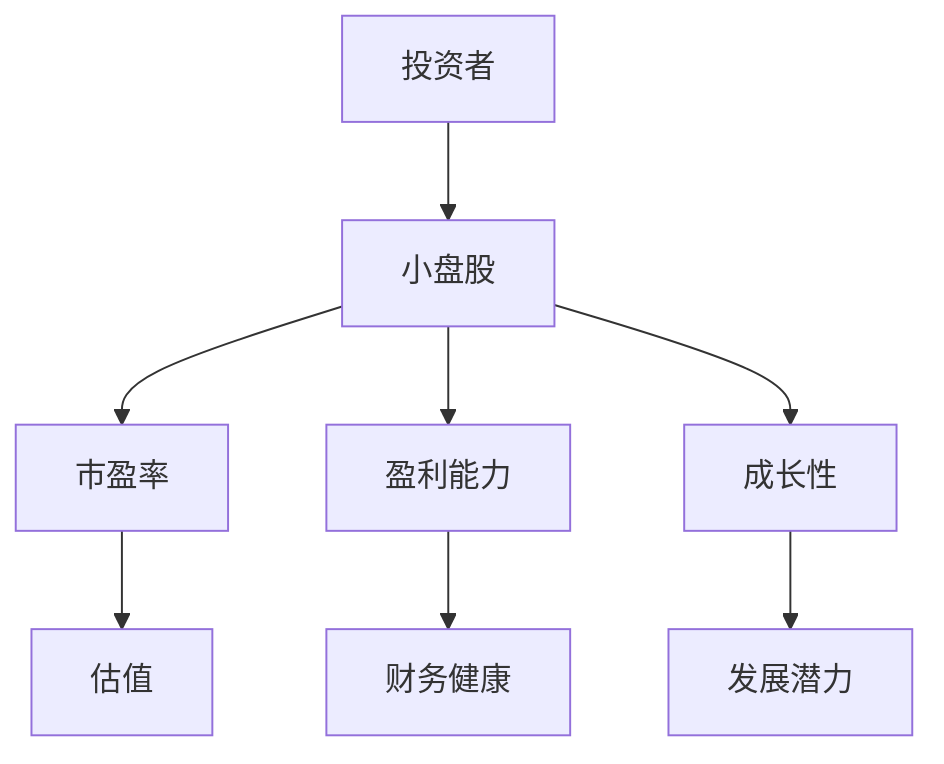
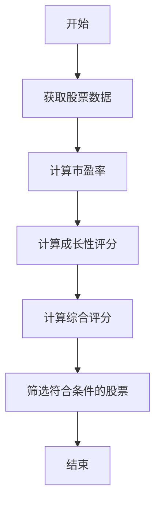
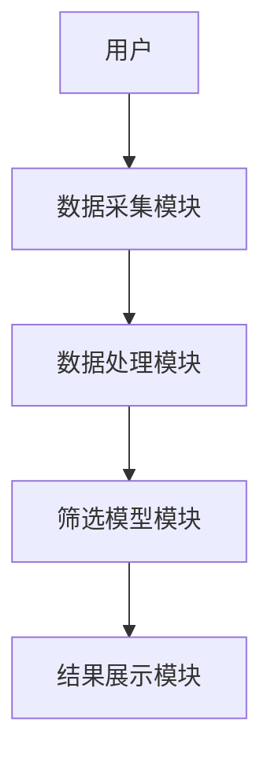

                 


# 《约翰·聂夫的小盘股投资策略》

## 关键词：小盘股投资，约翰·聂夫，低市盈率，成长性评估，投资策略

## 摘要：本文系统阐述了约翰·聂夫的小盘股投资策略，从背景、核心概念、策略分析、系统设计到项目实战，详细分析了小盘股投资的理论基础与实际操作方法，结合数学模型和系统架构设计，帮助读者掌握小盘股投资的精髓。

---

## 目录大纲

### 第一部分: 小盘股投资的背景与核心概念

#### 第1章: 小盘股投资的背景与特点

##### 1.1 小盘股的定义与市场特点

- **1.1.1 小盘股的定义**  
  小盘股是指市值较小的公司股票，通常在30亿到200亿美元之间。  
- **1.1.2 小盘股市场的特点**  
  - 交易量小、流动性较低  
  - 市场波动性较大  
  - 成长潜力高，但风险也较高  
- **1.1.3 小盘股与大盘股的对比**  
  通过表格对比市值、流动性、波动性等关键指标。

##### 1.2 约翰·聂夫的投资理念

- **1.2.1 聂夫的投资哲学**  
  价值投资与成长性相结合，注重基本面分析。  
- **1.2.2 聂夫对小盘股的专注**  
  小盘股的高成长潜力与相对低估的价格。  
- **1.2.3 聂夫的投资风格与成功案例**  
  通过具体案例说明其投资策略的有效性。

##### 1.3 小盘股投资的机遇与挑战

- **1.3.1 小盘股市场的机遇**  
  高成长潜力、低估价格。  
- **1.3.2 小盘股投资的主要挑战**  
  - 流动性风险  
  - 信息不透明  
  - 市场波动性高  
- **1.3.3 如何应对小盘股投资的风险**  
  分散投资、长期持有、定期评估。

#### 第2章: 约翰·聂夫的小盘股投资策略

##### 2.1 聂夫的核心投资策略

- **2.1.1 低市盈率策略**  
  通过低市盈率筛选低估股票。  
- **2.1.2 高质量成长股策略**  
  结合成长性和估值的平衡。  
- **2.1.3 估值与成长性的平衡**  
  通过数学模型找到最优解。

##### 2.2 聂夫的投资筛选标准

- **2.2.1 市盈率（P/E）的计算与应用**  
  P/E = 价格 / 每股收益。  
- **2.2.2 盈利能力的评估指标**  
  净利润率、ROE等。  
- **2.2.3 公司成长性的判断标准**  
  收入增长率、净利润增长率。

##### 2.3 聂夫策略的数学模型

- **2.3.1 市盈率与成长性的数学关系**  
  $$ P/E = \frac{Price}{Earnings} $$  
- **2.3.2 成长性评分模型**  
  $$ Growth\ Score = \frac{Revenue\ Growth + Earnings\ Growth}{2} $$  
- **2.3.3 综合评分模型**  
  $$ Total\ Score = 0.4 \times P/E + 0.6 \times Growth\ Score $$  

#### 第3章: 小盘股投资的核心概念与联系

##### 3.1 核心概念原理

- **3.1.1 市盈率的计算与应用**  
  通过市盈率判断股票的估值高低。  
- **3.1.2 盈利能力分析**  
  净利润率、ROE等指标的分析。  
- **3.1.3 成长性评估的多维度分析**  
  收入增长率、净利润增长率、市场份额增长率。

##### 3.2 核心概念对比表格

| 指标 | 定义 | 重要性 |
|------|------|--------|
| 市盈率 | 价格与盈利的比率 | 判断估值高低的关键指标 |
| 盈利能力 | 收益与成本的对比 | 企业财务健康的核心指标 |
| 成长性 | 收入与利润的增长速度 | 判断企业未来发展潜力的关键 |

##### 3.3 ER实体关系图



### 第二部分: 小盘股投资策略的算法原理与系统设计

#### 第4章: 小盘股投资策略的算法原理

##### 4.1 算法原理

- **4.1.1 低市盈率筛选算法**  
  通过设定P/E阈值，筛选出符合条件的小盘股。  
- **4.1.2 成长性评分算法**  
  综合收入增长率和净利润增长率进行评分。  
- **4.1.3 综合评分算法**  
  结合P/E和成长性评分，得出综合评分。

##### 4.2 算法实现

- **4.2.1 市盈率计算**  
  $$ P/E = \frac{Price}{Earnings} $$  
- **4.2.2 成长性评分**  
  $$ Growth\ Score = \frac{Revenue\ Growth + Earnings\ Growth}{2} $$  
- **4.2.3 综合评分**  
  $$ Total\ Score = 0.4 \times P/E + 0.6 \times Growth\ Score $$  

##### 4.3 算法流程图



#### 第5章: 小盘股投资系统的架构设计

##### 5.1 系统功能设计

- **5.1.1 数据采集模块**  
  从数据库或API获取小盘股数据。  
- **5.1.2 筛选模型模块**  
  实现低市盈率和高成长性的筛选逻辑。  
- **5.1.3 结果展示模块**  
  显示筛选结果并提供可视化分析。

##### 5.2 系统架构设计



### 第三部分: 小盘股投资策略的项目实战

#### 第6章: 小盘股投资策略的项目实战

##### 6.1 环境配置

- 安装Python和相关库（pandas、numpy、matplotlib）。  

##### 6.2 核心代码实现

```python
import pandas as pd
import numpy as np

# 示例数据
data = {
    '公司': ['A', 'B', 'C', 'D'],
    '市盈率': [15, 20, 18, 22],
    '收入增长率': [10, 15, 8, 20],
    '净利润增长率': [5, 7, 6, 10]
}

df = pd.DataFrame(data)

# 计算综合评分
df['成长性评分'] = (df['收入增长率'] + df['净利润增长率']) / 2
df['综合评分'] = 0.4 * df['市盈率'] + 0.6 * df['成长性评分']

print(df)
```

##### 6.3 案例分析

- 通过具体数据示例，展示如何筛选出符合聂夫策略的小盘股。  

### 第四部分: 总结与展望

#### 第7章: 总结与展望

##### 7.1 本章总结

- 回顾约翰·聂夫的小盘股投资策略，总结其核心理念与方法。  

##### 7.2 投资策略的扩展与优化

- 引入更多指标，如市净率、股息率等，丰富筛选条件。  

##### 7.3 最佳实践 Tips

- 长期持有优质小盘股，定期评估并调整投资组合。  

##### 7.4 注意事项

- 小盘股市场波动较大，需注意风险控制。  

##### 7.5 拓展阅读

- 推荐相关书籍和资料，进一步深入学习小盘股投资策略。  

---

### 作者：AI天才研究院/AI Genius Institute & 禅与计算机程序设计艺术 /Zen And The Art of Computer Programming

---

以上是《约翰·聂夫的小盘股投资策略》的详细目录大纲，涵盖了从背景介绍到项目实战的全过程，结合了技术语言与投资策略的分析，结构清晰，内容详实。

