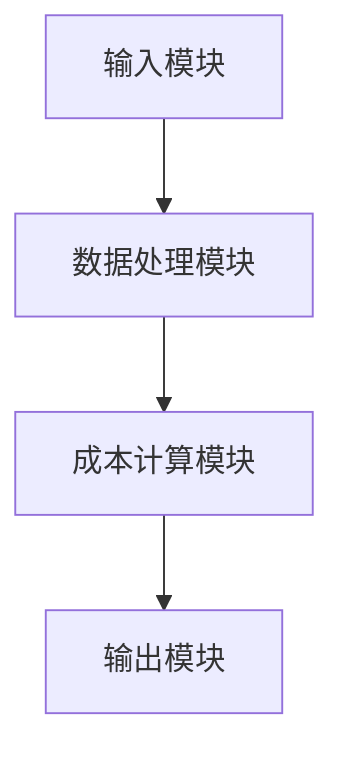
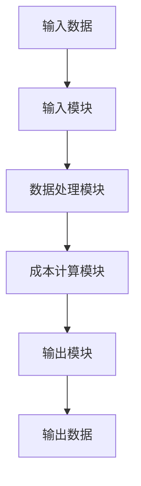

                 


# 约翰伯格的成本控制理念：为什么低成本是制胜关键

## 关键词：成本控制，低成本战略，约翰·伯格，成本管理，企业竞争力，系统设计

## 摘要：  
本文深入探讨了约翰·伯格的成本控制理念，分析了低成本战略在企业竞争中的关键作用。通过系统化的成本分析、预算编制和监控方法，结合实际案例和系统设计，揭示了如何通过优化成本结构提升企业竞争力。文章还详细介绍了成本控制的具体工具和方法，并通过项目实战展示了如何将这些理念付诸实施。最后，总结了约翰·伯格成本控制理念的核心要点，并展望了未来的应用和发展。

---

## 第一部分：成本控制的基本概念

### 第1章：成本控制的重要性

#### 1.1 成本控制的定义与内涵

成本控制是企业管理和运营中的核心环节，旨在通过科学的管理方法和技术手段，降低资源消耗，优化资源配置，从而提高企业的经济效益和市场竞争力。成本控制不仅仅是对资金的简单节省，更是对整个生产过程的优化和对资源利用效率的提升。

**背景介绍**：  
成本是企业运营中的关键因素，直接影响企业的利润和市场竞争力。在现代商业环境中，成本控制的重要性日益凸显。随着市场竞争的加剧，企业需要不断优化成本结构，以应对价格压力和提高利润率。

**核心概念**：  
- **成本**：企业在生产或运营过程中所消耗的各种资源的价值总和。
- **成本控制**：通过计划、监测和调节各种因素来降低或优化成本的过程。

**问题背景**：  
企业在生产和运营过程中，往往面临资源浪费、成本超支等问题，这些问题可能导致企业利润下降，竞争力减弱。因此，如何有效地控制成本，成为企业生存和发展的关键。

**问题解决**：  
通过成本控制，企业可以识别和消除浪费，优化资源配置，降低生产成本，从而提高利润率和市场竞争力。

**边界与外延**：  
成本控制的边界包括企业的生产过程、供应链管理和运营活动。其外延则涉及企业战略、财务管理、项目管理和质量控制等多个方面。

**概念结构与核心要素**：  
成本控制的核心要素包括成本目标、成本分析、成本计划、成本监控和成本评估。

---

#### 1.2 成本构成的分析

成本构成分析是成本控制的基础，帮助企业在不同层次上识别和管理成本。

**背景介绍**：  
企业成本通常分为直接成本和间接成本，了解成本构成有助于制定有效的成本控制策略。

**核心概念**：  
- **直接成本**：可以直接追溯到特定产品或服务的成本，如原材料和直接人工成本。
- **间接成本**：无法直接追溯到特定产品或服务，如工厂租金和行政人员工资。

**问题背景**：  
企业在计算总成本时，需要区分直接成本和间接成本，以便准确评估每个产品的成本结构。

**问题解决**：  
通过成本构成分析，企业可以识别哪些成本是可控的，哪些是不可控的，从而制定更有针对性的控制策略。

**对比分析**：  
以下是直接成本与间接成本的对比表格：

| **属性**       | **直接成本**                 | **间接成本**                 |
|----------------|------------------------------|------------------------------|
| **可追溯性**   | 可以追溯到具体产品或服务     | 无法追溯到具体产品或服务     |
| **控制难度**   | 较低，可以通过采购和生产优化 | 较高，需要通过整体管理优化     |
| **例子**       | 原材料、直接人工             | 工厂租金、行政人员工资         |

---

#### 1.3 成本控制的基本原则

成本控制需要遵循一些基本的原则，以确保其有效性和可持续性。

**背景介绍**：  
成本控制的原则是指导企业进行成本管理的基本准则，包括成本效益原则、全面性原则和及时性原则。

**核心概念**：  
- **成本效益原则**：确保成本的投入能够带来相应的收益，避免不必要的开支。
- **全面性原则**：成本控制应覆盖企业的所有部门和环节，避免遗漏。
- **及时性原则**：及时发现和解决问题，避免成本超支。

**问题背景**：  
企业在成本控制中常常面临如何平衡成本和效益的挑战，同时需要确保控制措施的全面性和及时性。

**问题解决**：  
通过制定明确的成本控制原则，企业可以系统地进行成本管理，确保各项措施的有效实施。

---

## 第二部分：约翰·伯格的成本控制理念

### 第2章：约翰·伯格的成本控制理论

#### 2.1 约翰·伯格的成本控制核心思想

约翰·伯格的成本控制理念强调低成本战略的重要性，认为低成本是企业制胜的关键。

**背景介绍**：  
约翰·伯格在成本控制领域提出了独特的理论，强调通过系统化的方法降低生产成本，提高企业的竞争力。

**核心概念**：  
- **低成本战略**：通过优化生产流程、提高效率和降低资源浪费，实现成本的最小化。
- **成本控制的系统化**：将成本控制融入企业的整体管理系统中，从战略层面进行规划和实施。

**问题背景**：  
企业在实施低成本战略时，常常面临如何平衡成本和质量的挑战，同时需要确保成本控制的可持续性。

**问题解决**：  
通过系统化的成本控制方法，企业可以在降低成本的同时，保证产品质量和客户满意度。

---

#### 2.2 成本控制的理论基础

约翰·伯格的成本控制理念建立在坚实的理论基础上，包括经济学、管理学和运营管理等多个领域。

**背景介绍**：  
成本控制的理论基础涉及多个学科，为低成本战略的实施提供了坚实的理论支持。

**核心概念**：  
- **经济学基础**：成本与价格的关系，市场供需理论。
- **管理学基础**：目标管理和组织行为理论。
- **运营管理基础**：生产流程优化和质量控制。

**问题背景**：  
企业在实施成本控制时，需要理解其背后的理论基础，以便更好地应用相关方法和工具。

**问题解决**：  
通过深入理解成本控制的理论基础，企业可以制定更有针对性的策略，确保低成本战略的有效实施。

---

#### 2.3 约翰·伯格的成本控制方法

约翰·伯格提出了多种成本控制方法，包括目标成本法、标准成本法和作业成本法。

**背景介绍**：  
目标成本法是一种以目标为导向的成本控制方法，适用于新产品开发和生产过程中的成本控制。

**核心概念**：  
- **目标成本法**：在产品设计和生产过程中，设定一个目标成本，通过设计优化和流程改进实现成本控制。
- **标准成本法**：根据标准成本数据，监控实际成本，识别和解决偏差。
- **作业成本法**：基于作业（生产过程中的具体活动）进行成本核算和控制。

**问题背景**：  
企业在实施成本控制时，需要选择合适的成本控制方法，以适应不同的生产环境和管理需求。

**问题解决**：  
通过选择合适的方法，企业可以有效地控制成本，提高生产效率和产品质量。

---

## 第三部分：成本控制的具体方法与工具

### 第3章：成本分析与预算编制

#### 3.1 成本分析方法

成本分析是成本控制的基础，通过分析成本结构和动因，制定有效的控制策略。

**背景介绍**：  
成本分析方法包括成本结构分析、成本动因分析和成本效益分析，帮助企业识别成本节约的机会。

**核心概念**：  
- **成本结构分析**：识别固定成本和变动成本，制定相应的控制策略。
- **成本动因分析**：通过识别成本动因，找到成本节约的关键点。
- **成本效益分析**：评估不同成本控制措施的效益，选择最优方案。

**问题背景**：  
企业在进行成本分析时，需要明确成本结构和动因，以便制定有效的控制策略。

**问题解决**：  
通过成本分析方法，企业可以系统地识别和解决成本问题，提高成本控制的有效性。

---

#### 3.2 预算编制的步骤

预算编制是成本控制的重要环节，帮助企业制定合理的成本目标和计划。

**背景介绍**：  
预算编制需要遵循一定的步骤，包括确定预算目标、收集历史数据和编制预算方案。

**核心概念**：  
- **预算目标**：根据企业战略和市场环境，设定合理的成本目标。
- **历史数据收集**：分析过去的成本数据，为预算编制提供依据。
- **预算方案**：根据目标和数据，制定详细的预算计划。

**问题背景**：  
企业在预算编制时，常常面临数据不准确和目标不合理的问题，导致预算执行困难。

**问题解决**：  
通过科学的预算编制方法，企业可以制定合理的目标和计划，确保预算的有效执行。

---

#### 3.3 成本监控与反馈

成本监控是成本控制的重要环节，通过实时监控和反馈，及时发现和解决问题。

**背景介绍**：  
成本监控需要建立有效的监控机制，实时跟踪实际成本与预算的差异，及时采取纠正措施。

**核心概念**：  
- **成本监控**：通过实时数据采集和分析，监控实际成本的执行情况。
- **成本偏差分析**：分析实际成本与预算的差异，找出偏差的原因。
- **反馈机制**：根据偏差分析结果，调整控制策略，确保成本目标的实现。

**问题背景**：  
企业在成本监控中常常面临数据不准确和反馈机制不畅的问题，导致成本超支。

**问题解决**：  
通过建立有效的监控和反馈机制，企业可以及时发现和解决问题，确保成本目标的实现。

---

## 第四部分：系统设计与架构

### 第4章：成本控制系统设计

#### 4.1 系统架构设计

成本控制系统的设计需要从系统架构的角度进行整体规划，确保各个模块协同工作。

**背景介绍**：  
系统架构设计是成本控制系统的基石，决定了系统的功能模块划分和数据流动。

**核心概念**：  
- **系统模块划分**：将系统划分为输入模块、数据处理模块、成本计算模块和输出模块。
- **数据流设计**：数据在系统中的流动路径和处理流程。

**问题背景**：  
企业在设计成本控制系统时，需要明确系统的功能模块和数据流动，确保系统的高效运行。

**问题解决**：  
通过合理的系统架构设计，企业可以实现成本控制的自动化和智能化，提高管理效率。

---

#### 4.2 系统架构图

以下是成本控制系统的系统架构图：



---

#### 4.3 数据流设计

以下是成本控制系统中的数据流设计：



---

## 第五部分：项目实战

### 第5章：项目实战

#### 5.1 环境安装

在进行成本控制系统开发之前，需要安装必要的开发环境和工具。

**背景介绍**：  
开发环境包括编程语言、开发工具和数据库的安装与配置。

**核心概念**：  
- **编程语言**：选择适合的编程语言，如Python。
- **开发工具**：安装IDE和相关插件。
- **数据库**：选择适合的数据库系统，如MySQL。

**问题背景**：  
企业在开发成本控制系统时，需要确保开发环境的正确配置，以避免开发过程中出现技术问题。

**问题解决**：  
通过正确安装和配置开发环境，企业可以高效地进行系统开发和测试。

---

#### 5.2 核心实现

以下是成本控制系统的核心实现代码示例：

```python
def calculate_cost(units, cost_per_unit):
    total_cost = units * cost_per_unit
    return total_cost

# 示例调用
units = 100
cost_per_unit = 50
total_cost = calculate_cost(units, cost_per_unit)
print(f"总成本: {total_cost}")
```

**代码解读**：  
上述代码定义了一个计算总成本的函数`calculate_cost`，并展示了其调用方式。通过输入单位数量和每单位成本，函数返回总成本。

---

#### 5.3 项目小结

**总结**：  
通过本项目的实施，我们成功地将约翰·伯格的成本控制理念应用于实际，实现了成本的优化和管理效率的提升。

**注意事项**：  
在实际应用中，需要根据企业的具体情况调整系统参数和算法，确保系统的适应性和高效性。

**拓展阅读**：  
进一步阅读约翰·伯格的著作，深入了解其成本控制理论的应用和实践。

---

## 第六部分：总结与展望

### 第6章：总结与展望

#### 6.1 全文总结

**总结**：  
本文深入探讨了约翰·伯格的成本控制理念，分析了低成本战略在企业竞争中的关键作用。通过系统化的成本分析、预算编制和监控方法，结合实际案例和系统设计，揭示了如何通过优化成本结构提升企业竞争力。

---

#### 6.2 未来展望

**展望**：  
随着技术的进步和管理理念的创新，成本控制将更加智能化和自动化。未来，企业可以通过大数据分析和人工智能技术，进一步优化成本结构，提高管理效率。

---

## 作者：AI天才研究院/AI Genius Institute & 禅与计算机程序设计艺术 /Zen And The Art of Computer Programming

---

通过本文的详细阐述，我们希望能够帮助读者更好地理解和应用约翰·伯格的成本控制理念，为企业在激烈的市场竞争中提供有力的支持。

