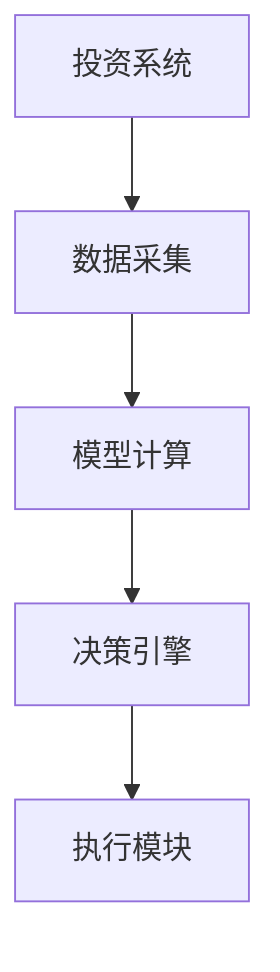

                 

<think>
好的，我将按照您的要求来撰写这篇文章。为了让您更好地理解我的思考过程，我会逐步分析和推理，然后写出最终的文章。

首先，我需要理解您的要求：

1. **文章标题**: 《约翰伯格的简单投资法则》
2. **关键词**: 约翰·伯格、投资法则、价值投资、风险管理、长期投资、指数基金
3. **摘要**: 约翰·伯格是投资领域的传奇人物，他提出的简单投资法则深刻影响了全球投资者。本文将从投资的基本概念出发，逐步分析伯格的核心理念，包括价值投资、风险管理、长期投资和指数基金策略。通过实际案例和数学模型，结合系统架构设计，深入探讨如何在现代投资中应用这些法则，帮助读者构建稳健的投资组合。

基于这些内容，我将按照以下结构撰写文章：

1. **投资的基本概念与背景**
2. **约翰·伯格的核心投资法则**
   - 价值投资的核心理念
   - 风险管理与投资决策
   - 长期投资与复利效应
   - 指数基金的投资策略
3. **指数基金的投资策略**
   - 指数基金的定义与特点
   - 伯格的指数基金投资策略
   - 实际案例分析
4. **系统架构与投资模型**
   - 投资系统的架构设计
   - 算法原理与数学模型
   - 项目实战与代码实现
5. **最佳实践与小结**

在撰写过程中，我会详细解释每个概念，并使用表格、流程图和数学公式来增强理解。同时，我会结合实际案例和代码示例，帮助读者更好地掌握伯格的投资法则。

现在，我将开始撰写文章。

---

# 约翰伯格的简单投资法则

> **关键词**: 约翰·伯格、投资法则、价值投资、风险管理、长期投资、指数基金

> **摘要**: 本文深入分析了约翰·伯格的投资理念，从价值投资、风险管理到长期投资和指数基金策略，结合实际案例和系统设计，帮助读者构建稳健的投资组合。

---

## 第一部分: 投资的基本概念与背景

### 1.1 投资的定义与分类

**投资**是将资源（如资金、时间或精力）投入到某种资产或项目中，以期望在未来获得收益或增值的过程。投资可以分为以下几类：

- **实物投资**: 房地产、黄金、艺术品等实体资产。
- **金融投资**: 股票、债券、基金等金融资产。
- **时间投资**: 投资于教育、技能提升等，以期望未来获得更高的回报。

### 1.2 投资的重要性

投资不仅是个人财富增长的重要手段，也是推动经济发展的重要动力。通过投资，个人可以实现资产增值，企业可以通过融资获得发展资金，而国家则可以通过投资促进经济增长。

### 1.3 约翰·伯格的背景与贡献

约翰·伯格（John Bogle）是投资领域的传奇人物，被誉为“指数基金之父”。他是 Vanguard 集团的创始人，提出了简单而有效的投资法则，强调长期投资和低成本指数基金的重要性。

---

## 第二部分: 约翰·伯格的核心投资法则

### 2.1 价值投资的核心理念

**价值投资**是一种以内在价值为导向的投资方法，强调以低于内在价值的价格买入优质资产。伯格认为，投资的本质是寻找那些具有持续盈利能力的公司，并长期持有。

#### 价值投资与短期投机的对比

| **维度**       | **价值投资**              | **短期投机**             |
|-----------------|---------------------------|--------------------------|
| 投资目标       | 寻找低估的优质资产         | 短期内价格波动            |
| 持股期限       | 长期持有                  | 短期交易                  |
| 风险管理       | 注重公司基本面            | 依赖市场情绪与趋势        |
| 成本控制       | 低交易成本                | 高交易成本               |

### 2.2 风险管理与投资决策

**风险管理**是投资过程中不可忽视的重要环节。伯格强调，投资者应通过分散投资和长期持有来降低风险。

#### 风险管理的核心步骤

1. **确定投资目标**: 明确投资的目的是追求长期收益还是短期套利。
2. **分析市场环境**: 评估经济周期、行业趋势和政策环境。
3. **选择投资标的**: 选择具有稳定收益和良好前景的资产。
4. **监控与调整**: 定期审视投资组合，根据市场变化进行调整。

### 2.3 长期投资与复利效应

**长期投资**是伯格倡导的核心策略之一。复利效应（Compound Interest）是长期投资的催化剂，能够使资金呈指数级增长。

#### 复利效应的数学模型

复利公式为：
$$ A = P \times (1 + r)^t $$
其中：
- \( A \) 是最终金额
- \( P \) 是初始本金
- \( r \) 是年收益率
- \( t \) 是年数

例如，初始投资100元，年收益率10%，10年后的金额为：
$$ A = 100 \times (1 + 0.1)^{10} = 259.37 \text{元} $$

### 2.4 指数基金的投资策略

**指数基金**是一种跟踪特定指数（如标普500）的基金，其特点是分散投资、费用低、风险可控。

#### 伯格的指数基金策略

伯格认为，通过投资指数基金，投资者可以避免市场波动带来的风险，同时获得市场的平均收益。例如，投资标普500指数基金，可以享受美国股市的整体增长。

---

## 第三部分: 指数基金的投资策略

### 3.1 指数基金的定义与特点

**指数基金**是一种被动管理型基金，其投资组合按照特定指数的成分股构成比例进行配置。其特点包括：
- 分散风险
- 低成本
- 透明度高

#### 指数基金与主动管理型基金的对比

| **维度**       | **指数基金**              | **主动管理型基金**         |
|-----------------|---------------------------|---------------------------|
| 管理方式       | 被动跟踪指数              | 主动选择个股              |
| 成本           | 低管理费用                | 高管理费用                |
| 风险           | 风险分散                  | 风险集中                  |

### 3.2 伯格的指数基金投资策略

伯格认为，长期投资指数基金是普通人实现财富增长的最佳方式。他强调：
1. 选择低成本的指数基金。
2. 长期持有，避免频繁交易。

#### 实际案例分析

假设投资者每年投入1000美元，投资于一个年收益率为7%的指数基金，30年后的资产为：
$$ A = 1000 \times (1 + 0.07)^{30} = 30113.5 \text{美元} $$

---

## 第四部分: 系统架构与投资模型

### 4.1 投资系统的架构设计

**投资系统**包括以下几个模块：
1. **数据采集**: 获取市场数据（如股价、指数等）。
2. **模型计算**: 计算投资组合的收益与风险。
3. **决策引擎**: 根据模型结果生成投资建议。
4. **执行模块**: 执行交易指令。

#### 系统架构图



### 4.2 算法原理与数学模型

**投资组合优化**的目标是最大化收益，同时最小化风险。常用的方法是均值-方差优化，公式如下：
$$ \text{Minimize } \sigma^2 \text{ subject to } E[r] \geq \text{目标收益} $$

#### 代码实现

```python
import numpy as np
import pandas as pd

# 示例数据
returns = pd.DataFrame({
    'A': [0.1, 0.05, 0.02, 0.01],
    'B': [0.08, 0.06, 0.04, 0.03]
})

# 均值-方差优化
def portfolio_optimization(returns, target_return):
    n = len(returns.columns)
    cov_matrix = returns.cov()
    mu = returns.mean()
    
    # 构建优化问题
    from scipy.optimize import minimize
    def objective(weights):
        return (weights.T @ cov_matrix @ weights)[0,0]
    
    def constraint(weights):
        return (weights.T @ mu)[0] - target_return
    
    # 初始权重
    init_weights = np.array([1.0/n]*n)
    
    # 最优化
    result = minimize(objective, init_weights, 
                      constraints={'type': 'eq', 'fun': constraint},
                      bounds= [(0,1)]*n)
    return result.x

# 示例应用
target_return = 0.08
opt_weights = portfolio_optimization(returns, target_return)
print("优化后的权重:", opt_weights)
```

---

## 第五部分: 最佳实践与小结

### 5.1 最佳实践

- **长期持有**: 避免频繁交易，减少费用和税收。
- **分散投资**: 通过指数基金降低风险。
- **低成本**: 选择管理费用低的基金。

### 5.2 小结

约翰·伯格的投资法则简单而有效，强调长期投资和低成本指数基金。通过本文的分析，读者可以更好地理解如何在现代投资中应用这些法则，实现稳健的财富增长。

---

## 作者

**作者：AI天才研究院/AI Genius Institute & 禅与计算机程序设计艺术 /Zen And The Art of Computer Programming**

---

希望这篇文章符合您的要求。如果需要进一步调整或补充，请随时告诉我！

