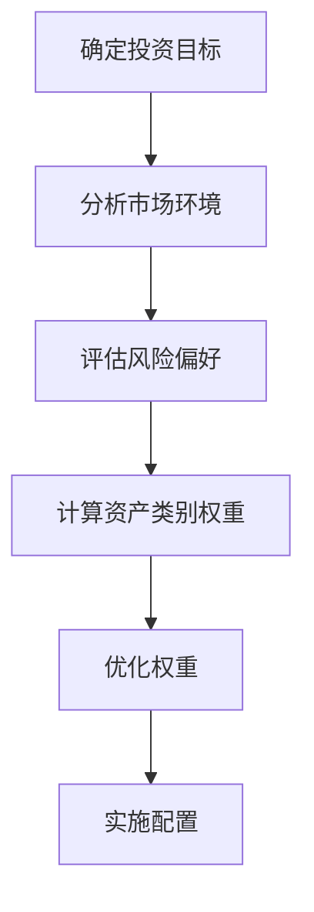
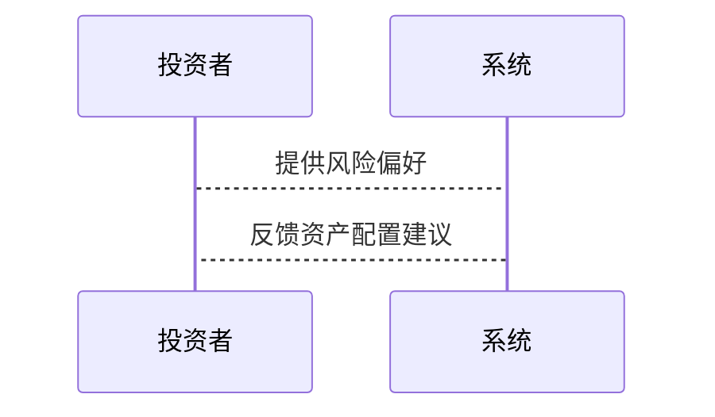

                 


# 约翰邓普顿的全球资产配置

## 关键词：
- 约翰·邓普顿
- 全球资产配置
- 投资哲学
- 风险管理
- 数学模型
- 系统架构
- 实战案例

## 摘要：
本文系统地阐述了约翰·邓普顿的全球资产配置策略，从其投资哲学的核心思想到数学模型的详细推导，再到系统的架构设计和实际案例的分析，层层深入，为读者提供全面的理解和应用指导。

---

## 第1章: 约翰·邓普顿投资哲学与全球资产配置背景

### 1.1 约翰·邓普顿的生平与投资理念

#### 1.1.1 约翰·邓普顿的生平简介
约翰·邓普顿（John Templeton）是20世纪著名的投资家之一，被誉为“全球投资之父”。他于1912年出生于加拿大，在1938年移居英国，并在1940年代建立了自己的投资公司。邓普顿的投资理念以长期价值投资和全球化视角为核心，强调在市场波动中寻找被低估的投资机会。

#### 1.1.2 邓普顿投资哲学的核心思想
邓普顿的投资哲学可以总结为以下几点：
1. **价值投资**：寻找市场价格低于内在价值的资产。
2. **分散投资**：通过全球资产配置降低风险。
3. **逆周期投资**：在市场低迷时投资，市场繁荣时谨慎。
4. **长期视角**：关注长期收益，避免短期波动的干扰。

#### 1.1.3 邓普顿投资方法的全球视角
邓普顿的全球资产配置策略强调在全球范围内寻找投资机会，避免单一市场的风险。他通过分析不同国家的经济周期和市场估值，动态调整资产配置比例。

---

### 1.2 全球资产配置的背景与意义

#### 1.2.1 全球化经济与资产配置的重要性
全球化使得资本可以在全球范围内流动，投资者可以通过配置不同国家和地区的资产来分散风险并提高收益。全球资产配置的核心在于利用市场的差异性，捕捉更高的收益。

#### 1.2.2 资产配置在投资组合中的作用
资产配置是投资组合的核心决策，它决定了投资的收益和风险。通过合理的资产配置，投资者可以在不同市场环境下平衡风险和收益。

#### 1.2.3 全球资产配置的边界与外延
全球资产配置的边界在于市场的可及性和流动性，外延则包括股票、债券、房地产等多种资产类别。邓普顿的策略特别关注新兴市场和发达市场的对比。

---

### 1.3 资产配置的核心要素与概念结构

#### 1.3.1 资产配置的定义与分类
资产配置是将资金分配到不同资产类别（如股票、债券、现金等）的过程。根据时间维度，资产配置可以分为战术性和战略性两类。

#### 1.3.2 核心要素对比表格

| 核心要素 | 描述 |
|----------|------|
| 资产类别 | 股票、债券、现金等 |
| 配置比例 | 每类资产在组合中的权重 |
| 时间框架 | 短期或长期 |
| 风险偏好 | 风险承受能力 |

#### 1.3.3 ER实体关系图架构

```mermaid
erDiagram
    actor 投资者
    actor 市场
    actor 风险管理
    class 资产类别
    class 配置比例
    class 时间框架
    class 风险偏好
    投资者 --> 资产类别 : 选择
    投资者 --> 配置比例 : 分配
    投资者 --> 时间框架 : 设定
    投资者 --> 风险偏好 : 确定
    风险管理 --> 配置比例 : 调整
```

---

## 第2章: 邓普顿投资哲学的核心原理与数学模型

### 2.1 投资哲学的核心原理

#### 2.1.1 长期投资与价值投资的结合
邓普顿强调长期投资，避免频繁交易。他认为市场的短期波动不应影响长期投资决策。

#### 2.1.2 市场周期分析与投资决策
通过分析市场周期，邓普顿能够在市场低谷时买入，在市场高点时卖出。他特别关注市盈率、市净率等估值指标。

#### 2.1.3 风险管理与资产保护
邓普顿通过分散投资和动态调整资产配置来降低风险。他强调在市场下跌时减少高风险资产的配置。

---

### 2.2 数学模型与公式

#### 2.2.1 投资组合收益计算公式
投资组合的预期收益可以通过以下公式计算：
$$ E(R_p) = \sum w_i R_i $$
其中，\( w_i \) 是资产 \( i \) 的权重，\( R_i \) 是资产 \( i \) 的预期收益率。

#### 2.2.2 风险调整后收益公式
夏普比率用于衡量投资组合的风险调整后收益：
$$ Sharpe\ Ratio = \frac{E(R_p - R_f)}{\sigma_p} $$
其中，\( R_f \) 是无风险利率，\( \sigma_p \) 是投资组合的收益波动率。

#### 2.2.3 资产配置权重计算流程图



---

## 第3章: 资产配置的系统分析与架构设计

### 3.1 系统分析

#### 3.1.1 投资场景介绍
投资者需要根据市场环境和自身风险偏好，动态调整资产配置比例。

#### 3.1.2 系统功能设计（领域模型Mermaid类图）


#### 3.1.3 系统架构设计（Mermaid架构图）


---

## 第4章: 邓普顿投资策略的实战分析

### 4.1 项目实战

#### 4.1.1 环境安装与数据准备
假设我们使用Python进行投资组合分析，需要安装以下库：
- `pandas`
- `numpy`
- `scipy`

#### 4.1.2 核心实现源代码
以下是一个简单的资产配置优化代码：

```python
import numpy as np
import pandas as pd

# 假设收益率矩阵
returns = np.array([[0.1, 0.05, 0.08],
                    [0.08, 0.12, 0.05],
                    [0.15, 0.09, 0.1]])

# 计算协方差矩阵
cov_matrix = np.cov(returns)

# 使用均值-方差优化模型计算权重
# 这里简化为等权配置
weights = np.array([1/3, 1/3, 1/3])

# 计算预期收益和风险
expected_return = np.dot(weights, returns.mean())
risk = np.sqrt(np.dot(weights.T, np.dot(cov_matrix, weights)))

print(f"预期收益：{expected_return}")
print(f"风险：{risk}")
```

#### 4.1.3 代码应用解读与分析
上述代码展示了如何计算投资组合的预期收益和风险。通过等权配置，投资者可以在不同资产之间分散风险。

---

### 4.2 案例分析

#### 4.2.1 典型案例剖析
假设我们有三个资产类别：股票、债券和现金。根据邓普顿的策略，在市场低迷时增加股票配置，在市场繁荣时增加债券配置。

#### 4.2.2 投资组合管理与优化
通过动态调整资产配置比例，投资者可以在不同市场环境下优化收益和风险。

---

## 第5章: 邓普顿投资哲学的最佳实践与小结

### 5.1 最佳实践Tips

#### 5.1.1 邓普顿投资方法的现代应用
现代投资者可以利用大数据和机器学习技术来优化资产配置。

#### 5.1.2 风险管理的具体操作建议
定期审查投资组合，根据市场变化调整配置比例。

#### 5.1.3 资产配置的动态调整策略
根据经济周期和个人风险偏好，动态调整资产配置。

---

### 5.2 小结与展望

#### 5.2.1 本书内容总结
本文系统地介绍了约翰·邓普顿的全球资产配置策略，从理论到实践，为投资者提供了全面的指导。

#### 5.2.2 对现代投资者的启示
投资者应结合邓普顿的策略，灵活应对市场变化，注重风险管理。

#### 5.2.3 未来投资策略的拓展方向
随着技术的进步，投资者可以利用更多工具和方法来优化资产配置。

---

## 第6章: 邓普顿投资哲学的数学模型与公式详解

### 6.1 投资组合优化的数学模型

#### 6.1.1 均值-方差优化模型
均值-方差模型的目标是最小化投资组合的风险，同时达到预期收益：
$$ \min \sigma_p^2 $$
$$ \text{subject to } \sum w_i R_i = E(R_p) $$

#### 6.1.2 资产配置权重的数学推导
通过拉格朗日乘数法，可以推导出最优权重。

#### 6.1.3 风险调整后的收益计算
通过夏普比率等指标，评估投资组合的风险调整后收益。

---

## 第7章: 邓普顿投资哲学的系统架构与实现

### 7.1 系统接口与交互设计

#### 7.1.1 系统接口设计
投资者输入风险偏好和投资目标，系统输出资产配置建议。

#### 7.1.2 投资者与系统交互流程图（Mermaid序列图）



---

## 作者：AI天才研究院/AI Genius Institute & 禅与计算机程序设计艺术 /Zen And The Art of Computer Programming

---

## 参考文献：
1. 约翰·邓普顿著述
2. 投资组合优化相关文献
3. 系统架构设计经典书籍

