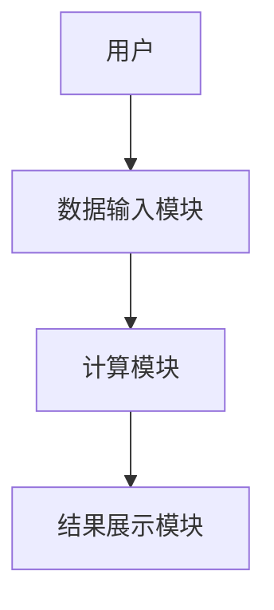
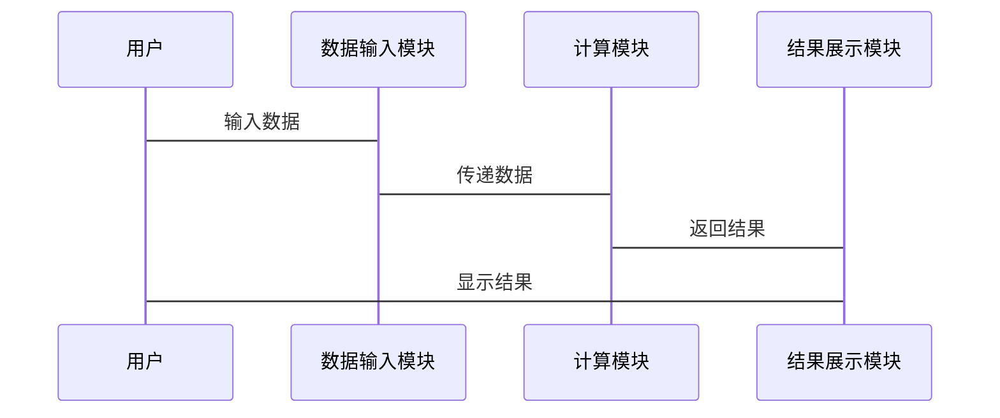

                 


# 经济利润模型：衡量真实价值创造的工具

---

## 关键词

- 经济利润模型
- 价值创造
- 财务分析
- 商业决策
- 资本成本

---

## 摘要

经济利润模型（Economic Value Added，EVA）是一种衡量企业真实价值创造的重要工具。它通过计算企业的经济利润，揭示了企业在扣除所有成本后的真正盈利能力，从而为企业和投资者提供了更准确的决策依据。本文将从经济利润模型的核心概念、数学模型、系统架构、项目实战等多个方面进行详细分析，帮助读者全面理解这一工具的原理和应用。

---

## 第1章：经济利润模型的背景与概念

### 1.1 经济利润模型的基本概念

#### 1.1.1 经济利润的定义与内涵

经济利润（Economic Profit）是指企业在扣除所有成本（包括显性成本和隐性成本）后的净收益。与会计利润不同，经济利润更关注企业创造的真实价值，排除了市场扭曲和非经济性因素的影响。其公式为：

$$ \text{经济利润} = \text{净利润} - \text{资本成本} $$

其中，资本成本是指企业为使用资本所支付的成本，包括债务利息和股权资本的机会成本。

#### 1.1.2 经济利润与会计利润的区别

| 项目                | 会计利润                          | 经济利润                          |
|---------------------|-----------------------------------|------------------------------------|
| 定义                | 税后净利润                        | 扣除所有成本后的净收益            |
| 计算方式            | 利润 = 收入 - 显性成本            | 利润 = 净利润 - 资本成本          |
| 目的                | 衡量会计期间的盈利能力            | 衡量企业的真实价值创造能力        |

#### 1.1.3 经济利润模型的核心要素

经济利润模型的核心要素包括：

1. **营业收入**：企业在一定时期内通过销售产品或服务所获得的总收入。
2. **经营成本**：企业为生产产品或提供服务而发生的直接成本。
3. **资本成本**：企业使用资本所支付的成本，包括债务利息和股权资本的机会成本。
4. **经济利润**：扣除所有成本后的净收益。

---

### 1.2 经济利润模型的背景与意义

#### 1.2.1 经济利润模型的发展历程

经济利润模型起源于20世纪90年代，由美国学者弗雷德·德曼（Fred Mishkin）提出。随着全球经济的快速发展，企业之间的竞争日益激烈，传统的会计利润已无法准确衡量企业的真正价值，经济利润模型应运而生。

#### 1.2.2 经济利润模型在现代经济中的作用

经济利润模型的主要作用包括：

1. **衡量企业的真实价值**：通过扣除资本成本，揭示企业创造的真实利润。
2. **优化资源配置**：帮助企业合理分配资源，提高投资效率。
3. **支持决策制定**：为管理层和投资者提供可靠的决策依据。

#### 1.2.3 经济利润模型的应用场景与边界

经济利润模型适用于企业内部管理和外部投资评估。其应用场景包括：

- 企业绩效评估
- 投资决策分析
- 企业并购评估

其应用边界包括：

- 忽略市场环境的短期波动
- 不考虑企业的战略调整
- 仅适用于成熟的市场经济环境

---

## 第2章：经济利润模型的构建与计算方法

### 2.1 经济利润模型的数学模型

#### 2.1.1 经济利润的公式推导

经济利润的计算公式为：

$$ \text{EVA} = \text{净利润} - \text{资本成本} $$

其中，净利润的计算公式为：

$$ \text{净利润} = \text{营业收入} - \text{经营成本} $$

资本成本的计算公式为：

$$ \text{资本成本} = r \times E \times (1 - t) $$

其中，r为资本的平均成本率，E为企业的资本总额，t为企业所得税率。

#### 2.1.2 经济利润模型的计算步骤

1. 计算企业的营业收入和经营成本，得出净利润。
2. 计算企业的资本成本。
3. 扣除资本成本，得出经济利润。

---

### 2.2 经济利润模型的案例分析

#### 2.2.1 案例背景

假设某公司2022年的营业收入为1000万元，经营成本为600万元，资本总额为800万元，资本成本率为5%，所得税率为25%。

#### 2.2.2 计算过程

1. 净利润 = 营业收入 - 经营成本 = 1000万元 - 600万元 = 400万元
2. 资本成本 = 5% × 800万元 × (1 - 25%) = 30万元
3. 经济利润 = 净利润 - 资本成本 = 400万元 - 30万元 = 370万元

---

## 第3章：经济利润模型的系统架构与实现

### 3.1 经济利润模型的系统设计

#### 3.1.1 系统功能设计

经济利润模型的系统功能模块包括：

1. 数据输入模块：输入企业的营业收入、经营成本、资本总额等数据。
2. 计算模块：计算净利润和资本成本，得出经济利润。
3. 结果展示模块：以图表形式展示计算结果。

#### 3.1.2 系统架构设计



---

### 3.2 经济利润模型的接口设计

#### 3.2.1 接口设计

系统提供以下接口：

1. 输入接口：接受企业的营业收入、经营成本、资本总额等数据。
2. 计算接口：计算净利润和资本成本，返回经济利润。
3. 输出接口：以JSON格式返回计算结果。

#### 3.2.2 交互流程图



---

## 第4章：经济利润模型的项目实战

### 4.1 项目背景

某企业希望引入经济利润模型，评估其真实价值创造能力。

---

### 4.2 项目需求分析

项目需求包括：

1. 开发一个经济利润计算系统。
2. 提供用户友好的界面，方便数据输入和结果查看。

---

### 4.3 项目实现

#### 4.3.1 系统实现代码

```python
def calculate_eva(revenue, cost, capital, rate, tax_rate):
    net_profit = revenue - cost
    capital_cost = capital * rate * (1 - tax_rate)
    eva = net_profit - capital_cost
    return eva

# 示例
revenue = 1000
cost = 600
capital = 800
rate = 0.05
tax_rate = 0.25

eva = calculate_eva(revenue, cost, capital, rate, tax_rate)
print(f"经济利润为：{eva}万元")
```

#### 4.3.2 代码解读与分析

- `calculate_eva`函数：计算经济利润，输入参数包括营业收入、经营成本、资本总额、资本成本率和税率。
- 示例部分：使用假设数据计算经济利润，输出结果。

---

### 4.4 项目结果分析

根据示例计算，企业的经济利润为370万元，表明其创造了370万元的真实价值。

---

## 第5章：经济利润模型的最佳实践与总结

### 5.1 最佳实践

1. **数据准确性**：确保输入数据的准确性，以提高计算结果的可靠性。
2. **模型适用性**：根据企业的实际情况选择合适的模型参数。
3. **定期更新**：根据市场环境的变化，定期更新模型参数。

---

### 5.2 小结

经济利润模型是一种有效的衡量企业真实价值创造的工具。通过本文的详细分析，读者可以深入了解其原理和应用，并能够将其应用于实际的商业决策中。

---

## 作者信息

作者：AI天才研究院/AI Genius Institute & 禅与计算机程序设计艺术 /Zen And The Art of Computer Programming

---

通过本文的系统分析和详细讲解，读者可以全面掌握经济利润模型的原理和应用，从而在实际工作中更好地衡量和优化企业的价值创造能力。

