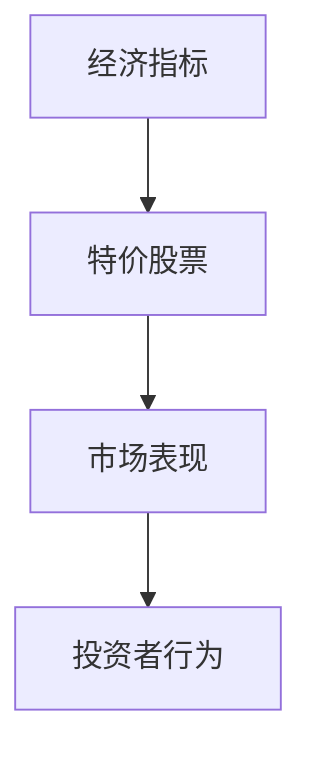
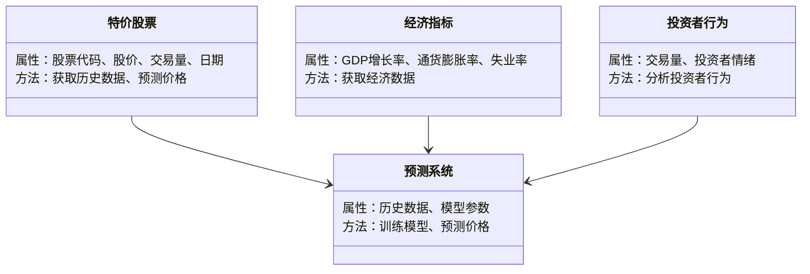
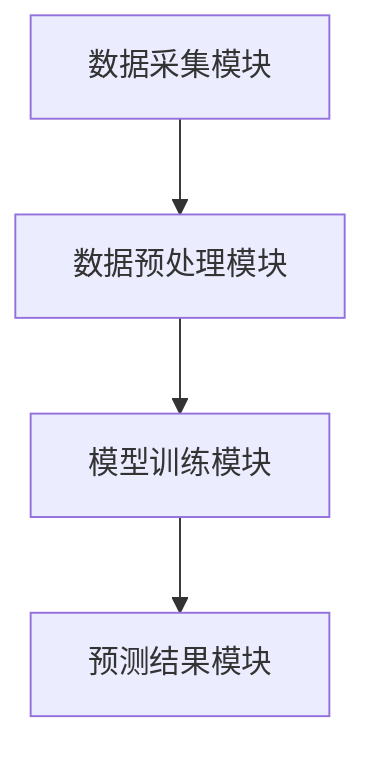
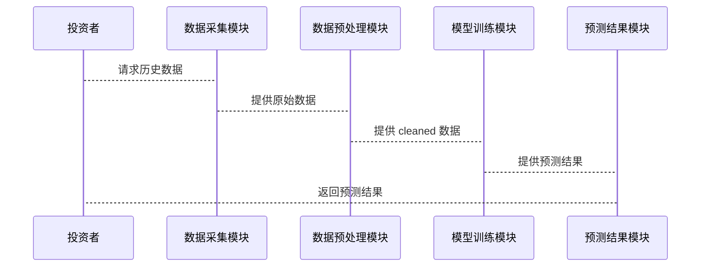

                 


# 经济形势恶化时特价股票的表现预测

> 关键词：经济形势、特价股票、股票预测、经济指标、投资策略、市场分析  
> 摘要：本文探讨在经济形势恶化时，特价股票的表现预测方法和投资策略。通过分析影响特价股票表现的关键因素，结合经济指标和市场数据，利用时间序列分析和机器学习算法，为投资者提供科学的决策支持。

---

## 第一部分：经济形势恶化时特价股票的表现预测概述

### 第1章：特价股票与经济形势概述

#### 1.1 特价股票的定义与特性

##### 1.1.1 特价股票的定义  
特价股票通常指价格低于某一特定阈值的股票，通常被视为市场上的低价股。这类股票通常具有高波动性和高风险，但也可能隐藏着投资机会。

##### 1.1.2 特价股票的核心特性  
- **低价性**：价格低于市场平均水平的股票。
- **高波动性**：股价波动较大，容易受到市场情绪影响。
- **高风险性**：由于价格较低，通常属于高风险投资标的。

##### 1.1.3 特价股票的市场定位  
特价股票主要分布在小盘股或中盘股中，通常属于成长型企业或处于困境中的企业。

#### 1.2 经济形势对股市的影响

##### 1.2.1 经济周期与股市的关系  
经济周期分为扩张期和衰退期，股市表现与经济周期密切相关。在经济衰退期，股市通常会下跌，而在经济扩张期，股市则会上涨。

##### 1.2.2 经济恶化时的股市表现  
- **市场下跌**：经济恶化时，投资者通常会抛售股票，导致股市整体下跌。
- **避险情绪上升**：投资者倾向于转向黄金、债券等避险资产，导致股市流动性下降。

##### 1.2.3 特价股票在经济恶化中的特殊性  
在经济恶化时，特价股票可能面临更大的下跌压力，但也可能因为市场反转而出现反弹机会。

#### 1.3 特价股票表现预测的背景与意义

##### 1.3.1 经济恶化时的投资选择  
在经济恶化时，投资者需要寻找能够在市场波动中表现稳定的股票，特价股票作为一种高风险高收益的投资工具，具有研究价值。

##### 1.3.2 特价股票作为避险工具的作用  
尽管特价股票风险较高，但在市场底部，这类股票可能具有较高的反弹潜力，为投资者提供避险机会。

##### 1.3.3 预测特价股票表现的重要性  
通过预测特价股票的表现，投资者可以在经济恶化时做出更明智的投资决策，降低风险，抓住潜在的投资机会。

---

## 第二部分：特价股票表现预测的核心概念与联系

### 第2章：特价股票表现预测的核心概念与联系

#### 2.1 特价股票表现预测的核心概念

##### 2.1.1 特价股票的市场表现  
特价股票的市场表现受多种因素影响，包括宏观经济指标、行业趋势、公司基本面等。

##### 2.1.2 经济指标对股票的影响  
- **GDP增长率**：GDP增长与股市密切相关，经济增长通常会带动股市上涨。
- **通货膨胀率**：高通胀可能导致股市下跌，因为企业利润被压缩。
- **失业率**：高失业率通常意味着经济不景气，股市表现不佳。

##### 2.1.3 投资者行为与股票价格的关系  
投资者情绪和行为会直接影响股票价格。在经济恶化时，恐慌性抛售会导致股价大幅下跌。

#### 2.2 特价股票与经济指标的对比分析

##### 2.2.1 特价股票与GDP增长率的对比  
GDP增长率是衡量经济健康的重要指标，经济衰退时GDP增长放缓，通常会导致股市整体下跌，包括特价股票。

##### 2.2.2 特价股票与通货膨胀率的对比  
高通胀可能导致企业成本上升，利润减少，进而影响股价。在经济恶化时，通胀率下降，可能对特价股票有利。

##### 2.2.3 特价股票与失业率的对比  
高失业率意味着经济不景气，投资者通常会抛售股票，导致股价下跌，包括特价股票。

#### 2.3 特价股票表现预测的ER实体关系图



---

## 第三部分：特价股票表现预测的算法原理

### 第3章：特价股票表现预测的算法原理

#### 3.1 时间序列分析

##### 3.1.1 时间序列分析的定义  
时间序列分析是一种通过分析历史数据来预测未来趋势的方法，常用于股票价格预测。

##### 3.1.2 时间序列分析的步骤  
1. 数据收集：获取历史股价数据。
2. 数据预处理：清洗数据，处理缺失值和异常值。
3. 模型选择：选择合适的时间序列模型，如ARIMA。
4. 模型训练：基于历史数据训练模型。
5. 预测与验证：使用测试数据验证模型准确性。

##### 3.1.3 时间序列分析的数学模型  
ARIMA（自回归积分滑动平均模型）是一种常用的时间序列分析模型，其数学公式如下：

$$ ARIMA(p, d, q) $$

其中，p为自回归阶数，d为差分阶数，q为移动平均阶数。

#### 3.2 机器学习算法

##### 3.2.1 支持向量回归  
支持向量回归（SVR）是一种基于支持向量机的回归算法，适用于非线性数据的预测。

##### 3.2.2 随机森林回归  
随机森林是一种基于决策树的集成学习算法，适用于处理高维数据。

##### 3.2.3 LSTM神经网络  
LSTM（长短期记忆网络）是一种特殊的循环神经网络，适用于时间序列数据的预测。

#### 3.3 算法实现

##### 3.3.1 时间序列分析的Python代码  
```python
import numpy as np
from statsmodels.tsa.arima_model import ARIMA

# 示例数据
data = np.array([100, 90, 80, 70, 60, 50, 40, 30, 20, 10])

# 训练ARIMA模型
model = ARIMA(data, order=(5, 1, 0))
model_fit = model.fit(disp=0)

# 预测下一个值
 forecast = model_fit.forecast(steps=1)
print(forecast[0][0])
```

---

## 第四部分：系统分析与架构设计方案

### 第4章：系统分析与架构设计方案

#### 4.1 问题场景介绍  
在经济恶化时，投资者需要一个实时监控和预测系统，帮助他们做出投资决策。

#### 4.2 项目介绍  
构建一个基于时间序列分析和机器学习算法的股票价格预测系统。

#### 4.3 系统功能设计

##### 4.3.1 领域模型  


#### 4.4 系统架构设计

##### 4.4.1 系统架构图  


#### 4.5 系统接口设计  
系统接口包括数据输入接口、模型训练接口和结果输出接口。

#### 4.6 系统交互设计

##### 4.6.1 交互流程图  


---

## 第五部分：项目实战

### 第5章：项目实战

#### 5.1 环境安装  
安装必要的Python库，如numpy、pandas、statsmodels、scikit-learn。

#### 5.2 系统核心实现源代码  
```python
import numpy as np
import pandas as pd
from sklearn.ensemble import RandomForestRegressor
from sklearn.metrics import mean_squared_error

# 数据加载
data = pd.read_csv('stock_data.csv')

# 数据预处理
X = data.drop('price', axis=1)
y = data['price']

# 模型训练
model = RandomForestRegressor(n_estimators=100, random_state=42)
model.fit(X, y)

# 模型预测
predicted = model.predict(X)
print(mean_squared_error(y, predicted))
```

#### 5.3 代码应用解读与分析  
通过代码实现随机森林回归模型，对特价股票价格进行预测，并计算均方误差以评估模型性能。

#### 5.4 实际案例分析  
以具体股票为例，分析模型在实际数据中的表现，并讨论可能的影响因素。

#### 5.5 项目小结  
总结项目实现过程中的经验与教训，提出改进建议。

---

## 第六部分：最佳实践

### 第6章：最佳实践

#### 6.1 小结  
在经济恶化时，特价股票的表现预测需要结合宏观经济指标和市场数据，利用多种算法进行综合分析。

#### 6.2 注意事项  
- 数据质量对预测结果影响重大，需确保数据的准确性和完整性。
- 模型选择需根据实际数据特征进行，避免过度拟合。
- 投资者需结合市场实际情况，合理调整投资策略。

#### 6.3 拓展阅读  
推荐相关书籍和论文，帮助读者深入理解股票预测和经济指标分析。

---

## 作者信息

作者：AI天才研究院/AI Genius Institute & 禅与计算机程序设计艺术 /Zen And The Art of Computer Programming

---

以上是《经济形势恶化时特价股票的表现预测》的技术博客文章目录大纲及部分内容。希望这篇文章能够为投资者在经济恶化时提供有价值的参考和指导。

