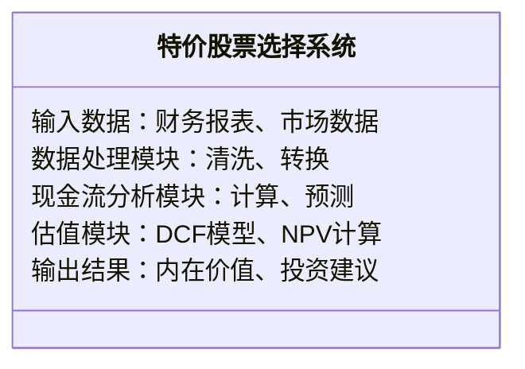

                 


```markdown
# 经营现金流对特价股票选择的影响

> 关键词：经营现金流，特价股票，股票价值，现金流分析，投资决策

> 摘要：本文深入探讨了经营现金流在特价股票选择中的重要性，通过分析现金流的基本原理、影响因素以及实际应用，帮助投资者更好地理解和应用现金流分析方法来选择高质量的特价股票。文章从现金流的基本概念到具体的分析方法，再到实际案例，全面而系统地阐述了现金流分析在股票投资中的关键作用。

---

## 第一部分: 经营现金流与特价股票的定义与关系

### 第1章: 经营现金流与特价股票的定义与关系

#### 1.1 经营现金流的定义与特点
##### 1.1.1 经营现金流的定义
经营现金流是指企业在日常经营活动中产生的现金流入和流出，主要包括销售商品、提供服务、购买原材料等活动所涉及的现金流动。它是企业财务健康状况的重要指标之一，反映了企业的盈利能力和现金流管理能力。

##### 1.1.2 经营现金流的核心特点
- 现金流的时间性：现金流的流入和流出具有时间性，需要考虑资金的时间价值。
- 现金流的稳定性：稳定的现金流表明企业具有持续的盈利能力，能够支撑企业的正常运营。
- 现金流的波动性：现金流可能会受到市场环境、行业周期等因素的影响，出现波动。

##### 1.1.3 经营现金流与企业价值的关系
经营现金流是企业价值的核心驱动因素之一。健康的现金流能够支持企业的扩张、分红和偿还债务，从而提升企业的市场价值。同时，现金流状况也是投资者评估企业财务健康状况的重要依据。

#### 1.2 特价股票的定义与特点
##### 1.2.1 特价股票的定义
特价股票是指那些市场价格低于其内在价值的股票。这类股票通常具有较高的分红回报率，或者其市场价格因市场波动、行业周期等因素而被低估。

##### 1.2.2 特价股票的核心特点
- 低估值：市场价格低于内在价值，具有较高的投资吸引力。
- 高分红：许多特价股票来自盈利稳定、现金流充足的公司，能够提供较高的股息回报。
- 高风险：特价股票通常来自处于困境或行业周期低谷的公司，投资风险较高。

##### 1.2.3 特价股票的市场定位与投资价值
特价股票在市场中通常被视为高收益、高风险的投资品种。投资者选择特价股票，通常基于对企业未来盈利能力的判断，以及对市场估值的预期。

#### 1.3 经营现金流与特价股票的关系
##### 1.3.1 经营现金流对股票价值的影响
健康的经营现金流能够支持企业的持续发展，增强企业的偿债能力，提升投资者信心，从而推动股票价格上涨。

##### 1.3.2 特价股票选择中的现金流分析
在选择特价股票时，投资者需要关注企业的经营现金流状况，评估企业的财务健康状况和未来盈利能力。

##### 1.3.3 现金流分析在投资决策中的重要性
现金流分析是评估企业财务健康状况的重要工具，能够帮助投资者识别那些现金流健康、具有持续盈利能力的特价股票。

---

## 第二部分: 现金流分析的基本原理与方法

### 第2章: 现金流分析的基本原理与方法

#### 2.1 现金流分析的核心原理
##### 2.1.1 现金流的时间价值
资金的时间价值是指资金随着时间的推移而产生的价值变化。现金流分析需要考虑资金的时间价值，通常通过折现率来衡量。

##### 2.1.2 现金流的折现原理
现金流的折现原理是指将未来现金流按照一定的折现率折算到现在价值的过程。通过折现，可以将未来的现金流与其当前价值进行比较，从而评估其投资价值。

##### 2.1.3 现金流的净现值计算
净现值（Net Present Value，NPV）是指未来现金流的现值与初始投资之间的差额。NPV为正的项目通常具有较高的投资价值。

#### 2.2 现金流分析的主要方法
##### 2.2.1 现金流折现模型（DCF模型）
DCF模型是一种通过将未来现金流折现到现值，来评估企业或项目价值的模型。它是现金流分析的核心方法之一。

##### 2.2.2 内部收益率（IRR）法
内部收益率是指使得未来现金流的现值等于初始投资的折现率。IRR法常用于评估项目的盈利能力。

##### 2.2.3 净现值（NPV）法
净现值法通过计算未来现金流的现值与初始投资的差额，来评估项目的投资价值。

#### 2.3 现金流分析在股票投资中的应用
##### 2.3.1 现金流分析在股票估值中的作用
现金流分析可以帮助投资者评估企业的内在价值，从而判断股票是否被低估或高估。

##### 2.3.2 现金流分析与股票投资策略
通过现金流分析，投资者可以制定基于现金流状况的投资策略，例如选择现金流稳定、分红回报高的特价股票。

##### 2.3.3 现金流分析的局限性与改进方向
现金流分析的局限性包括对未来现金流预测的不确定性，以及对折现率的选择敏感性。投资者可以通过结合其他分析方法来弥补这些局限性。

---

## 第三部分: 经营现金流对股票价值的影响

### 第3章: 经营现金流对股票价值的影响

#### 3.1 经营现金流与股票价值的关系
##### 3.1.1 现金流是股票价值的核心驱动因素
健康的经营现金流能够支持企业的持续发展，增强投资者信心，从而提升股票价值。

##### 3.1.2 现金流与股票市盈率的关系
市盈率（P/E比率）是股票价格与每股收益的比率。健康的现金流能够提升企业的盈利能力和分红能力，从而影响市盈率。

##### 3.1.3 现金流与股票市净率的关系
市净率（P/B比率）是股票价格与每股净资产的比率。现金流充足的公司通常具有较高的资产质量，从而影响市净率。

#### 3.2 现金流质量与股票投资决策
##### 3.2.1 现金流质量的定义与衡量
现金流质量是指企业现金流的稳定性和可持续性。高质量的现金流表明企业具有持续的盈利能力。

##### 3.2.2 现金流质量对股票价值的影响
高质量的现金流能够提升企业的市场价值，增强投资者信心，从而推动股票价格上涨。

##### 3.2.3 现金流质量与企业财务健康状况的关系
高质量的现金流通常与健康的财务状况相关，能够反映企业的盈利能力和财务稳定性。

#### 3.3 现金流预测与股票价值评估
##### 3.3.1 现金流预测的基本原理
现金流预测是基于对企业未来经营状况的预测，结合历史数据和市场环境，估算未来现金流的过程。

##### 3.3.2 现金流预测的常用方法
- 历史数据分析法：基于历史现金流数据，预测未来的现金流。
- 财务模型法：通过构建财务模型，预测未来的现金流。
- 市场分析法：结合市场环境和行业趋势，预测未来的现金流。

##### 3.3.3 现金流预测在股票投资中的应用
通过现金流预测，投资者可以评估企业的未来盈利能力，判断股票的内在价值，从而做出投资决策。

---

## 第四部分: 特价股票选择中的现金流分析

### 第4章: 特价股票选择中的现金流分析

#### 4.1 特价股票的现金流特征
##### 4.1.1 特价股票的高分红特性
许多特价股票来自盈利稳定、现金流充足的公司，能够提供较高的股息回报。

##### 4.1.2 特价股票的高现金流稳定性
健康的现金流状况是特价股票的重要特征，能够反映企业的财务健康状况。

##### 4.1.3 特价股票的低估值特性
特价股票通常市场价格低于内在价值，具有较高的投资吸引力。

#### 4.2 现金流分析在特价股票选择中的具体应用
##### 4.2.1 现金流分析的指标体系
- 自由现金流（Free Cash Flow）：衡量企业经营活动中产生的现金流。
- 现金流比率（Cash Flow Ratio）：衡量企业现金流与净利润的比例。
- 现金流折现率（Discount Rate）：衡量现金流的折现率。

##### 4.2.2 现金流分析的步骤与流程
1. **数据收集**：收集企业的财务报表和市场数据。
2. **现金流计算**：计算企业的自由现金流和其他相关指标。
3. **现金流预测**：基于历史数据和市场环境，预测未来的现金流。
4. **现金流折现**：使用DCF模型计算企业的内在价值。
5. **投资决策**：结合市场估值和内在价值，判断股票是否被低估。

##### 4.2.3 现金流分析的案例
假设我们分析一家公司的现金流状况，计算其自由现金流和内在价值，判断其是否符合特价股票的条件。

---

## 第五部分: 系统分析与架构设计

### 第5章: 系统分析与架构设计

#### 5.1 系统功能设计
##### 5.1.1 领域模型


#### 5.2 系统架构设计


---

## 第六部分: 项目实战

### 第6章: 项目实战

#### 6.1 环境安装
- 安装Python和相关库（如Pandas、NumPy）。
- 安装Jupyter Notebook用于数据分析和可视化。

#### 6.2 系统核心实现源代码
```python
import pandas as pd
import numpy as np

# 示例数据
data = {
    '收入': [100, 200, 300, 400, 500],
    '成本': [50, 100, 150, 200, 250],
    '现金流': [10, 50, 90, 150, 220]
}

df = pd.DataFrame(data)

# 计算自由现金流
free_cash_flow = df['现金流'] - (df['收入'] - df['成本'])

print(free_cash_flow)
```

#### 6.3 代码应用解读与分析
上述代码展示了如何从财务数据中计算自由现金流。通过分析自由现金流，投资者可以评估企业的盈利能力和现金流状况，从而判断其是否符合特价股票的条件。

#### 6.4 实际案例分析
假设我们选择一家公司的财务数据，计算其自由现金流，并使用DCF模型评估其内在价值，判断其是否为特价股票。

---

## 第七部分: 总结与展望

### 第7章: 总结与展望

#### 7.1 最佳实践 tips
- 在选择特价股票时，重点关注企业的现金流状况，尤其是自由现金流和分红能力。
- 结合市场估值和内在价值，制定合理的投资策略。

#### 7.2 小结
现金流分析是选择特价股票的重要工具，能够帮助投资者识别具有高分红回报和低估值的股票。

#### 7.3 注意事项
- 现金流分析具有一定的局限性，需要结合其他分析方法进行综合判断。
- 投资者需要关注市场环境和行业周期，避免仅依赖现金流分析做出投资决策。

#### 7.4 拓展阅读
- 《投资学》：深入理解股票投资的基本原理。
- 《财务报表分析》：掌握如何从财务报表中提取现金流信息。

---

## 作者：AI天才研究院/AI Genius Institute & 禅与计算机程序设计艺术 /Zen And The Art of Computer Programming
```

