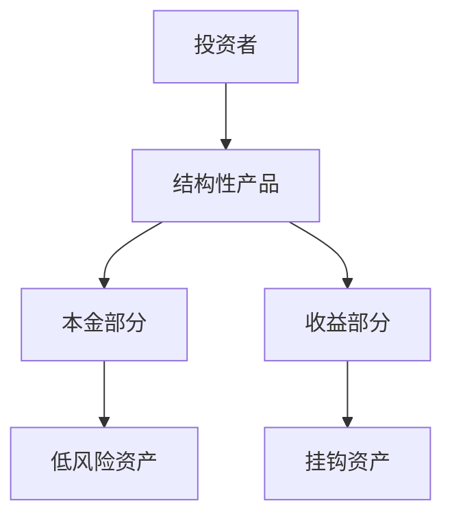
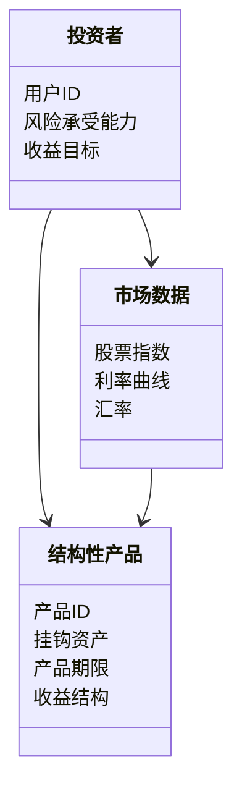
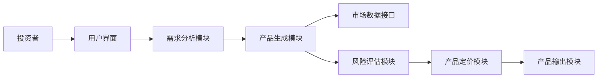
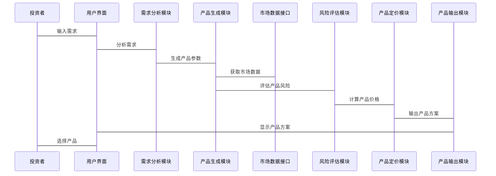

                 


# 结构性产品：定制化投资解决方案

## 关键词：结构性产品，定制化投资，金融衍生品，风险评估，定价模型

## 摘要：结构性产品是一种结合了固定收益和衍生品的定制化投资工具，允许投资者根据市场情况定制收益结构。本文将从结构性产品的背景、核心概念、定价模型、系统架构、项目实战和最佳实践等方面进行详细分析，帮助读者全面理解结构性产品的设计与应用。

---

# 目录

## 第一部分: 结构性产品的背景与核心概念

## 第1章: 结构性产品的定义与背景

### 1.1 结构性产品的定义与分类

#### 1.1.1 什么是结构性产品

结构性产品是一种结合了固定收益和衍生品的投资工具，通常由本金和收益部分组成。其收益部分与特定的资产或指数挂钩，投资者可以根据市场表现获得超额收益。与传统投资工具相比，结构性产品具有更高的灵活性和定制化能力。

#### 1.1.2 结构性产品的分类

结构性产品可以根据不同的分类标准进行划分：

- **按挂钩资产分类**：包括股票、债券、指数、商品等多种类型。
- **按收益结构分类**：包括固定收益、浮动收益、保本型、非保本型等。
- **按期限分类**：包括短期、中期和长期结构性产品。

#### 1.1.3 结构性产品与传统投资工具的区别

- **传统投资工具**：如股票、债券等，收益和风险直接挂钩，投资者需自行承担市场波动风险。
- **结构性产品**：通过将收益部分与特定资产挂钩，投资者可以根据自身风险承受能力和收益目标进行定制化投资。

### 1.2 结构性产品的历史发展

#### 1.2.1 结构性产品的起源

结构性产品起源于20世纪80年代的金融衍生品创新，随着金融市场的不断发展，结构性产品逐渐成为投资者的重要工具之一。

#### 1.2.2 结构性产品的发展阶段

- **早期阶段**：主要以简单的期权和 warrants 为基础，产品种类有限。
- **发展阶段**：随着金融创新的推进，结构性产品逐渐多样化，涵盖更多资产类型和收益结构。
- **当前阶段**：结构性产品已成为金融市场的重要组成部分，广泛应用于财富管理和风险管理领域。

#### 1.2.3 当前结构性产品的市场现状

当前，结构性产品在全球范围内得到广泛应用，尤其在财富管理和风险管理领域表现突出。随着金融市场的不断复杂化，结构性产品也在不断创新，以满足投资者日益多样化的需求。

## 第2章: 结构性产品的核心要素与运作机制

### 2.1 结构性产品的核心要素

#### 2.1.1 本金部分

本金部分是结构性产品的基础，通常提供本金保障。投资者在投资结构性产品时，本金可以得到一定程度的保护，尤其是在保本型产品中。

#### 2.1.2 收益部分

收益部分是结构性产品的重要组成部分，其收益通常与特定资产或指数的表现挂钩。投资者可以根据市场表现获得超额收益。

#### 2.1.3 风险部分

结构性产品的风险主要体现在收益部分的表现。投资者需要根据自身的风险承受能力选择合适的产品。

### 2.2 结构性产品的运作机制

#### 2.2.1 产品结构化设计

结构性产品的设计需要结合投资者的需求和市场情况，通过将收益部分与特定资产挂钩，实现收益的定制化。

#### 2.2.2 风险与收益的匹配

结构性产品的设计需要充分考虑风险与收益的匹配，确保投资者在可承受风险范围内获得预期收益。

#### 2.2.3 产品生命周期管理

结构性产品的生命周期包括发行、运作和到期三个阶段。在运作过程中，需要定期监控市场表现和产品风险，确保产品的顺利运作。

## 第3章: 结构性产品的核心概念与联系

### 3.1 结构性产品的核心概念原理

#### 3.1.1 本金保障机制

结构性产品的本金保障机制通常通过将本金投资于低风险资产，如国债或高等级债券，确保本金的安全性。

#### 3.1.2 收益分配规则

收益分配规则通常基于挂钩资产的表现，投资者可以根据市场表现获得相应的收益。

#### 3.1.3 风险控制方法

结构性产品的风险控制方法包括设置风险敞口限制、引入风险对冲机制等，确保产品在市场波动中的稳定性。

### 3.2 结构性产品概念属性特征对比表

| 属性 | 保本型结构性产品 | 非保本型结构性产品 |
|------|-----------------|-------------------|
| 本金保障 | 是             | 否               |
| 收益类型 | 固定收益       | 浮动收益         |
| 风险等级 | 较低           | 较高             |

### 3.3 结构性产品ER实体关系图



## 第4章: 结构性产品的定价与风险评估

### 4.1 结构性产品的定价模型

#### 4.1.1 Black-Scholes定价模型

Black-Scholes模型是一种常用的期权定价模型，适用于标的资产价格服从几何布朗运动的假设。其公式为：

$$ C = S_0 N(d_1) - K e^{-rT} N(d_2) $$

其中：
- \( C \) 为期权的理论价格
- \( S_0 \) 为标的资产当前价格
- \( K \) 为执行价格
- \( r \) 为无风险利率
- \( T \) 为到期时间
- \( N(d) \) 为标准正态分布的累积分布函数
- \( d_1 = \frac{\ln(S_0/K) + (r + \sigma^2/2)T}{\sigma \sqrt{T}} \)
- \( d_2 = d_1 - \sigma \sqrt{T} \)
- \( \sigma \) 为标的资产价格的波动率

#### 4.1.2 Monte Carlo模拟方法

Monte Carlo模拟方法是一种通过随机抽样来估计变量概率分布的数值模拟技术。其基本步骤如下：

1. 确定模型参数
2. 生成随机数
3. 计算模拟结果
4. 统计结果并分析

#### 4.1.3 其他定价方法

除了Black-Scholes模型和Monte Carlo模拟，还有其他定价方法，如二叉树模型和解析解方法。这些方法在不同情况下各有优劣，需要根据具体情况进行选择。

### 4.2 结构性产品的风险评估

#### 4.2.1 风险类型分析

- **市场风险**：由于市场波动导致产品收益下降的风险。
- **信用风险**：由于发行人或交易对手违约导致的风险。
- **流动性风险**：由于产品缺乏流动性导致的买卖价差风险。

#### 4.2.2 风险评估指标

- **VaR（Value at Risk）**：在一定置信水平下，可能的最大损失。
- **CVaR（Conditional Value at Risk）**：在VaR基础上的条件风险测度。
- **波动率**：资产价格波动程度的指标。

#### 4.2.3 风险对冲策略

- **期权对冲**：通过买入或卖出期权来对冲市场风险。
- **资产配置**：通过合理配置不同资产类别来分散风险。
- **动态再平衡**：根据市场变化定期调整投资组合，以保持风险在可接受范围内。

---

# 第二部分: 结构性产品的系统分析与架构设计

## 第5章: 结构性产品的系统分析

### 5.1 问题场景介绍

投资者需要根据自身的风险承受能力和收益目标选择合适的结构性产品。系统需要能够根据市场数据和投资者需求，提供个性化的结构性产品解决方案。

### 5.2 领域模型设计



## 第6章: 系统架构设计

### 6.1 系统架构设计



### 6.2 系统功能设计

- **用户界面**：投资者输入需求，如风险承受能力、收益目标等。
- **需求分析模块**：根据投资者需求生成结构性产品参数。
- **产品生成模块**：结合市场数据和产品参数生成结构性产品。
- **市场数据接口**：获取实时市场数据，如股票指数、利率曲线等。
- **风险评估模块**：评估结构性产品的风险，并生成风险报告。
- **产品定价模块**：根据定价模型计算产品价格。
- **产品输出模块**：输出结构性产品方案，供投资者选择。

## 第7章: 系统交互设计

### 7.1 系统交互流程



---

# 第三部分: 结构性产品的项目实战

## 第8章: 环境安装与配置

### 8.1 环境要求

- **操作系统**：Windows 10或更高版本，或macOS 10.15或更高版本
- **Python版本**：Python 3.8或更高版本
- **依赖库**：numpy、pandas、scipy、matplotlib、mermaid、black

### 8.2 安装步骤

1. 安装Python和pip
2. 安装依赖库：
   ```bash
   pip install numpy pandas scipy matplotlib mermaid black
   ```

## 第9章: 核心代码实现

### 9.1 结构性产品定价模型实现

```python
import numpy as np
from scipy.stats import norm

def black_scholes(S, K, r, T, sigma):
    d1 = (np.log(S/K) + (r + sigma**2/2)*T) / (sigma*np.sqrt(T))
    d2 = d1 - sigma*np.sqrt(T)
    C = S * norm.cdf(d1) - K * np.exp(-r*T) * norm.cdf(d2)
    return C

# 示例计算
S = 100
K = 105
r = 0.05
T = 1
sigma = 0.2

price = black_scholes(S, K, r, T, sigma)
print(f"期权价格为：{price}")
```

### 9.2 结构性产品风险评估实现

```python
import numpy as np
import matplotlib.pyplot as plt

def calculate VaR(returns, confidence_level=0.95):
    returns_sorted = sorted(returns)
    var_index = int(len(returns_sorted) * (1 - confidence_level))
    var = returns_sorted[var_index]
    return var

# 示例数据
returns = np.random.normal(0, 0.2, 1000)
VaR_95 = calculate_VaR(returns)
print(f"95% VaR: {VaR_95}")
```

## 第10章: 项目实战案例分析

### 10.1 案例背景

假设一位投资者希望投资于股票指数，并希望通过结构性产品实现保本和部分收益的目标。

### 10.2 案例分析

通过结构性产品设计，将本金投资于低风险资产，收益部分挂钩股票指数。投资者可以在本金安全的前提下，享受股票指数上涨带来的收益。

### 10.3 详细讲解

1. 设计结构性产品参数：
   - 本金：100万元
   - 产品期限：1年
   - 收益挂钩：沪深300指数
   - 收益结构：若指数上涨5%，则获得5%的收益；否则，无收益。

2. 市场数据获取：
   - 股票指数初始值：3000点
   - 无风险利率：4%
   - 波动率：20%

3. 产品定价：
   - 使用Black-Scholes模型计算期权价格，确定产品收益部分的价值。

4. 风险评估：
   - 计算VaR和CVaR，评估产品在不同风险水平下的最大损失。

5. 投资者选择：
   - 根据风险评估结果和自身风险承受能力，选择合适的结构性产品。

---

# 第四部分: 结构性产品的最佳实践

## 第11章: 小结与注意事项

### 11.1 小结

结构性产品是一种灵活的投资工具，能够满足投资者多样化的投资需求。通过科学的设计和合理的定价模型，投资者可以在风险可控的前提下实现收益最大化。

### 11.2 注意事项

- **风险控制**：投资者需要根据自身风险承受能力选择合适的产品。
- **市场波动**：结构性产品的收益与市场表现挂钩，需关注市场波动。
- **产品期限**：投资者需考虑产品的期限，确保与自身投资目标匹配。
- **产品费用**：了解产品的各项费用，避免额外成本。

## 第12章: 拓展阅读

### 12.1 推荐书籍

- 《金融衍生品定价与风险管理》
- 《结构性产品设计与应用》

### 12.2 相关课程

- 《期权与衍生品》
- 《投资学基础》

### 12.3 在线资源

- 金融衍生品论坛
- 结构性产品白皮书

---

# 作者：AI天才研究院/AI Genius Institute & 禅与计算机程序设计艺术 /Zen And The Art of Computer Programming

