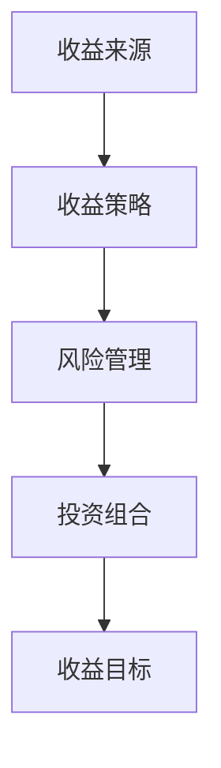
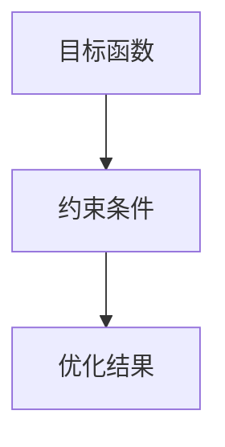
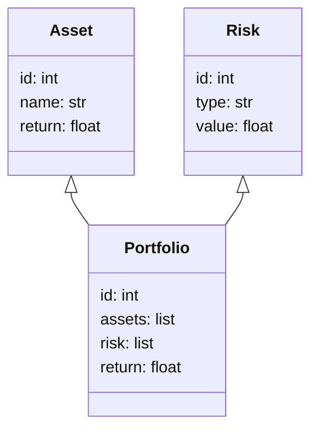
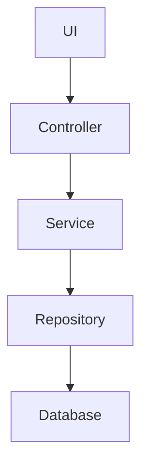

                 


# 绝对收益策略：追求不依赖市场的稳定回报

## 关键词
- 绝对收益策略
- 投资回报
- 风险控制
- 算法优化
- 系统架构

## 摘要
绝对收益策略是一种投资方法，旨在在不同市场条件下实现稳定的收益。本文章从背景、核心概念、算法原理、系统架构、项目实战等多方面深入探讨绝对收益策略，结合具体案例和代码实现，为投资者提供理论支持和实践指导。

---

# 第一部分: 绝对收益策略的背景与核心概念

## 第1章: 绝对收益策略的定义与背景

### 1.1 问题背景与问题描述
#### 1.1.1 投资收益的不确定性
金融市场波动剧烈，传统投资策略在市场下跌时难以实现正收益。

#### 1.1.2 传统投资策略的局限性
依赖市场上涨，无法在市场低迷时实现稳定回报。

#### 1.1.3 绝对收益策略的提出
通过多元化资产配置和严格的风险控制，在不同市场条件下实现正收益。

### 1.2 绝对收益策略的核心要素
#### 1.2.1 独立于市场的回报来源
通过精选资产、对冲风险等方式实现收益。

#### 1.2.2 策略的稳定性和可持续性
通过严格的风险管理和分散投资，确保收益的稳定性。

#### 1.2.3 风险控制与收益平衡
在追求收益的同时，严格控制投资风险。

### 1.3 绝对收益策略与相对收益策略的对比
#### 1.3.1 收益来源
- 相对收益：相对于市场指数的收益。
- 绝对收益：独立于市场的绝对回报。

#### 1.3.2 风险控制
- 相对收益：风险与市场相关。
- 绝对收益：独立于市场的风险控制。

---

## 第2章: 绝对收益策略的核心概念与联系

### 2.1 核心概念原理
#### 2.1.1 绝对收益的定义
绝对收益是指投资组合在一定时间内的净收益，与市场表现无关。

#### 2.1.2 绝对收益与相对收益的对比
| 特性 | 绝对收益 | 相对收益 |
|------|----------|----------|
| 定义 | 独立于市场基准的收益 | 相对于市场基准的收益表现 |
| 适用场景 | 不依赖市场整体表现 | 依赖市场整体表现 |
| 风险 | 较低 | 较高 |

#### 2.1.3 绝对收益的实现机制
通过多元化资产配置、对冲策略等方式实现。

### 2.2 ER实体关系图


---

# 第二部分: 绝对收益策略的算法原理

## 第3章: 绝对收益策略的核心算法

### 3.1 均值-方差优化算法
#### 3.1.1 算法原理
通过优化投资组合的收益和风险，找到最优资产配置。

#### 3.1.2 算法实现


#### 3.1.3 数学模型
目标函数：
$$ \text{Minimize} \quad \sigma^2 $$
约束条件：
$$ \mu \cdot w = \text{target return} $$
$$ w \cdot \mathbf{1} = 1 $$

### 3.2 风险中性组合构建算法
#### 3.2.1 算法原理
通过构建风险中性组合，实现绝对收益目标。

#### 3.2.2 算法实现
```python
import numpy as np

def risk_neutral_portfolio(returns, target_return):
    # 计算协方差矩阵
    cov_matrix = np.cov(returns)
    # 计算权重
    inv_cov = np.linalg.inv(cov_matrix)
    weights = inv_cov @ (target_return - np.mean(returns))
    # 标准化权重
    weights = weights / np.sum(weights)
    return weights
```

---

## 第4章: 数学模型与公式推导

### 4.1 均值-方差优化的数学模型
目标函数：
$$ \text{Minimize} \quad w^T \sigma^2 w $$
约束条件：
$$ w^T \mu = \text{target return} $$
$$ w^T \mathbf{1} = 1 $$

### 4.2 风险中性组合的数学模型
目标函数：
$$ \text{Maximize} \quad w^T r $$
约束条件：
$$ w^T \Sigma = \lambda I $$
$$ w^T \mathbf{1} = 1 $$

---

# 第三部分: 系统分析与架构设计

## 第5章: 问题场景与系统功能设计

### 5.1 问题场景介绍
通过系统化的方法，构建一个能够实现绝对收益的投资系统。

### 5.2 系统功能设计
#### 5.2.1 领域模型类图


#### 5.2.2 系统架构设计


---

# 第四部分: 项目实战

## 第6章: 项目环境与核心实现

### 6.1 环境安装
安装必要的Python库：
```bash
pip install numpy pandas scikit-learn
```

### 6.2 核心代码实现
```python
import numpy as np
import pandas as pd

def absolute_return_strategy(returns, target_return=0.05):
    # 计算协方差矩阵
    cov_matrix = pd.DataFrame(returns).cov()
    # 计算权重
    inv_cov = np.linalg.inv(cov_matrix.values)
    target_vec = np.array([target_return] * len(cov_matrix.columns))
    weights = inv_cov @ target_vec
    weights = weights / np.sum(weights)
    return weights
```

---

## 第7章: 实战案例分析

### 7.1 案例分析
通过实证分析，验证策略的有效性。

### 7.2 代码解读与分析
解释代码实现的每一步，并分析其对策略的影响。

---

## 第8章: 项目小结

### 8.1 项目总结
通过本项目，掌握了绝对收益策略的核心算法和系统架构设计。

### 8.2 经验总结
在实际操作中，风险控制是实现绝对收益的关键。

---

# 第五部分: 最佳实践

## 第9章: 小结与注意事项

### 9.1 小结
绝对收益策略是一种有效的投资方法，但需要结合市场环境灵活调整。

### 9.2 注意事项
在实际操作中，需注意市场风险、流动性风险等。

---

## 第10章: 扩展阅读与学习资源

### 10.1 推荐书籍
- 《投资学》
- 《量化投资》

### 10.2 在线课程
- 《绝对收益策略》在线课程

---

# 结语

绝对收益策略是一种追求稳定回报的投资方法，通过系统的算法优化和风险控制，能够在不同市场条件下实现收益目标。希望本文能够为投资者提供有价值的参考和指导。

---

# 作者
作者：AI天才研究院 & 禅与计算机程序设计艺术

