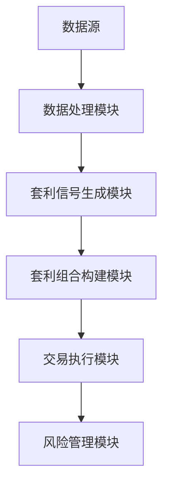
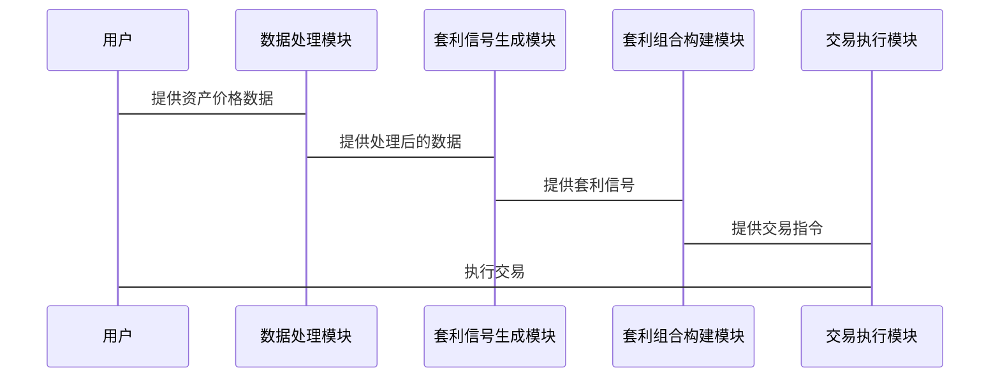

                 


# 统计套利：利用价格偏离进行中性市场投资

## 关键词：统计套利，价格偏离，市场中性，均值回归，配对交易

## 摘要：统计套利是一种利用资产价格短期偏离均值的特性，通过建立市场中性的投资组合来获取超额收益的投资策略。本文将详细探讨统计套利的核心概念、数学模型、算法实现、系统架构以及实际案例，帮助读者全面理解并掌握统计套利的精髓。

---

# 第一部分：统计套利概述

## 第1章：统计套利的基本概念与背景

### 1.1 统计套利的定义与特点

统计套利是一种通过利用资产价格短期偏离均值的特性，建立市场中性的投资组合，从而在市场中套取无风险或低风险利润的投资策略。与传统套利不同，统计套利依赖于统计套利模型，寻找资产之间的相对价值偏离，而不是依赖于市场无效性。

**特点：**
- 市场中性：统计套利的投资组合通常对市场风险（Beta）中性，因此不受市场整体波动的影响。
- 统计套利模型：依赖于数学模型和统计方法来识别套利机会。
- 高频交易：统计套利通常需要高频交易来捕捉短期价格偏离。

### 1.2 统计套利的历史与发展

统计套利的起源可以追溯到20世纪80年代，随着计算机技术的进步和量化投资的发展，统计套利逐渐成为一种重要的投资策略。在1986年，统计学家John Hull首次提出了统计套利的概念，并将其应用于外汇市场。随着算法交易的兴起，统计套利在股票、外汇和商品期货市场中得到了广泛应用。

### 1.3 统计套利的理论基础

统计套利的理论基础主要包括均值回归理论和弱有效市场假说。均值回归理论认为，资产价格会在长期围绕其均值波动，短期偏离均值的资产价格会回归到其均值。弱有效市场假说认为，市场的价格反映了所有公开信息，因此统计套利模型需要依赖于市场中的短期定价错误来捕捉套利机会。

### 1.4 统计套利在金融市场中的应用

统计套利在金融市场中的应用非常广泛，主要包括：
- 股票市场：寻找价格偏离均值的股票，进行配对交易。
- 外汇市场：利用汇率的短期偏离进行套利。
- 商品期货市场：利用价格波动进行套利。

---

## 第2章：统计套利的核心概念与原理

### 2.1 统计套利的核心概念

统计套利的核心概念包括套利机会、价格偏离、市场中性投资策略等。

#### 2.1.1 套利机会

套利机会是指在市场中存在价格偏离的情况，投资者可以通过同时买入低估资产和卖出高估资产来获利。套利机会的存在依赖于市场中的短期定价错误。

#### 2.1.2 价格偏离

价格偏离是指资产价格在短期内偏离其均值的情况。统计套利模型通过识别这些偏离来捕捉套利机会。

#### 2.1.3 市场中性投资策略

市场中性投资策略是指通过建立对冲市场风险的投资组合，使得投资组合的Beta值为零。统计套利通常采用市场中性策略，以避免市场整体波动的影响。

### 2.2 统计套利的原理

统计套利的原理是通过建立统计模型，识别资产价格的短期偏离，进行套利交易。统计套利模型通常基于均值回归理论，通过分析资产价格的历史数据，寻找价格偏离的资产对。

#### 2.2.1 均值回归理论

均值回归理论认为，资产价格在长期会围绕其均值波动，短期偏离均值的资产价格会回归到其均值。统计套利模型利用这一理论，寻找价格偏离的资产进行交易。

#### 2.2.2 配对交易策略

配对交易策略是统计套利中常用的一种策略，通过选取相关性较高的资产对，建立对冲的投资组合。配对交易策略的核心思想是，如果资产对之间的价格关系偏离均值，将会回归到其均值。

#### 2.2.3 统计套利的数学模型

统计套利的数学模型通常基于时间序列分析，如ARIMA模型或GARCH模型。这些模型用于分析资产价格的波动性，识别价格偏离的信号。

### 2.3 统计套利的核心要素

统计套利的核心要素包括数据来源与处理、套利信号的生成、套利组合的构建等。

#### 2.3.1 数据来源与处理

统计套利需要大量的历史数据，包括资产价格、成交量等。数据处理包括数据清洗、标准化等。

#### 2.3.2 套利信号的生成

套利信号的生成是统计套利的核心步骤，通过分析资产价格的波动性，识别价格偏离的信号。

#### 2.3.3 套利组合的构建

套利组合的构建是统计套利的最终步骤，通过建立对冲的投资组合，实现市场中性的投资策略。

### 2.4 统计套利的风险与挑战

统计套利的风险主要包括市场风险、模型风险、交易成本与滑点等。

#### 2.4.1 市场风险

市场风险是指市场整体波动对统计套利投资组合的影响。由于统计套利采用市场中性策略，市场风险相对较小，但并非完全消除。

#### 2.4.2 模型风险

模型风险是指统计套利模型失效或参数估计错误的风险。统计套利模型依赖于假设和参数估计，如果模型失效，可能导致投资损失。

#### 2.4.3 交易成本与滑点

交易成本与滑点是统计套利的另一个挑战。统计套利通常需要高频交易，交易成本和滑点可能影响套利收益。

---

## 第3章：统计套利的数学模型与算法

### 3.1 统计套利的数学基础

统计套利的数学基础主要包括时间序列分析、均值回归模型、配对交易策略等。

#### 3.1.1 均值回归模型

均值回归模型是统计套利的核心模型之一，用于分析资产价格的回归趋势。均值回归模型可以表示为：

$$ r_t = \alpha + \beta t + \epsilon_t $$

其中，\( r_t \) 是资产价格的收益率，\( \alpha \) 是截距，\( \beta \) 是趋势系数，\( \epsilon_t \) 是误差项。

#### 3.1.2 配对交易策略

配对交易策略的核心思想是通过建立对冲的投资组合，消除市场风险。配对交易策略通常选择相关性较高的资产对，建立买入低估资产、卖出高估资产的投资组合。

#### 3.1.3 时间序列分析

时间序列分析是统计套利的重要工具，用于分析资产价格的波动性。常用的时间序列模型包括ARIMA模型、GARCH模型等。

### 3.2 统计套利的核心算法

统计套利的核心算法包括均值回归模型、配对交易策略等。

#### 3.2.1 均值回归模型

均值回归模型用于分析资产价格的回归趋势，通过识别价格偏离的信号，进行套利交易。

#### 3.2.2 配对交易策略

配对交易策略通过选择相关性较高的资产对，建立对冲的投资组合，消除市场风险。

#### 3.2.3 统计套利组合优化算法

统计套利组合优化算法用于优化投资组合的收益和风险。常用的方法包括均值-方差优化、风险中性优化等。

### 3.3 统计套利的实现步骤

统计套利的实现步骤包括数据收集与预处理、套利信号生成、套利组合构建等。

#### 3.3.1 数据收集与预处理

数据收集与预处理是统计套利的第一步，包括数据清洗、标准化等。

#### 3.3.2 套利信号生成

套利信号生成是统计套利的核心步骤，通过分析资产价格的波动性，识别价格偏离的信号。

#### 3.3.3 套利组合构建

套利组合构建是统计套利的最终步骤，通过建立对冲的投资组合，实现市场中性的投资策略。

---

## 第4章：统计套利的系统架构与设计

### 4.1 统计套利系统架构

统计套利系统架构包括数据处理模块、套利信号生成模块、套利组合构建模块等。

#### 4.1.1 数据处理模块

数据处理模块负责收集和处理资产价格数据，包括数据清洗、标准化等。

#### 4.1.2 套利信号生成模块

套利信号生成模块通过分析资产价格的波动性，识别价格偏离的信号。

#### 4.1.3 套利组合构建模块

套利组合构建模块通过建立对冲的投资组合，实现市场中性的投资策略。

### 4.2 系统功能设计

统计套利系统的功能设计包括数据处理、套利信号生成、套利组合构建等。

#### 4.2.1 数据处理功能

数据处理功能包括数据清洗、标准化等，确保数据的质量和一致性。

#### 4.2.2 套利信号生成功能

套利信号生成功能通过分析资产价格的波动性，识别价格偏离的信号。

#### 4.2.3 套利组合构建功能

套利组合构建功能通过建立对冲的投资组合，实现市场中性的投资策略。

### 4.3 系统架构图

以下是统计套利系统的架构图：



### 4.4 系统接口设计

统计套利系统的接口设计包括数据接口、交易接口等。

#### 4.4.1 数据接口

数据接口用于与数据源对接，获取资产价格数据。

#### 4.4.2 交易接口

交易接口用于与交易系统对接，执行套利交易。

### 4.5 系统交互流程

以下是统计套利系统的交互流程图：



---

## 第5章：统计套利的项目实战

### 5.1 项目环境安装

统计套利的项目环境安装包括安装Python、Pandas、NumPy、Matplotlib等工具。

#### 5.1.1 安装Python

安装Python，推荐使用Anaconda发行版。

#### 5.1.2 安装Pandas、NumPy、Matplotlib

在终端中运行以下命令：

```bash
pip install pandas numpy matplotlib
```

### 5.2 系统核心实现源代码

以下是统计套利系统的核心实现代码：

```python
import pandas as pd
import numpy as np
import matplotlib.pyplot as plt

# 数据预处理
def preprocess_data(data):
    data = data.dropna()
    return data

# 均值回归模型
def mean_reversion_model(data, window=20):
    mean = data.rolling(window).mean()
    std = data.rolling(window).std()
    z_score = (data - mean) / std
    return z_score

# 配对交易策略
def pairs_trading_strategy(data, window=20):
    z_score = mean_reversion_model(data, window)
    positions = np.sign(z_score)
    return positions

# 策略回测
def backtest_strategy(data, strategy, window=20):
    positions = strategy(data, window)
    returns = (data.shift(1) - data) * positions.shift(1)
    return returns

# 主函数
if __name__ == "__main__":
    # 数据加载
    data = pd.read_csv('asset_prices.csv')
    data = preprocess_data(data)
    
    # 策略实现
    strategy = pairs_trading_strategy(data)
    returns = backtest_strategy(data, strategy)
    
    # 策略回测
    print(returns.mean() * 252)  # 年化收益
    plt.plot(returns.cumsum())
    plt.show()
```

### 5.3 代码应用解读与分析

以上代码实现了一个简单的配对交易策略，通过计算资产价格的z-score，识别价格偏离的信号，进行套利交易。策略回测部分计算了年化收益，并绘制了累积收益曲线。

### 5.4 实际案例分析

以股票市场为例，选取两只相关性较高的股票，建立配对交易策略。假设股票A和股票B的历史价格数据如下：

| 日期 | 股票A价格 | 股票B价格 |
|------|------------|------------|
| 2023-01-01 | 100        | 95         |
| 2023-01-02 | 105        | 98         |
| 2023-01-03 | 102        | 96         |
| 2023-01-04 | 108        | 97         |

通过计算z-score，识别价格偏离的信号。如果z-score大于1，表示股票A被高估，股票B被低估，进行卖出股票A，买入股票B的操作。

### 5.5 项目小结

通过以上项目实战，我们可以看到统计套利的核心思想和实现步骤。实际应用中需要考虑交易成本、滑点、模型风险等因素，以提高套利策略的收益和稳定性。

---

## 第6章：总结与展望

### 6.1 全文总结

统计套利是一种利用资产价格短期偏离均值的特性，通过建立市场中性的投资组合来获取超额收益的投资策略。本文详细探讨了统计套利的核心概念、数学模型、算法实现、系统架构以及实际案例，帮助读者全面理解并掌握统计套利的精髓。

### 6.2 未来展望

统计套利作为一种重要的投资策略，随着计算机技术的进步和量化投资的发展，其应用前景广阔。未来，统计套利可能会更加智能化和自动化，结合人工智能技术，进一步提高套利策略的收益和稳定性。

---

# 作者：AI天才研究院/AI Genius Institute & 禅与计算机程序设计艺术 /Zen And The Art of Computer Programming

