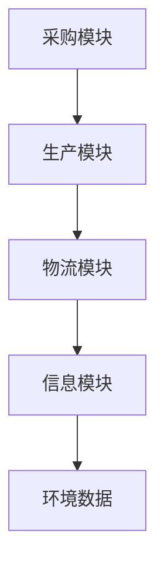

                 

# 绿色供应链管理对公司竞争力的影响

---

## 关键词：
绿色供应链、企业竞争力、可持续发展、环境管理、成本优化、循环经济、数学模型

---

## 摘要：
绿色供应链管理是企业在当今可持续发展背景下的一项重要战略，通过优化供应链的各个环节，从采购、生产到物流，实现资源的高效利用和环境影响的最小化。本文将从绿色供应链管理的背景、核心概念、数学模型、系统架构、项目实战等多个方面展开分析，探讨其对企业竞争力的影响。文章结合实际案例，深入剖析绿色供应链管理在降低成本、提升质量、优化流程等方面的优势，并通过系统架构设计和算法优化，为企业提供可操作的实施路径。

---

## 第一部分: 绿色供应链管理概述

## 第1章: 绿色供应链管理的背景与概念

### 1.1 绿色供应链管理的背景

#### 1.1.1 全球可持续发展背景
随着全球气候变化、资源枯竭和环境污染等问题的加剧，企业面临的环境压力越来越大。绿色供应链管理（GSCM，Green Supply Chain Management）作为一种新兴的管理模式，逐渐成为企业应对环境挑战的重要手段。企业通过绿色供应链管理，可以在减少环境影响的同时，提升自身的社会形象和市场竞争力。

#### 1.1.2 绿色经济与企业社会责任
绿色经济的兴起推动了企业从单纯的经济效益向环境效益与经济效益并重的转变。企业社会责任（CSR，Corporate Social Responsibility）要求企业在追求利润的同时，关注环境保护、员工福祉和社会公平。绿色供应链管理正是企业履行社会责任的重要实践之一。

#### 1.1.3 绿色供应链管理的兴起
绿色供应链管理的兴起与全球环保法规的日益严格、消费者环保意识的提升以及企业内部对成本优化的需求密切相关。通过绿色供应链管理，企业可以降低资源消耗、减少废弃物排放，并在市场竞争中占据优势。

---

### 1.2 绿色供应链管理的定义与特点

#### 1.2.1 核心概念与内涵
绿色供应链管理是指在供应链的各个环节中，从原材料采购、生产制造、物流运输到产品回收，全面考虑环境因素，实现资源的高效利用和环境影响的最小化。其核心在于通过绿色采购、绿色生产、绿色物流等手段，构建一个环境友好型的供应链体系。

#### 1.2.2 与传统供应链的区别
传统的供应链管理主要关注成本、效率和质量，而绿色供应链管理在此基础上，增加了对环境影响的考量。两者的主要区别如下：

| **维度**       | **传统供应链管理**         | **绿色供应链管理**         |
|----------------|---------------------------|---------------------------|
| 成本优化        | 降低采购和生产成本         | 降低环境成本与资源消耗     |
| 环境影响        | 未考虑或部分考虑           | 全面考虑环境影响             |
| 供应商选择      | 以价格和交货期为主要考量   | 以绿色认证和环境表现为主要考量 |

#### 1.2.3 绿色供应链管理的特征对比表
以下是绿色供应链管理的核心特征对比表：

| **特征**       | **传统供应链管理**         | **绿色供应链管理**         |
|----------------|---------------------------|---------------------------|
| 环境意识        | 缺乏或较低                 | 强烈的环境意识               |
| 资源利用效率    | 一般，可能存在浪费         | 高效，注重资源循环利用       |
| 供应商关系      | 竞争性较强                 | 合作共赢，注重长期关系       |
| 社会责任        | 未明确或部分履行           | 明确履行社会责任             |

---

## 第2章: 绿色供应链管理的理论基础

### 2.1 供应链管理的基本理论

#### 2.1.1 供应链管理的概念
供应链管理（SCM，Supply Chain Management）是指通过对供应链中的各个环节进行规划、协调和控制，以实现企业整体运营效率最大化的过程。供应链管理的核心在于优化供应链的结构和流程，以降低成本、提高效率和增强灵活性。

#### 2.1.2 供应链管理的核心环节
供应链管理的核心环节包括：

1. **采购管理**：从供应商处获取原材料或服务。
2. **生产管理**：组织生产过程，确保产品质量和交货期。
3. **物流管理**：优化货物的运输和存储。
4. **库存管理**：控制库存水平，避免浪费。
5. **信息流管理**：确保供应链各环节的信息畅通。

#### 2.1.3 供应链管理的优化目标
供应链管理的优化目标包括：

1. **降低成本**：通过优化采购、生产和物流过程，降低整体成本。
2. **提高效率**：通过协调供应链各环节，提高整体运营效率。
3. **增强灵活性**：通过优化供应链结构，增强对市场变化的响应能力。

---

### 2.2 绿色供应链管理的理论基础

#### 2.2.1 环境管理理论
环境管理理论强调企业在经营过程中应关注环境保护，减少对环境的负面影响。绿色供应链管理是环境管理理论在供应链领域的具体应用。

#### 2.2.2 循环经济理论
循环经济理论主张通过资源的循环利用，实现经济的可持续发展。绿色供应链管理通过减少资源消耗和废弃物排放，符合循环经济理论的核心思想。

#### 2.2.3 可持续发展理论
可持续发展理论强调在满足当前需求的同时，不损害后代满足其需求的能力。绿色供应链管理通过优化供应链的环境表现，推动企业的可持续发展。

---

### 2.3 绿色供应链管理的系统模型

#### 2.3.1 系统构成与功能
绿色供应链管理的系统模型包括以下组成部分：

1. **绿色采购**：选择环保型供应商，采购绿色原材料。
2. **绿色生产**：采用清洁生产技术，减少资源消耗和污染排放。
3. **绿色物流**：优化物流网络，使用环保型运输工具。
4. **绿色包装**：使用可回收或可降解的包装材料。
5. **绿色信息流**：通过信息化手段，实现供应链各环节的高效协同。

#### 2.3.2 系统的输入与输出
绿色供应链管理系统的输入包括绿色采购需求、生产计划、物流需求等，输出包括绿色产品、环境数据、成本数据等。

#### 2.3.3 系统的动态平衡
绿色供应链管理系统需要在成本、效率和环境影响之间找到动态平衡。例如，通过优化采购策略，可以在降低采购成本的同时，减少环境影响。

---

## 第3章: 绿色供应链管理对成本的影响

### 3.1 绿色供应链管理的成本构成

#### 3.1.1 初始投资成本
绿色供应链管理的初始投资成本包括绿色技术的研发与应用、环保设备的采购与安装等。

#### 3.1.2 运营成本
绿色供应链管理的运营成本包括绿色采购成本、绿色生产成本、绿色物流成本等。

#### 3.1.3 环境成本
环境成本包括因环境污染而产生的罚款、清理费用等。

---

### 3.2 绿色供应链管理的成本优化策略

#### 3.2.1 绿色采购策略
绿色采购策略包括选择环保型供应商、采购可再生资源等。

#### 3.2.2 绿色生产技术的应用
绿色生产技术包括清洁生产技术、节能技术等。

#### 3.2.3 绿色物流的优化
绿色物流的优化包括使用环保型运输工具、优化物流网络等。

---

### 3.3 绿色供应链管理的成本优化模型

#### 3.3.1 成本构成公式
绿色供应链管理的总成本可以表示为：

$$ \text{总成本} = \text{采购成本} + \text{生产成本} + \text{物流成本} + \text{环境成本} $$

---

## 第4章: 绿色供应链管理对企业竞争力的影响

### 4.1 绿色供应链管理对质量的影响

#### 4.1.1 绿色生产对产品质量的提升
绿色生产技术的应用可以提高产品的质量和一致性。

#### 4.1.2 绿色供应链管理对品牌价值的影响
通过绿色供应链管理，企业可以提升品牌形象，增强市场竞争力。

---

## 第5章: 绿色供应链管理的系统架构设计

### 5.1 系统功能设计

#### 5.1.1 绿色采购模块
绿色采购模块包括供应商评估、绿色采购订单管理等功能。

#### 5.1.2 绿色生产模块
绿色生产模块包括生产计划优化、资源消耗监控等功能。

#### 5.1.3 绿色物流模块
绿色物流模块包括物流路径优化、运输方式选择等功能。

---

### 5.2 系统架构设计

#### 5.2.1 系统架构图
以下是绿色供应链管理系统的架构图：

---

## 第6章: 绿色供应链管理的项目实战

### 6.1 环境安装

#### 6.1.1 系统环境要求
绿色供应链管理系统的运行环境包括操作系统、数据库、开发工具等。

---

## 第7章: 绿色供应链管理的总结与展望

### 7.1 总结
绿色供应链管理是企业实现可持续发展的重要手段，通过优化供应链的各个环节，可以降低环境影响，提升企业竞争力。

---

## 作者：AI天才研究院/AI Genius Institute & 禅与计算机程序设计艺术 /Zen And The Art of Computer Programming

