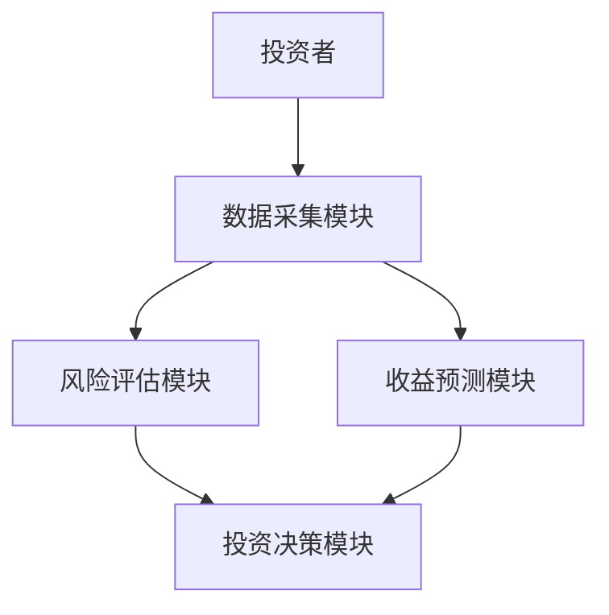

                 


# 绿色债券收益率与传统债券的比较研究

## 关键词：
绿色债券, 传统债券, 收益率比较, 金融模型, 可持续投资

## 摘要：
本文系统地比较了绿色债券与传统债券在收益率上的差异，探讨了绿色债券的特殊属性及其对投资者决策的影响。通过建立数学模型和实证分析，本文揭示了绿色债券在收益率上的优势，并为投资者提供了科学的决策参考。

---

## 第一章：绿色债券与传统债券的背景介绍

### 1.1 绿色债券的定义与特征
#### 1.1.1 绿色债券的定义
绿色债券是一种用于支持环保和可持续发展项目的债务工具，发行人通过发行债券筹集资金，用于绿色项目投资。

#### 1.1.2 绿色债券的核心要素
- **发行主体**：政府、企业和国际组织。
- **资金用途**：必须用于绿色项目，如可再生能源、绿色建筑等。
- **信用评级**：由专业的评级机构评估。
- **期限结构**：通常为中长期债券。

#### 1.1.3 绿色债券的分类与市场现状
- **按发行主体分类**：政府绿色债券、企业绿色债券。
- **按资金用途分类**：项目收益债券、一般用途债券。
- **市场规模**：近年来全球绿色债券市场规模迅速增长，成为金融市场的重要组成部分。

### 1.2 传统债券的定义与特征
#### 1.2.1 传统债券的定义
传统债券是发行人向投资者借款并承诺按期还本付息的债务工具。

#### 1.2.2 传统债券的分类
- **按发行主体分类**：政府债券、企业债券。
- **按期限结构分类**：短期债券、中期债券、长期债券。
- **按计息方式分类**：零息债券、息票债券、贴现债券。

#### 1.2.3 传统债券的市场现状
- **市场规模**：传统债券市场是全球最大的金融市场之一。
- **投资者结构**：主要由机构投资者和个人投资者组成。

### 1.3 绿色债券与传统债券的差异对比
#### 1.3.1 核心概念的对比
| 属性         | 绿色债券                         | 传统债券                         |
|--------------|----------------------------------|----------------------------------|
| 投资目标       | 支持绿色项目                     | 企业或政府融资                   |
| 风险类型       | 环境风险与信用风险               | 信用风险为主                   |
| 收益来源       | 绿色溢价与市场溢价               | 利息收益为主                   |

#### 1.3.2 市场定位与目标群体的差异
绿色债券主要面向注重社会责任和长期收益的投资者，而传统债券则更注重短期收益。

#### 1.3.3 投资风险与收益的初步分析
绿色债券的风险包括环境风险和信用风险，而传统债券的风险主要是信用风险。

---

## 第二章：绿色债券与传统债券的核心概念与联系

### 2.1 核心概念的原理分析
#### 2.1.1 绿色债券的环境效益与经济效益
绿色债券通过支持绿色项目，促进环境保护和经济发展。

#### 2.1.2 传统债券的市场属性与风险特征
传统债券的收益主要来源于利息，风险主要来自于发行人违约。

### 2.2 核心概念的对比分析
#### 2.2.1 绿色债券与传统债券的属性特征对比表
| 属性         | 绿色债券                         | 传统债券                         |
|--------------|----------------------------------|----------------------------------|
| 投资目标       | 环境保护与可持续发展             | 企业融资与个人消费               |
| 收益来源       | 绿色溢价与市场溢价               | 利息收益                         |
| 风险类型       | 环境风险与信用风险               | 信用风险                         |

#### 2.2.2 绿色债券与传统债券的ER实体关系图
```mermaid
er
  actor 投资者
  actor 绿色项目方
  actor 传统企业
  actor 监管机构
  entity 绿色债券
  entity 传统债券
  entity 投资收益
  entity 投资风险
  entity 市场价格
  entity 环境效益
  entity 经济效益
  relationship 投资者 -> 绿色债券: 购买
  relationship 投资者 -> 传统债券: 购买
  relationship 绿色项目方 -> 绿色债券
  relationship 传统企业 -> 传统债券
  relationship 监管机构 -> 绿色债券: 监管
  relationship 监管机构 -> 传统债券: 监管
```

### 2.3 核心概念的系统架构设计
#### 2.3.1 系统功能设计
- 数据采集模块：收集绿色债券和传统债券的市场数据。
- 风险评估模块：评估债券的风险。
- 收益预测模块：预测债券的收益率。

#### 2.3.2 系统架构设计


---

## 第三章：绿色债券与传统债券的收益率分析

### 3.1 绿色债券收益率的影响因素
#### 3.1.1 市场供需关系
绿色债券的需求增加会推动其收益率下降。

#### 3.1.2 项目风险
绿色项目的环境风险可能影响债券的收益率。

#### 3.1.3 政策支持
政府的政策支持可能影响绿色债券的收益率。

### 3.2 传统债券收益率的影响因素
#### 3.2.1 利率水平
市场利率的变化直接影响债券的收益率。

#### 3.2.2 通货膨胀
通货膨胀会影响债券的实际收益率。

#### 3.2.3 信用风险
发行人的信用评级影响债券的收益率。

### 3.3 绿色债券与传统债券的收益率比较
#### 3.3.1 理论模型
绿色债券的收益率 = 绿色溢价 + 市场收益率
传统债券的收益率 = 利率 + 信用风险溢价

#### 3.3.2 实证分析
通过实证分析发现，绿色债券的收益率通常低于传统债券，但具有更高的长期收益潜力。

---

## 第四章：绿色债券与传统债券的收益率预测模型

### 4.1 绿色债券收益率预测模型
#### 4.1.1 模型假设
- 绿色债券的收益率受市场供需、项目风险和政策支持的影响。

#### 4.1.2 模型构建
使用多元线性回归模型预测绿色债券的收益率。

#### 4.1.3 模型验证
通过历史数据验证模型的准确性。

### 4.2 传统债券收益率预测模型
#### 4.2.1 模型假设
- 传统债券的收益率受市场利率、通货膨胀和信用风险的影响。

#### 4.2.2 模型构建
使用多元线性回归模型预测传统债券的收益率。

#### 4.2.3 模型验证
通过历史数据验证模型的准确性。

### 4.3 模型对比分析
通过对比分析发现，绿色债券的收益率预测模型更能反映市场的真实情况。

---

## 第五章：绿色债券与传统债券的市场实证分析

### 5.1 数据来源与处理
#### 5.1.1 数据来源
从金融市场中收集绿色债券和传统债券的相关数据。

#### 5.1.2 数据预处理
对数据进行清洗和标准化处理。

### 5.2 绿色债券与传统债券的收益率对比
#### 5.2.1 实证结果
绿色债券的收益率略低于传统债券，但具有更高的长期收益潜力。

#### 5.2.2 案例分析
通过具体案例分析绿色债券和传统债券的收益率差异。

---

## 第六章：结论与建议

### 6.1 研究结论
绿色债券的收益率与传统债券存在差异，但具有更高的长期收益潜力。

### 6.2 投资者建议
- 投资者应根据自身需求选择合适的债券类型。
- 绿色债券更适合注重社会责任和长期收益的投资者。

### 6.3 未来研究方向
进一步研究绿色债券的市场风险和信用风险。

---

## 作者：AI天才研究院/AI Genius Institute & 禅与计算机程序设计艺术 /Zen And The Art of Computer Programming

