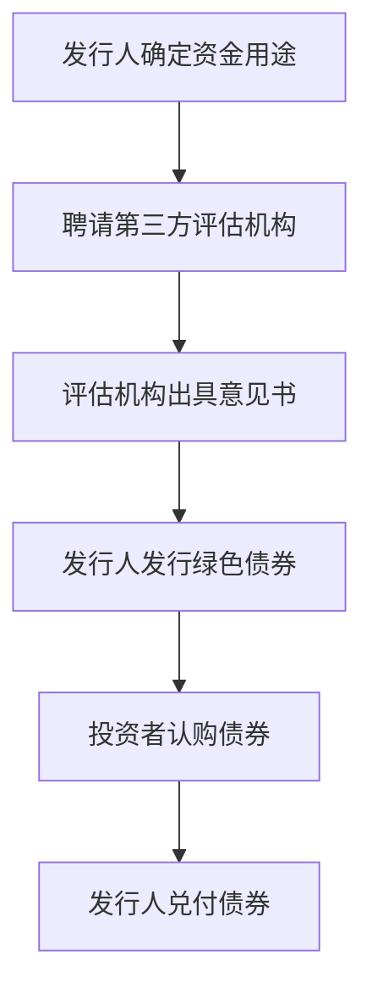
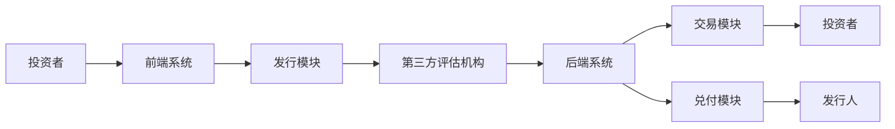
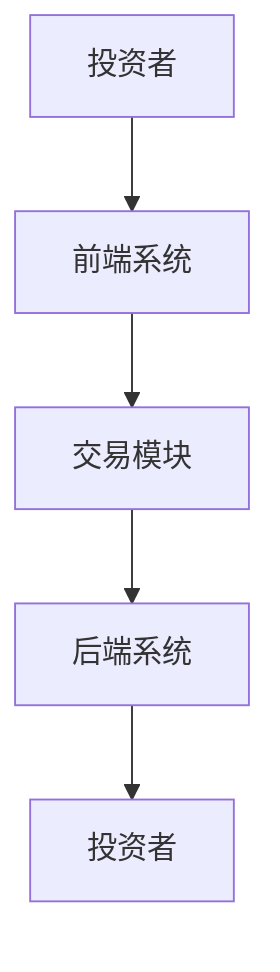

                 

# 绿色债券：可持续发展融资的投资机会

> 关键词：绿色债券, 可持续发展, 投资机会, 评级标准, 风险评估, 金融市场

> 摘要：绿色债券作为一种新兴的融资工具，正在成为推动全球可持续发展的重要力量。本文从绿色债券的定义、分类、发行流程、评级标准等方面进行深入分析，并探讨其在投资中的机会与挑战。通过案例分析和系统设计，结合数学模型和算法流程，为投资者提供科学的决策依据。本文还详细介绍了绿色债券的系统架构和交易流程，并提供了实际项目中的代码实现和风险评估方法，帮助读者更好地理解和投资绿色债券。

---

# 第一部分: 绿色债券的背景与核心概念

## 第1章: 绿色债券的定义与背景

### 1.1 绿色债券的起源与发展

#### 1.1.1 绿色债券的定义与核心特征
绿色债券是一种专用于支持环保和可持续发展的债务工具。其核心特征包括：
- **特定用途**：募集资金必须用于环保项目，如可再生能源、绿色建筑等。
- **透明性**：发行人需定期披露资金使用情况和项目进展。
- **第三方认证**：由独立机构对债券的绿色属性进行评估和认证。

#### 1.1.2 绿色债券的起源与演变
绿色债券的概念最早出现在20世纪70年代，但真正的发展始于2010年后。2013年，国际金融协会（IFC）发布了《绿色债券原则》，为绿色债券的发行和投资提供了标准化指导。

#### 1.1.3 绿色债券与可持续发展的关系
绿色债券是推动全球可持续发展的重要工具。通过支持清洁能源、低碳技术和环保项目，绿色债券有助于减少温室气体排放、改善生态环境，并促进经济的可持续增长。

#### 图1-1: 绿色债券与可持续发展的关系图

### 1.2 绿色债券的分类与市场现状

#### 1.2.1 绿色债券的分类标准
绿色债券可以根据发行主体、资金用途和债券类型进行分类。以下是主要分类：
- **按发行主体**：政府绿色债券、企业绿色债券。
- **按资金用途**：项目融资债券、一般用途债券。
- **按债券类型**：普通绿色债券、可转换绿色债券。

#### 1.2.2 全球绿色债券市场的现状分析
近年来，全球绿色债券市场快速增长。根据彭博新能源财经的数据，2022年全球绿色债券发行规模超过6000亿美元，同比增长30%。

#### 1.2.3 中国绿色债券市场的特点与发展
中国绿色债券市场起步较晚，但发展迅速。截至2023年，中国已成为全球第二大绿色债券市场，主要集中在可再生能源和绿色交通领域。

### 1.3 绿色债券的发行与投资主体

#### 1.3.1 发行主体的类型
绿色债券的发行主体包括：
- **政府机构**：如国家开发银行、财政部。
- **企业**：包括上市公司和非上市公司。
- **国际组织**：如世界银行、亚洲开发银行。

#### 1.3.2 投资主体的类型
绿色债券的投资主体包括：
- **机构投资者**：如 pension funds、保险公司。
- **零售投资者**：个人投资者通过基金或理财产品间接投资。
- **资产管理公司**：专门管理绿色债券资产的机构。

#### 1.3.3 绿色债券的评级与认证机构
绿色债券的评级由专业机构负责，如：
- **国际评级机构**：穆迪、标普、惠誉。
- **绿色债券标准委员会（GBS）**：提供绿色债券的认证服务。

---

# 第二部分: 绿色债券的核心概念与属性

## 第2章: 绿色债券的核心概念与属性

### 2.1 绿色债券的核心概念

#### 2.1.1 绿色债券的定义与范围
绿色债券的定义：绿色债券是指募集资金用于支持符合可持续发展理念的项目，并且债券本身具有绿色属性的债务工具。

#### 2.1.2 绿色债券的发行流程
绿色债券的发行流程包括：
1. 确定募集资金用途。
2. 聘请第三方机构进行绿色评估。
3. 发行债券并募集资金。
4. 定期披露资金使用情况。

#### 2.1.3 绿色债券的生命周期
绿色债券的生命周期包括发行、流通、到期兑付三个阶段。

#### 图2-1: 绿色债券的发行流程

### 2.2 绿色债券的属性与特征

#### 2.2.1 绿色债券的环境效益
绿色债券的环境效益体现在支持环保项目，减少碳排放，改善生态环境。

#### 2.2.2 绿色债券的经济效益
绿色债券的经济效益包括：降低融资成本、提升企业形象、吸引绿色投资。

#### 2.2.3 绿色债券的社会效益
绿色债券的社会效益包括：促进就业、改善社会福祉、推动可持续发展。

### 2.3 绿色债券与其他债券的区别

#### 2.3.1 传统债券与绿色债券的对比
| 特性 | 传统债券 | 绿色债券 |
|------|----------|----------|
| 资金用途 | 无特定用途 | 用于环保项目 |
| 披露要求 | 无特殊要求 | 需定期披露资金使用情况 |
| 风险 | 无特定风险 | 有环境和社会风险 |

#### 2.3.2 绿色债券的特殊属性
绿色债券的特殊属性包括：
- **绿色属性**：资金用途符合可持续发展理念。
- **透明性**：发行人需定期披露资金使用情况。
- **第三方认证**：由独立机构对债券的绿色属性进行评估。

---

# 第三部分: 绿色债券的评估与投资策略

## 第3章: 绿色债券的评估方法

### 3.1 绿色债券的评级标准

#### 3.1.1 绿色债券评级的定义与作用
绿色债券评级是对债券的绿色属性和信用风险进行评估的过程。

#### 3.1.2 绿色债券评级的主要指标
绿色债券评级的主要指标包括：
- **环境效益**：项目对环境的贡献。
- **财务风险**：发行人的财务状况。
- **管理能力**：发行人管理绿色项目的能力。

#### 3.1.3 绿色债券评级的流程与方法
绿色债券评级的流程包括：
1. 确定评级标准。
2. 收集发行人信息。
3. 评估发行人信用风险。
4. 评估项目环境效益。
5. 出具评级意见。

### 3.2 绿色债券的风险评估

#### 3.2.1 绿色债券的主要风险类型
绿色债券的主要风险包括：
- **信用风险**：发行人无法按时兑付债券本息。
- **环境风险**：项目未能实现预期的环境效益。
- **市场风险**：债券价格波动带来的损失。

#### 3.2.2 绿色债券风险的量化方法
绿色债券风险的量化方法包括：
- **内部收益率（IRR）**：评估债券的预期收益。
- **净现值（NPV）**：评估债券的未来现金流现值。

#### 3.2.3 绿色债券风险的管理策略
绿色债券风险的管理策略包括：
- **分散投资**：通过投资不同类型的绿色债券降低风险。
- **风险对冲**：利用衍生工具对冲市场风险。
- **持续监控**：定期评估债券的风险状况。

---

## 第4章: 绿色债券的投资策略

### 4.1 绿色债券的投资机会

#### 4.1.1 绿色债券的市场需求分析
绿色债券的市场需求主要来自机构投资者和个人投资者对可持续投资的需求。

#### 4.1.2 绿色债券的投资潜力
绿色债券的投资潜力体现在：长期收益稳定，符合可持续发展理念。

#### 4.1.3 绿色债券的长期价值
绿色债券的长期价值体现在：支持环保项目，推动可持续发展，提升企业和社会形象。

### 4.2 绿色债券的投资组合管理

#### 4.2.1 绿色债券在投资组合中的作用
绿色债券在投资组合中的作用包括：降低整体风险，提升长期收益。

#### 4.2.2 绿色债券投资组合的构建策略
绿色债券投资组合的构建策略包括：
1. 根据风险偏好选择债券类型。
2. 分散投资于不同行业和地区的绿色债券。
3. 定期调整投资组合。

#### 4.2.3 绿色债券投资组合的风险管理
绿色债券投资组合的风险管理包括：
- **定期评估**：评估债券的信用风险和市场风险。
- **动态调整**：根据市场变化调整投资组合。
- **风险对冲**：利用衍生工具对冲市场风险。

---

# 第四部分: 绿色债券的系统架构与交易流程

## 第5章: 绿色债券的系统架构

### 5.1 绿色债券发行与交易的系统架构

#### 5.1.1 系统功能设计
绿色债券发行与交易系统的功能模块包括：
- **发行模块**：发行人提交债券发行申请。
- **评估模块**：第三方机构评估债券的绿色属性。
- **交易模块**：投资者进行债券买卖。
- **兑付模块**：发行人兑付债券本息。

#### 5.1.2 系统架构设计
绿色债券发行与交易系统的架构设计包括：
- **前端**：投资者界面，展示债券信息。
- **后端**：处理债券发行、交易和兑付的逻辑。
- **第三方服务**：连接评估机构和监管机构。

#### 图5-1: 绿色债券发行与交易系统的架构图

### 5.2 绿色债券交易流程

#### 5.2.1 绿色债券交易的流程
绿色债券交易的流程包括：
1. 投资者通过前端系统提交交易订单。
2. 前端系统将订单发送到后端系统。
3. 后端系统处理交易并通知投资者。
4. 投资者收到交易确认。

#### 图5-2: 绿色债券交易流程图

---

# 第五部分: 绿色债券的项目实战

## 第6章: 绿色债券的项目实战

### 6.1 绿色债券的实际案例分析

#### 6.1.1 项目背景与目标
以中国三峡集团发行的绿色债券为例，该债券募集资金用于长江流域的生态修复项目。

#### 6.1.2 项目实施与管理
三峡集团通过发行绿色债券筹集资金，用于建设生态修复项目，改善长江流域的生态环境。

#### 6.1.3 项目成果与评估
该绿色债券的成功发行不仅支持了环保项目，还提升了三峡集团的国际形象。

### 6.2 绿色债券的核心实现

#### 6.2.1 环境效益评估
通过环境效益评估模型，量化绿色债券对环境的贡献。

#### 6.2.2 风险评估与管理
通过风险评估模型，识别和管理绿色债券的风险。

### 6.3 绿色债券的实际案例分析

#### 6.3.1 案例背景
以三峡集团发行的绿色债券为例，详细分析其发行背景、资金用途和信用评级。

#### 6.3.2 案例分析
绿色债券的发行流程、评级标准和市场表现。

---

# 第六部分: 绿色债券的最佳实践

## 第7章: 绿色债券的最佳实践

### 7.1 绿色债券投资策略

#### 7.1.1 分散投资
通过投资不同类型的绿色债券降低风险。

#### 7.1.2 关注评级
选择评级较高的绿色债券，降低信用风险。

#### 7.1.3 长期视角
关注绿色债券的长期价值，避免短期波动。

### 7.2 绿色债券的风险管理

#### 7.2.1 风险识别
识别绿色债券的主要风险，如信用风险和环境风险。

#### 7.2.2 风险量化
通过数学模型量化风险，制定风险管理策略。

#### 7.2.3 风险对冲
利用衍生工具对冲市场风险，降低整体风险。

### 7.3 绿色债券的政策解读

#### 7.3.1 政策支持
政府对绿色债券的政策支持，如税收优惠、补贴等。

#### 7.3.2 政策风险
政策变化对绿色债券市场的影响。

### 7.4 绿色债券的未来发展

#### 7.4.1 市场趋势
绿色债券市场的未来发展趋势。

#### 7.4.2 技术创新
技术进步对绿色债券市场的影响。

---

# 第七部分: 小结与注意事项

## 第8章: 小结与注意事项

### 8.1 绿色债券的核心内容总结

绿色债券是一种支持可持续发展的融资工具，具有特定的用途、透明性和第三方认证等特点。

### 8.2 投资绿色债券的注意事项

#### 8.2.1 风险管理
投资者应注重绿色债券的风险管理，分散投资，关注评级。

#### 8.2.2 市场趋势
关注绿色债券市场的趋势，抓住投资机会。

#### 8.2.3 信息透明
投资者应关注绿色债券的信息透明度，选择信誉良好的发行人。

---

# 作者：AI天才研究院/AI Genius Institute & 禅与计算机程序设计艺术 /Zen And The Art of Computer Programming

