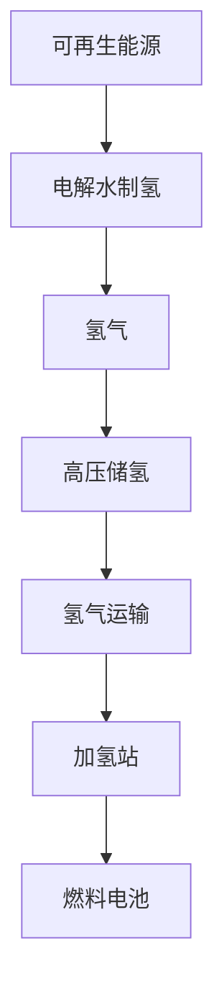
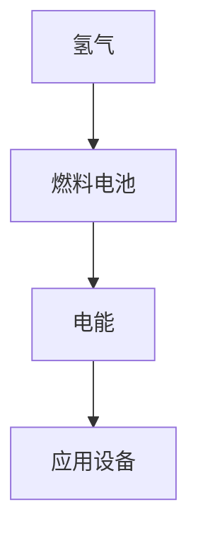

                 

# 绿色氢能产业链的投资机会分析

> 关键词：绿色氢能、产业链分析、投资机会、可再生能源、制氢技术

> 摘要：本文系统分析绿色氢能产业链的构成、技术发展、投资机会及风险，重点探讨绿色氢能的制氢技术、储运技术及应用领域的投资潜力，为投资者提供科学的决策依据。

---

# 第一部分：绿色氢能产业链的背景与概念

## 第1章：绿色氢能的定义与背景

### 1.1 绿色氢能的定义与核心概念

#### 1.1.1 绿色氢能的定义
绿色氢能（Green Hydrogen）是通过可再生能源（如风能、太阳能）电解水制得的氢气，其生产和使用过程中碳排放为零，是实现能源低碳化的重要途径。

#### 1.1.2 绿色氢能的核心属性与特征
- **来源清洁**：完全依赖可再生能源，无化石能源掺入。
- **零碳排放**：生产、储存和使用过程中几乎无碳排放。
- **能源载体**：可储存和运输能量，适用于多种应用场景。

#### 1.1.3 绿色氢能与传统氢能的区别
| 特性 | 绿色氢能 | 灰氢（传统氢能） | 蓝氢（部分清洁化） |
|------|----------|------------------|---------------------|
| 来源  | 可再生能源电解水 | 石油、天然气重整 | 石油、天然气重整+碳捕获 |
| 碳排放 | 零 | 高 | 部分降低 |
| 成本  | 高 | 低 | 中 |

---

### 1.2 绿色氢能的发展背景

#### 1.2.1 全球能源转型的背景
- **气候变化**：全球碳排放必须在2050年前达到净零，氢能是实现这一目标的重要路径。
- **能源结构转型**：可再生能源占比快速提升，但其间歇性问题亟需储能解决方案。

#### 1.2.2 可再生能源技术的进步
- 太阳能和风能技术成本大幅下降，为绿色氢能的生产提供了经济基础。
- 大规模储能技术（如电池、氢储能）的发展为绿色氢能的应用提供了支持。

#### 1.2.3 绿色氢能的战略意义
- 是实现能源结构转型的重要纽带。
- 在工业、交通、发电等领域具有广泛应用潜力。

---

### 1.3 绿色氢能产业链的构成

#### 1.3.1 上游：可再生能源制氢
- **技术路径**：电解水制氢（PEM和碱性电解）。
- **关键设备**：电解槽、电源系统、制氢控制系统。

#### 1.3.2 中游：储运与加氢站
- **储氢技术**：高压气态储氢、液氢储氢、固体储氢。
- **运氢方式**：管道运输、液氢罐运输、高压气瓶运输。
- **加氢站**：站内制氢、氢气压缩与储存。

#### 1.3.3 下游：应用领域与场景
- **交通领域**：燃料电池汽车、公交车、物流车。
- **工业领域**：炼化、钢铁、化工。
- **发电领域**：氢燃料电池发电、氢气储能。

---

## 第2章：绿色氢能产业链的现状与趋势

### 2.1 全球绿色氢能发展现状

#### 2.1.1 主要国家的绿色氢能发展情况
- **欧盟**：明确提出“绿色氢”战略，计划到2030年部署40GW电解水制氢产能。
- **美国**：注重氢能技术的研发与商业化，重点发展交通和工业领域应用。
- **中国**：规划到2025年建成氢能装机容量200万吨，重点支持燃料电池汽车和工业应用。

#### 2.1.2 绿色氢能技术的最新进展
- **制氢技术**：碱性电解槽效率提升至80%以上。
- **储氢技术**：液氢储氢技术逐步成熟。
- **应用技术**：氢燃料电池技术不断突破。

---

### 2.2 中国绿色氢能产业链的现状

#### 2.2.1 政策支持与产业规划
- **政策支持**：国家能源局、工信部等多部门联合推动绿色氢能发展。
- **产业规划**：明确到2030年实现绿氢生产成本显著下降。

#### 2.2.2 产业链关键环节的发展现状
- **制氢环节**：主要依赖化石能源制氢，绿色制氢占比不足5%。
- **储运环节**：高压气态储氢为主，液氢储运技术尚处研发阶段。
- **应用环节**：燃料电池汽车试点城市增加，工业应用逐步起步。

---

### 2.3 绿色氢能产业链的未来发展趋势

#### 2.3.1 技术创新与成本下降
- **技术突破**：电解槽效率提升、储氢材料创新。
- **成本下降**：规模化生产将显著降低设备成本。

#### 2.3.2 市场规模的扩张
- **全球市场**：预计到2030年，全球绿色氢气需求将达5000万吨。
- **中国市场**：到2050年，绿色氢能占终端能源需求比例将达10%以上。

#### 2.3.3 应用领域的拓展
- **交通领域**：燃料电池汽车大规模商业化。
- **工业领域**：绿氢替代传统能源，推动化工、炼化行业低碳转型。

---

# 第二部分：绿色氢能产业链的关键技术与投资机会

## 第3章：绿色氢能产业链的技术分析

### 3.1 制氢技术分析

#### 3.1.1 可再生能源电解水制氢技术

- **技术原理**：通过可再生能源发电驱动电解槽，将水分解为氢气和氧气。
- **技术路径**：
  1. **碱性电解（AE）**：成本低，但效率较低。
  2. **质子交换膜电解（PEM）**：效率高，适合波动性可再生能源。
- **最新进展**：PEM电解技术成本下降30%，效率提升至80%。

#### 3.1.2 其他制氢技术的对比分析

| 技术类型 | 优点 | 缺点 | 适用场景 |
|----------|------|------|----------|
| PEM      | 高效率、适合可再生能源 | 成本高 | 适用于可再生能源丰富的地区 |
| AE       | 成本低、技术成熟 | 低效率 | 适用于电价稳定的地区 |
| 灰氢     | 成本低、技术成熟 | 高排放 | 适用于传统工业场景 |

---

### 3.2 氢气储存与运输技术

#### 3.2.1 储氢技术的分类与特点

| 技术类型 | 优点 | 缺点 | 适用场景 |
|----------|------|------|----------|
| 高压气态储氢 | 储存效率高、成本低 | 储存压力高、运输危险 | 适用于短途运输 |
| 液氢储氢 | 储存密度高、体积小 | 投资成本高 | 适用于长距离运输 |
| 固体储氢 | 安全性高、储存时间长 | 成本高 | 适用于固定场景 |

#### 3.2.2 运氢技术的优劣势分析

| 运输方式 | 优点 | 缺点 | 适用场景 |
|----------|------|------|----------|
| 管道运输 | 成本低、安全性高 | 初始投资高 | 适用于大规模、长距离运输 |
| 液氢罐运输 | 运输效率高 | 成本高 | 适用于短途运输 |
| 高压气瓶运输 | 灵活性高 | 安全风险高 | 适用于城市配送 |

---

### 3.3 氢能应用技术

#### 3.3.1 氢能发电技术

- **技术原理**：通过燃料电池将氢气转化为电能。
- **应用优势**：高效、零排放。
- **最新进展**：燃料电池效率提升至60%。

#### 3.3.2 氢能在交通领域的应用

- **燃料电池汽车**：续航里程达600公里，加氢时间3分钟。
- **公共交通**：氢燃料电池公交车已在多个城市试点运行。

---

## 第4章：绿色氢能产业链的投资机会分析

### 4.1 上游制氢环节的投资机会

#### 4.1.1 可再生能源电解水制氢设备

- **投资重点**：PEM电解槽技术。
- **市场潜力**：预计到2030年，全球PEM电解槽市场将达500亿美元。
- **技术突破**：降低设备成本和能耗。

#### 4.1.2 技术创新带来的投资机会

- **研发投资**：支持电解槽效率提升和成本下降。
- **技术路线**：PEM电解技术占比将达70%。

---

### 4.2 中游储运环节的投资机会

#### 4.2.1 储氢技术的商业化潜力

- **投资方向**：高压气态储氢和液氢储氢技术。
- **市场前景**：预计到2030年，储氢技术市场规模将达100亿美元。

#### 4.2.2 加氢站网络的建设机会

- **投资重点**：燃料电池汽车的加氢站布局。
- **区域选择**：优先在氢能资源丰富地区和燃料电池汽车试点城市。

---

### 4.3 下游应用环节的投资机会

#### 4.3.1 氢能在交通领域的应用

- **投资方向**：燃料电池汽车的商业化运营。
- **市场潜力**：预计到2030年，燃料电池汽车保有量将达1000万辆。

#### 4.3.2 氢能在工业领域的应用

- **投资重点**：替代传统能源的工业应用。
- **应用场景**：炼化、钢铁、化工等领域。

---

## 第5章：绿色氢能产业链的技术与经济可行性分析

### 5.1 绿色氢能的成本分析

#### 5.1.1 当前制氢成本分析

| 制氢技术 | 当前成本（$/kg） | 未来成本目标（$/kg） |
|----------|------------------|-----------------------|
| PEM      | 5-8              | 2-3                   |
| AE       | 4-6              | 2-3                   |

#### 5.1.2 未来成本下降的潜力

- **技术进步**：电解槽效率提升和规模效应。
- **政策支持**：政府补贴和税收优惠。

---

### 5.2 绿色氢能的技术瓶颈与突破方向

#### 5.2.1 当前技术瓶颈

- **制氢成本高**：PEM电解槽成本仍较高。
- **储运技术不成熟**：液氢储运技术尚未大规模应用。

#### 5.2.2 未来技术突破方向

- **新材料研发**：开发更高效率的电解材料。
- **储运技术创新**：发展液氢储运和固体储氢技术。

---

### 5.3 投资回报周期与风险分析

#### 5.3.1 不同环节的投资回报周期

| 环节 | 投资周期（年） | 投资回报周期（年） |
|------|----------------|---------------------|
| 上游制氢 | 5-8            | 8-10                |
| 中游储运 | 4-6            | 6-8                 |
| 下游应用 | 3-5            | 5-7                 |

#### 5.3.2 投资风险与应对策略

- **政策风险**：依赖政府补贴和政策支持。
- **技术风险**：技术瓶颈可能导致投资损失。
- **市场风险**：市场需求不确定性较高。

---

# 第三部分：绿色氢能产业链的投资策略与风险管理

## 第6章：绿色氢能产业链的投资策略

### 6.1 绿色氢能产业链的投资逻辑

#### 6.1.1 产业链各环节的投资逻辑

- **上游制氢**：技术驱动型投资，重点关注电解槽技术。
- **中游储运**：基础设施投资，优先布局加氢站网络。
- **下游应用**：市场驱动型投资，关注燃料电池汽车和工业应用。

---

## 第7章：绿色氢能产业链的风险管理与投资建议

### 7.1 绿色氢能产业链的风险管理

#### 7.1.1 政策风险管理

- **政策跟踪**：密切关注政府氢能发展规划和补贴政策。
- **政策应对**：积极参与政策支持的试点项目。

#### 7.1.2 技术风险管理

- **技术跟踪**：关注制氢、储运和应用技术的最新进展。
- **技术储备**：提前布局新技术研发和商业化。

---

### 7.2 绿色氢能产业链的投资建议

#### 7.2.1 短期投资建议

- **上游制氢**：投资PEM电解槽技术。
- **中游储运**：布局加氢站网络。

#### 7.2.2 中长期投资建议

- **技术创新**：支持新材料和新工艺研发。
- **市场拓展**：扩大下游应用市场。

---

## 结语

绿色氢能是全球能源转型的重要方向，其产业链的投资机会和挑战并存。投资者需要从技术、经济和政策三个维度综合评估，重点关注上游制氢技术和下游应用领域的投资机会，同时注重风险管理，规避政策和技术风险。

---

**作者：AI天才研究院/AI Genius Institute & 禅与计算机程序设计艺术 /Zen And The Art of Computer Programming**

---

### 附录：图表与公式

#### 图1：绿色氢能产业链结构图

#### 图2：氢燃料电池发电流程

#### 公式：电解水制氢效率计算

$$ \text{效率} = \frac{\text{氢气产量}}{\text{输入电量}} $$

