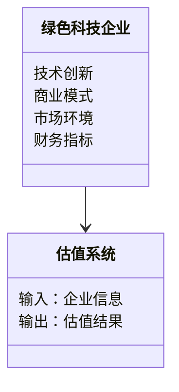
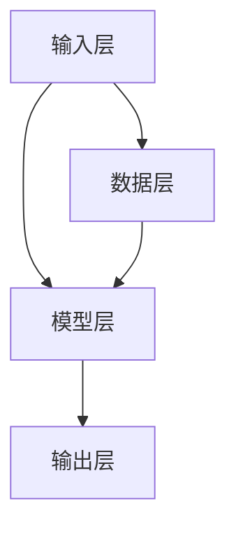
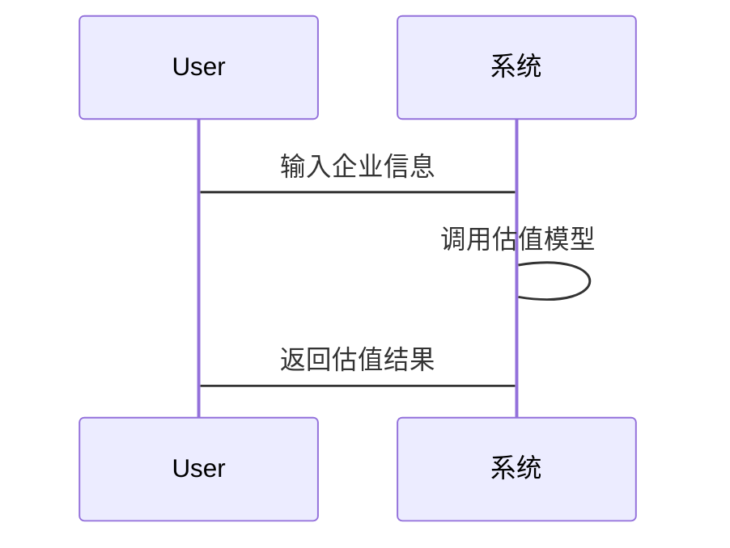

                 


# 绿色科技创新企业的估值挑战与机遇

## 关键词：绿色科技、企业估值、科技创新、投资机遇、可持续发展

## 摘要：绿色科技创新企业是推动全球可持续发展的重要力量，其估值不仅是企业价值的体现，更是技术创新和市场潜力的综合评估。本文从绿色科技的核心概念出发，分析其估值的挑战与机遇，探讨多层次评估体系的构建，并结合实际案例，提出创新性的估值方法。

---

# 第1章 绿色科技创新企业的定义与背景

## 1.1 绿色科技创新企业的定义

绿色科技创新企业是指在环保、节能、清洁能源等领域，通过技术创新和商业模式创新，提供绿色产品或服务的企业。这些企业致力于解决环境问题，推动可持续发展。

---

## 1.2 绿色科技创新企业的背景与发展

### 1.2.1 全球绿色科技发展现状

全球范围内，绿色科技正成为投资热点。根据联合国的数据，2022年全球绿色投资超过7000亿美元，预计到2030年将增长至数万亿美元。

### 1.2.2 中国绿色科技创新的现状

中国在绿色科技领域的发展迅速，特别是在新能源汽车、太阳能和风能等领域，已经涌现出一批领先企业。

### 1.2.3 绿色科技未来发展趋势

随着技术的进步和政策的支持，绿色科技将向智能化、数字化和全球化方向发展，市场规模将进一步扩大。

---

## 1.3 绿色科技创新企业的估值挑战

### 1.3.1 传统估值方法的局限性

传统估值方法如市盈率和市净率难以准确反映绿色科技企业的价值，因为这些企业的核心资产更多是无形的创新能力和知识产权。

### 1.3.2 绿色科技企业的特殊性

绿色科技企业的研发投入高、周期长，且商业模式新颖，传统估值指标可能不适用。

### 1.3.3 估值中的主要困难与问题

数据获取难、技术评估难、市场不确定性大是绿色科技企业估值的主要难点。

---

## 1.4 绿色科技创新企业的社会价值

### 1.4.1 环境效益

绿色科技企业通过减少碳排放和资源消耗，对环境保护具有重要意义。

### 1.4.2 经济效益

绿色科技产业的发展可以创造新的经济增长点，带动相关产业链的发展。

### 1.4.3 社会效益

绿色科技企业通过提供环保产品和服务，提升社会福祉，推动可持续发展。

---

## 1.5 本章小结

绿色科技创新企业是推动全球可持续发展的重要力量，其估值不仅是企业价值的体现，更是技术创新和市场潜力的综合评估。然而，绿色科技企业的特殊性也带来了估值的挑战，需要采用创新的估值方法。

---

# 第2章 绿色科技创新企业的核心概念与联系

## 2.1 技术创新的核心作用

### 2.1.1 技术创新的定义与特征

技术创新是指通过引入新的技术或改进现有技术，提高产品或服务的性能和效率。绿色科技企业的技术创新通常集中在节能环保、清洁能源等领域。

### 2.1.2 技术创新在绿色科技中的表现

技术创新在绿色科技中的表现包括新能源技术、智能环保技术和循环经济技术等。

### 2.1.3 技术创新与企业竞争力的关系

技术创新是绿色科技企业核心竞争力的源泉，决定了企业的市场地位和发展潜力。

---

## 2.2 商业模式的创新与绿色科技

### 2.2.1 商业模式的定义与类型

商业模式是指企业如何创造价值、传递价值和获取价值的逻辑。绿色科技企业常见的商业模式包括订阅制、按使用付费等。

### 2.2.2 绿色科技商业模式的特点

绿色科技商业模式注重可持续性，强调资源高效利用和环境友好。

### 2.2.3 商业模式创新对估值的影响

创新的商业模式可以提高企业的收入来源和盈利稳定性，从而提升估值。

---

## 2.3 市场环境与绿色科技企业的关系

### 2.3.1 市场环境的定义与分类

市场环境包括宏观环境和微观环境，绿色科技企业的发展受到政策、经济和市场供需的影响。

### 2.3.2 绿色科技市场的发展现状

全球绿色科技市场增长迅速，中国政府也在政策上大力支持绿色科技的发展。

### 2.3.3 市场环境对估值的影响

良好的市场环境可以提升绿色科技企业的估值，反之则可能带来负面影响。

---

## 2.4 核心概念对比分析

### 2.4.1 技术创新与商业模式创新的对比

技术创新注重技术本身的改进，商业模式创新注重如何将技术转化为收益。

### 2.4.2 绿色科技与传统科技的对比

绿色科技更注重环保和可持续性，传统科技则更关注效率和成本。

### 2.4.3 不同绿色科技企业的核心要素对比

不同绿色科技企业可能在技术创新、商业模式和市场环境等方面有不同的侧重点。

---

## 2.5 本章小结

绿色科技创新企业的核心在于技术创新和商业模式创新，两者相辅相成，共同推动企业的可持续发展。市场环境对企业的估值有着重要影响，需要综合考虑。

---

# 第3章 绿色科技创新企业估值的算法原理

## 3.1 层次分析法（AHP）在估值中的应用

### 3.1.1 层次分析法的基本原理

层次分析法是一种定性与定量相结合的决策分析方法，适用于多因素决策问题。

### 3.1.2 AHP在绿色科技企业估值中的步骤

1. 确定影响估值的因素，如技术、市场、财务等。
2. 构建层次分析结构图。
3. 计算各因素的权重。
4. 根据权重计算综合得分。

### 3.1.3 AHP的权重计算公式

权重计算公式为：
$$ w_i = \frac{a_{i1} + a_{i2} + ... + a_{in}}{\sum_{j=1}^{n} a_{ij}} $$

其中，$a_{ij}$表示第i个因素在第j个准则下的权重。

---

## 3.2 模糊综合评价法的应用

### 3.2.1 模糊综合评价法的原理

模糊综合评价法适用于评价对象模糊、指标众多的情况。

### 3.2.2 模糊综合评价法的步骤

1. 确定评价指标。
2. 构建模糊评价矩阵。
3. 计算综合评价结果。

### 3.2.3 综合评价模型

综合评价模型为：
$$ V = \sum_{i=1}^{n} w_i \cdot f_i(x) $$

其中，$w_i$为第i个指标的权重，$f_i(x)$为第i个指标的评价函数。

---

## 3.3 算法实现与代码示例

### 3.3.1 Python代码实现

```python
import numpy as np
from sklearn.metrics import pairwise_distances

# 示例数据
X = np.array([[2, 3], [5, 1], [3, 4], [6, 2], [4, 5]])

# 计算层次分析法的权重
D = pairwise_distances(X)
```

### 3.3.2 代码解释

上述代码通过计算数据点之间的距离，实现层次分析法中权重的初步计算。实际应用中，需要根据具体问题调整数据和计算步骤。

---

## 3.4 本章小结

层次分析法和模糊综合评价法是常用的绿色科技企业估值方法，各有优缺点。实际应用中，可以根据具体情况选择合适的算法。

---

# 第4章 绿色科技创新企业的系统分析与架构设计

## 4.1 问题场景介绍

绿色科技企业的估值需要考虑技术、市场、财务等多个方面，系统化的方法有助于提高估值的准确性和效率。

---

## 4.2 系统功能设计

### 4.2.1 领域模型类图



---

## 4.3 系统架构设计

### 4.3.1 系统架构图



---

## 4.4 系统接口设计

### 4.4.1 接口设计

系统需要提供数据输入接口、模型调用接口和结果展示接口。

---

## 4.5 系统交互流程图



---

## 4.6 本章小结

通过系统化的方法，可以有效提高绿色科技企业的估值效率和准确性。系统架构设计有助于整合多方面的信息，提供全面的估值结果。

---

# 第5章 绿色科技创新企业的项目实战

## 5.1 环境安装与配置

### 5.1.1 安装Python

安装Python 3.x版本，并配置环境变量。

### 5.1.2 安装必要的库

安装Pandas、NumPy、Scikit-learn等库。

```bash
pip install pandas numpy scikit-learn
```

---

## 5.2 系统核心实现

### 5.2.1 数据清洗与特征选择

```python
import pandas as pd

# 读取数据
data = pd.read_csv('green_tech.csv')

# 数据清洗
data.dropna(inplace=True)
data = pd.get_dummies(data)
```

### 5.2.2 模型训练与评估

```python
from sklearn.model

