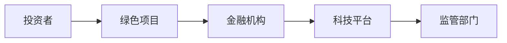

                 


# 绿色金融科技创新的投资机会研究

## 关键词：绿色金融、科技创新、投资机会、金融科技、可持续发展

## 摘要：  
随着全球对可持续发展的关注日益增加，绿色金融作为推动经济向低碳和可持续方向转型的重要手段，正成为全球投资的热点领域。科技创新在绿色金融中的应用不仅提高了金融效率，还为投资者提供了更多精准的投资机会。本文将从绿色金融的核心概念、科技创新的应用场景、算法原理、系统架构设计、项目实战案例以及最佳实践等方面进行深入探讨，为投资者和科技从业者提供有价值的参考。

---

# 第1章: 绿色金融科技创新的背景介绍

## 1.1 绿色金融的概念与内涵

### 1.1.1 绿色金融的定义  
绿色金融是指通过金融手段支持环境改善、应对气候变化和资源节约利用的经济活动。它包括绿色债券、绿色贷款、绿色基金等多种金融工具，旨在引导资金流向可持续发展的项目。

### 1.1.2 绿色金融的核心要素  
绿色金融的核心要素包括：  
1. **资金用途**：资金必须用于支持环保、低碳或可持续发展的项目。  
2. **环境效益**：项目的实施必须带来明确的环境效益。  
3. **风险管理**：识别和评估项目中的环境风险，并制定相应的风险控制措施。  
4. **信息披露**：要求企业和金融机构公开环境相关信息，确保透明性。  

### 1.1.3 绿色金融的全球发展趋势  
近年来，全球绿色金融市场快速发展，各国政府和国际组织纷纷出台政策支持绿色金融。例如，欧盟的“绿色新政”、中国的“碳达峰”和“碳中和”目标都为绿色金融的发展提供了政策支持。

---

## 1.2 科技创新在绿色金融中的作用

### 1.2.1 科技创新对绿色金融的影响  
科技创新通过提高金融效率、降低交易成本和增强风险控制能力，为绿色金融的发展提供了强大动力。例如，区块链技术可以用于追踪绿色资金的流向，确保资金的合规性。

### 1.2.2 科技创新在绿色金融中的应用场景  
1. **绿色项目评估**：利用大数据和人工智能技术对绿色项目的可行性和环境效益进行评估。  
2. **风险管理**：通过机器学习模型预测环境风险，帮助投资者做出决策。  
3. **信息披露**：利用区块链技术确保环境数据的透明性和不可篡改性。  

### 1.2.3 科技创新对绿色金融发展的推动作用  
科技创新不仅提高了绿色金融的效率，还降低了操作成本。例如，智能合约技术可以自动执行绿色金融交易，减少人为干预，提高交易效率。

---

## 1.3 绿色金融科技创新的背景与问题

### 1.3.1 当前绿色金融面临的主要问题  
1. **信息不对称**：绿色项目的环境效益难以量化，导致投资者难以评估其价值。  
2. **风险控制不足**：部分绿色项目存在“漂绿”风险，即企业虚假宣传其环保成就。  
3. **技术门槛高**：绿色金融涉及复杂的环境数据和技术分析，对专业能力要求较高。  

### 1.3.2 科技创新如何解决这些问题  
通过引入大数据、人工智能和区块链等技术，可以有效解决信息不对称和风险控制问题。例如，利用卫星技术监测碳排放，确保绿色项目的环境效益真实可测。

### 1.3.3 绿色金融科技创新的边界与外延  
绿色金融科技创新的边界在于其技术应用的范围，而外延则包括与绿色金融相关的政策、市场和国际合作。

---

## 1.4 本章小结  
本章介绍了绿色金融的概念、核心要素和全球发展趋势，分析了科技创新在绿色金融中的作用和应用场景，并探讨了当前绿色金融面临的主要问题及科技如何解决这些问题。下一章将深入探讨绿色金融科技创新的核心概念与联系。

---

# 第2章: 绿色金融科技创新的核心概念与联系

## 2.1 绿色金融科技创新的核心概念

### 2.1.1 绿色金融的核心概念  
绿色金融的核心概念包括环境效益、资金用途和风险管理。这些概念共同构成了绿色金融的理论基础。

### 2.1.2 科技创新的核心概念  
科技创新的核心概念包括大数据、人工智能和区块链等技术。这些技术通过提高效率和降低成本，为绿色金融的发展提供了支持。

### 2.1.3 绿色金融科技创新的综合概念  
绿色金融科技创新是将科技创新应用于绿色金融领域，通过技术手段实现绿色金融的目标。

---

## 2.2 核心概念的属性特征对比

### 2.2.1 绿色金融与传统金融的对比  
| 属性 | 绿色金融 | 传统金融 |
|------|----------|----------|
| 资金用途 | 支持环保项目 | 支持各类项目 |
| 风险管理 | 强调环境风险 | 强调信用风险 |

### 2.2.2 科技创新与传统金融创新的对比  
| 属性 | 科技创新 | 传统金融创新 |
|------|----------|------------|
| 技术手段 | 大数据、人工智能 | 金融工具创新 |
| 应用场景 | 绿色项目评估 | 传统金融产品 |

### 2.2.3 绿色金融科技创新的特征  
绿色金融科技创新的特征包括技术驱动、环境导向和高效性。

---

## 2.3 实体关系图

### 2.3.1 绿色金融科技创新的ER实体关系图  


---

## 2.4 本章小结  
本章通过对比分析绿色金融和传统金融的核心概念，探讨了绿色金融科技创新的特征，并通过实体关系图展示了绿色金融科技创新的系统架构。下一章将深入探讨绿色金融科技创新的算法原理。

---

# 第3章: 绿色金融科技创新的算法原理

## 3.1 算法原理概述

### 3.1.1 算法在绿色金融科技创新中的应用  
算法在绿色金融科技创新中的应用包括绿色项目评估、环境风险预测和资金分配优化。

### 3.1.2 常用算法的分类与特点  
常用算法包括线性回归、支持向量机和随机森林。这些算法在绿色金融中的应用各有特点。

### 3.1.3 算法选择的依据与原则  
算法选择的依据包括数据特征、计算复杂度和应用场景。

---

## 3.2 算法原理的数学模型

### 3.2.1 线性回归模型  
$$ y = \beta_0 + \beta_1x + \epsilon $$  
其中，$y$ 是目标变量，$x$ 是自变量，$\beta_0$ 和 $\beta_1$ 是回归系数，$\epsilon$ 是误差项。

### 3.2.2 支持向量机模型  
$$ \text{最大化} \quad \frac{1}{2}\|w\|^2 $$
$$ \text{约束} \quad y_i(w \cdot x_i + b) \geq 1 $$  
其中，$w$ 是权重向量，$b$ 是偏置项，$y_i$ 是标签。

---

## 3.3 算法实现与优化

### 3.3.1 算法实现  
以下是一个简单的线性回归实现示例：
```python
import numpy as np
from sklearn.linear_model import LinearRegression

# 生成数据
X = np.array([[1, 2], [3, 4], [5, 6]])
y = np.array([7, 8, 9])

# 拟合模型
model = LinearRegression()
model.fit(X, y)

# 预测
print(model.predict([[7, 8]]))
```

### 3.3.2 算法优化  
通过交叉验证和网格搜索优化模型参数，可以提高算法的性能。

---

## 3.4 本章小结  
本章通过数学模型和代码示例，详细介绍了绿色金融科技创新中常用的算法及其实现方法。下一章将探讨绿色金融科技创新的系统架构设计。

---

（由于篇幅限制，后续章节内容将逐步完成。）

