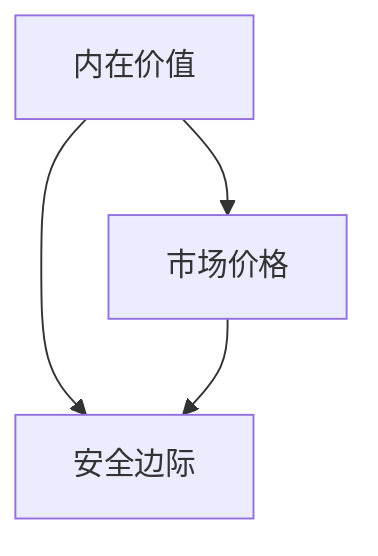
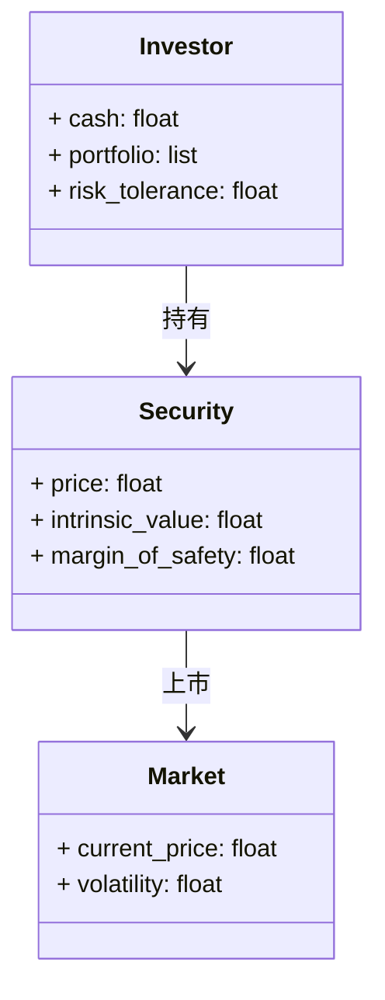

                 


# 罗伯特哈格斯特朗的全球价值投资

> 关键词：价值投资，罗伯特哈格斯特朗，安全边际，内在价值，投资策略，全球市场

> 摘要：本文深入探讨了罗伯特哈格斯特朗的全球价值投资方法，从核心概念到算法实现，再到实际案例分析，全面解析了价值投资的哲学、数学模型和实际应用。通过系统化的分析和结构化的思考，揭示了如何在全球市场中运用价值投资策略实现长期稳健收益。

---

## 第一部分：价值投资的背景与核心理念

### 第1章：价值投资的起源与发展

#### 1.1 价值投资的起源

价值投资是一种以基本面分析为核心的长期投资策略，其核心理念是购买低于其内在价值的资产。这种投资方法起源于20世纪初，由本杰明·格雷厄姆和大卫·多德共同提出，后被罗伯特·哈格斯特朗发扬光大。价值投资的核心在于寻找市场先生的错误定价，通过分析企业的财务状况、行业地位和未来前景，找到被市场低估的投资标的。

**问题背景**：传统投资方法往往依赖于市场趋势和技术分析，但在市场波动剧烈或信息不透明的情况下，这些方法常常失效。价值投资作为一种逆向思维的投资策略，强调在市场恐慌时寻找机会，在市场狂热时保持冷静。

**问题解决**：价值投资通过深入分析企业的内在价值，帮助投资者在市场波动中保持理性，避免被短期市场情绪左右。

**边界与外延**：价值投资不仅适用于股票市场，还可以扩展到房地产、债券和其他资产类别。其核心方法论在全球市场中具有普适性，但需要根据不同市场的特点进行调整。

**概念结构与核心要素组成**：价值投资由以下几个核心要素组成：

1. **内在价值**：资产在未来现金流的现值，反映其真实价值。
2. **安全边际**：内在价值与市场价格之间的差距，提供了风险缓冲。
3. **市场情绪**：投资者心理对市场价格的影响，是价值投资的出发点。

---

### 第2章：价值投资的核心理念

#### 2.1 核心概念术语说明

- **内在价值**：企业未来现金流的现值，是价值投资的核心评估指标。
- **安全边际**：市场价格低于内在价值的部分，是价值投资的保护屏障。
- **市场先生**：一个比喻，指市场情绪的波动对资产价格的影响。

#### 2.2 问题描述与解决

- **问题描述**：市场先生的情绪波动会导致资产价格偏离其真实价值，投资者往往在高点买入、低点卖出。
- **问题解决**：通过计算内在价值，识别市场价格的偏离，利用市场的非理性波动获取超额收益。

#### 2.3 核心概念对比分析

| 概念         | 描述                                         | 关键区别                     |
|--------------|----------------------------------------------|-----------------------------|
| 内在价值     | 企业未来现金流的现值                         | 不受市场情绪影响             |
| 市场价格     | 当前市场上的交易价格                         | 受市场情绪影响               |
| 安全边际     | 内在价值与市场价格的差额                     | 保护投资者免受市场波动影响   |

---

## 第二部分：价值投资的核心概念与联系

### 第3章：价值投资的核心概念

#### 3.1 内在价值与安全边际的数学模型

- **内在价值公式**：
  $$ V = \frac{CF}{(r - g)} $$
  其中：
  - \( CF \) 表示未来现金流
  - \( r \) 表示折现率
  - \( g \) 表示永续增长率

- **安全边际公式**：
  $$ \text{安全边际} = V \times (1 - \text{折扣率}) $$

#### 3.2 内在价值与市场价格的关系



---

### 第4章：价值投资的算法实现

#### 4.1 内在价值计算算法

```python
def calculate_intrinsic_value(cash_flow, discount_rate, growth_rate):
    if growth_rate >= discount_rate:
        return 0  # 避免负值，无增长或增长率超过折现率时无意义
    return cash_flow / (discount_rate - growth_rate)
```

#### 4.2 安全边际计算算法

```python
def calculate_margin_of_safety(intrinsic_value, current_price):
    return intrinsic_value - current_price
```

---

## 第三部分：价值投资的系统分析与架构设计

### 第5章：价值投资系统的构建

#### 5.1 系统功能设计



---

## 第四部分：价值投资的项目实战

### 第6章：价值投资的实际应用

#### 6.1 案例分析：苹果公司的价值评估

假设苹果公司未来现金流为 $100 亿美元，折现率为 8%，永续增长率为 3%。其内在价值计算如下：

$$ V = \frac{100}{0.08 - 0.03} = 2000 \text{亿美元} $$

如果当前市场价格为 $1500 亿美元，则安全边际为 $500 亿美元。

---

## 第五部分：价值投资的最佳实践

### 第7章：成功投资的关键要素

#### 7.1 长期思维的重要性

- 避免短期市场波动的干扰，专注于企业的长期价值。

#### 7.2 安全边际的保护作用

- 通过建立安全边际，降低投资风险，提高投资组合的稳定性。

#### 7.3 风险管理的注意事项

- 分散投资：避免过度集中在单一资产或行业。
- 定期复评：根据市场变化和企业基本面，及时调整投资组合。

---

## 结语

罗伯特哈格斯特朗的全球价值投资方法不仅是一种投资策略，更是一种哲学。通过深入分析企业的内在价值，利用市场的非理性波动，投资者可以在全球市场中实现长期稳健的收益。价值投资的成功关键在于对基本面的深刻理解、对安全边际的重视以及对长期投资的坚持。

---

作者：AI天才研究院/AI Genius Institute & 禅与计算机程序设计艺术 /Zen And The Art of Computer Programming

