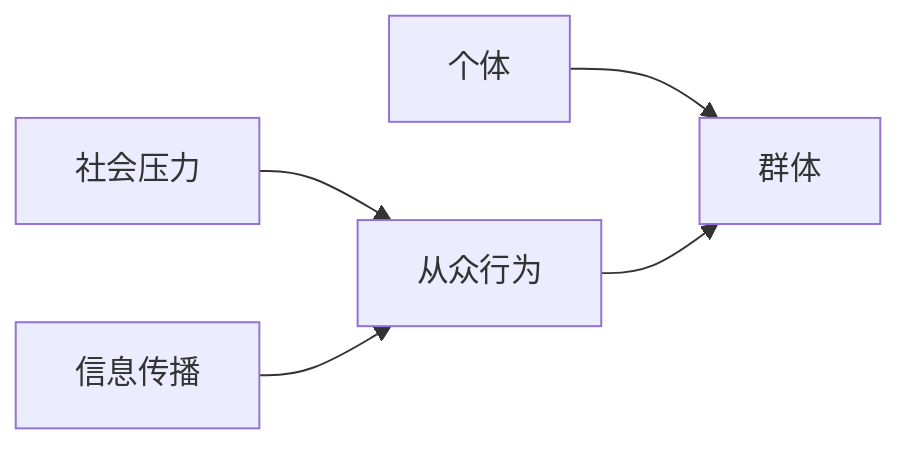

                 

# 羊群效应：理解并避免从众心理陷阱

**关键词**：羊群效应，从众心理，群体决策，信息传播，独立思考，决策优化

**摘要**：羊群效应是一种普遍存在于人类社会中的现象，表现为个体在决策时倾向于跟随大多数人的选择，而不是基于独立思考。本文深入分析羊群效应的形成机制、负面影响，并提供应对策略。通过实际案例和系统分析，帮助读者理解如何避免羊群效应的陷阱，提升决策的独立性和理性。

---

## 第1章 羊群效应的定义与表现

### 1.1 羊群效应的基本概念

羊群效应（羊群心理）是指个体在决策时，由于受到周围人的影响，倾向于跟随大多数人的选择，而不是基于独立思考。这种现象广泛存在于社会、经济、科技等多个领域。

#### 1.1.1 羊群效应的定义
羊群效应是一种从众行为，表现为个体在缺乏信息或不确定的情况下，倾向于模仿他人的决策。这种行为可能导致群体决策的低效性和非理性。

#### 1.1.2 羊群效应的表现形式
1. **群体决策偏差**：群体决策往往倾向于平庸，缺乏创新性。
2. **信息过载与决策疲劳**：个体在面对大量信息时，倾向于跟随多数人的选择，减少思考负担。
3. **社会压力与趋同心理**：个体为了避免被孤立，选择与大多数人一致。

#### 1.1.3 羊群效应的背景与现状
随着信息传播速度的加快，羊群效应在社交媒体、金融市场等领域表现得尤为明显。例如，社交媒体上的流行语、金融市场的跟风炒作等。

### 1.2 羊群效应的形成机制

羊群效应的形成涉及个体行为、信息传播和社会压力等多个因素。

#### 1.2.1 个体行为与群体决策的关系
1. **个体理性**：个体在信息不全时，倾向于参考他人决策。
2. **群体理性**：群体决策可能导致非理性结果。

#### 1.2.2 信息传播与羊群效应的关联
1. **信息传播的链式反应**：信息在群体中传播时，个体的决策可能影响他人。
2. **信息过滤**：个体选择性地接收与自己观点一致的信息，导致信息偏差。

#### 1.2.3 社会压力与从众心理的作用
1. **社会认同**：个体希望被群体接纳，避免孤立。
2. **风险分担**：跟随多数人可以降低个人风险。

### 1.3 羊群效应的负面影响

羊群效应可能导致多种负面后果，包括信息泡沫、决策失误和创新抑制。

#### 1.3.1 信息泡沫的产生与扩散
1. **虚假信息的传播**：羊群效应可能导致虚假信息的快速传播。
2. **信息过载**：个体难以辨别信息真伪，导致决策失误。

#### 1.3.2 群体决策的低效与失误
1. **决策趋同**：群体决策缺乏多样性，可能导致错误选择。
2. **集体错误**：群体决策可能放大个体错误。

#### 1.3.3 创新与多样性的抑制
1. **创新受阻**：个体倾向于跟随，导致创新减少。
2. **多样性降低**：群体行为趋向一致，缺乏多样性。

## 第2章 羊群效应的核心概念与原理

### 2.1 羊群效应的核心概念

羊群效应的核心在于个体行为与群体决策的互动，以及信息传播的影响。

#### 2.1.1 个体决策的独立性与依赖性
1. **独立决策**：个体基于自身信息做出决策。
2. **依赖决策**：个体依赖他人的决策，减少思考负担。

#### 2.1.2 群体决策的协调性与一致性
1. **协调决策**：群体决策需要协调个体行为。
2. **一致性**：群体决策趋向一致，减少冲突。

#### 2.1.3 信息传递的链式反应机制
1. **信息传播**：个体决策影响他人。
2. **链式反应**：信息在群体中传播，形成连锁反应。

### 2.2 羊群效应的理论基础

羊群效应涉及多个理论，包括社会心理学、行为经济学和信息传播理论。

#### 2.2.1 社会心理学视角下的从众行为
1. **社会影响**：个体受到群体压力的影响。
2. **从众行为**：个体为了融入群体，选择与大多数人一致。

#### 2.2.2 经济学中的理性选择与集体行动
1. **理性选择**：个体基于利益最大化做出决策。
2. **集体行动**：群体决策可能偏离个体理性。

#### 2.2.3 行为经济学中的羊群效应模型
1. **行为偏差**：个体存在认知偏差，影响决策。
2. **羊群模型**：描述个体如何跟随他人决策。

### 2.3 羊群效应的特征对比

通过对比分析，理解羊群效应与其他群体行为的区别。

#### 2.3.1 个体行为与群体行为的对比分析
1. **个体行为**：基于个人信息和偏好。
2. **群体行为**：受到社会影响，趋向一致。

#### 2.3.2 羊群效应与其他群体行为的异同
1. **从众行为**：个体跟随多数人。
2. **社会趋同**：群体趋向一致。

#### 2.3.3 羊群效应在不同情境下的表现差异
1. **低信息环境**：个体依赖他人决策。
2. **高信息环境**：个体基于信息做出决策。

### 2.4 羊群效应的ER实体关系图

### 2.5 本章小结

羊群效应的核心在于个体行为与群体决策的互动，以及信息传播的影响。理解这些概念有助于分析其形成机制和负面影响。

---

## 第3章 羊群效应的算法与数学模型

### 3.1 羊群效应的传播模型

#### 3.1.1 传播机制
1. **信息传递**：个体间的信息传播。
2. **决策影响**：个体决策影响他人。

#### 3.1.2 模型构建
1. **数学模型**：描述信息传播和决策变化的数学关系。
2. **模拟实验**：通过模拟验证模型的准确性。

#### 3.1.3 实验结果
1. **传播速度**：信息在群体中的传播速度。
2. **决策趋同**：群体决策趋同的现象。

---

通过以上章节的分析，我们深入探讨了羊群效应的形成机制、负面影响以及应对策略。接下来的章节将结合实际案例和系统设计，进一步分析如何避免羊群效应的陷阱。

---

**作者：AI天才研究院 & 禅与计算机程序设计艺术**

