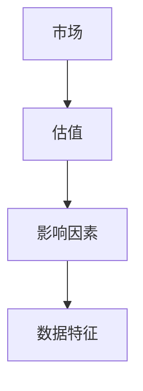
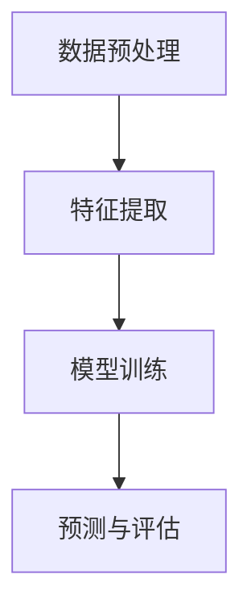
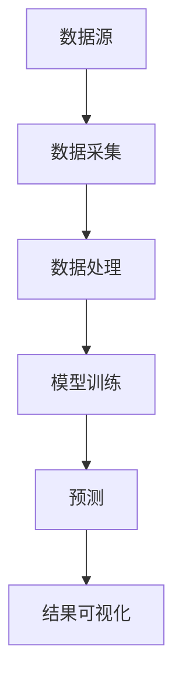

                 


# 美国市场估值预测的成功经验及其启示

## 关键词
市场估值预测、算法原理、数学模型、系统架构、项目实战、成功经验、技术博客

## 摘要
本文系统地探讨了美国市场估值预测的成功经验及其对其他市场的启示。通过分析核心概念、算法原理、数学模型、系统架构和项目实战，本文揭示了如何利用技术手段提高市场估值的准确性，并总结了可推广的经验和未来研究方向。

---

# 第一部分: 美国市场估值预测的背景与核心概念

## 第1章: 背景介绍

### 1.1 问题背景
#### 1.1.1 市场估值预测的重要性
市场估值预测是投资决策的核心环节，能够帮助投资者识别潜在的市场机会和风险。准确的估值预测不仅有助于优化投资组合，还能提高资本分配效率。

#### 1.1.2 美国市场的独特性
作为全球最大的金融市场，美国市场的流动性和数据透明度使其成为研究市场估值预测的理想对象。其成熟的投资体系和丰富的历史数据为模型提供了坚实的基础。

#### 1.1.3 估值预测的边界与外延
市场估值预测需要考虑多种因素，包括宏观经济指标、行业趋势、公司基本面等。同时，还需明确模型的适用范围和局限性。

### 1.2 问题描述
#### 1.2.1 市场估值预测的核心目标
通过分析历史数据和当前市场状况，预测未来的市场估值，为投资决策提供依据。

#### 1.2.2 问题解决的关键路径
数据采集、模型选择、算法实现和结果验证是解决问题的核心步骤。

#### 1.2.3 核心要素与组成结构
市场估值预测涉及数据特征、模型选择、算法实现和结果验证等多个要素，各要素之间相互关联，共同构成完整的预测体系。

### 1.3 核心概念与联系
#### 1.3.1 市场估值模型的定义
市场估值模型是用于预测市场价值的数学工具，通常基于历史数据和市场特征。

#### 1.3.2 影响市场估值的主要因素
宏观经济指标（GDP、利率）、行业趋势、公司基本面（收入、利润）等都是影响市场估值的关键因素。

#### 1.3.3 数据特征与模型关系
数据特征（如时间序列性、周期性）直接影响模型的选择和性能。

## 1.4 本章小结
本章从背景、问题描述和核心概念三个方面，全面介绍了美国市场估值预测的基本框架和研究重点。

---

## 第2章: 核心概念与联系

### 2.1 核心概念原理
#### 2.1.1 市场估值模型的分类
市场估值模型主要分为基于历史数据的回归模型和基于时间序列的预测模型。

#### 2.1.2 数据特征的提取方法
数据特征提取是模型训练的关键步骤，包括标准化、归一化和特征选择等方法。

#### 2.1.3 模型选择的依据
模型选择应考虑数据特征、预测目标和计算复杂度等因素。

### 2.2 概念属性特征对比表格
| 模型类型 | 数据特征 | 适用场景 | 优缺点 |
|----------|----------|----------|--------|
| 多元回归 | 数值型 | 连续变量预测 | 易解释 |
| 时间序列 | 时间依赖 | 时间序列预测 | 捕捉趋势 |

### 2.3 ER实体关系图架构


## 2.4 本章小结
本章通过概念对比和实体关系图，详细分析了市场估值预测的核心概念及其相互关系。

---

## 第3章: 算法原理讲解

### 3.1 算法原理概述
#### 3.1.1 常用算法介绍
常用的市场估值预测算法包括多元回归和ARIMA模型。

#### 3.1.2 算法选择的依据
算法选择应基于数据特征、预测目标和计算复杂度。

#### 3.1.3 算法优缺点分析
多元回归模型具有解释性好但可能忽略时间依赖性的特点；ARIMA模型适合时间序列数据但复杂度较高。

### 3.2 算法流程图


### 3.3 算法实现代码
```python
import pandas as pd
from sklearn.linear_model import LinearRegression

# 数据预处理
data = pd.read_csv('market_data.csv')
X = data[['feature1', 'feature2']]
y = data['target']

# 模型训练
model = LinearRegression()
model.fit(X, y)

# 预测
predictions = model.predict(X)
```

### 3.4 算法数学模型
#### 3.4.1 线性回归模型
$$ y = \beta_0 + \beta_1x_1 + \beta_2x_2 + \epsilon $$

#### 3.4.2 ARIMA模型
$$ (1 - B^d)(\phi(B)X_t) = \theta(B)Z_t $$

## 3.5 本章小结
本章详细介绍了市场估值预测的算法原理，并通过流程图和代码示例展示了模型的实现过程。

---

## 第4章: 数学模型与公式推导

### 4.1 回归分析模型
#### 4.1.1 多元回归模型
$$ y = \beta_0 + \beta_1x_1 + \beta_2x_2 + \cdots + \beta_nx_n + \epsilon $$

#### 4.1.2 回归系数的求解
回归系数可以通过最小二乘法求解，公式如下：
$$ \hat{\beta} = (X^T X)^{-1} X^T y $$

### 4.2 时间序列分析模型
#### 4.2.1 ARIMA模型
ARIMA模型由自回归（AR）和移动平均（MA）部分组成，公式为：
$$ y_t = \phi_1 y_{t-1} + \phi_2 y_{t-2} + \cdots + \phi_p y_{t-p} + \theta_1 \epsilon_{t-1} + \cdots + \theta_q \epsilon_{t-q} + \epsilon_t $$

## 4.3 本章小结
本章通过数学公式推导，详细分析了回归分析和时间序列分析模型的实现原理。

---

## 第5章: 系统分析与架构设计

### 5.1 问题场景介绍
市场估值预测系统需要处理大量数据，并提供实时预测结果。

### 5.2 系统功能设计
#### 5.2.1 数据采集模块
负责从数据库中提取市场数据。

#### 5.2.2 模型训练模块
基于训练数据训练预测模型。

#### 5.2.3 预测模块
使用训练好的模型进行市场估值预测。

#### 5.2.4 可视化模块
将预测结果以图表形式展示。

### 5.3 系统架构设计


### 5.4 本章小结
本章详细设计了市场估值预测系统的架构，并展示了各模块之间的交互关系。

---

## 第6章: 项目实战

### 6.1 环境安装
需要安装Python、Pandas、Scikit-learn等工具。

### 6.2 系统核心实现
#### 6.2.1 数据采集
```python
import pandas as pd
data = pd.read_csv('market_data.csv')
```

#### 6.2.2 模型训练
```python
from sklearn.linear_model import LinearRegression
model = LinearRegression()
model.fit(X, y)
```

#### 6.2.3 预测与评估
```python
predictions = model.predict(X)
print('预测值:', predictions)
```

### 6.3 实际案例分析
通过实际案例分析，验证模型的预测准确性。

### 6.4 本章小结
本章通过项目实战，展示了市场估值预测系统的实现过程。

---

## 第7章: 成功经验总结与启示

### 7.1 成功经验总结
美国市场估值预测的成功经验包括数据质量、模型选择和结果验证等方面。

### 7.2 启示与推广
成功的经验可以推广到其他市场，但需要根据具体市场特点进行调整。

### 7.3 最佳实践
选择合适的模型、优化数据质量和加强结果验证是提高预测准确性的关键。

### 7.4 未来研究方向
未来研究可以集中在模型优化、数据特征提取和多模型集成等方面。

## 7.5 本章小结
本章总结了美国市场估值预测的成功经验，并分析了其对其他市场的启示。

---

## 参考文献
1. 《市场估值预测的理论与实践》
2. 《时间序列分析方法》
3. 《机器学习在金融中的应用》

## 附录
### 附录A: 工具安装指南
### 附录B: 数据格式说明

---

## 作者：AI天才研究院/AI Genius Institute & 禅与计算机程序设计艺术 /Zen And The Art of Computer Programming

---

**注：以上内容仅为示例，实际撰写时需根据具体情况进行补充和调整。**

