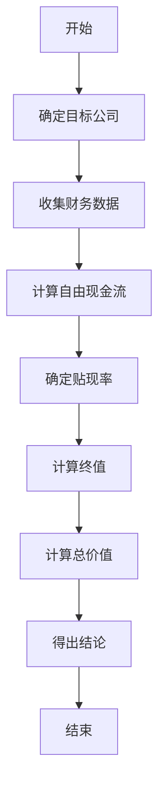
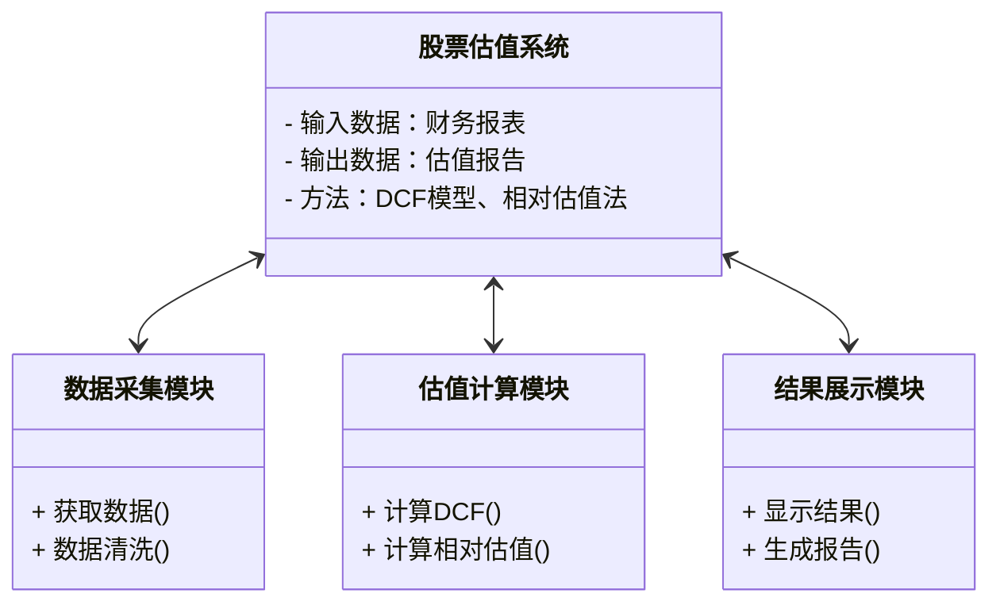
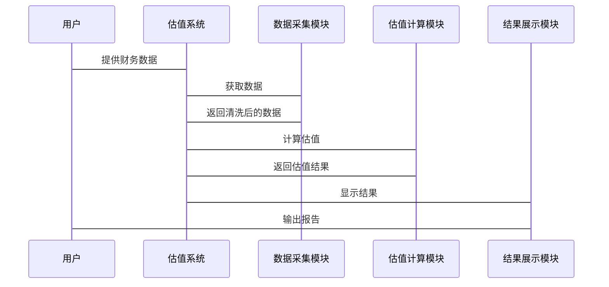

                 


```markdown
# 美国股市估值: 多角度评估方法

## 关键词
- 股市估值
- 多角度评估
- 现金流贴现模型
- 相对估值法
- Python应用

## 摘要
本文从多个角度探讨美国股市估值的方法，涵盖基本概念、核心指标、算法原理、系统架构设计及项目实战。通过详细讲解DCF模型、相对估值法等方法，并结合Python代码实现，帮助读者全面理解股市估值的复杂性及其应用。

---

# 第一部分: 美国股市估值背景与基础

## 第1章: 股市估值的基本概念

### 1.1 股市估值的定义与重要性
股票估值是确定股票内在价值的过程，旨在帮助投资者做出明智的投资决策。多角度评估方法结合了财务指标、市场趋势和公司基本面，以更全面地评估股票价值。

### 1.2 美国股市的基本结构
美国股市由主要交易所（如纽交所、纳斯达克）和指数（如标普500）组成，涵盖多个行业，为投资者提供广泛的投资选择。

### 1.3 股票定价的核心要素
股票价格受多种因素影响，包括财务表现、市场情绪和行业趋势。理解这些因素有助于投资者准确评估股票价值。

---

# 第二部分: 股市估值的核心概念与联系

## 第2章: 估值指标与方法

### 2.1 常用估值指标
- **市盈率（PE）**：衡量股价与收益的关系。
- **市净率（PB）**：评估股价与资产的关系。
- **市销率（PS）**：考虑股价与收入的关系。
- **股息率**：衡量分红回报。

### 2.2 估值方法概述
- **相对估值法**：基于市场数据进行比较。
- **绝对估值法**：基于DCF模型计算内在价值。
- **市场法与资产重估法**：综合考虑市场和资产价值。

### 2.3 核心概念与联系
通过对比表格和ER图，展示各指标的属性和关系，帮助读者更好地理解它们的联系。

---

# 第三部分: 股市估值的算法原理

## 第3章: 现金流贴现模型（DCF）

### 3.1 DCF模型的基本原理
DCF模型通过贴现未来现金流计算股票的内在价值。公式如下：
$$
FCF = EBIT(1 - 税率) + 折旧 - 资本支出
$$

### 3.2 DCF模型的流程图


### 3.3 算法的数学模型
- **终值公式**：$$TV = \frac{FCF_{n+1}}{WACC}$$
- **总价值公式**：$$V = \sum_{t=1}^{n} \frac{FCF_t}{(1 + WACC)^t} + TV$$

---

# 第四部分: 系统分析与架构设计

## 第4章: 估值系统设计

### 4.1 系统功能设计
- **数据采集模块**：收集公司财务数据。
- **估值计算模块**：应用DCF模型和相对估值法。
- **结果展示模块**：可视化估值结果。

### 4.2 系统架构设计


### 4.3 接口设计与交互


---

# 第五部分: 项目实战

## 第5章: Python代码实现

### 5.1 环境安装
安装必要的Python库，如pandas、numpy、matplotlib。

### 5.2 核心代码实现
```python
import pandas as pd
import numpy as np

def calculate_pe(ticker):
    # 示例代码：计算市盈率
    df = pd.get_data(ticker)
    pe = df['Close'] / df['Earnings Per Share']
    return pe.mean()

def calculate_pb(ticker):
    # 示例代码：计算市净率
    df = pd.get_data(ticker)
    pb = df['Close'] / df['Book Value Per Share']
    return pb.mean()

if __name__ == "__main__":
    ticker = 'AAPL'
    pe = calculate_pe(ticker)
    pb = calculate_pb(ticker)
    print(f"{ticker}的市盈率为：{pe}")
    print(f"{ticker}的市净率为：{pb}")
```

### 5.3 案例分析与解读
以苹果公司为例，展示如何使用上述代码计算PE和PB值，分析其估值情况。

---

# 第六部分: 总结与展望

## 第6章: 总结与最佳实践

### 6.1 小结
多角度评估方法结合了多种指标和模型，能够更全面地评估股票价值。本文通过理论和实践的结合，帮助读者掌握这些方法。

### 6.2 注意事项
- 数据的准确性和完整性。
- 模型的适用性和限制。
- 市场环境的变化影响估值结果。

### 6.3 拓展阅读
建议读者深入学习高级估值模型和风险管理策略，以提升投资决策的准确性。

---

# 作者
作者：AI天才研究院 & 禅与计算机程序设计艺术
```

