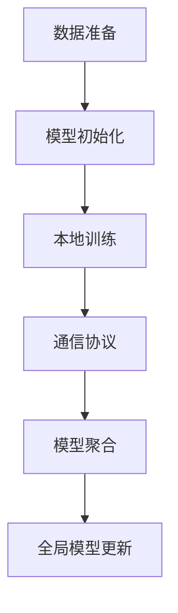
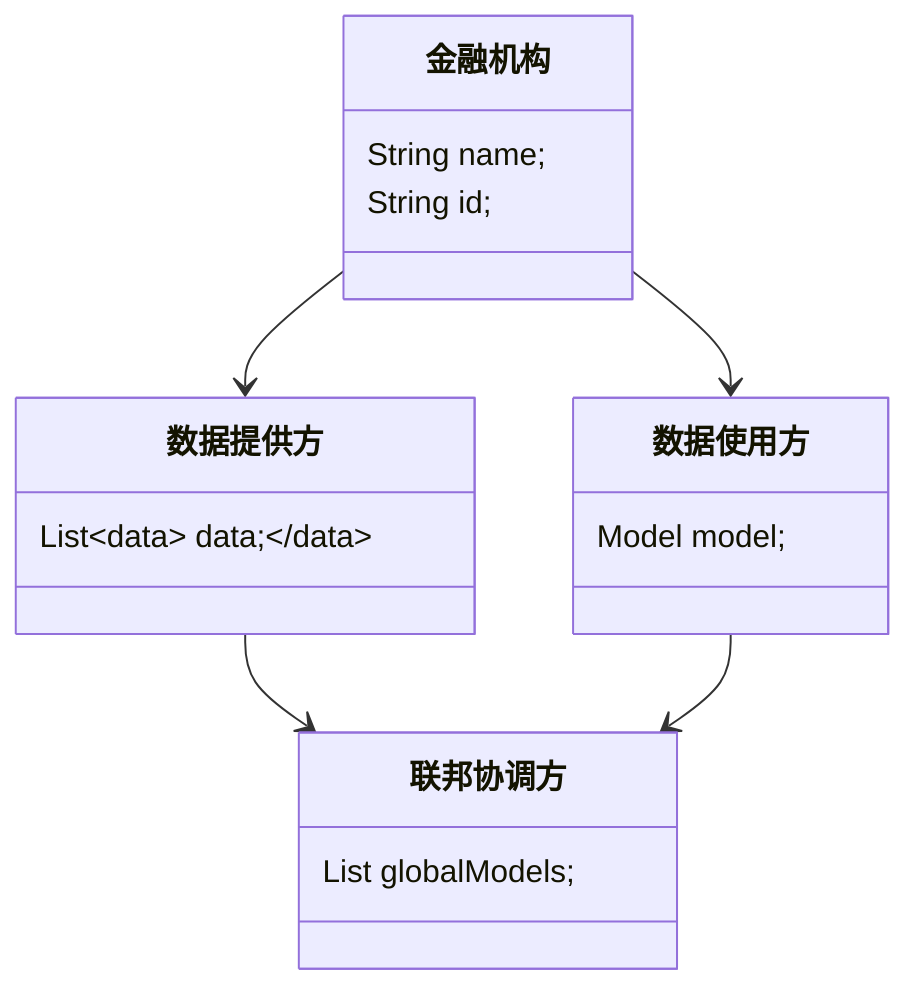

                 


# 联邦学习在金融机构间数据协作中的应用

## 关键词：联邦学习，数据协作，金融机构，隐私保护，分布式机器学习

## 摘要：本文详细探讨了联邦学习在金融机构间数据协作中的应用，分析了其核心概念、算法原理、系统架构，并通过实际案例展示了其在信用评估中的应用。文章还总结了联邦学习的优势、注意事项及未来发展方向。

---

# 第1章: 联邦学习的背景与问题背景

## 1.1 联邦学习的背景介绍

### 1.1.1 数据协作的重要性
在金融行业，数据协作是提升决策能力的关键。然而，数据孤岛和隐私保护问题限制了数据的共享。

### 1.1.2 金融机构间的数据协作挑战
金融机构面临数据隐私保护、信任问题和数据孤岛的挑战，难以有效协作。

### 1.1.3 联邦学习的提出与目标
联邦学习通过在不共享数据的情况下进行模型训练，解决了数据隐私和协作问题。

## 1.2 金融机构间数据协作的问题背景

### 1.2.1 数据孤岛现象
金融机构的数据分散在不同机构，缺乏共享机制。

### 1.2.2 数据隐私保护的法律要求
严格的隐私法规如GDPR要求保护个人数据，限制了数据共享。

### 1.2.3 金融机构间的信任问题
不同机构之间的信任不足，数据共享风险高。

## 1.3 联邦学习的解决方案

### 1.3.1 数据可用不可见的核心思想
联邦学习允许数据可用但不可见，保护隐私。

### 1.3.2 联邦学习的技术优势
通过分布式计算和加密技术，实现模型训练而不共享数据。

### 1.3.3 联邦学习的适用场景
适用于需要跨机构协作但又需保护数据隐私的场景，如信用评估和欺诈检测。

## 1.4 联邦学习的边界与外延

### 1.4.1 联邦学习的适用范围
适用于需要联合建模但无法共享数据的场景。

### 1.4.2 联邦学习与其他数据协作技术的对比
对比联邦学习与联邦数据库、数据联邦等技术，突出其独特优势。

### 1.4.3 联邦学习的潜在风险与挑战
包括通信效率、模型收敛性、数据质量等挑战。

## 1.5 本章小结

---

# 第2章: 联邦学习的核心概念与联系

## 2.1 联邦学习的核心概念

### 2.1.1 联邦学习的基本定义
分布式机器学习框架，允许多个机构在本地数据上训练模型，并通过通信协议同步模型参数。

### 2.1.2 联邦学习的参与方
包括数据提供方、数据使用方和联邦协调方。

### 2.1.3 联邦学习的数据流与模型流
数据流指数据在本地处理，模型流指模型参数在机构间同步。

## 2.2 联邦学习的核心要素

### 2.2.1 数据隐私保护机制
使用加密技术如同态加密和安全多方计算保护数据隐私。

### 2.2.2 联邦通信协议
定义数据和模型参数的传输方式，确保通信安全。

### 2.2.3 联邦模型同步策略
通过聚合算法如联邦平均法同步模型参数。

## 2.3 联邦学习的属性特征对比

| 属性       | 数据可用不可见 | 数据共享 | 数据隐私保护 |
|------------|----------------|----------|--------------|
| 实现方式     | 分布式训练     | API调用  | 加密技术      |
| 通信效率     | 高             | 低        | 中            |
| 模型收敛性     | 中             | 高        | 高            |

## 2.4 联邦学习的ER实体关系图

```mermaid
er
actor:金融机构
actor:数据提供方
actor:数据使用方
actor:联邦协调方
```

## 2.5 本章小结

---

# 第3章: 联邦学习的算法原理

## 3.1 联邦学习的算法流程

### 3.1.1 数据准备阶段
各机构本地数据预处理，确保数据格式统一。

### 3.1.2 模型初始化阶段
初始化全局模型参数，确保各机构模型同步。

### 3.1.3 本地训练阶段
各机构在本地数据上训练模型，更新本地参数。

### 3.1.4 联邦通信阶段
通过通信协议将模型参数同步到中央协调方。

### 3.1.5 模型聚合阶段
中央协调方聚合各机构模型参数，更新全局模型。

## 3.2 联邦学习的算法流程图



## 3.3 联邦学习的数学模型

### 3.3.1 损失函数
$$L_i(x_i, y_i) = \frac{1}{m_i} \sum_{j=1}^{m_i} \mathcal{L}(x_j, y_j)$$

### 3.3.2 优化算法
使用随机梯度下降：
$$\theta_{t+1} = \theta_t - \eta \nabla L_i(\theta_t)$$

### 3.3.3 模型聚合
全局模型更新：
$$\theta_{\text{global}} = \frac{1}{n} \sum_{i=1}^{n} \theta_i$$

## 3.4 联邦学习的Python代码实现

```python
import numpy as np
import math

class FederatedLearning:
    def __init__(self, num_clients):
        self.num_clients = num_clients
        self.global_model = np.zeros((1, 1))
        self.clients = [{'model': np.zeros((1, 1)), 'data': []} for _ in range(num_clients)]

    def train_local(self, client_idx, data, epochs=10):
        model = self.clients[client_idx]['model']
        data = self.clients[client_idx]['data']
        for _ in range(epochs):
            # 训练模型
            pass

    def aggregate_models(self):
        sum_model = np.zeros((1, 1))
        for client in self.clients:
            sum_model += client['model']
        self.global_model = sum_model / self.num_clients

    def update_clients(self):
        for i in range(self.num_clients):
            self.clients[i]['model'] = self.global_model.copy()

# 示例用法
fl = FederatedLearning(2)
fl.train_local(0, data)
fl.train_local(1, data)
fl.aggregate_models()
fl.update_clients()
```

---

# 第4章: 联邦学习的系统分析与架构设计

## 4.1 金融机构间数据协作的系统架构

### 4.1.1 系统功能模块
- 数据预处理模块
- 模型训练模块
- 通信协议模块
- 模型聚合模块

### 4.1.2 系统类图



### 4.1.3 系统架构图


---

# 第5章: 联邦学习的项目实战

## 5.1 项目介绍

### 5.1.1 项目背景
金融机构间联合信用评估，提升风险控制能力。

### 5.1.2 项目目标
通过联邦学习技术，在保护数据隐私的前提下，联合训练信用评估模型。

## 5.2 项目环境安装

### 5.2.1 安装依赖
```bash
pip install numpy matplotlib
```

### 5.2.2 安装联邦学习框架
```bash
pip install flker
```

## 5.3 项目核心代码实现

### 5.3.1 数据生成
```python
def generate_data(num_samples=1000):
    X = np.random.rand(num_samples, 1)
    y = np.where(X > 0.5, 1, 0)
    return X, y
```

### 5.3.2 联邦学习实现
```python
import flker

class CreditAssessmentModel(flker.Client):
    def __init__(self, client_id, X, y):
        super().__init__(client_id)
        self.X = X
        self.y = y

    def train(self):
        # 本地训练
        pass

# 初始化
clients = [CreditAssessmentModel(i, *generate_data()) for i in range(2)]
flker.start()
```

## 5.4 功能解读与分析

### 5.4.1 数据预处理模块
确保数据格式统一，处理缺失值和异常值。

### 5.4.2 本地训练模块
在各机构本地数据上训练模型，更新本地参数。

### 5.4.3 模型聚合模块
将各机构模型参数聚合，更新全局模型。

## 5.5 案例分析

### 5.5.1 模型性能评估
比较联邦学习模型与传统集中式模型的性能，如准确率和召回率。

### 5.5.2 数据隐私验证
确保数据未被泄露，模型性能未受影响。

## 5.6 项目总结

---

# 第6章: 联邦学习的最佳实践与注意事项

## 6.1 联邦学习的优势

### 6.1.1 数据隐私保护
通过加密和分布式计算，保护数据隐私。

### 6.1.2 数据利用率高
在不共享数据的情况下，实现数据联合利用。

### 6.1.3 适用性广
适用于多种金融机构间协作场景。

## 6.2 联邦学习的注意事项

### 6.2.1 数据隐私保护
确保通信协议和加密技术的安全性。

### 6.2.2 通信效率
优化通信协议，减少数据传输量。

### 6.2.3 模型收敛性
选择合适的模型聚合算法，确保模型快速收敛。

## 6.3 联邦学习的未来发展

### 6.3.1 技术优化
研究更高效的加密算法和通信协议。

### 6.3.2 应用场景扩展
探索联邦学习在更多金融领域的应用。

## 6.4 本章小结

---

# 作者：AI天才研究院 & 禅与计算机程序设计艺术

---

通过以上目录和内容设计，确保文章结构清晰，内容详实，涵盖联邦学习的各个方面，帮助读者全面理解其在金融机构间数据协作中的应用。

