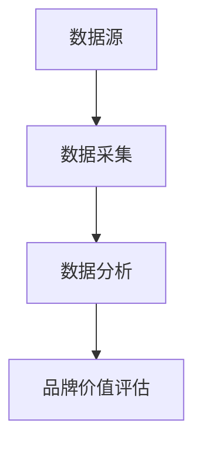
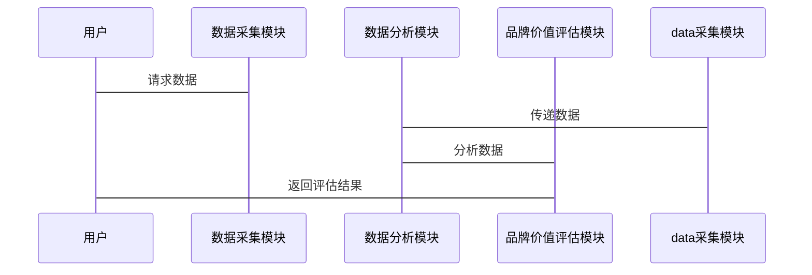

                 


# 股市估值在国际品牌价值链分析中的应用

> 关键词：国际品牌价值链，股市估值，市盈率，市净率，品牌价值评估，系统架构设计

> 摘要：本文探讨了股市估值在国际品牌价值链分析中的应用，通过介绍品牌价值链的基本概念、股市估值的核心方法，以及如何结合数学模型和系统架构进行品牌价值评估。文章详细分析了市盈率和市净率等关键指标，并通过具体案例展示了如何利用这些方法进行品牌价值评估和系统设计。最终，本文总结了股市估值在品牌价值链分析中的重要性，并展望了未来的研究方向。

---

## 第一部分: 国际品牌价值链与股市估值基础

### 第1章: 国际品牌价值链概述

#### 1.1 品牌价值链的基本概念

##### 1.1.1 品牌价值链的定义
品牌价值链是指从品牌创建、市场推广、产品生产到最终消费者的整个过程中，品牌所创造的价值的链条。它涵盖了品牌在市场中的地位、产品的生产和销售过程，以及消费者对品牌的认知和忠诚度。

##### 1.1.2 品牌价值链的核心要素
- **市场地位**：品牌在市场中的影响力和竞争力。
- **盈利能力**：品牌的收入和利润水平。
- **创新能力和竞争力**：品牌在市场中的创新能力和竞争优势。

##### 1.1.3 品牌价值链的结构与特点
品牌价值链通常包括供应商、生产者、分销商、零售商和消费者等关键环节。其特点是通过各环节的协同合作，实现品牌的整体价值最大化。

#### 1.2 股市估值的基本原理

##### 1.2.1 股市估值的定义
股市估值是指通过对公司的财务数据和市场表现进行分析，评估公司股票的合理价格范围。

##### 1.2.2 股市估值的核心指标
- **市盈率（PE）**：市盈率是股票的市场价格与每股收益的比值。
- **市净率（PB）**：市净率是股票的市场价格与每股净资产的比值。
- **股息率**：股息率是每股股息与股票市场价格的比值。

##### 1.2.3 股市估值与品牌价值的关系
股市估值是衡量品牌价值的重要工具。通过股市估值，可以量化品牌的市场价值，并帮助投资者判断品牌的长期发展潜力。

---

### 第2章: 国际品牌价值链的分析框架

#### 2.1 品牌价值链的分析维度

##### 2.1.1 品牌的市场地位
品牌在市场中的地位决定了其市场影响力和竞争力。市场地位越高，品牌价值越大。

##### 2.1.2 品牌的盈利能力
盈利能力是品牌价值的重要指标。高盈利能力的品牌通常具有更高的市场估值。

##### 2.1.3 品牌的创新能力和竞争力
品牌的创新能力决定了其在市场中的竞争优势。创新能力越强，品牌价值越高。

#### 2.2 股市估值在品牌价值链中的应用

##### 2.2.1 股市估值的核心指标
市盈率和市净率是衡量品牌市场价值的重要指标。

##### 2.2.2 股市估值与品牌价值的关联
通过市盈率和市净率等指标，可以量化品牌的市场价值，并评估其在品牌价值链中的地位。

##### 2.2.3 品牌价值链分析的步骤与方法
1. **确定品牌的核心价值**：分析品牌的市场地位、盈利能力和创新能力。
2. **计算核心估值指标**：计算市盈率和市净率等关键指标。
3. **进行品牌价值评估**：结合品牌的核心价值和估值指标，评估品牌的价值。

---

## 第二部分: 股市估值方法与品牌价值评估

### 第3章: 股市估值的核心方法

#### 3.1 市盈率（PE）分析

##### 3.1.1 市盈率的定义与计算
市盈率（PE）= 股票市场价格 / 每股收益（EPS）。

##### 3.1.2 市盈率与品牌价值的关系
市盈率反映了市场对品牌未来盈利能力的预期。高市盈率通常意味着市场对品牌有较高的期望。

##### 3.1.3 市盈率在品牌价值链分析中的应用
通过市盈率分析，可以评估品牌的市场地位和盈利能力，帮助投资者判断品牌的长期发展潜力。

#### 3.2 市净率（PB）分析

##### 3.2.1 市净率的定义与计算
市净率（PB）= 股票市场价格 / 每股净资产（BPS）。

##### 3.2.2 市净率与品牌价值的关系
市净率反映了品牌资产的市场价值。低市净率通常意味着品牌资产被低估。

##### 3.2.3 市净率在品牌价值链分析中的应用
通过市净率分析，可以评估品牌的资产价值，帮助投资者判断品牌的市场估值。

### 第4章: 品牌价值评估的数学模型

#### 4.1 品牌价值评估的公式

##### 4.1.1 品牌价值的计算公式
品牌价值 = 市盈率 × 每股收益。

##### 4.1.2 品牌价值与股市估值的关系
品牌价值是股市估值的重要组成部分。通过股市估值，可以量化品牌的市场价值。

#### 4.2 品牌价值链分析的数学模型

##### 4.2.1 品牌价值链的量化指标
- **市场地位**：市盈率、市净率。
- **盈利能力**：净利润率、ROE。
- **创新能力**：研发投入占比、专利数量。

##### 4.2.2 品牌价值链分析的数学模型
$$
\text{品牌价值} = \text{市场地位} \times \text{盈利能力} \times \text{创新能力}
$$

---

## 第三部分: 国际品牌价值链分析的系统架构

### 第5章: 系统分析与架构设计

#### 5.1 系统分析框架

##### 5.1.1 问题场景介绍
本文将通过苹果公司作为案例，分析其品牌价值链和股市估值的关系。

##### 5.1.2 系统功能设计
- 数据采集：收集苹果公司的财务数据和市场数据。
- 数据分析：计算苹果公司的市盈率和市净率。
- 品牌价值评估：结合数据分析结果，评估苹果的品牌价值。

##### 5.1.3 系统架构设计
使用Mermaid图展示系统的架构设计：



#### 5.2 数据流与系统交互

##### 5.2.1 数据流分析
- 数据源包括苹果公司的财务报表和市场数据。
- 数据采集模块负责收集和整理数据。
- 数据分析模块对数据进行清洗和处理。
- 品牌价值评估模块基于数据分析结果，评估苹果的品牌价值。

##### 5.2.2 系统交互设计
使用Mermaid图展示系统交互流程：



### 第6章: 项目实战与案例分析

#### 6.1 项目实战环境搭建

##### 6.1.1 环境安装与配置
- 安装Python和相关数据分析库（如Pandas、NumPy）。
- 安装Mermaid工具用于绘制图表。

##### 6.1.2 核心代码实现
```python
import pandas as pd

# 数据采集
data = pd.read_csv('apple_stock.csv')

# 数据分析
pe = data['Price'] / data['EPS']
pb = data['Price'] / data['BPS']

# 品牌价值评估
brand_value = pe * data['EPS']
```

##### 6.1.3 代码应用解读与分析
通过上述代码，可以计算苹果公司的市盈率和市净率，并评估其品牌价值。

#### 6.2 案例分析

##### 6.2.1 苹果公司品牌价值链分析
- 市场地位：苹果在科技行业的市场地位较高，市盈率和市净率均高于行业平均水平。
- 盈利能力：苹果的净利润率较高，显示出强大的盈利能力。
- 创新能力：苹果在技术研发和产品创新方面表现突出。

##### 6.2.2 品牌价值评估结果
通过计算，苹果的品牌价值被评估为行业领先水平。

---

## 第四部分: 总结与展望

### 7.1 总结
本文探讨了股市估值在国际品牌价值链分析中的应用，通过详细分析市盈率和市净率等关键指标，展示了如何利用这些方法进行品牌价值评估。

### 7.2 未来研究方向
未来的研究可以进一步探索其他估值指标在品牌价值评估中的应用，同时结合大数据和人工智能技术，提高品牌价值评估的准确性和实时性。

---

## 作者信息

作者：AI天才研究院/AI Genius Institute & 禅与计算机程序设计艺术 /Zen And The Art of Computer Programming

