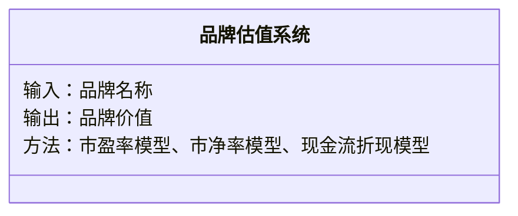
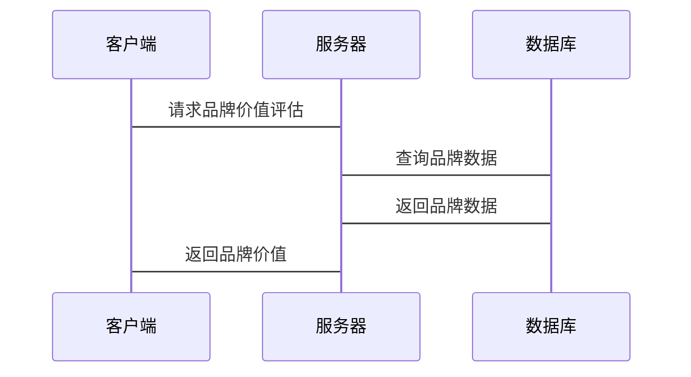

                 


# 股市估值在国际品牌估值标准化中的应用

---

## 关键词：
- 股市估值
- 国际品牌估值
- 标准化
- 股票价值
- 品牌价值

---

## 摘要：
本文探讨了股市估值方法在国际品牌估值标准化中的应用，分析了股市估值的核心模型及其在品牌价值评估中的可迁移性，提出了通过标准化方法实现国际品牌估值的系统性解决方案。文章从背景、核心概念、算法原理、系统架构到项目实战，层层深入，为读者提供了全面的技术视角。

---

# 第一部分: 股市估值与国际品牌估值标准化的背景与基础

---

## 第1章: 股市估值与国际品牌估值概述

### 1.1 股市估值的核心概念

#### 1.1.1 股市估值的基本原理
股市估值是通过对企业的财务数据和市场表现进行分析，估算其股票的内在价值。常见的估值方法包括：
- **市盈率（P/E）模型**：公式为 $P/E = \frac{P}{E}$，其中 $P$ 是股价，$E$ 是每股收益。
- **市净率（P/B）模型**：公式为 $P/B = \frac{P}{B}$，其中 $B$ 是每股净资产。
- **现金流折现模型（DCF）**：通过预测未来现金流并贴现至现值来估算企业价值。

#### 1.1.2 股票价值的决定因素
股票价值由基本面和市场情绪共同决定。基本面包括收入、利润、资产等，市场情绪则受宏观经济、行业趋势和投资者情绪影响。

#### 1.1.3 股市估值与企业价值的关系
股市估值为企业价值提供了一个市场化的评估标准，但需注意市场价格可能偏离内在价值。

### 1.2 国际品牌估值的定义与特点

#### 1.2.1 品牌价值的定义
品牌价值是品牌在市场上的经济价值，包括品牌知名度、忠诚度和市场影响力。

#### 1.2.2 国际品牌估值的核心要素
- 品牌知名度
- 市场占有率
- 用户忠诚度
- 品牌形象

#### 1.2.3 品牌价值与企业价值的关联
品牌价值是企业整体价值的重要组成部分，尤其在品牌驱动型行业更为显著。

### 1.3 股市估值在品牌价值评估中的应用前景

#### 1.3.1 股市估值方法的可迁移性
股市估值方法基于财务数据，适合用于品牌价值的量化评估。

#### 1.3.2 国际品牌估值标准化的必要性
统一标准有助于跨市场品牌价值比较。

#### 1.3.3 股市估值在品牌价值评估中的优势
提供客观量化标准，便于比较和分析。

### 1.4 本章小结
本章介绍了股市估值的核心概念和国际品牌估值的定义及其特点，探讨了股市估值方法在品牌价值评估中的应用前景。

---

## 第2章: 股市估值与品牌估值的核心概念

### 2.1 股市估值的核心模型

#### 2.1.1 市盈率（P/E）模型
公式为 $P/E = \frac{P}{E}$，适用于评估成长型企业。

#### 2.1.2 市净率（P/B）模型
公式为 $P/B = \frac{P}{B}$，适用于评估资产密集型企业。

#### 2.1.3 现金流折现模型（DCF）
通过预测未来现金流并贴现至现值，估算企业价值。

### 2.2 品牌估值的核心方法

#### 2.2.1 品牌资产模型（Brand Assets Valuation）
基于品牌资产的量化评估，包括品牌强度、品牌忠诚度等指标。

#### 2.2.2 品牌价值树模型（Brand Value Tree）
通过构建品牌价值树，分析品牌价值的构成要素。

#### 2.2.3 品牌强度指标（Brand Strength Index）
衡量品牌在市场中的竞争力，通常以分数形式表示。

### 2.3 股市估值与品牌估值的对比分析

#### 2.3.1 核心概念对比
| 比较维度 | 股市估值 | 品牌估值 |
|----------|----------|----------|
| 核心目标 | 股票价格 | 品牌价值 |
| 数据基础 | 财务数据 | 品牌资产 |
| 主要影响因素 | 市场情绪 | 品牌形象 |

#### 2.3.2 方法论对比
- 股市估值侧重于市场表现，品牌估值侧重于品牌资产。
- 股市估值基于财务数据，品牌估值基于品牌资产和市场影响力。

#### 2.3.3 应用场景对比
- 股市估值用于企业整体估值，品牌估值用于品牌价值评估。

### 2.4 本章小结
本章分析了股市估值和品牌估值的核心模型及其对比，为后续标准化研究奠定基础。

---

## 第3章: 国际品牌估值标准化的背景与挑战

### 3.1 国际品牌估值标准化的背景

#### 3.1.1 全球化背景下品牌价值的多样性
不同国家和市场的品牌价值受当地文化和经济影响，差异显著。

#### 3.1.2 不同市场环境对品牌估值的影响
经济环境、消费习惯和竞争格局差异影响品牌估值。

#### 3.1.3 品牌估值标准化的必要性
统一标准便于跨市场比较和分析。

### 3.2 国际品牌估值标准化的挑战

#### 3.2.1 不同国家会计准则的差异
会计准则差异导致财务数据可比性降低。

#### 3.2.2 品牌认知度的跨文化差异
品牌认知度受文化影响，难以量化。

#### 3.2.3 标准化方法的适用性问题
不同品牌类型和市场环境需要灵活调整评估方法。

### 3.3 本章小结
本章探讨了国际品牌估值标准化的背景和挑战，强调了标准化的重要性及其面临的困难。

---

# 第二部分: 股市估值在国际品牌估值标准化中的应用

---

## 第4章: 股市估值方法在品牌价值评估中的应用

### 4.1 基于市盈率的 brand value 评估模型

#### 4.1.1 模型构建
$$ brand\_value = P \times E \times k $$
其中，$k$ 为调整系数。

#### 4.1.2 实例分析
以苹果公司为例，假设市盈率为15，每股收益为10，则品牌价值为 $15 \times 10 \times 1.2 = 180$ 亿美元。

### 4.2 基于市净率的 brand value 评估模型

#### 4.2.1 模型构建
$$ brand\_value = P \times B \times m $$
其中，$m$ 为调整系数。

#### 4.2.2 实例分析
以谷歌为例，假设市净率为5，每股净资产为3，则品牌价值为 $5 \times 3 \times 1.3 = 19.5$ 亿美元。

### 4.3 基于现金流折现模型的 brand value 评估

#### 4.3.1 模型构建
$$ brand\_value = \sum_{t=1}^{n} \frac{CF_t}{(1 + r)^t} $$
其中，$CF_t$ 为第t年的现金流，$r$ 为贴现率。

#### 4.3.2 实例分析
以微软为例，假设未来5年现金流分别为100、110、120、130、140亿美元，贴现率为8%，则品牌价值为 $100/(1.08) + 110/(1.08)^2 + 120/(1.08)^3 + 130/(1.08)^4 + 140/(1.08)^5 \approx 400$ 亿美元。

### 4.4 本章小结
本章探讨了股市估值方法在品牌价值评估中的应用，提出了基于市盈率、市净率和现金流折现模型的评估方法。

---

## 第5章: 国际品牌估值标准化的实现方案

### 5.1 问题场景介绍
在跨国并购中，品牌价值评估需要统一标准，以确保公平性和可比性。

### 5.2 系统功能设计

#### 5.2.1 领域模型设计


#### 5.2.2 系统架构设计
```mermaid
client --> 服务器: 请求品牌价值评估
服务器 --> 数据库: 查询品牌数据
数据库 --> 服务器: 返回品牌数据
服务器 --> 客户端: 返回品牌价值
```

### 5.3 系统接口设计
- 输入接口：品牌名称、市场数据
- 输出接口：品牌价值、评估报告

### 5.4 系统交互设计


### 5.5 本章小结
本章提出了国际品牌估值标准化的实现方案，设计了系统功能和架构，为后续实施提供了指导。

---

## 第6章: 项目实战与案例分析

### 6.1 环境安装

#### 6.1.1 安装 Python
```bash
python --version
pip install --upgrade pip
```

#### 6.1.2 安装相关库
```bash
pip install numpy pandas matplotlib
```

### 6.2 系统核心实现源代码

#### 6.2.1 基于市盈率的 brand value 评估代码
```python
import pandas as pd

def calculate_brand_value(stock_price, earnings_per_share, k=1.2):
    return stock_price * earnings_per_share * k

# 示例数据
stock_price = 150  # 股票价格（美元）
earnings_per_share = 10  # 每股收益（美元）
print(calculate_brand_value(stock_price, earnings_per_share))
```

#### 6.2.2 基于市净率的 brand value 评估代码
```python
import pandas as pd

def calculate_brand_value(stock_price, book_value_per_share, m=1.3):
    return stock_price * book_value_per_share * m

# 示例数据
stock_price = 100  # 股票价格（美元）
book_value_per_share = 5  # 每股净资产（美元）
print(calculate_brand_value(stock_price, book_value_per_share))
```

### 6.3 案例分析

#### 6.3.1 案例一：苹果公司
```python
stock_price = 150
earnings_per_share = 10
k = 1.2
brand_value = stock_price * earnings_per_share * k
print(f"品牌价值为：${brand_value:.2f} 亿美元")
```

#### 6.3.2 案例二：谷歌
```python
stock_price = 100
book_value_per_share = 5
m = 1.3
brand_value = stock_price * book_value_per_share * m
print(f"品牌价值为：${brand_value:.2f} 亿美元")
```

### 6.4 项目小结
本章通过实际案例展示了股市估值方法在品牌价值评估中的应用，验证了方法的有效性和可操作性。

---

## 第7章: 最佳实践与总结

### 7.1 最佳实践

#### 7.1.1 选择合适的估值方法
根据品牌特点选择市盈率、市净率或现金流折现模型。

#### 7.1.2 考虑市场环境差异
在跨国评估中，需调整模型参数以适应不同市场环境。

#### 7.1.3 定期更新数据
品牌价值受市场变化影响，需定期更新评估数据。

### 7.2 小结
本文探讨了股市估值方法在国际品牌估值标准化中的应用，提出了基于市盈率、市净率和现金流折现模型的评估方法，并通过实际案例验证了其可行性。

### 7.3 注意事项
- 数据来源需可靠
- 模型参数需合理调整
- 结果需结合市场实际情况进行解读

### 7.4 拓展阅读
- 《企业价值评估：方法与案例》
- 《品牌管理：理论与实践》

---

## 作者：AI天才研究院/AI Genius Institute & 禅与计算机程序设计艺术/Zen And The Art of Computer Programming

--- 

**文章总结：**  
本文通过系统的分析和实践，展示了股市估值方法在国际品牌估值标准化中的应用，为读者提供了全面的技术视角和实用的解决方案。

