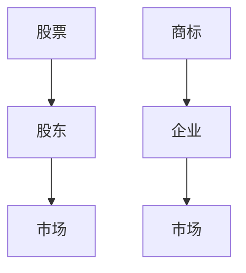
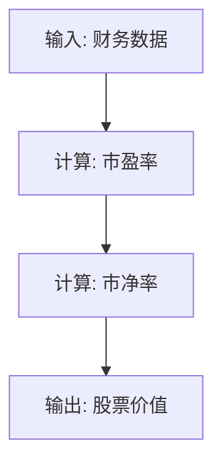
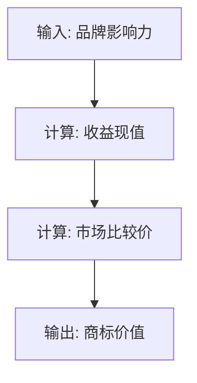
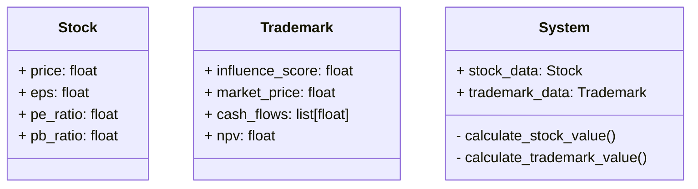
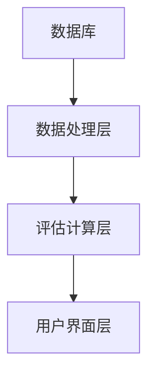
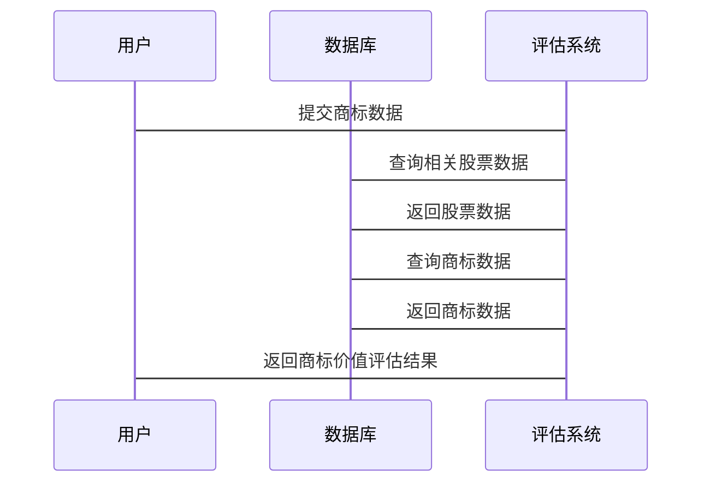

                 


```markdown
# 股市估值在国际商标价值评估中的应用

## 关键词：股市估值、商标价值评估、品牌评估、企业价值评估、知识产权评估、投资评估、资产评估

## 摘要：本文探讨如何将股市估值方法应用于国际商标价值评估。通过分析股票估值的核心模型和商标价值的影响因素，揭示两者之间的关联性，并结合实际案例，展示如何利用股票估值的方法来提升商标价值评估的准确性和科学性。

---

# 第一部分：背景介绍

## 第1章：股市估值与商标价值评估的背景介绍

### 1.1 股市估值的基本概念

#### 1.1.1 股票估值的定义与核心要素
股票估值是指通过分析公司的财务数据、市场环境和行业趋势，对股票的内在价值进行评估的过程。核心要素包括：
- **财务数据**：收入、利润、资产、负债等。
- **市场环境**：宏观经济指标、行业趋势、政策影响等。
- **估值方法**：市盈率（P/E）、市净率（P/B）、股息率等。

#### 1.1.2 股票估值的主要方法
- **相对估值法**：通过比较同类公司的估值指标（如P/E、P/B）来确定股票价值。
- **绝对估值法**：通过现金流折现模型（DCF）等方法计算股票的内在价值。
- **技术分析法**：通过股价走势、成交量等技术指标预测股票价格。

#### 1.1.3 股票估值在金融市场中的作用
股票估值是投资者决策的重要依据，帮助投资者判断股票的合理价格区间，指导买入、卖出或持有策略。

---

### 1.2 商标价值评估的基本概念

#### 1.2.1 商标的定义与法律保护
商标是区分商品或服务来源的标识，包括文字、图形、字母、数字等。商标的价值主要体现在其市场识别力和品牌影响力。

#### 1.2.2 商标价值评估的影响因素
- **品牌知名度**：品牌在市场上的认知度和影响力。
- **市场占有率**：品牌在目标市场中的份额。
- **盈利能力**：品牌带来的收入和利润。
- **法律保护**：商标的注册情况和法律保护力度。

#### 1.2.3 商标评估的行业现状
随着全球化的发展，商标作为无形资产的重要性日益增加，尤其是在跨国公司和品牌运作中，商标价值评估已成为企业决策的重要依据。

---

### 1.3 股市估值与商标价值评估的关联性

#### 1.3.1 股市估值方法的可迁移性
股票估值方法中的一些指标和模型，如相对估值法和绝对估值法，可以借鉴到商标价值评估中。

#### 1.3.2 商标价值评估的市场需求
随着企业品牌化趋势的增强，商标作为企业核心资产之一，其价值评估需求日益增长。

#### 1.3.3 两者的结合意义与应用前景
将股市估值方法应用于商标价值评估，可以提高评估的科学性和准确性，为企业决策提供更有力的支持。

---

## 第2章：股市估值与商标价值评估的核心概念与联系

### 2.1 核心概念原理

#### 2.1.1 股票估值的核心模型与公式
- **市盈率（P/E）**：市盈率 = 股票价格 / 每股净利润。
- **市净率（P/B）**：市净率 = 股票价格 / 每股净资产。
- **股息率**：股息率 = 每股股息 / 股票价格。

#### 2.1.2 商标价值评估的关键指标
- **品牌价值**：品牌带来的收入和利润。
- **品牌影响力**：品牌在市场中的认知度和影响力。
- **市场占有率**：品牌在目标市场中的份额。

#### 2.1.3 两者的共同特征与差异对比
- **共同特征**：都涉及对资产价值的评估，都需要考虑市场环境和财务数据。
- **差异对比**：股票估值注重短期市场波动，商标价值评估注重长期品牌积累。

---

### 2.2 核心概念属性特征对比表格

| 特性       | 股票估值         | 商标价值评估     |
|------------|------------------|------------------|
| 评估对象   | 股票价值         | 商标经济价值     |
| 评估方法   | 市盈率、市净率等 | 收益法、市场法等 |
| 评估周期   | 短期波动         | 长期稳定性       |
| 评估依据   | 财务数据         | 品牌影响力       |

---

### 2.3 实体关系图



---

## 第3章：股市估值与商标价值评估的算法原理

### 3.1 股票估值算法原理



#### Python代码实现

```python
# 示例股票估值代码
def calculate_stock_value(finance_data):
    import pandas as pd
    import numpy as np

    # 计算市盈率
    pe_ratio = finance_data['price'] / finance_data['eps']
    # 计算市净率
    pb_ratio = finance_data['price'] / finance_data['book_value_per_share']
    # 返回估值结果
    return pd.DataFrame({
        '市盈率': pe_ratio,
        '市净率': pb_ratio
    })

# 示例数据
data = {
    'price': [100, 80, 120],
    'eps': [20, 25, 30],
    'book_value_per_share': [5, 4, 6]
}
finance_data = pd.DataFrame(data)

# 调用函数
result = calculate_stock_value(finance_data)
print(result)
```

---

### 3.2 商标价值评估算法原理



#### Python代码实现

```python
# 示例商标价值评估代码
def calculateTrademarkValue(influence_data):
    import pandas as pd
    import numpy as np

    # 计算收益现值
    npv = np.npv(0.1, influence_data['cash_flows'])
    # 计算市场比较价
    market_comparable = influence_data['market_price'].mean() * influence_data['influence_score']
    # 返回估值结果
    return pd.DataFrame({
        '收益现值': npv,
        '市场比较价': market_comparable
    })

# 示例数据
data = {
    'cash_flows': [100000, 120000, 150000],
    'market_price': [500000, 600000, 700000],
    'influence_score': [0.8, 0.9, 1.0]
}
influence_data = pd.DataFrame(data)

# 调用函数
result = calculateTrademarkValue(influence_data)
print(result)
```

---

## 第4章：系统分析与架构设计

### 4.1 问题场景介绍
我们希望通过一个系统，将股市估值方法应用到国际商标价值评估中，构建一个高效、准确的评估系统。

### 4.2 项目介绍
系统名称：国际商标价值评估系统  
目标：利用股市估值方法，实现商标价值的科学评估。

### 4.3 系统功能设计

#### 4.3.1 领域模型类图



### 4.4 系统架构设计



### 4.5 系统接口设计



---

## 第5章：项目实战

### 5.1 环境安装
- **Python**：安装Python 3.8+
- **库**：安装pandas、numpy、scikit-learn

### 5.2 核心代码实现

#### 5.2.1 股票估值代码

```python
import pandas as pd
import numpy as np

def calculate_stock_value(finance_data):
    pe_ratio = finance_data['price'] / finance_data['eps']
    pb_ratio = finance_data['price'] / finance_data['book_value_per_share']
    return pd.DataFrame({
        '市盈率': pe_ratio,
        '市净率': pb_ratio
    })

# 示例数据
data = {
    'price': [100, 80, 120],
    'eps': [20, 25, 30],
    'book_value_per_share': [5, 4, 6]
}
finance_data = pd.DataFrame(data)
result = calculate_stock_value(finance_data)
print(result)
```

#### 5.2.2 商标价值评估代码

```python
import pandas as pd
import numpy as np

def calculateTrademarkValue(influence_data):
    npv = np.npv(0.1, influence_data['cash_flows'])
    market_comparable = influence_data['market_price'].mean() * influence_data['influence_score']
    return pd.DataFrame({
        '收益现值': npv,
        '市场比较价': market_comparable
    })

# 示例数据
data = {
    'cash_flows': [100000, 120000, 150000],
    'market_price': [500000, 600000, 700000],
    'influence_score': [0.8, 0.9, 1.0]
}
influence_data = pd.DataFrame(data)
result = calculateTrademarkValue(influence_data)
print(result)
```

---

## 第6章：总结与展望

### 6.1 总结
本文探讨了股市估值方法在国际商标价值评估中的应用，通过分析股票估值的核心模型和商标价值的影响因素，提出了将两者结合的思路，并通过实际案例展示了其可行性。

### 6.2 注意事项
- 数据的准确性和完整性对评估结果至关重要。
- 需要考虑不同行业的差异性。

### 6.3 拓展阅读
- 《企业价值评估》
- 《商标法与品牌管理》
- 《股票估值与投资策略》

### 6.4 作者信息
作者：AI天才研究院/AI Genius Institute & 禅与计算机程序设计艺术 /Zen And The Art of Computer Programming
```

