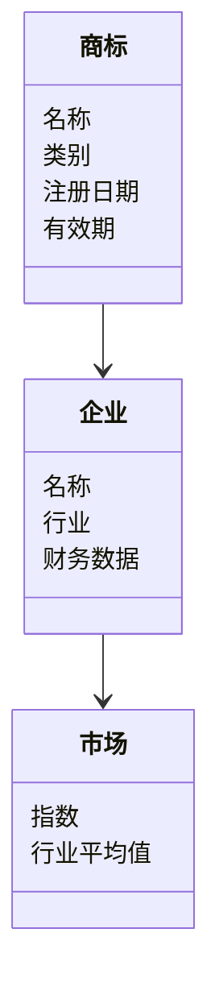
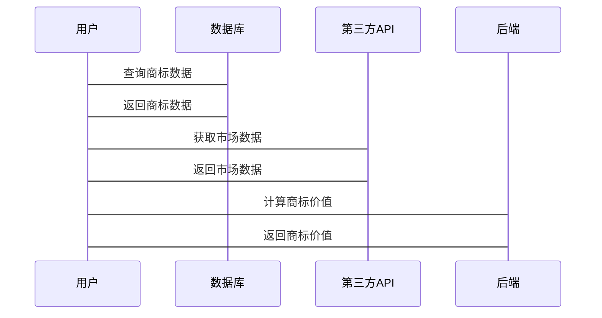

                 


```markdown
# 股市估值在国际商标价值评估中的应用

> 关键词：股市估值、商标价值评估、市盈率、市净率、商标评估方法

> 摘要：本文探讨了股市估值方法在国际商标价值评估中的应用，分析了传统商标评估方法的局限性，以及股市估值方法的优势。通过详细讲解市盈率、市净率等指标的计算与应用，结合实际案例，展示了如何将股市估值方法应用于商标评估，为商标价值评估提供了新的思路和方法。

---

## 第一章：股市估值与商标价值评估的背景介绍

### 1.1 股市估值的核心概念

股票作为企业的一部分，其价值反映了企业的整体实力和市场表现。股市估值是通过分析股票价格与企业基本面之间的关系，来评估企业价值的过程。常见的股市估值方法包括市盈率（P/E）、市净率（P/B）和股权自由现金流法。

#### 1.1.1 股票价值的定义与影响因素
股票价值是指股票在市场上的价格，受多种因素影响，如企业的盈利能力、行业地位、市场前景等。投资者通过分析这些因素来判断股票的价值。

#### 1.1.2 股市估值的基本方法
- **市盈率（P/E）**：市盈率 = 股票价格 / 每股收益。该指标反映了市场对公司盈利能力的评价。
- **市净率（P/B）**：市净率 = 股票价格 / 每股净资产。该指标反映了市场对公司资产质量的评价。
- **股权自由现金流法**：通过分析企业产生的自由现金流，评估企业的内在价值。

#### 1.1.3 股市估值与企业价值的关系
股市估值是企业价值的市场体现，通过分析股市估值指标，可以更好地理解企业的市场地位和投资价值。

### 1.2 商标价值评估的定义与特点

商标是企业的无形资产，其价值受到企业声誉、品牌影响力、市场地位等多种因素的影响。

#### 1.2.1 商标的法律定义
商标是区别商品或服务来源的标识，具有法律保护的特性。

#### 1.2.2 商标价值的影响因素
- **品牌知名度**：品牌知名度越高，商标价值越大。
- **市场占有率**：市场占有率高的商标价值更高。
- **法律保护**：商标的法律保护越完善，其价值越高。

#### 1.2.3 商标评估的复杂性与挑战
商标价值评估涉及多方面的因素，且受市场环境和企业战略的影响，具有较高的复杂性。

### 1.3 股市估值方法在商标评估中的应用背景

#### 1.3.1 传统商标评估方法的局限性
传统商标评估方法多基于主观判断，缺乏客观性和可量化性。

#### 1.3.2 股市估值方法的优势
股市估值方法基于量化指标，具有客观性和可操作性，适用于商标价值评估。

#### 1.3.3 股市估值与商标评估的结合意义
通过将股市估值方法应用于商标评估，可以提高商标价值评估的科学性和准确性。

---

## 第二章：股市估值与商标价值评估的核心概念

### 2.1 股市估值的核心原理

股市估值的核心在于通过分析企业的财务指标和市场表现，评估企业的内在价值。

#### 2.1.1 市盈率（P/E）的计算与应用
市盈率反映了市场对公司盈利能力的评价，计算公式为：
$$ P/E = \frac{\text{股票价格}}{\text{每股收益}} $$

#### 2.1.2 市净率（P/B）的计算与应用
市净率反映了市场对公司资产质量的评价，计算公式为：
$$ P/B = \frac{\text{股票价格}}{\text{每股净资产}} $$

#### 2.1.3 股东权益价值的评估方法
股东权益价值是企业净资产的评估，反映了企业的资产价值。

### 2.2 商标价值评估的核心要素

商标价值评估需要考虑多个方面，包括品牌影响力、市场占有率、法律保护等。

#### 2.2.1 商标的市场影响力
商标的市场影响力决定了其在市场中的地位和竞争力。

#### 2.2.2 商标价值的经济贡献度
商标的经济贡献度反映了其对企业收益的贡献程度。

#### 2.2.3 商标评估的法律保护价值
商标的法律保护越完善，其价值越高。

### 2.3 股市估值与商标评估的核心联系

#### 2.3.1 股市估值方法的可迁移性
股市估值方法基于量化指标，具有较强的可迁移性，适用于商标评估。

#### 2.3.2 商标价值的动态评估
商标价值受市场环境影响，需要动态评估。

#### 2.3.3 股市估值与商标评估的协同效应
通过结合股市估值方法，可以提高商标价值评估的科学性和准确性。

---

## 第三章：股市估值在商标价值评估中的算法原理

### 3.1 股市估值算法的分类

股市估值算法主要包括市盈率法、市净率法和股权自由现金流法。

#### 3.1.1 市盈率法
市盈率法通过比较市盈率与行业平均水平，评估企业的估值水平。

#### 3.1.2 市净率法
市净率法通过比较市净率与行业平均水平，评估企业的估值水平。

#### 3.1.3 股东权益价值的评估方法
通过分析企业的净资产，评估股东权益价值。

### 3.2 商标价值评估的算法选择

根据商标评估的具体需求，选择合适的股市估值方法。

#### 3.2.1 市盈率法的适用场景
市盈率法适用于评估商标的市场影响力和经济贡献度。

#### 3.2.2 市净率法的适用场景
市净率法适用于评估商标的法律保护价值。

#### 3.2.3 自由现金流法的适用场景
自由现金流法适用于评估商标的长期收益能力。

### 3.3 股市估值算法在商标评估中的应用

#### 3.3.1 市盈率法的调整与应用
通过调整市盈率指标，评估商标的市场价值。

#### 3.3.2 市净率法的调整与应用
通过调整市净率指标，评估商标的资产价值。

#### 3.3.3 自由现金流法的调整与应用
通过调整自由现金流指标，评估商标的长期收益能力。

---

## 第四章：系统分析与架构设计方案

### 4.1 问题场景介绍

商标价值评估需要结合企业的财务数据和市场表现，是一个复杂的过程。

### 4.2 项目介绍

通过开发一个商标价值评估系统，应用股市估值方法，实现商标价值的量化评估。

### 4.3 系统功能设计

#### 4.3.1 领域模型


#### 4.3.2 系统架构


#### 4.3.3 系统接口设计


---

## 第五章：项目实战

### 5.1 环境安装

需要安装Python、数据库和相关开发工具。

### 5.2 核心实现

#### 5.2.1 商标价值评估系统核心代码
```python
def calculateTrademarkValue(trademark_data, market_data):
    # 计算市盈率
    pe_ratio = trademark_data['price'] / trademark_data['earnings_per_share']
    # 计算市净率
    pb_ratio = trademark_data['price'] / trademark_data['book_value_per_share']
    # 返回评估价值
    return pe_ratio * market_data['industry_average_pe'], pb_ratio * market_data['industry_average_pb']
```

#### 5.2.2 数据库设计
```sql
CREATE TABLE商标 (
    名称 VARCHAR(255),
    类别 VARCHAR(255),
    注册日期 DATE,
    有效期 DATE,
    企业ID INT
);
```

### 5.3 应用解读与分析

通过实际案例，展示如何应用上述代码和方法进行商标价值评估。

### 5.4 项目小结

总结项目的实现过程和应用效果，为后续研究提供参考。

---

## 第六章：最佳实践 tips、小结、注意事项、拓展阅读

### 6.1 最佳实践 tips

- 数据的准确性和完整性是商标价值评估的关键。
- 定期更新评估模型，以适应市场变化。

### 6.2 小结

本文通过分析股市估值方法在商标价值评估中的应用，提出了一种新的评估思路，为商标价值评估提供了新的视角。

### 6.3 注意事项

- 在实际应用中，需结合企业的具体情况，调整评估模型。
- 数据来源和模型选择需谨慎，确保评估结果的准确性。

### 6.4 拓展阅读

建议进一步研究其他无形资产评估方法，以及如何结合大数据技术提升评估效果。

---

## 作者信息

作者：AI天才研究院/AI Genius Institute & 禅与计算机程序设计艺术 /Zen And The Art of Computer Programming
```

