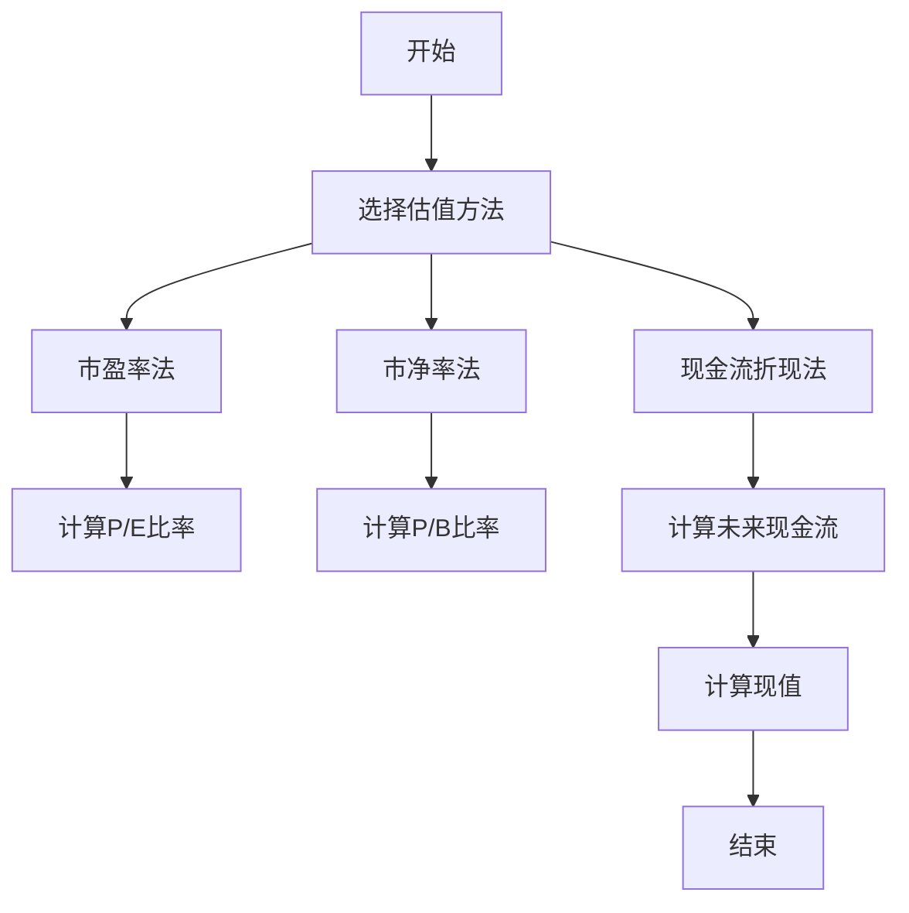

                 


# 股市估值在国际商标诉讼中的应用

---

## 关键词：股市估值，国际商标诉讼，公司价值评估，商标权，经济影响

---

## 摘要

本文探讨了股市估值在国际商标诉讼中的应用，分析了股市估值的基本原理、国际商标诉讼的核心概念，以及两者之间的联系与影响。通过详细阐述股市估值的数学模型、法律框架、系统架构和实战案例，本文为读者提供了全面的理解和深入的分析，展示了股市估值在商标诉讼中的实际应用价值。

---

## 第一部分：引言

### 第1章：引言

#### 1.1 背景介绍

- **股市估值的基本概念**：股市估值是指通过各种方法和模型对上市公司的价值进行评估，以确定其股票的合理价格。
- **国际商标诉讼的定义与特点**：国际商标诉讼是指在跨国商业活动中，因商标权的归属、侵权或无效等问题引发的法律诉讼。
- **股市估值与商标诉讼的关联性**：在商标诉讼中，公司价值的评估往往会影响赔偿金额的计算，而股市估值可以为商标权的经济价值提供参考依据。
- **研究意义与应用前景**：研究股市估值在商标诉讼中的应用，有助于更好地理解商标权的经济价值，为法律判决提供数据支持，同时为企业在国际商标争议中的战略决策提供参考。

---

## 第二部分：股市估值与商标诉讼的核心概念

### 第2章：股市估值的核心原理

#### 2.1 股市估值的基本方法

- **市盈率（P/E）法**：通过公司股价与每股收益的比率来评估公司价值。
  - 公式：$$ P/E = \frac{\text{股价}}{\text{每股收益}} $$
- **市净率（P/B）法**：通过公司股价与每股净资产的比率来评估公司价值。
  - 公式：$$ P/B = \frac{\text{股价}}{\text{每股净资产}} $$
- **现金流折现法（DCF）**：通过未来现金流的现值来评估公司价值。
  - 公式：$$ \text{企业价值} = \sum_{t=1}^{n} \frac{\text{现金流}}{(1+r)^t} $$

#### 2.2 股市估值的关键影响因素

- **公司财务状况**：包括收入、利润、资产负债情况等。
- **行业竞争格局**：行业的市场集中度、竞争对手的数量和实力。
- **宏观经济环境**：包括利率、通货膨胀、经济政策等。
- **市场情绪与投资者预期**：市场情绪和投资者对公司的预期会影响股价。

### 第3章：国际商标诉讼的核心原理

#### 3.1 商标的基本概念

- **商标的定义与功能**：商标是用于区分商品或服务来源的标识，具有识别性和区分性。
- **商标权的法律保护**：商标权是指商标所有人在法律规定的范围内独占使用其商标的权利。

#### 3.2 商标诉讼的主要类型

- **商标侵权诉讼**：因未经许可使用他人商标引发的诉讼。
- **商标无效宣告**：因商标注册违反法律规定的条件而被宣告无效的程序。
- **商标权属争议**：因商标权的归属引发的争议。

#### 3.3 商标诉讼的关键影响因素

- **商标知名度与影响力**：商标的知名度越高，其经济价值越大。
- **商标注册与使用历史**：商标的注册时间、使用历史等会影响其法律地位。
- **商标权的经济价值评估**：商标权的经济价值是商标诉讼中的重要考量因素。

---

## 第三部分：股市估值与商标诉讼的关联分析

### 第4章：股市估值与商标诉讼的联系

#### 4.1 股市估值在商标诉讼中的应用背景

- **商标诉讼中公司价值的评估需求**：在商标侵权诉讼中，赔偿金额的计算往往需要参考侵权行为对公司价值的影响。
- **商标权的经济价值对股价的影响**：商标权的经济价值会影响公司的整体估值，进而影响股价。

#### 4.2 股市估值在商标诉讼中的具体应用

- **商标侵权赔偿的计算**：通过股市估值方法，评估侵权行为对公司价值的影响，从而确定赔偿金额。
- **商标权的经济价值评估**：通过股市估值方法，评估商标权的经济价值，为商标权的转让、质押等提供参考依据。

---

## 第四部分：股市估值在国际商标诉讼中的应用分析

### 第5章：股市估值在国际商标诉讼中的算法与模型

#### 5.1 股市估值的数学模型

- **CAPM模型**：通过计算资本资产定价模型，评估公司的期望收益率。
  - 公式：$$ R_i = R_f + \beta_i (R_m - R_f) $$
  - 其中，\( R_i \) 为公司股票的期望收益率，\( R_f \) 为无风险利率，\( \beta_i \) 为公司的贝塔系数，\( R_m \) 为市场期望收益率。
- **DCF模型**：通过未来现金流的折现，计算公司的内在价值。

#### 5.2 商标权的经济价值评估模型

- **商标权价值的评估公式**：$$ \text{商标权价值} = \sum_{t=1}^{n} \frac{\text{商标带来的收益}}{(1+r)^t} $$
  - 其中，\( r \) 为折现率，\( n \) 为商标的生命周期。

#### 5.3 算法流程图



### 第6章：系统分析与架构设计

#### 6.1 系统功能设计

- **领域模型**：通过mermaid类图展示公司、商标、股价等核心实体的关系。
  ```mermaid
  classDiagram
      class 公司 {
          名称：String
          股价：Float
          股票代码：String
      }
      class 商标 {
          名称：String
          注册日期：Date
          有效期：Integer
      }
      class 股市数据 {
          股票代码：String
          股价：Float
          日期：Date
      }
      公司 --> 商标：拥有
      公司 --> 股市数据：影响
  ```

- **系统架构设计**：通过mermaid架构图展示系统的主要模块和接口。
  ```mermaid
  rectangle 数据源 {
      股市数据
      商标数据
  }
  rectangle 处理模块 {
      数据清洗
      估值计算
  }
  rectangle 输出模块 {
      图表展示
      结果报告
  }
  数据源 --> 处理模块
  处理模块 --> 输出模块
  ```

### 第7章：项目实战与案例分析

#### 7.1 项目实战

- **环境安装**：安装Python、Pandas、Matplotlib等工具。
- **核心实现代码**：使用Python实现股市估值模型。
  ```python
  import pandas as pd
  import numpy as np
  import matplotlib.pyplot as plt

  def calculate_pe_ratio(df):
      pe_ratio = df['股价'] / df['每股收益']
      return pe_ratio

  def calculate_pb_ratio(df):
      pb_ratio = df['股价'] / df['每股净资产']
      return pb_ratio

  def plot_pe_pb Scatterplot(df):
      plt.scatter(df['股价'], df['市盈率'], label='市盈率')
      plt.scatter(df['股价'], df['市净率'], label='市净率')
      plt.xlabel('股价')
      plt.ylabel('估值比率')
      plt.legend()
      plt.show()

  # 示例数据
  data = {
      '股价': [100, 200, 300, 400, 500],
      '每股收益': [10, 20, 30, 40, 50],
      '每股净资产': [50, 60, 70, 80, 90]
  }
  df = pd.DataFrame(data)
  pe_ratio = calculate_pe_ratio(df)
  pb_ratio = calculate_pb_ratio(df)
  plot_pe_pb_Scatterplot(df)
  ```

- **代码应用解读**：解释代码的功能和实现逻辑，展示如何通过代码实现股市估值模型。

#### 7.2 案例分析

- **案例背景**：某跨国公司因商标侵权被起诉，需评估商标权的经济价值。
- **案例分析**：通过股市估值方法，评估商标权对公司价值的影响，计算侵权赔偿金额。
- **结果解读**：展示计算结果，并分析其对商标诉讼的潜在影响。

---

## 第五部分：总结与展望

### 第8章：总结

- **核心内容回顾**：总结股市估值在国际商标诉讼中的应用，强调其重要性。
- **主要结论**：股市估值为商标权的经济价值评估提供了有力工具，有助于商标诉讼中的赔偿金额计算。

### 第9章：展望

- **未来研究方向**：探索更复杂的股市估值模型在商标诉讼中的应用，如机器学习算法。
- **发展趋势**：随着技术的进步，股市估值在商标诉讼中的应用将更加广泛和深入。

---

## 作者

作者：AI天才研究院/AI Genius Institute & 禅与计算机程序设计艺术/Zen And The Art of Computer Programming

---

**注意**：以上内容为示例，实际撰写时需根据具体情况进行调整和补充。

