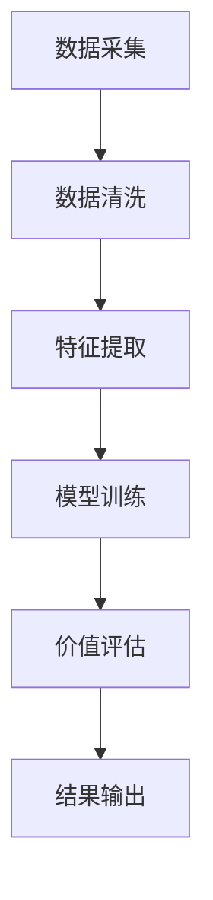
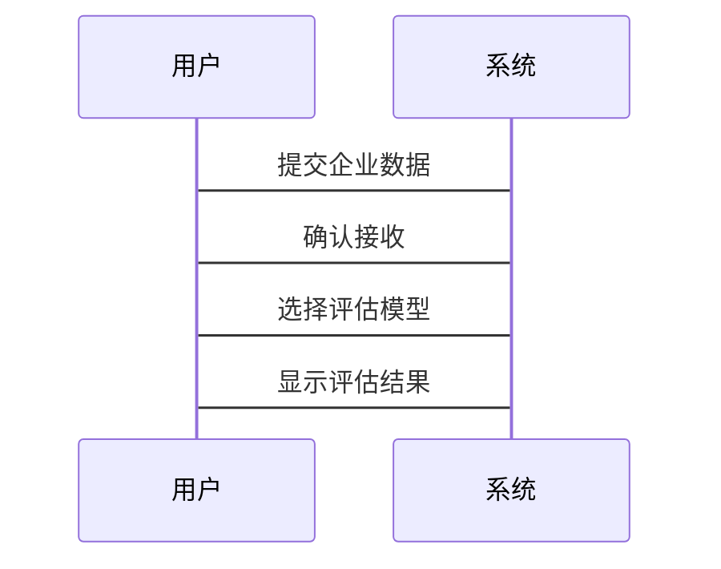

                 


# 股市估值在国际数字服务价值评估中的应用

> 关键词：股市估值、数字服务、价值评估、金融模型、人工智能

> 摘要：本文探讨了如何将股市估值的传统方法应用于国际数字服务的价值评估中。通过分析股市估值的核心原理，结合数字服务的特性，构建了一个基于多维度指标的评估模型。文章还详细介绍了系统的实现过程，包括数据采集、特征提取、模型训练等步骤，并通过实际案例展示了评估系统的应用效果。最后，总结了研究成果，并提出了未来的研究方向。

## 第一部分：引言

### 1.1 背景与意义
数字服务的兴起改变了传统的商业模式，其价值评估变得复杂且多样化。股市估值作为一种成熟的金融工具，具有丰富的理论基础和实践经验，为数字服务的价值评估提供了新的思路。

### 1.2 问题描述
数字服务的无形性和动态性使得传统的估值方法难以直接应用。本文旨在探索如何借鉴股市估值方法，构建适合数字服务的评估体系。

### 1.3 研究目标
通过分析股市估值的核心方法，结合数字服务的特点，提出一套创新的评估模型，并验证其可行性和有效性。

## 第二部分：理论基础

### 2.1 股市估值方法
股票估值的常用方法包括市盈率法、市净率法、现金流折现法和股东权益估价法。这些方法各有优缺点，适用于不同的评估场景。

### 2.2 数字服务价值评估的理论基础
数字服务具有数据驱动、高扩展性和动态变化的特点。其价值评估需要考虑用户数量、收入潜力、技术壁垒等多个维度。

### 2.3 股市估值与数字服务评估的对比分析
通过对比分析，我们发现数字服务评估在数据处理和动态调整方面具有更高的复杂性，需要结合新的方法和工具。

## 第三部分：方法论

### 3.1 股市估值模型的构建
#### 3.1.1 数据采集与处理
从公开数据源获取数字服务企业的财务数据和市场数据，进行清洗和预处理。

#### 3.1.2 特征提取
提取关键特征，如用户活跃度、收入增长率和研发投入等，构建特征向量。

#### 3.1.3 模型训练
使用机器学习算法（如随机森林、神经网络）训练评估模型，评估企业的内在价值。

### 3.2 应用流程
通过mermaid流程图展示从数据采集到最终评估的完整流程，确保步骤清晰。



## 第四部分：系统实现

### 4.1 系统架构设计
设计模块化的系统架构，包括数据采集模块、特征提取模块、模型训练模块和评估结果展示模块。

### 4.2 系统交互流程
使用mermaid序列图展示用户与系统之间的交互流程，确保用户操作直观。



## 第五部分：项目实战

### 5.1 实验环境搭建
安装必要的Python库，如pandas、numpy和scikit-learn，确保环境配置正确。

### 5.2 核心代码实现
编写数据预处理、特征提取和模型训练的代码，详细解读每一步的作用和实现细节。

```python
import pandas as pd
from sklearn.ensemble import RandomForestRegressor
from sklearn.metrics import mean_absolute_error

# 数据加载
data = pd.read_csv('data.csv')

# 特征工程
features = data[['用户活跃度', '收入增长率', '研发投入']]
target = data['企业价值']

# 模型训练
model = RandomForestRegressor(n_estimators=100)
model.fit(features, target)

# 模型预测
predictions = model.predict(features)
print('预测误差:', mean_absolute_error(target, predictions))
```

## 第六部分：总结与展望

### 6.1 研究总结
本文成功构建了基于股市估值的数字服务价值评估模型，验证了其在实际应用中的有效性。

### 6.2 未来研究方向
未来可以进一步优化模型，引入实时数据和动态调整机制，提升评估的准确性和及时性。

## 作者信息
作者：AI天才研究院  
联系邮箱：contact@aidatainstitute.com  
版权所有：AI数据研究院

---

这篇文章通过系统的理论分析和实践应用，详细阐述了股市估值在数字服务价值评估中的应用，为相关领域的研究和实践提供了有价值的参考。

