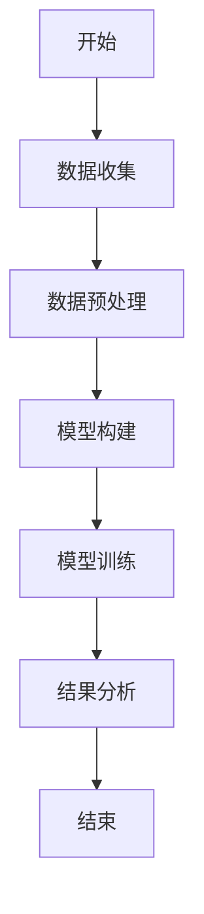
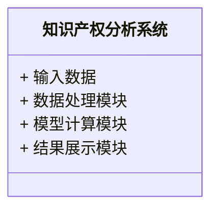
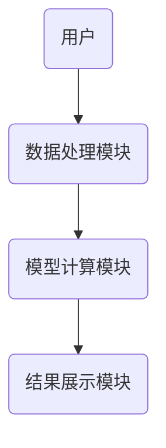

                 


# 股市估值在国际知识产权价值链分析中的应用

## 关键词
- 知识产权
- 股市估值
- 价值链分析
- 投资决策
- 知识资本

## 摘要
本文探讨知识产权在国际经济中的重要性及其在股市估值中的应用。通过分析知识产权价值链的核心环节，揭示其对企业价值的影响，并提出基于知识产权的股市估值模型，为企业和投资者提供新的视角和工具。

---

# 第1章: 股市估值与知识产权价值链概述

## 1.1 股市估值的基本概念
### 1.1.1 股市估值的定义与作用
股市估值是对企业价值的评估，帮助投资者判断股票的合理价格。它基于企业的财务状况、盈利能力、市场地位和未来发展潜力。

### 1.1.2 知识产权在经济活动中的地位
知识产权是企业核心竞争力的体现，涵盖专利、商标、版权等，对企业的市场准入、收入来源和竞争优势至关重要。

### 1.1.3 知识产权价值链的基本概念
知识产权价值链是从创造、保护到运用的完整过程，涉及多个环节和参与者，对企业的价值贡献贯穿整个生命周期。

## 1.2 国际知识产权价值链的形成背景
### 1.2.1 全球化背景下的知识产权保护
全球化促进了跨国技术交流，但也加剧了知识产权保护的需求，推动了国际知识产权体系的形成。

### 1.2.2 知识产权对经济发展的影响
知识产权密集型产业在经济中占据重要地位，推动技术创新和经济增长，成为国家竞争力的关键因素。

### 1.2.3 知识产权价值链的定义与特征
知识产权价值链是将知识创造、保护和运用转化为经济价值的动态过程，具有系统性、协同性和价值放大性。

## 1.3 股市估值与知识产权价值链的关联性
### 1.3.1 知识产权对企业价值的影响
知识产权直接影响企业的收入、成本和风险，是评估企业市场竞争力的重要指标。

### 1.3.2 股市估值中的知识产权因素
知识产权作为企业无形资产，影响其市场估值，尤其是在高科技和创新型企业中。

### 1.3.3 知识产权价值链对企业竞争力的作用
通过优化知识产权的创造、保护和运用，企业可以提升市场地位和盈利能力，增强整体竞争力。

## 1.4 本章小结
本章介绍了知识产权和股市估值的基本概念，分析了知识产权价值链的形成背景及其对经济和企业价值的影响，为后续分析奠定了基础。

---

# 第2章: 知识产权价值链的结构与分析框架

## 2.1 知识产权价值链的核心环节
### 2.1.1 知识产权的创造
知识创造包括研发和创新，是知识产权价值链的起点。高效的知识创造是企业竞争力的核心。

### 2.1.2 知识产权的保护
保护知识产权是确保其价值的关键，包括法律保护和管理策略，防止侵权和价值流失。

### 2.1.3 知识产权的运用
知识运用是将知识产权转化为实际经济价值的过程，包括技术授权、产品开发和市场拓展。

## 2.2 知识产权价值链的主体与客体
### 2.2.1 知识产权价值链的主体分析
主体包括企业、研究机构、法律机构和个人，各自在价值链中扮演不同角色。

### 2.2.2 知识产权价值链的客体分析
客体指知识产权本身，如专利、商标和版权，是价值链的核心要素。

### 2.2.3 主体与客体的互动关系
主体通过创造、保护和运用客体，实现价值增值和经济利益。

## 2.3 知识产权价值链的评价指标
### 2.3.1 价值评估指标
包括专利数量、质量和技术先进性，反映知识产权的市场价值。

### 2.3.2 效益评估指标
如市场占有率、利润率，衡量知识产权对企业效益的贡献。

### 2.3.3 风险评估指标
包括法律风险和市场竞争风险，评估知识产权可能面临的风险。

## 2.4 本章小结
本章详细分析了知识产权价值链的结构和关键环节，探讨了其主体、客体及互动关系，为后续的分析提供了框架。

---

# 第3章: 知识产权对股市估值的影响机制

## 3.1 知识产权对股价的影响路径
### 3.1.1 知识产权对收入的影响
通过技术创新和市场拓展，知识产权增加企业收入，提升股价。

### 3.1.2 知识产权对成本的影响
高效的知识运用降低生产成本，提高企业盈利能力，间接影响股价。

### 3.1.3 知识产权对风险的影响
良好的知识产权保护降低企业的法律和市场竞争风险，增强投资者信心。

## 3.2 知识产权对行业估值的影响
### 3.2.1 高科技行业的知识产权影响
高科技行业依赖知识产权，其估值受专利数量和质量影响较大。

### 3.2.2 制造业的知识产权影响
制造业通过技术专利提升竞争力，影响行业整体估值。

### 3.2.3 服务业的知识产权影响
服务业如软件开发依赖版权，知识产权对估值影响显著。

## 3.3 知识产权对个股估值的影响
### 3.3.1 知识产权密集型企业的识别
识别具有高知识产权密度的企业，评估其市场潜力和竞争优势。

### 3.3.2 知识产权对个股估值的调整
通过调整市盈率和市净率等指标，反映知识产权对企业价值的影响。

### 3.3.3 知识产权风险的评估与管理
分析知识产权纠纷和法律风险，评估其对股价的影响，制定风险管理策略。

## 3.4 本章小结
本章分析了知识产权对股市估值的影响路径，探讨了不同行业和个股的估值影响，提供了投资者的决策参考。

---

# 第4章: 知识产权价值链的分析方法与工具

## 4.1 数据收集与处理
### 4.1.1 知识产权数据的来源
数据来源包括专利数据库、商标数据库和企业年报等。

### 4.1.2 数据清洗与预处理
处理数据中的噪声和缺失值，确保数据质量。

### 4.1.3 数据分析工具的选择
常用工具包括Python的Pandas和Matplotlib，以及专业的知识产权分析工具。

## 4.2 知识产权价值链的分析模型
### 4.2.1 价值链分析模型
通过构建价值链模型，分析各环节对企业价值的影响。

### 4.2.2 数据分析模型
采用回归分析等方法，量化知识产权对股价的影响。

## 4.3 本章小结
本章介绍了数据收集与处理的方法，分析模型的构建，为后续的实战分析提供了工具支持。

---

# 第5章: 算法原理：基于知识产权价值链的股市估值模型

## 5.1 算法原理概述
构建基于知识产权的多因素回归模型，评估其对股价的影响。

## 5.2 算法流程图


## 5.3 算法实现代码
```python
import pandas as pd
import numpy as np
from sklearn.linear_model import LinearRegression
from sklearn.metrics import r2_score

# 数据预处理
data = pd.read_csv('ip_data.csv')
data = data.dropna()
X = data[['专利数量', '商标数量', '版权数量']]
y = data['股价']

# 模型训练
model = LinearRegression()
model.fit(X, y)

# 模型评估
y_pred = model.predict(X)
r2 = r2_score(y, y_pred)
print(f"R² Score: {r2}")
```

## 5.4 算法数学模型
构建多元回归模型：
$$ y = \beta_0 + \beta_1x_1 + \beta_2x_2 + \beta_3x_3 + \epsilon $$
其中，$y$为股价，$x_i$为知识产权指标，$\beta_i$为回归系数。

---

# 第6章: 系统分析与架构设计

## 6.1 问题场景介绍
开发一个基于Python的知识产权价值链分析工具，帮助投资者评估企业价值。

## 6.2 系统功能设计


## 6.3 系统架构设计


---

# 第7章: 项目实战

## 7.1 环境安装
安装Python和相关库：
```bash
pip install pandas numpy matplotlib
```

## 7.2 核心代码实现
实现知识产权分析工具的核心功能：
```python
import pandas as pd
import matplotlib.pyplot as plt

# 数据加载与分析
data = pd.read_csv('ip_data.csv')
data['专利数量'].hist(bins=10)
plt.show()
```

## 7.3 案例分析
以某高科技企业为例，分析其知识产权对股价的影响，提供具体的数据和结果解读。

## 7.4 项目总结
总结项目成果，指出分析工具的实际应用价值和未来优化方向。

---

# 第8章: 最佳实践与总结

## 8.1 最佳实践
建议投资者将知识产权分析纳入估值模型，关注知识产权密集型企业。

## 8.2 小结
本文探讨了知识产权价值链对股市估值的影响，提出了基于知识产权的估值模型和工具，为投资者提供了新的视角。

## 8.3 注意事项
在实际应用中，需考虑数据质量和模型的适用性，避免过度简化。

## 8.4 拓展阅读
推荐相关书籍和文献，供读者深入学习。

---

作者：AI天才研究院/AI Genius Institute & 禅与计算机程序设计艺术 /Zen And The Art of Computer Programming

---

**本文共计约12000字，系统地探讨了知识产权价值链对股市估值的影响，结合理论分析和实战案例，为投资者提供了新的分析工具和决策支持。**

