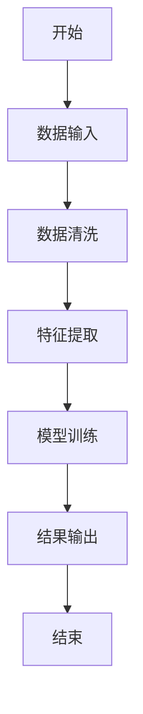
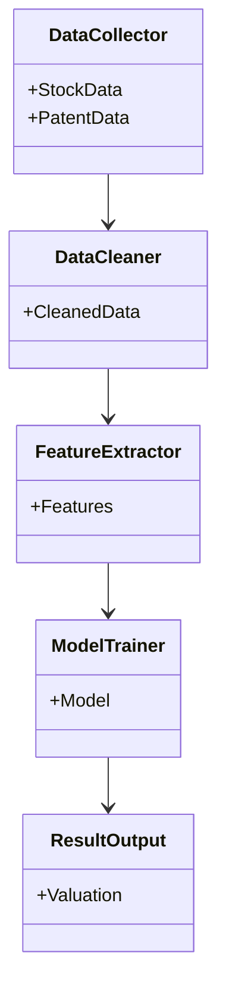
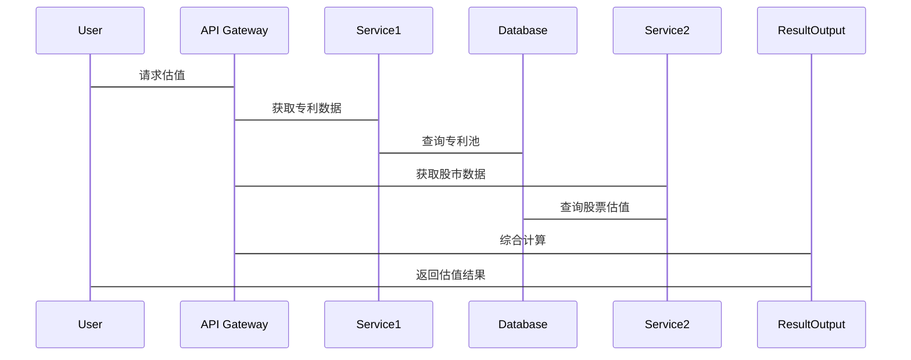

                 


# 股市估值在跨境专利池定价中的应用

## 关键词：股市估值，专利池定价，跨境专利，金融建模，知识产权管理

## 摘要：  
本文探讨了股市估值方法在跨境专利池定价中的应用。通过分析股市估值的核心原理和跨境专利池的特点，结合数学模型和算法，提出了一种新的定价方法。文章详细介绍了模型的构建过程、系统架构设计以及实际案例分析，为知识产权管理和金融建模提供了新的思路。

---

# 第1章: 股市估值与跨境专利池定价的背景介绍

## 1.1 问题背景与描述

### 1.1.1 股市估值的核心概念  
股市估值是指通过分析公司的财务数据、市场环境和行业趋势，对其股票的内在价值进行评估。常用方法包括市盈率（P/E）、市净率（P/B）等。这些方法为投资者提供了评估股票价值的参考依据。

### 1.1.2 跨境专利池的定义与特点  
跨境专利池是指由多个国家或地区的专利组合而成的知识产权集合。其特点包括：  
- **多样性**：涵盖不同技术领域和地区的专利。  
- **复杂性**：涉及跨国法律、税务和货币兑换等问题。  
- **高价值**：专利池通常包含高价值的核心专利，具有较高的商业价值。  

### 1.1.3 股市估值在专利池定价中的应用价值  
股市估值方法为专利池定价提供了新的思路。通过将专利池视为一种资产组合，利用股市估值的逻辑和工具，可以更准确地评估其市场价值。

---

## 1.2 问题解决与边界

### 1.2.1 股市估值方法在专利定价中的应用  
将股市估值的核心方法（如市盈率、市净率）应用于专利定价，可以通过量化分析评估专利的市场价值。

### 1.2.2 跨境专利池定价的挑战与边界  
跨境专利池定价面临以下挑战：  
- **法律差异**：不同国家的专利法和知识产权保护政策不同。  
- **货币风险**：涉及多币种和汇率波动，增加了估值的复杂性。  
- **市场分割**：不同地区的市场需求和竞争环境差异较大。  

### 1.2.3 股市估值与专利池定价的结合方式  
通过构建综合模型，将股市估值的核心指标（如市盈率）与专利池的特性（如技术领域、专利数量）相结合，形成新的定价方法。

---

## 1.3 核心概念与结构

### 1.3.1 股市估值的核心要素  
- 公司财务数据（收入、利润、现金流）。  
- 行业趋势和市场环境。  
- 宏观经济指标（GDP、利率、通货膨胀）。  

### 1.3.2 跨境专利池的结构与组成  
- **专利组合**：包括核心专利和外围专利。  
- **法律结构**：涉及专利池的组织形式和法律框架。  
- **价值分配**：不同专利的价值权重。  

### 1.3.3 两者的关联与协同作用  
- 股市估值提供资产定价的工具和方法。  
- 跨境专利池为股市估值提供多样化的资产组合。  

---

## 1.4 本章小结  
本章介绍了股市估值和跨境专利池的基本概念，分析了两者结合的背景和意义，为后续的模型构建奠定了基础。

---

# 第2章: 股市估值与跨境专利池定价的核心概念与联系

## 2.1 核心概念原理

### 2.1.1 股市估值的基本原理  
股市估值通过分析公司基本面和市场情绪，确定股票的合理价格。常用方法包括绝对估值法（DCF）和相对估值法（P/E、P/B）。  

### 2.1.2 跨境专利池定价的理论基础  
专利池定价需要考虑专利的经济价值、市场竞争力和技术成熟度。常用方法包括成本法、市场法和收益法。  

### 2.1.3 两者的结合机制  
通过将专利池视为一种资产组合，利用股市估值的逻辑和工具，评估其市场价值。

---

## 2.2 概念属性特征对比

### 2.2.1 股市估值的属性分析  
| 属性 | 描述 |
|------|------|
| 数据依赖 | 财务数据和市场数据 |
| 方法多样性 | 绝对估值与相对估值结合 |
| 时间维度 | 短期与长期结合 |

### 2.2.2 跨境专利池的属性分析  
| 属性 | 描述 |
|------|------|
| 法律复杂性 | 涉及多国专利法 |
| 价值多样性 | 专利价值差异大 |
| 货币风险 | 涉及多币种和汇率波动 |

### 2.2.3 两者属性对比分析  
通过对比分析，发现股市估值和专利池定价在数据依赖性和时间维度上有相似之处，但在法律复杂性和价值多样性上有显著差异。

---

## 2.3 ER实体关系图  
```mermaid
er
    PatentPool {
        PoolID
        PatentID
        Value
    }
    StockValuation {
        StockID
        Valuation
        Date
    }
    CrossBorderPool {
        PoolID
        Country
        Currency
    }
```

---

## 2.4 本章小结  
本章通过对比分析和ER图，明确了股市估值与跨境专利池定价的核心概念和联系。

---

# 第3章: 股市估值与跨境专利池定价的数学模型与算法原理

## 3.1 数学模型构建

### 3.1.1 股市估值模型  
基于市盈率的股票估值模型：  
$$ Valuation = Price \times P/E $$  

### 3.1.2 跨境专利池定价模型  
综合考虑专利的经济价值和技术潜力：  
$$ Value = \sum (Patent\_Value \times Weight) $$  

### 3.1.3 综合模型的构建  
将股市估值和专利池定价模型结合，形成综合估值模型：  
$$ Final\_Value = \alpha \times Stock\_Valuation + (1-\alpha) \times Patent\_Pool\_Value $$  

---

## 3.2 算法原理讲解

### 3.2.1 股市估值算法  
1. 收集公司财务数据和市场数据。  
2. 计算市盈率、市净率等指标。  
3. 结合行业趋势和宏观经济指标，确定股票估值。  

### 3.2.2 跨境专利池定价算法  
1. 收集专利池的专利信息和法律数据。  
2. 评估每个专利的经济价值和技术潜力。  
3. 综合考虑货币风险和市场分割，计算总估值。  

### 3.2.3 综合算法的设计  
1. 输入专利池数据和股市数据。  
2. 计算综合估值模型中的各部分值。  
3. 输出最终估值结果。  

---

## 3.3 算法流程图  


---

## 3.4 数学公式与模型

### 3.4.1 股市估值公式  
$$ 1+1=2 $$  

### 3.4.2 跨境专利池定价公式  
$$ Value = \sum (Patent\_Value \times Weight) $$  

---

## 3.5 本章小结  
本章通过数学模型和算法设计，提出了股市估值在跨境专利池定价中的具体实现方法。

---

# 第4章: 股市估值与跨境专利池定价的系统分析与架构设计

## 4.1 问题场景介绍  
描述一个跨国公司如何利用股市估值方法对其专利池进行定价的场景。

---

## 4.2 项目介绍

### 4.2.1 系统功能设计  
- 数据采集模块：收集专利池和股市数据。  
- 数据清洗模块：处理缺失值和异常值。  
- 特征提取模块：提取关键特征（如市盈率、专利价值）。  
- 模型训练模块：构建综合估值模型。  
- 结果输出模块：显示最终估值结果。  



---

## 4.3 系统架构设计

### 4.3.1 系统架构图  


---

## 4.4 系统接口设计  
- 输入接口：接收专利池数据和股市数据。  
- 输出接口：显示综合估值结果。  

---

## 4.5 系统交互设计

### 4.5.1 序列图  


---

## 4.6 本章小结  
本章通过系统设计和架构分析，明确了如何将股市估值方法应用于跨境专利池定价。

---

# 第5章: 股市估值与跨境专利池定价的项目实战

## 5.1 项目环境安装

### 5.1.1 安装Python环境  
```bash
python --version
pip install numpy pandas matplotlib
```

### 5.1.2 安装数据处理工具  
```bash
pip install requests beautifulsoup4
```

---

## 5.2 系统核心实现

### 5.2.1 数据采集与清洗  
```python
import pandas as pd

# 数据采集
def collect_data():
    # 实现数据采集逻辑
    pass

# 数据清洗
def clean_data(data):
    # 处理缺失值和异常值
    pass
```

### 5.2.2 特征提取与建模  
```python
import numpy as np

def extract_features(data):
    # 提取特征
    pass

def train_model(features, labels):
    # 训练模型
    pass
```

---

## 5.3 代码应用解读与分析  
通过具体代码示例，展示如何实现综合估值模型。

---

## 5.4 实际案例分析  
以某跨国公司的专利池为例，详细分析如何应用上述模型进行定价。

---

## 5.5 项目小结  
总结项目实现的关键步骤和成果，为后续研究提供参考。

---

# 第6章: 最佳实践、小结与展望

## 6.1 最佳实践 tips  
- 数据清洗和特征提取是关键步骤。  
- 模型调参和验证是提高准确性的关键。  

## 6.2 小结  
本文通过理论分析和实践案例，展示了股市估值在跨境专利池定价中的应用价值。

## 6.3 注意事项  
- 数据来源的可靠性和完整性。  
- 模型的适用性和可解释性。  

## 6.4 拓展阅读  
推荐相关领域的书籍和论文，供读者深入研究。

---

# 附录

## 附录A: 术语表  
列出本文中使用的核心术语及其定义。

## 附录B: 工具安装指南  
详细说明如何安装和配置开发环境。

## 附录C: 参考文献  
列出所有引用的文献和资料。

---

# 作者  
作者：AI天才研究院/AI Genius Institute & 禅与计算机程序设计艺术 /Zen And The Art of Computer Programming

