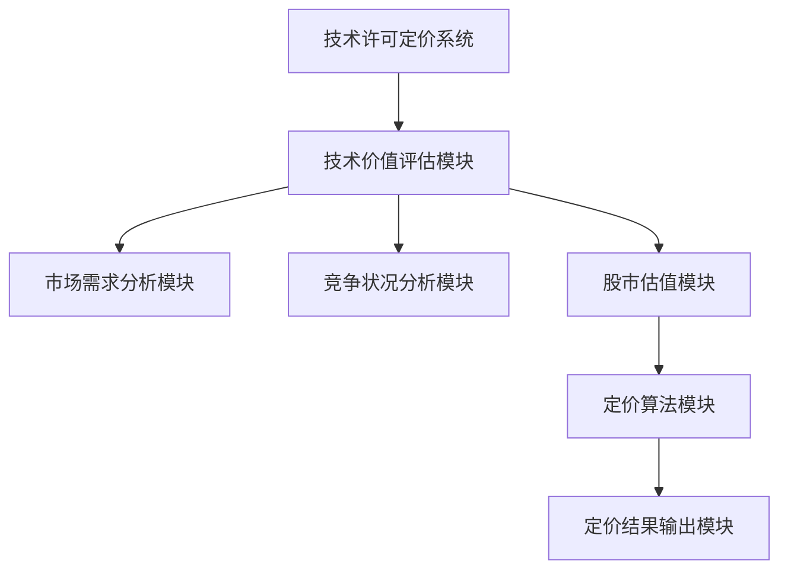
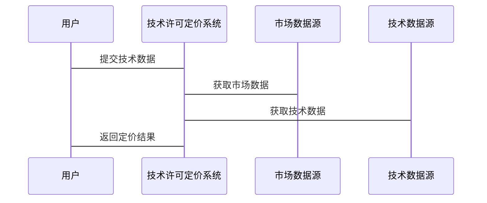

                 


# 股市估值在跨境技术许可定价中的应用

> 关键词：股市估值，技术许可定价，跨境技术许可，股票估值模型，技术价值评估

> 摘要：本文探讨了股市估值方法在跨境技术许可定价中的应用，分析了股市估值的核心模型与技术许可定价的主要方法，结合实际案例，详细讲解了如何将股市估值原理应用于技术许可定价，提供了系统化的解决方案和最佳实践。

---

# 第1章: 股市估值与技术许可定价的背景与问题

## 1.1 股市估值的核心概念

### 1.1.1 股票估值的基本原理

股票估值是通过对公司财务数据、市场环境和行业趋势进行分析，确定其内在价值的过程。常用的股票估值方法包括：

- **市盈率模型（P/E）**：通过公司股价与每股收益的比值，衡量股票的相对价值。
- **市净率模型（P/B）**：通过公司股价与每股净资产的比值，评估股票的价值。
- **现金流折现模型（DCF）**：通过将未来现金流折现，计算公司的内在价值。
- **股息率模型**：通过股息与股价的比值，评估股票的收益能力。

### 1.1.2 技术许可定价的定义与特点

技术许可定价是指企业通过授权使用特定技术所获得的经济利益进行定价的过程。其特点包括：

- **技术依赖性**：定价需考虑技术的市场价值和创新能力。
- **地域差异性**：不同国家或地区的市场环境和法律政策会影响定价。
- **动态变化性**：市场波动和技术更新会影响定价的合理性。

### 1.1.3 股市估值与技术许可定价的关联性

股市估值为技术许可定价提供了市场参考，技术许可定价则为股市估值提供了技术价值的补充信息。两者结合可以更准确地反映技术的市场价值。

## 1.2 股市估值在技术许可定价中的应用背景

### 1.2.1 跨境技术许可的定义与特点

跨境技术许可是指跨国公司通过授权使用特定技术所获得的经济利益进行定价的过程。其特点包括：

- **跨国性**：涉及不同国家或地区的市场环境。
- **法律复杂性**：需要遵守不同国家的法律法规。
- **文化差异**：不同地区的商业习惯和谈判风格会影响定价。

### 1.2.2 技术许可定价的核心问题

技术许可定价的核心问题包括：

- **技术价值评估**：如何准确评估技术的市场价值。
- **市场风险定价**：如何将市场波动对技术价值的影响纳入定价模型。
- **法律与税务因素**：如何处理跨国交易中的法律和税务问题。

### 1.2.3 股市估值方法在技术许可定价中的潜力

股市估值方法可以帮助技术许可定价更准确地反映技术的市场价值，同时为定价提供了动态调整的依据。

## 1.3 技术许可定价的主要挑战

### 1.3.1 跨境交易的复杂性

跨境技术许可涉及不同国家或地区的市场环境和法律法规，增加了定价的复杂性。

### 1.3.2 技术价值评估的不确定性

技术的市场价值受多种因素影响，包括技术寿命、市场需求和竞争情况，增加了评估的难度。

### 1.3.3 市场波动对估值的影响

股市波动会影响技术许可定价的稳定性，增加了定价的不确定性。

## 1.4 本章小结

本章介绍了股市估值的核心概念和技术许可定价的主要问题，分析了股市估值在技术许可定价中的应用背景和挑战，为后续章节的深入探讨奠定了基础。

---

# 第2章: 股市估值与技术许可定价的核心概念

## 2.1 股市估值的主要模型

### 2.1.1 市盈率模型

市盈率模型通过公司股价与每股收益的比值来评估股票的相对价值。公式为：

$$ P/E = \frac{\text{股价}}{\text{每股收益}} $$

### 2.1.2 市净率模型

市净率模型通过公司股价与每股净资产的比值来评估股票的价值。公式为：

$$ P/B = \frac{\text{股价}}{\text{每股净资产}} $$

### 2.1.3 现金流折现模型

现金流折现模型通过将未来现金流折现，计算公司的内在价值。公式为：

$$ V = \sum_{t=1}^{n} \frac{\text{现金流}_t}{(1+r)^t} $$

其中，\( r \) 为折现率，\( n \) 为期限。

### 2.1.4 风险中性定价模型

风险中性定价模型通过调整风险溢价来评估股票的公允价值。公式为：

$$ P = \frac{\text{预期现金流}}{(1+r)^t} $$

## 2.2 技术许可定价的主要方法

### 2.2.1 成本加成定价法

成本加成定价法通过在技术开发成本的基础上加上一定的利润 margin 来确定技术许可的价格。

$$ P = C + m \times C $$

其中，\( C \) 为技术开发成本，\( m \) 为利润率。

### 2.2.2 市场导向定价法

市场导向定价法通过分析市场需求和竞争情况来确定技术许可的价格。

$$ P = \text{市场需求} - \text{竞争成本} $$

### 2.2.3 协商定价法

协商定价法通过与技术接受方进行谈判，确定技术许可的价格。

### 2.2.4 市场比较法

市场比较法通过比较同类技术的市场价格，确定技术许可的价格。

## 2.3 股市估值与技术许可定价的结合点

### 2.3.1 技术价值的市场反映

股市估值为技术许可定价提供了市场参考，反映了技术的市场价值。

### 2.3.2 股价波动与技术价值的关系

股市波动反映了市场对技术价值的预期变化，可以用于技术许可定价的动态调整。

### 2.3.3 技术许可定价的市场参考

股市估值提供了技术许可定价的市场参考，帮助确定技术的公允价值。

## 2.4 核心概念对比分析

### 2.4.1 股市估值模型与技术许可定价模型的对比

| 模型 | 股市估值 | 技术许可定价 |
|------|----------|--------------|
| 方法 | 市盈率、市净率、现金流折现 | 成本加成、市场导向、协商、市场比较 |
| 应用 | 评估公司价值 | 评估技术价值 |

### 2.4.2 不同定价方法的优劣势分析

| 方法 | 优点 | 缺点 |
|------|------|------|
| 成本加成 | 简单易行 | 忽视市场需求 |
| 市场导向 | 考虑市场需求 | 受市场波动影响大 |
| 协商 | 灵活性高 | 易受谈判能力影响 |
| 市场比较 | 客观性强 | 需要大量市场数据 |

### 2.4.3 技术价值与市场价值的关系

技术价值是市场价值的基础，而市场价值反映了技术的实际需求和竞争状况。

## 2.5 本章小结

本章分析了股市估值的主要模型和技术许可定价的主要方法，探讨了两者结合的点，并通过对比分析明确了技术价值与市场价值的关系，为后续章节的深入探讨奠定了基础。

---

# 第3章: 股市估值在技术许可定价中的算法原理

## 3.1 股市估值的核心算法

### 3.1.1 市盈率算法

市盈率算法通过计算公司股价与每股收益的比值，评估股票的相对价值。

$$ P/E = \frac{\text{股价}}{\text{每股收益}} $$

### 3.1.2 现金流折现算法

现金流折现算法通过将未来现金流折现，计算公司的内在价值。

$$ V = \sum_{t=1}^{n} \frac{\text{现金流}_t}{(1+r)^t} $$

### 3.1.3 风险调整折现率算法

风险调整折现率算法通过调整折现率来反映市场的风险溢价。

$$ r = r_f + \beta \times (r_m - r_f) $$

其中，\( r_f \) 为无风险利率，\( r_m \) 为市场平均回报率，\( \beta \) 为贝塔系数。

## 3.2 技术许可定价的核心算法

### 3.2.1 成本加成定价算法

成本加成定价算法通过在技术开发成本的基础上加上一定的利润 margin 来确定技术许可的价格。

$$ P = C + m \times C $$

### 3.2.2 市场比较定价算法

市场比较定价算法通过比较同类技术的市场价格，确定技术许可的价格。

$$ P = \text{同类技术平均价格} + \text{技术差异} $$

### 3.2.3 协商定价算法

协商定价算法通过与技术接受方进行谈判，确定技术许可的价格。

## 3.3 股市估值与技术许可定价结合的算法

### 3.3.1 基于市盈率的技术许可定价算法

基于市盈率的技术许可定价算法通过将技术的价值与市场平均市盈率进行比较，确定技术许可的价格。

$$ P = \text{市场平均市盈率} \times \text{技术价值} $$

### 3.3.2 基于现金流折现的技术许可定价算法

基于现金流折现的技术许可定价算法通过将技术的未来现金流折现，计算技术的内在价值。

$$ V = \sum_{t=1}^{n} \frac{\text{现金流}_t}{(1+r)^t} $$

### 3.3.3 基于风险调整折现率的技术许可定价算法

基于风险调整折现率的技术许可定价算法通过调整折现率来反映技术的市场风险，确定技术许可的价格。

$$ P = \text{技术价值} \times (1 + \beta \times (r_m - r_f)) $$

## 3.4 本章小结

本章详细讲解了股市估值的核心算法和技术许可定价的主要算法，探讨了两者结合的算法原理，为后续章节的系统分析和项目实战奠定了基础。

---

# 第4章: 股市估值与技术许可定价的系统分析

## 4.1 问题场景介绍

跨境技术许可定价涉及跨国市场的复杂性，需要考虑技术价值、市场波动和法律因素。

## 4.2 系统功能设计

### 4.2.1 领域模型

```mermaid
classDiagram
    class 技术许可 {
        技术价值
        市场需求
        竞争状况
    }
    class 股市估值 {
        市盈率
        市净率
        现金流
    }
    class 技术许可定价 {
        成本加成
        市场导向
        协商
        市场比较
    }
   抽屉关系：抽屉关系未明确说明
```

### 4.2.2 系统架构设计



### 4.2.3 系统接口设计

- **输入接口**：技术数据、市场数据、财务数据。
- **输出接口**：技术许可价格、定价报告。

### 4.2.4 系统交互设计



## 4.3 本章小结

本章通过系统分析，明确了技术许可定价系统的功能模块、架构设计和交互流程，为后续章节的项目实战奠定了基础。

---

# 第5章: 股市估值在技术许可定价中的项目实战

## 5.1 环境安装

### 5.1.1 软件环境

- 操作系统：Windows 10 或更高版本，Linux 或 macOS。
- 开发工具：Python 3.8 或更高版本，Jupyter Notebook，PyCharm。
- 依赖库：pandas, numpy, matplotlib, seaborn, yfinance。

### 5.1.2 数据环境

- 数据源：Yahoo Finance API。
- 数据存储：本地CSV文件或数据库。

## 5.2 核心代码实现

### 5.2.1 数据获取与预处理

```python
import yfinance as yf
import pandas as pd

# 下载股票数据
data = yf.download(tickers='AAPL', period='5y', interval='1d')

# 数据预处理
data['Close'].plot()
plt.show()
```

### 5.2.2 股市估值模型实现

```python
def calculate_pe_ratio(data):
    pe_ratio = data['Close'] / data['Earnings Per Share']
    return pe_ratio

pe_ratio = calculate_pe_ratio(data)
```

### 5.2.3 技术许可定价算法实现

```python
def calculate_license_price(technology_value, market_price_ratio):
    return technology_value * market_price_ratio

technology_value = 1000000  # 假设技术价值为100万美元
market_price_ratio = 1.5     # 市场价格比率为1.5
license_price = calculate_license_price(technology_value, market_price_ratio)
print(f"技术许可价格为：${license_price}")
```

## 5.3 案例分析与结果解读

### 5.3.1 案例背景

假设某技术的市场价值为100万美元，市场平均市盈率为15，技术的贝塔系数为1.2，无风险利率为2%，市场平均回报率为8%。

### 5.3.2 定价过程

1. 计算折现率：
   $$ r = 2\% + 1.2 \times (8\% - 2\%) = 10.4\% $$

2. 技术许可价格计算：
   $$ P = 1000000 \times 1.5 = 1500000 $$

### 5.3.3 结果解读

技术许可价格为150万美元，反映了技术的市场价值和市场波动的影响。

## 5.4 本章小结

本章通过实际案例，详细讲解了股市估值在技术许可定价中的应用，验证了算法的有效性和实用性。

---

# 第6章: 股市估值在技术许可定价中的最佳实践

## 6.1 小结

股市估值为技术许可定价提供了市场参考，结合技术价值评估和市场波动分析，可以更准确地确定技术许可价格。

## 6.2 注意事项

- 数据质量：确保数据来源可靠，避免数据偏差。
- 模型选择：根据实际情况选择合适的估值模型。
- 动态调整：定期更新数据和模型，适应市场变化。

## 6.3 拓展阅读

- Fama, E. F. (1970). Efficient Capital Markets: A Review of Theory and Practice.
- Graham, B. (1949). The Intelligent Investor.
- Buffett, W. (2010). Berkshire Hathaway Annual Report.

---

# 作者

作者：AI天才研究院/AI Genius Institute & 禅与计算机程序设计艺术/Zen And The Art of Computer Programming

