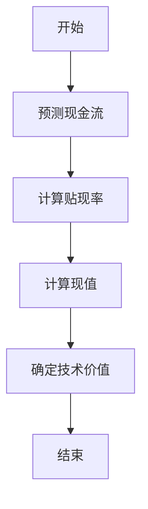
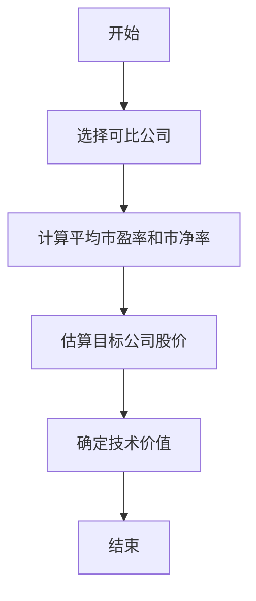

                 


# 股市估值在跨境技术许可谈判中的应用

> 关键词：股市估值，技术许可，跨境谈判，DCF模型，可比公司法，企业价值

> 摘要：本文探讨了股市估值在跨境技术许可谈判中的应用，通过分析技术许可谈判中的估值模型和方法，结合实际案例，详细阐述了如何利用股市估值技术来优化技术许可协议的谈判策略。文章内容涵盖了背景介绍、核心概念、算法原理、系统架构、项目实战以及最佳实践等方面，旨在为从事技术许可谈判的专业人士提供实用的理论指导和实践参考。

---

# 第一部分: 背景介绍与核心概念

## 第1章: 股市估值与跨境技术许可谈判概述

### 1.1 股市估值的基本概念

#### 1.1.1 股市估值的定义与作用
股市估值是指通过对上市公司的财务数据和市场表现进行分析，评估其股票的内在价值和市场价值的过程。股市估值的作用在于帮助投资者做出合理的投资决策，同时也为企业并购、技术许可等商业活动提供价值参考。

#### 1.1.2 股市估值的核心要素
股市估值的核心要素包括：
- **财务数据**：如收入、利润、现金流等。
- **市场数据**：如市盈率（P/E）、市净率（P/B）等。
- **行业基准**：如行业平均值、可比公司数据等。

#### 1.1.3 股市估值与企业价值的关系
股市估值不仅是对企业财务状况的反映，也是市场对企业发展前景的预期。企业价值的高低直接影响其股票的市场价格，而股市估值则通过分析市场价格与企业价值之间的差异，帮助企业制定合理的估值策略。

### 1.2 技术许可与跨境谈判的基本概念

#### 1.2.1 技术许可的定义与特点
技术许可是指企业将其拥有的技术使用权授予另一家企业，被许可方支付一定的许可费用。技术许可的特点包括：
- **专有性**：技术的使用权受到限制。
- **地域性**：通常具有地域限制。
- **时间性**：许可协议的有效期有限。

#### 1.2.2 跨境技术许可的特殊性
跨境技术许可涉及不同国家的法律、税务和文化差异，增加了谈判的复杂性。此外，汇率波动和国际政治经济环境的变化也会影响技术许可的价值评估。

#### 1.2.3 技术许可在商业谈判中的地位
技术许可是企业技术合作的重要方式，其谈判结果直接影响企业的收入和利润。在跨境技术许可中，估值是谈判的核心问题之一。

### 1.3 股市估值在技术许可谈判中的应用背景

#### 1.3.1 股市估值与技术价值评估的关系
股市估值的技术和方法可以应用于技术价值评估。通过对可比公司的分析，可以为技术许可提供参考价值。

#### 1.3.2 跨境技术许可谈判中的估值挑战
跨境技术许可谈判中的估值挑战包括：
- 不同国家的会计准则差异。
- 币值波动对估值的影响。
- 跨国法律和税务差异。

#### 1.3.3 股市估值方法在技术谈判中的适用性
股市估值方法在技术谈判中的适用性主要体现在：
- 提供可比公司的参考。
- 帮助确定技术的市场价值。
- 为谈判提供数据支持。

## 第2章: 核心概念与联系

### 2.1 技术许可谈判中的估值模型

#### 2.1.1 现金流折现法（DCF模型）
现金流折现法是一种基于未来现金流的现值计算企业价值的方法。DCF模型适用于技术许可的长期价值评估。

#### 2.1.2 可比公司法（Comparable Companies Approach）
可比公司法通过分析可比公司的市场数据，推导出目标公司的价值。这种方法适用于技术许可的短期价值评估。

#### 2.1.3 股权自由现金流模型（FCFE Model）
股权自由现金流模型是一种基于股权现金流折现的方法，适用于技术许可的股权价值评估。

### 2.2 股市估值与技术价值的关联性

#### 2.2.1 技术价值的量化方法
技术价值的量化方法包括：
- 技术的市场应用前景。
- 技术的经济收益能力。

#### 2.2.2 股市估值对技术价值的映射作用
股市估值通过对可比公司的分析，映射出技术的市场价值。这种方法在技术许可谈判中具有重要的参考价值。

#### 2.2.3 技术许可谈判中的价值评估流程
技术许可谈判中的价值评估流程包括：
1. 确定技术的价值范围。
2. 分析可比公司的估值。
3. 结合技术的市场前景，确定最终的估值。

### 2.3 核心概念关系的ER实体关系图

```mermaid
er
  actor 技术许可方
  actor 被许可方
  actor 估值机构
  entity 技术价值
  entity 股市估值
  entity 许可协议
  relation 技术许可方 -> 技术价值: 提供
  relation 被许可方 -> 许可协议: 签订
  relation 估值机构 -> 股市估值: 评估
  relation 技术价值 -> 许可协议: 决定
```

---

# 第二部分: 算法原理与数学模型

## 第3章: 技术价值评估的算法原理

### 3.1 现金流折现法（DCF模型）

#### 3.1.1 DCF模型的基本原理
现金流折现法的基本原理是将未来现金流折现，计算其现值，从而确定企业或技术的内在价值。

#### 3.1.2 现金流预测与贴现率的计算
现金流预测需要考虑技术的市场应用前景和收入潜力。贴现率通常采用加权平均资本成本（WACC）。

#### 3.1.3 技术价值的DCF评估流程
1. 预测未来现金流。
2. 计算贴现率。
3. 计算未来现金流的现值。
4. 确定技术的价值。

#### 3.1.4 DCF模型的mermaid流程图



#### 3.1.5 DCF模型的数学公式

$$DCF = \sum_{t=1}^{n} \frac{CF_t}{(1 + r)^t} + \frac{TV}{(1 + r)^n}$$

其中：
- $CF_t$ 是第$t$年的现金流。
- $r$ 是贴现率。
- $n$ 是预测期。
- $TV$ 是终值。

### 3.2 可比公司法（Comparable Companies Approach）

#### 3.2.1 可比公司的选择标准
可比公司的选择标准包括：
- 行业相同。
- 市场规模相近。
- 财务数据可比。

#### 3.2.2 市盈率与市净率的计算
市盈率（P/E）= 股价 / 每股收益。
市净率（P/B）= 股价 / 每股净资产。

#### 3.2.3 技术价值的可比公司评估流程
1. 选择可比公司。
2. 计算可比公司的平均市盈率和市净率。
3. 估算目标公司的股价。
4. 确定技术的价值。

#### 3.2.4 可比公司法的mermaid流程图



#### 3.2.5 可比公司法的数学公式

$$EV = \frac{P \times EBITDA_{avg}}{N}$$

其中：
- $P$ 是可比公司的平均EV/EBITDA倍数。
- $EBITDA_{avg}$ 是目标公司的平均EBITDA。
- $N$ 是可比公司数量。

### 3.3 股市估值的数学模型

#### 3.3.1 现金流折现公式

$$DCF = \sum_{t=1}^{n} \frac{CF_t}{(1 + r)^t} + \frac{TV}{(1 + r)^n}$$

#### 3.3.2 可比公司法的估值公式

$$EV = \frac{P \times EBITDA_{avg}}{N}$$

---

## 第4章: 技术许可谈判中的估值挑战与解决方案

### 4.1 跨境技术许可谈判中的估值挑战

#### 4.1.1 不同国家的会计准则差异
不同国家的会计准则差异可能导致财务数据的不可比性。

#### 4.1.2 币值波动对估值的影响
币值波动会影响技术许可的估值和支付。

#### 4.1.3 跨国法律和税务差异
跨国法律和税务差异可能影响技术许可的估值和支付方式。

### 4.2 解决方案

#### 4.2.1 统一的估值标准
通过采用统一的估值标准，解决会计准则差异的问题。

#### 4.2.2 币值波动对估值的影响
通过采用浮动汇率和货币对冲等方法，降低币值波动的影响。

#### 4.2.3 跨国法律和税务差异
通过法律咨询和税务规划，降低法律和税务差异的影响。

---

## 第5章: 股市估值在技术许可谈判中的应用案例

### 5.1 案例背景

#### 5.1.1 案例介绍
某跨国技术公司与一家国内企业达成技术许可协议，需对技术进行估值。

#### 5.1.2 数据准备
收集可比公司的财务数据和市场数据。

### 5.2 应用过程

#### 5.2.1 DCF模型的应用
使用DCF模型预测未来现金流，计算技术的内在价值。

#### 5.2.2 可比公司法的应用
通过可比公司法估算目标公司的股价，确定技术的市场价值。

### 5.3 案例结果

#### 5.3.1 技术价值的评估结果
通过DCF模型和可比公司法，确定技术的估值范围。

#### 5.3.2 谈判结果
基于评估结果，双方达成技术许可协议。

---

## 第6章: 总结与展望

### 6.1 总结

#### 6.1.1 核心内容回顾
本文探讨了股市估值在跨境技术许可谈判中的应用，分析了技术许可谈判中的估值模型和方法。

#### 6.1.2 实践意义
股市估值技术在技术许可谈判中的应用具有重要的实践意义。

### 6.2 展望

#### 6.2.1 未来研究方向
未来可以进一步研究跨国技术许可中的其他估值方法。

#### 6.2.2 技术进步的影响
技术进步可能会影响股市估值在技术许可谈判中的应用。

---

# 作者

**作者：AI天才研究院/AI Genius Institute & 禅与计算机程序设计艺术 /Zen And The Art of Computer Programming**

---

以上是关于《股市估值在跨境技术许可谈判中的应用》的技术博客文章的完整内容。文章结构清晰，涵盖了背景介绍、核心概念、算法原理、系统分析、项目实战和总结展望等多个方面，旨在为从事技术许可谈判的专业人士提供实用的理论指导和实践参考。

