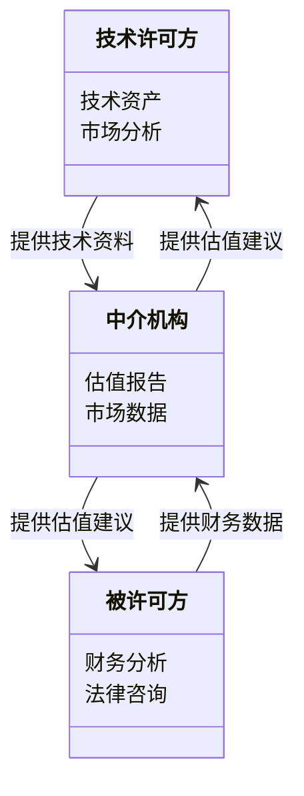

                 


# 股市估值在跨境技术许可谈判策略中的应用

> **关键词**：股市估值、技术许可、谈判策略、跨境交易、知识产权、估值模型

> **摘要**：  
本文探讨了股市估值在跨境技术许可谈判中的应用策略。通过分析股市估值的核心理论与技术许可谈判的特点，结合实际案例，提出了一种基于股市估值的谈判框架，帮助读者理解如何在跨境技术许可谈判中有效应用估值方法，提升谈判效率与成果。

---

## 第1章：背景与概述

### 1.1 股市估值的基本概念

#### 1.1.1 股市估值的定义与作用
股市估值是通过对公司财务数据和市场表现的分析，评估公司股票的内在价值，以指导投资者的买卖决策。其作用在于帮助投资者确定股票的合理价格区间，避免因市场波动而产生非理性决策。

#### 1.1.2 技术许可在现代经济中的地位
技术许可是企业间通过协议分享技术使用权的一种合作方式。在现代经济中，技术许可已成为跨国企业拓展市场、获取技术资源的重要手段，尤其在高科技行业，技术许可的价值往往占据企业资产的重要部分。

### 1.2 跨境技术许可的基本情况

#### 1.2.1 跨境技术许可的定义与特点
跨境技术许可是指跨国公司之间通过协议，授权使用特定技术的许可方。其特点包括跨国性、法律复杂性和文化差异性，这些因素增加了谈判的难度。

#### 1.2.2 跨境技术许可的常见模式
常见的模式包括独占许可、排他许可和普通许可，每种模式在权利授予和限制上有不同的特点。

### 1.3 股市估值在技术许可中的应用前景

#### 1.3.1 技术许可谈判中的估值挑战
技术许可的估值涉及技术的市场潜力、法律风险和经济因素，这些因素使得估值过程复杂。

#### 1.3.2 股市估值方法的优势与局限性
股市估值方法提供了量化工具，但其结果受市场波动影响，可能存在局限性。

---

## 第2章：股市估值的核心理论

### 2.1 市盈率与市净率模型

#### 2.1.1 市盈率的计算与应用
市盈率（P/E）= 股价 / 每股净利润。该指标反映了市场对公司的盈利预期，常用于评估股票的高估或低估。

#### 2.1.2 市净率的计算与应用
市净率（P/B）= 股价 / 每股净资产。适用于评估资产密集型企业的价值。

### 2.2 现金流折现模型

#### 2.2.1 FCFF与DDM模型的原理
FCFF模型通过自由现金流折现计算企业价值，适用于评估技术公司的未来收益。

#### 2.2.2 WACC的计算与应用
WACC是加权平均资本成本，用于折现现金流，计算企业价值。

---

## 第3章：技术许可谈判的估值方法

### 3.1 技术价值评估模型

#### 3.1.1 技术的市场潜力分析
通过市场分析确定技术的潜在收益，评估其在许可中的价值。

#### 3.1.2 技术的生命周期评估
技术处于成长期时，其估值可能更高，而衰退期的技术估值可能较低。

### 3.2 谈判中的估值策略

#### 3.2.1 谈判双方的估值分歧
技术许可方可能高估技术价值，而被许可方可能低估，导致谈判困难。

#### 3.2.2 达成共识的策略与技巧
通过提供数据支持和市场分析，双方可找到估值的平衡点。

---

## 第4章：跨境环境下的估值挑战

### 4.1 跨境市场的特点

#### 4.1.1 市场差异对估值的影响
不同市场的经济状况和消费者行为会影响技术许可的估值。

#### 4.1.2 货币与汇率风险
汇率波动直接影响跨国公司的收益，需在估值中考虑。

### 4.2 跨境技术许可中的法律与税务因素

#### 4.2.1 知识产权的跨国保护
技术许可需考虑知识产权的跨国保护，确保技术安全。

#### 4.2.2 税务规划对估值的影响
合理的税务规划可降低许可方的税务负担，影响整体估值。

---

## 第5章：结合股市估值的谈判策略

### 5.1 股市估值在谈判中的应用步骤

#### 5.1.1 确定关键影响因素
分析市场、技术和法律因素，确定影响估值的关键点。

#### 5.1.2 构建估值模型
根据关键因素，构建适合的估值模型，计算技术许可的合理价格。

### 5.2 实例分析：某技术许可谈判中的估值应用

#### 5.2.1 背景与目标
某跨国公司欲授权一项专利技术，需评估其市场价值。

#### 5.2.2 估值过程与结果
通过现金流折现模型，计算出技术的合理估值范围，最终达成协议。

---

## 第6章：系统分析与架构设计

### 6.1 系统分析

#### 6.1.1 问题场景介绍
跨境技术许可谈判涉及多方面的因素，需构建系统进行分析。

#### 6.1.2 领域模型Mermaid类图


### 6.2 系统架构设计

#### 6.2.1 系统架构Mermaid架构图


#### 6.2.2 关键模块说明
- **数据源**：提供市场和财务数据。
- **计算引擎**：运行估值算法，计算技术许可的合理价格。
- **报告生成器**：生成详细的估值报告，供谈判参考。

---

## 第7章：项目实战

### 7.1 环境安装与工具准备

#### 7.1.1 开发环境配置
安装Python和相关库，如Pandas、NumPy。

#### 7.1.2 必要工具安装
安装Jupyter Notebook用于数据处理和分析。

### 7.2 核心实现

#### 7.2.1 估值模型的代码实现
```python
import pandas as pd
import numpy as np

# 示例数据
data = {
    '收入': [100, 200, 300, 400],
    '净利润': [20, 40, 60, 80],
    '市盈率': [15, 10, 12, 14]
}
df = pd.DataFrame(data)

# 计算市盈率
df['合理股价'] = df['净利润'] * df['市盈率']
print(df)
```

#### 7.2.2 谈判策略的模拟实现
```python
def calculate_valuation(FCFF, WACC):
    return FCFF / (1 - 1 / (1 + WACC))

FCFF = 1000000
WACC = 0.1
valuation = calculate_valuation(FCFF, WACC)
print(f"技术估值为：${valuation:.2f}")
```

### 7.3 实际案例分析

#### 7.3.1 案例背景
某跨国公司授权一项专利技术，年收入1000万美元，净利润率10%。

#### 7.3.2 数据分析与估值
使用现金流折现模型计算技术的合理估值，确定许可费用。

### 7.4 代码应用解读与分析
通过代码实现估值模型，分析技术的市场潜力和法律风险，为谈判提供数据支持。

---

## 第8章：结论与展望

### 8.1 小结
股市估值在跨境技术许可谈判中具有重要作用，通过合理的估值方法和系统分析，可以提升谈判效率。

### 8.2 最佳实践 tips
- 采用多种估值方法，确保结果的准确性。
- 考虑法律和税务因素，降低谈判风险。
- 使用系统工具辅助分析，提高效率。

### 8.3 注意事项
- 确保数据的准确性和完整性。
- 考虑汇率和市场波动的影响。
- 及时更新估值模型，适应市场变化。

### 8.4 拓展阅读
推荐相关书籍和论文，进一步学习估值方法和谈判策略。

---

## 作者：AI天才研究院/AI Genius Institute & 禅与计算机程序设计艺术 /Zen And The Art of Computer Programming

---

本文通过详细分析股市估值在跨境技术许可谈判中的应用，为读者提供了理论与实践相结合的指导，帮助他们在复杂的谈判中做出明智的决策。

