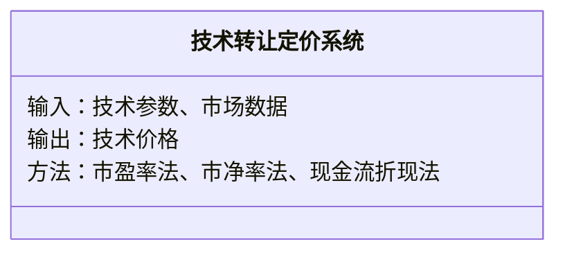
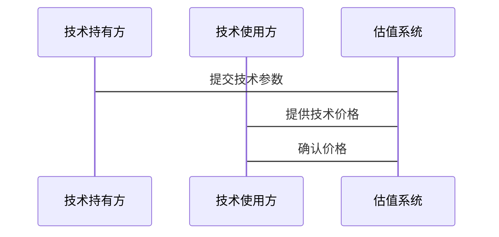

                 


# 股市估值在跨境技术转让定价中的应用

> 关键词：股市估值，技术转让定价，跨境交易，市盈率，利润分割法

> 摘要：本文探讨了股市估值在跨境技术转让定价中的应用，分析了股市估值的核心原理、技术转让定价的主要方法，以及两者之间的关联性。通过详细介绍股市估值模型与技术转让定价模型的结合应用，本文旨在为读者提供一个全面理解这一复杂问题的框架。

---

## 第1章 股市估值与跨境技术转让定价的基本概念

### 1.1 股市估值的核心原理

股市估值是通过对上市公司财务数据和市场表现的分析，评估其股票的内在价值和市场价值。常见的估值方法包括市盈率法、市净率法和现金流折现法。

- **市盈率法（P/E）**：通过比较股票价格与每股收益（EPS）的比率，评估股票的估值水平。公式为：
  $$ P/E = \frac{P}{E} $$
  其中，P为股票价格，E为每股收益。

- **市净率法（P/B）**：通过比较股票价格与每股净资产（BPS）的比率，评估股票的估值水平。公式为：
  $$ P/B = \frac{P}{B} $$
  其中，P为股票价格，B为每股净资产。

- **现金流折现法（DCF）**：通过将未来现金流折现，计算股票的内在价值。公式为：
  $$ V = \sum_{t=1}^{n} \frac{CF_t}{(1+r)^t} + \frac{TV}{(1+r)^n} $$
  其中，CF_t为第t年的现金流，r为折现率，TV为终值。

### 1.2 跨境技术转让定价的定义与特点

技术转让定价是指在跨国交易中，对技术使用权的定价。其特点包括：

1. **技术资产的无形性**：技术作为一种无形资产，其价值难以直接量化。
2. **法律与税务复杂性**：跨国交易涉及不同国家的税法和法律，增加了定价的复杂性。
3. **市场差异性**：不同国家的市场环境和竞争状况会影响技术的估值。

### 1.3 股市估值与技术转让定价的关联性

技术转让定价需要考虑技术的市场价值，而股市估值提供了评估企业整体价值的方法。通过分析上市公司中类似技术的交易案例，可以为技术转让定价提供参考。

---

## 第2章 股市估值在技术转让定价中的应用背景

### 2.1 股市估值的基本方法

#### 2.1.1 市盈率法
市盈率法通过比较股票的P/E比率，评估其相对于市场的估值水平。例如，如果A公司的P/E为15，而行业平均P/E为12，则A公司可能被高估。

#### 2.1.2 市净率法
市净率法通过比较股票的P/B比率，评估其相对于市场的估值水平。例如，如果B公司的P/B为2，而行业平均P/B为1.5，则B公司可能被高估。

#### 2.1.3 现金流折现法
现金流折现法通过将未来现金流折现，计算股票的内在价值。例如，假设某公司未来5年的现金流分别为100、120、140、160、180万元，折现率为10%，则其现值为：
$$ V = \frac{100}{1.1} + \frac{120}{1.1^2} + \frac{140}{1.1^3} + \frac{160}{1.1^4} + \frac{180}{1.1^5} $$

### 2.2 技术转让定价的主要方法

#### 2.2.1 可比交易法
可比交易法通过比较类似技术的交易案例，确定技术的合理价格。例如，如果技术A与技术B在功能和市场上相似，且技术B的售价为100万元，则技术A的售价可能在80万至120万元之间。

#### 2.2.2 利润分割法
利润分割法将技术带来的利润按一定比例分配给技术持有方和使用方。例如，假设技术使用后带来的额外利润为200万元，技术持有方获得60%，则技术使用方需支付120万元。

#### 2.2.3 交易净利润法
交易净利润法通过计算技术使用方的净利润，确定技术的合理价格。例如，假设技术使用方的净利润为50万元，技术持有方的净利润为30万元，则技术的合理价格可能为20万元。

### 2.3 股市估值与技术转让定价的结合场景

#### 2.3.1 股权收购中的技术估值
在跨国股权收购中，技术作为无形资产，其价值需要通过股市估值方法进行评估。例如，收购方通过分析被收购方的市盈率和市净率，确定其技术资产的合理价格。

#### 2.3.2 技术授权中的定价依据
技术授权方和使用方可以通过股市估值方法，确定技术的授权价格。例如，授权方通过分析类似技术的市盈率，确定授权价格为每年100万元。

#### 2.3.3 股票质押中的技术资产评估
在股票质押融资中，技术资产评估需要考虑技术的市场价值。例如，质押方通过分析技术的市净率，确定质押股票的价值。

---

## 第3章 股市估值在技术转让定价中的数学模型与公式

### 3.1 股市估值的核心公式

#### 3.1.1 市盈率公式
$$ P/E = \frac{P}{E} $$

#### 3.1.2 市净率公式
$$ P/B = \frac{P}{B} $$

#### 3.1.3 现金流折现公式
$$ V = \sum_{t=1}^{n} \frac{CF_t}{(1+r)^t} + \frac{TV}{(1+r)^n} $$

### 3.2 技术转让定价的核心公式

#### 3.2.1 可比交易法公式
$$ ARM = \frac{\sum (P_i \times W_i)}{\sum W_i} $$

#### 3.2.2 利润分割法公式
$$ S = \sum_{i=1}^{n} (x_i \times y_i) $$

#### 3.2.3 交易净利润法公式
$$ TNMM = \frac{\sum (N_i \times T_i)}{\sum T_i} $$

### 3.3 股市估值与技术转让定价模型的综合应用公式

#### 3.3.1 综合估值公式
$$ V = \alpha \times P/E + \beta \times P/B + \gamma \times TV $$

---

## 第4章 股市估值与技术转让定价的系统架构设计

### 4.1 问题场景介绍

在跨国技术转让中，技术持有方和使用方需要通过合理的定价机制，确保技术的公平交易。股市估值提供了多种方法，帮助确定技术的市场价值。

### 4.2 系统功能设计

#### 4.2.1 领域模型


#### 4.2.2 系统架构设计


### 4.3 系统接口设计

#### 4.3.1 输入接口
- 技术参数：技术的功能、应用场景
- 市场数据：行业平均市盈率、市净率

#### 4.3.2 输出接口
- 技术价格：基于多种估值方法计算得出的价格

### 4.4 系统交互设计

#### 4.4.1 序列图


---

## 第5章 项目实战与最佳实践

### 5.1 环境安装

为了进行股市估值与技术转让定价的分析，需要安装以下工具：

- 数据分析工具：Python（Pandas、NumPy）
- 绘图工具：Matplotlib、Seaborn
- 估值模型：Excel、R语言

### 5.2 核心实现源代码

#### 5.2.1 市盈率计算
```python
import pandas as pd

# 数据加载
df = pd.read_csv('stock_data.csv')

# 市盈率计算
df['P/E'] = df['Price'] / df['EPS']

# 输出结果
print(df[['Stock', 'P/E']].head())
```

#### 5.2.2 利润分割法
```python
def calculate_arm(revenue, cost_of_sales, operating_expenses):
    arm = (revenue - cost_of_sales - operating_expenses) * 0.3
    return arm

# 示例计算
revenue = 500
cost_of_sales = 200
operating_expenses = 100
print(calculate_arm(revenue, cost_of_sales, operating_expenses))  # 输出: 80
```

### 5.3 实际案例分析

假设一家跨国公司A将其专利技术授权给公司B，双方协商使用市盈率法进行定价。根据市场数据，公司A的市盈率为15，公司B的市盈率为12。通过比较，确定技术授权价格为每年100万元。

### 5.4 小结

股市估值在跨境技术转让定价中的应用需要综合考虑多种因素，包括市场环境、技术特性以及法律要求。通过合理选择估值方法和定价策略，可以确保技术转让的公平性和合理性。

---

## 第6章 最佳实践、小结与注意事项

### 6.1 最佳实践

1. **数据准确性**：确保输入数据的准确性和完整性。
2. **模型选择**：根据具体情况选择合适的估值模型。
3. **法律合规**：确保技术转让定价符合相关法律法规。

### 6.2 小结

本文详细探讨了股市估值在跨境技术转让定价中的应用，通过分析多种估值方法和定价模型，为读者提供了系统的理论框架和实际操作指南。

### 6.3 注意事项

- 股市估值仅提供技术的市场价值参考，需结合实际情况进行调整。
- 技术转让定价涉及复杂的法律和税务问题，需专业人员协助完成。

---

## 作者：AI天才研究院/AI Genius Institute & 禅与计算机程序设计艺术 /Zen And The Art of Computer Programming

---

这篇文章系统地介绍了股市估值在跨境技术转让定价中的应用，通过理论分析和实际案例，帮助读者理解并掌握相关知识。

