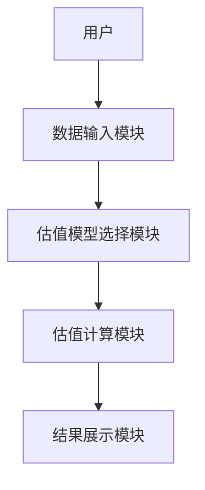

                 


# 股市估值在跨境技术转让谈判中的应用

> 关键词：股市估值、跨境技术转让、谈判策略、DCF模型、市盈率、市净率、技术价值评估

> 摘要：本文探讨了股市估值方法在跨境技术转让谈判中的应用，分析了技术价值评估的关键因素，并结合实际案例，详细讲解了如何利用股市估值模型（如DCF模型、市盈率模型等）进行技术谈判的策略优化。文章从背景、理论、实践等多个维度展开，为读者提供了一套系统的技术谈判估值方法。

---

# 第1章: 股市估值与跨境技术转让谈判概述

## 1.1 股市估值的核心概念

### 1.1.1 股市估值的基本原理
股市估值是指通过分析企业的财务数据、市场表现和行业趋势，对其内在价值进行评估的过程。核心在于将企业的未来现金流折现，以确定其当前的合理股价。常用的方法包括：
1. **市盈率（P/E）**：股价与每股收益的比值。
2. **市净率（P/B）**：股价与每股净资产的比值。
3. **现金流折现模型（DCF）**：通过预测企业未来现金流并折现，计算其当前价值。
4. **企业价值倍数（EV/EBITDA）**：企业价值与息税折旧及摊销前利润的比值。

### 1.1.2 股市估值与企业价值的关系
企业价值是股市估值的核心，它包括企业的股权价值和债权价值。股市估值通过分析企业财务状况、行业地位和市场前景，帮助企业确定其在公开市场的合理估值范围。

### 1.1.3 技术转让的定义与类型
技术转让是指企业将其拥有的技术、专利或专有知识转移给其他企业或个人，并收取转让费的过程。常见的技术转让类型包括：
1. **专利转让**：将专利权转移给他人。
2. **技术授权**：允许他人使用特定技术或工艺。
3. **技术咨询**：提供技术指导或解决方案。

## 1.2 股市估值在技术转让谈判中的应用背景

### 1.2.1 技术价值评估的重要性
技术的价值往往难以量化，尤其是在跨境谈判中，技术的市场潜力、法律风险和文化差异都会影响其估值。股市估值方法提供了一种客观的评估工具，帮助双方确定技术的合理价格。

### 1.2.2 股市估值方法在技术谈判中的优势
股市估值方法具有以下优势：
1. **数据驱动**：基于企业的财务数据和市场表现，确保估值的客观性。
2. **动态调整**：可以根据市场变化和企业经营状况实时调整估值。
3. **可比性**：通过与同行业企业的对比，快速确定技术的市场价值。

### 1.2.3 股市估值与技术谈判的结合点
在技术谈判中，股市估值主要用于以下方面：
1. **技术价值评估**：通过DCF模型评估技术的未来现金流。
2. **谈判策略制定**：基于估值结果，制定合理的报价和谈判策略。
3. **风险控制**：通过敏感性分析，评估估值的不确定性。

---

# 第2章: 股市估值的核心模型与方法

## 2.1 常用股市估值模型介绍

### 2.1.1 现金流折现模型（DCF）
DCF模型是技术转让谈判中最常用的估值方法。其核心在于预测企业未来现金流，并将其折现为当前价值。公式如下：

$$\text{企业价值} = \sum_{t=1}^{n} \frac{\text{现金流}_t}{(1 + r)^t} + \frac{\text{终值}}{(1 + r)^n}$$

其中，\( r \) 为折现率，\( n \) 为预测期数，\(\text{终值}\)为第n年后的剩余价值。

### 2.1.2 市盈率模型（P/E）
市盈率模型适用于净利润稳定的公司。公式为：

$$\text{合理股价} = \text{市盈率} \times \text{每股收益}$$

### 2.1.3 市净率模型（P/B）
市净率模型适用于净资产占主导地位的公司。公式为：

$$\text{合理股价} = \text{市净率} \times \text{每股净资产}$$

### 2.1.4 企业价值倍数（EV/EBITDA）
企业价值倍数适用于跨行业比较。公式为：

$$\text{企业价值} = \text{EV/EBITDA} \times \text{EBITDA}$$

## 2.2 股市估值模型的优缺点对比

### 2.2.1 各种估值模型的适用场景
- **DCF模型**：适用于现金流稳定、未来增长可预测的企业。
- **市盈率模型**：适用于净利润稳定的公司。
- **市净率模型**：适用于净资产占主导地位的公司。
- **EV/EBITDA模型**：适用于跨行业比较。

### 2.2.2 各种估值模型的优缺点分析
| 模型       | 优点                           | 缺点                           |
|------------|--------------------------------|--------------------------------|
| DCF       | 精度高，考虑未来现金流         | 需准确预测未来现金流           |
| 市盈率     | 易理解，适用于净利润稳定的公司 | 受行业波动影响较大             |
| 市净率     | 稳定性高，适用于净资产主导的公司 | 不考虑收益能力                 |
| EV/EBITDA | 跨行业比较性强                 | 需准确计算EBITDA               |

### 2.2.3 如何选择合适的估值模型
选择估值模型的关键在于企业的特点和谈判的具体需求。例如，对于高增长的技术公司，DCF模型更适合；而对于成熟企业，市盈率或市净率模型可能更合适。

---

# 第3章: 技术转让谈判中的估值挑战与解决方案

## 3.1 技术转让谈判中的估值难点

### 3.1.1 技术价值的主观性与不确定性
技术的价值往往受到市场波动、政策变化和竞争环境的影响，导致估值的不确定性。

### 3.1.2 跨境交易中的法律与税务影响
跨境技术转让需要考虑不同国家的税收政策和法律风险，这些因素会直接影响技术的估值。

### 3.1.3 技术市场波动对企业估值的影响
技术市场的波动性较高，新技术的出现可能迅速改变技术的市场价值。

## 3.2 应用股市估值方法解决技术谈判问题

### 3.2.1 DCF模型在技术估值中的应用
在技术转让谈判中，DCF模型可以用于预测技术的未来现金流。例如，假设某技术的未来5年现金流分别为100万、120万、140万、160万和180万，折现率为10%。计算其现值：

$$
\begin{align*}
\text{现值} &= \frac{100}{1.1} + \frac{120}{1.1^2} + \frac{140}{1.1^3} + \frac{160}{1.1^4} + \frac{180}{1.1^5} \\
&\approx 90.91 + 98.24 + 95.02 + 89.01 + 82.64 \\
&\approx 466.82 \text{万元}
\end{align*}
$$

### 3.2.2 市盈率与市净率模型的适用性分析
在技术转让中，市盈率模型适用于净利润稳定的公司，而市净率模型适用于净资产占主导地位的公司。

### 3.2.3 组合估值方法在技术谈判中的应用
为了降低估值的不确定性，可以结合多种估值模型进行综合评估。例如，同时使用DCF模型和市盈率模型，取其平均值作为最终估值。

## 3.3 技术谈判中的估值调整与优化

### 3.3.1 如何调整估值模型以适应技术谈判需求
根据谈判的具体需求，调整模型的参数。例如，如果技术的市场前景不确定，可以降低折现率。

### 3.3.2 估值结果的敏感性分析与优化
通过敏感性分析，评估模型中关键参数的变化对估值的影响。例如，假设折现率从10%提高到12%，现值会下降约10%。

### 3.3.3 考虑市场风险的估值调整策略
在跨境谈判中，需要考虑汇率波动和政策变化等市场风险，适当调整估值结果。

---

# 第4章: 股市估值模型的数学原理与实现

## 4.1 现金流折现模型（DCF）的数学推导

### 4.1.1 DCF模型的基本假设
DCF模型假设企业的未来现金流可以被准确预测，并且折现率是合理的。

### 4.1.2 自由现金流的计算公式
$$\text{自由现金流} = \text{营业收入} - \text{运营成本} - \text{资本支出}$$

### 4.1.3 折现率的确定方法
折现率通常包括无风险利率和风险溢价。公式为：
$$r = r_f + \text{风险溢价}$$

### 4.1.4 终值的计算与假设
终值假设企业在永续期后的价值，通常使用永续增长率计算。

## 4.2 市盈率与市净率模型的数学分析

### 4.2.1 市盈率模型的数学表达
$$\text{合理股价} = \text{市盈率} \times \text{每股收益}$$

### 4.2.2 市净率模型的数学表达
$$\text{合理股价} = \text{市净率} \times \text{每股净资产}$$

---

# 第5章: 系统分析与架构设计方案

## 5.1 项目介绍
本项目旨在开发一个基于股市估值模型的技术转让谈判支持系统，帮助用户快速评估技术的市场价值。

## 5.2 系统功能设计
### 5.2.1 用户需求分析
用户需要输入企业的财务数据和市场数据，选择合适的估值模型，并获取估值结果。

### 5.2.2 系统功能模块
- **数据输入模块**：用户输入企业的财务数据和市场数据。
- **估值模型选择模块**：用户选择DCF、市盈率或市净率模型。
- **估值计算模块**：根据输入数据和选择的模型，计算技术的估值。
- **结果展示模块**：以图表形式展示估值结果。

## 5.3 系统架构设计



---

# 第6章: 项目实战

## 6.1 环境安装
需要安装Python和相关库（如numpy、pandas、matplotlib）。

## 6.2 系统核心实现源代码
以下是一个基于DCF模型的Python实现：

```python
import numpy as np
import pandas as pd

def discounted_cash_flow(cash_flows, discount_rate, terminal_value):
    present_value = 0
    for year, cash_flow in enumerate(cash_flows):
        if year == 0:
            continue
        else:
            present_value += cash_flow / (1 + discount_rate) ** year
    present_value += terminal_value / (1 + discount_rate) ** len(cash_flows)
    return present_value

cash_flows = [100, 120, 140, 160, 180]
discount_rate = 0.1
terminal_value = 200
print(discounted_cash_flow(cash_flows, discount_rate, terminal_value))
```

## 6.3 实际案例分析
以某技术公司为例，假设其未来5年的现金流分别为100万、120万、140万、160万和180万，折现率为10%，终值为200万。根据DCF模型计算其企业价值：

$$
\begin{align*}
\text{现值} &= \frac{100}{1.1} + \frac{120}{1.1^2} + \frac{140}{1.1^3} + \frac{160}{1.1^4} + \frac{180}{1.1^5} + \frac{200}{1.1^5} \\
&\approx 90.91 + 98.24 + 95.02 + 89.01 + 82.64 + 75.13 \\
&\approx 571.95 \text{万元}
\end{align*}
$$

---

# 第7章: 总结与展望

## 7.1 本章小结
本文详细探讨了股市估值在跨境技术转让谈判中的应用，分析了技术价值评估的关键因素，并结合实际案例，详细讲解了如何利用股市估值模型（如DCF模型、市盈率模型等）进行技术谈判的策略优化。

## 7.2 未来研究方向
未来的研究可以进一步探讨如何结合人工智能技术，优化股市估值模型，提高技术谈判的精准度。

---

作者：AI天才研究院/AI Genius Institute & 禅与计算机程序设计艺术 /Zen And The Art of Computer Programming

