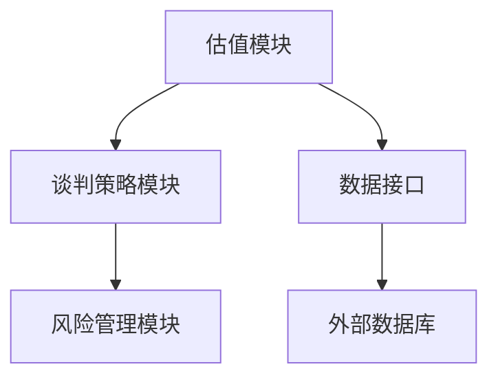
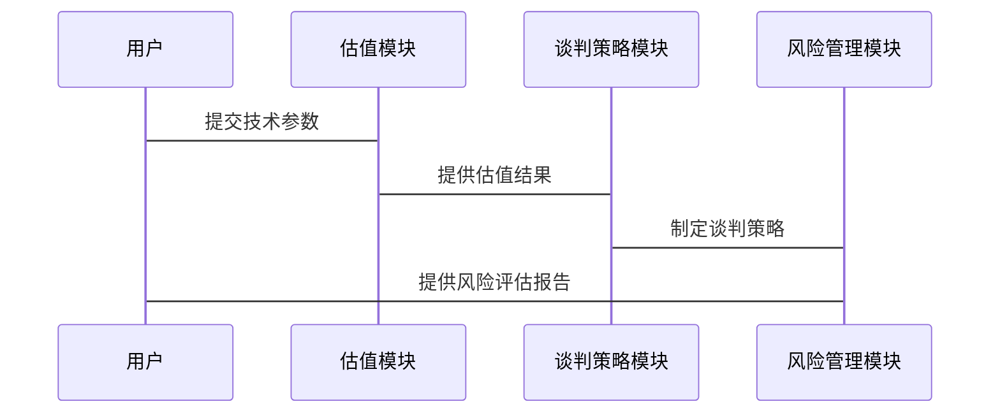

                 


# 股市估值在跨境技术转让谈判中的应用

> 关键词：股市估值、跨境技术转让、技术谈判、估值模型、技术价值

> 摘要：本文探讨了股市估值在跨境技术转让谈判中的应用，分析了股市估值的核心概念、方法及其在技术谈判中的重要性。通过详细讲解估值模型、数学公式、系统架构和实际案例，本文为读者提供了从理论到实践的全面指导。

---

## 第1章: 股市估值与跨境技术转让的背景与概念

### 1.1 股市估值的基本概念
#### 1.1.1 股市估值的定义
股市估值是通过对公司财务数据和市场表现的分析，评估其股票的合理价格范围。常用指标包括市盈率（P/E）、市净率（P/B）和市销率（P/S）。

#### 1.1.2 股市估值的核心要素
- **市盈率（P/E）**：衡量公司股价与每股收益的关系，公式为：  
  $$ P/E = \frac{\text{股价}}{\text{每股收益}} $$  
- **市净率（P/B）**：衡量股价与每股净资产的关系，公式为：  
  $$ P/B = \frac{\text{股价}}{\text{每股净资产}} $$  
- **市销率（P/S）**：衡量股价与每股销售收入的关系，公式为：  
  $$ P/S = \frac{\text{股价}}{\text{每股销售收入}} $$  

#### 1.1.3 股市估值与传统估值方法的对比
| 方法 | 优点 | 缺点 |
|------|------|------|
| 相对估值法 | 简单易懂 | 受市场情绪影响较大 |
| 绝对估值法 | 更具客观性 | 计算复杂 |

### 1.2 跨境技术转让的定义与特点
#### 1.2.1 跨境技术转让的定义
跨境技术转让是指跨国公司之间通过协议进行的技术所有权或使用权的转移，涉及专利、软件、工艺等。

#### 1.2.2 跨境技术转让的核心要素
- **技术价值**：技术的市场应用前景和盈利能力。
- **法律风险**：涉及的知识产权保护和法律条款。
- **税务因素**：跨国交易中的税务规划和影响。

#### 1.2.3 跨境技术转让与国内技术转让的区别
| 方面 | 跨境技术转让 | 国内技术转让 |
|------|-------------|---------------|
| 法律环境 | 复杂多变 | 简单明了 |
| 税务影响 | 需考虑双重征税 | 税务政策相对统一 |
| 市场环境 | 全球化市场 | 国内市场 |

### 1.3 股市估值在跨境技术转让中的应用背景
#### 1.3.1 股市估值与技术价值的关系
技术价值是股市估值的重要组成部分，特别是在科技公司中，技术的核心地位决定了其股价的波动。

#### 1.3.2 跨境技术转让中的估值挑战
- **汇率波动**：影响技术估值的稳定性。
- **法律不确定性**：不同国家的知识产权保护力度不同。
- **市场认知差异**：不同市场的投资者对技术的估值可能不同。

#### 1.3.3 股市估值在技术谈判中的作用
通过分析同类上市公司的估值，为技术谈判提供参考依据，确保谈判的合理性和公平性。

---

## 第2章: 股市估值的核心概念与方法

### 2.1 股市估值的核心概念
#### 2.1.1 市盈率（P/E）的定义与计算
市盈率是衡量公司股价与盈利能力的重要指标，计算公式为：  
$$ P/E = \frac{\text{股价}}{\text{每股收益}} $$  

#### 2.1.2 市净率（P/B）的定义与计算
市净率是衡量公司股价与净资产的关系，计算公式为：  
$$ P/B = \frac{\text{股价}}{\text{每股净资产}} $$  

#### 2.1.3 市销率（P/S）的定义与计算
市销率是衡量公司股价与销售收入的关系，计算公式为：  
$$ P/S = \frac{\text{股价}}{\text{每股销售收入}} $$  

### 2.2 股市估值的主要方法
#### 2.2.1 相对估值法
通过比较同类公司的估值指标（如P/E、P/B）来确定目标公司的合理估值范围。

#### 2.2.2 绝对估值法
基于公司未来现金流的折现值来评估其内在价值，常用股权自由现金流模型（FCFE）进行计算。

#### 2.2.3 股权自由现金流模型
股权自由现金流模型用于估算公司股权的价值，公式为：  
$$ V = \sum_{t=1}^{n} \frac{\text{FCFE}_t}{(1 + r)^t} $$  
其中，r为折现率，n为估值期限。

### 2.3 股市估值的局限性与改进方向
#### 2.3.1 股市估值的主要局限性
- 受市场情绪影响较大。
- 无法准确反映公司内在价值。

#### 2.3.2 提高估值准确性的方法
- 结合多种估值方法进行交叉验证。
- 考虑宏观经济环境的影响。

#### 2.3.3 新兴技术公司的估值挑战
新兴技术公司的未来现金流难以预测，导致估值难度较大。

---

## 第3章: 跨境技术转让中的估值模型与应用

### 3.1 跨境技术转让中的估值模型
#### 3.1.1 技术价值的评估方法
- **成本法**：基于技术开发成本的估值。
- **市场法**：参考同类技术的市场交易价格。
- **收益法**：基于技术带来的未来收益。

#### 3.1.2 市场法在技术估值中的应用
市场法通过分析同类技术的交易案例，确定技术的合理价格范围。

#### 3.1.3 收益法在技术估值中的应用
收益法基于技术带来的未来现金流，折现计算其内在价值。

### 3.2 股市估值与技术谈判的结合
#### 3.2.1 技术公司的上市估值分析
通过分析上市公司股票的估值指标，评估其技术价值。

#### 3.2.2 股市估值对技术谈判的启示
利用股市估值的方法，确保技术谈判的价格合理且具有竞争力。

#### 3.2.3 技术谈判中的股价波动分析
股价波动反映了市场对技术价值的预期，谈判双方需考虑市场情绪的影响。

### 3.3 跨境技术转让中的风险与应对
#### 3.3.1 跨境估值中的汇率风险
通过签订货币保值协议或选择固定汇率来降低汇率波动的影响。

#### 3.3.2 法律与税务风险
聘请专业律师和税务顾问，确保交易符合相关法律法规。

#### 3.3.3 技术贬值风险
通过签订技术更新条款，确保技术价值的持续性。

---

## 第4章: 股市估值与技术谈判的数学模型

### 4.1 股市估值的数学模型
#### 4.1.1 市盈率模型
$$ P = E \times P/E $$  
其中，P为股价，E为每股收益。

#### 4.1.2 市净率模型
$$ P = B \times P/B $$  
其中，P为股价，B为每股净资产。

#### 4.1.3 股权自由现金流模型
$$ V = \sum_{t=1}^{n} \frac{\text{FCFE}_t}{(1 + r)^t} $$  
其中，r为折现率，n为估值期限。

### 4.2 技术谈判中的估值模型
#### 4.2.1 技术价值的收益模型
$$ V = \sum_{t=1}^{n} \frac{\text{CF}_t}{(1 + r)^t} $$  
其中，CF为技术带来的现金流，r为折现率。

#### 4.2.2 技术谈判的市场模型
$$ P = \text{参考价} \times \text{调整系数} $$  
调整系数基于技术的市场竞争力和谈判双方的议价能力。

---

## 第5章: 股市估值与技术谈判的系统分析与架构设计

### 5.1 问题场景介绍
跨境技术转让谈判涉及复杂的法律、税务和市场因素，需要系统化的解决方案。

### 5.2 系统功能设计
- **估值模块**：基于股市估值模型计算技术价值。
- **谈判策略模块**：根据估值结果制定谈判策略。
- **风险管理模块**：评估和应对谈判中的各种风险。

### 5.3 系统架构设计


### 5.4 系统接口设计
- **数据接口**：与外部数据库对接，获取公司财务数据和市场信息。
- **用户界面**：提供直观的估值结果和谈判建议。

### 5.5 系统交互设计


---

## 第6章: 股市估值与技术谈判的项目实战

### 6.1 环境安装
- **工具安装**：安装Python和相关数据分析库（如Pandas、NumPy）。
- **数据获取**：获取相关技术公司的股票数据和财务数据。

### 6.2 系统核心实现
```python
import pandas as pd
import numpy as np

def calculate_pe_ratio(df):
    pe_ratio = df['股价'] / df['每股收益']
    return pe_ratio

def calculate_pb_ratio(df):
    pb_ratio = df['股价'] / df['每股净资产']
    return pb_ratio

# 示例数据
data = {
    '公司': ['A', 'B', 'C'],
    '股价': [100, 80, 120],
    '每股收益': [20, 15, 30],
    '每股净资产': [50, 40, 60]
}
df = pd.DataFrame(data)

pe_ratio = calculate_pe_ratio(df)
pb_ratio = calculate_pb_ratio(df)

print("市盈率:", pe_ratio)
print("市净率:", pb_ratio)
```

### 6.3 代码应用解读与分析
- **市盈率计算**：通过公司股价和每股收益计算市盈率，反映公司盈利能力。
- **市净率计算**：通过公司股价和每股净资产计算市净率，反映公司资产质量。

### 6.4 实际案例分析
以某科技公司为例，分析其技术转让谈判中的估值过程，包括数据收集、模型计算和结果解读。

### 6.5 项目小结
通过实际项目，验证了股市估值模型在技术谈判中的应用价值。

---

## 第7章: 股市估值与技术谈判的最佳实践

### 7.1 小结
股市估值是技术谈判中的重要工具，帮助谈判双方确定技术的合理价格。

### 7.2 注意事项
- 考虑市场环境的复杂性。
- 注重法律和税务风险的控制。
- 灵活应用多种估值方法。

### 7.3 拓展阅读
- 建议阅读《The Valuation Challenge》和《Mergers and Acquisitions: A Case Studies Approach》。

---

## 作者：AI天才研究院 & 禅与计算机程序设计艺术

---

通过本文的详细分析，读者可以全面了解股市估值在跨境技术转让谈判中的应用，掌握从理论到实践的完整方法。

