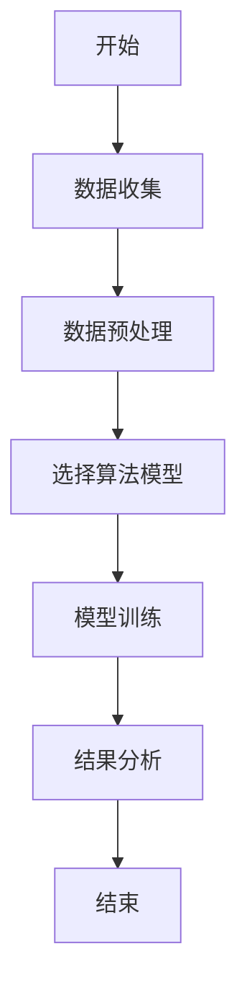
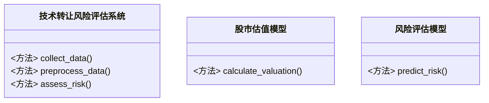
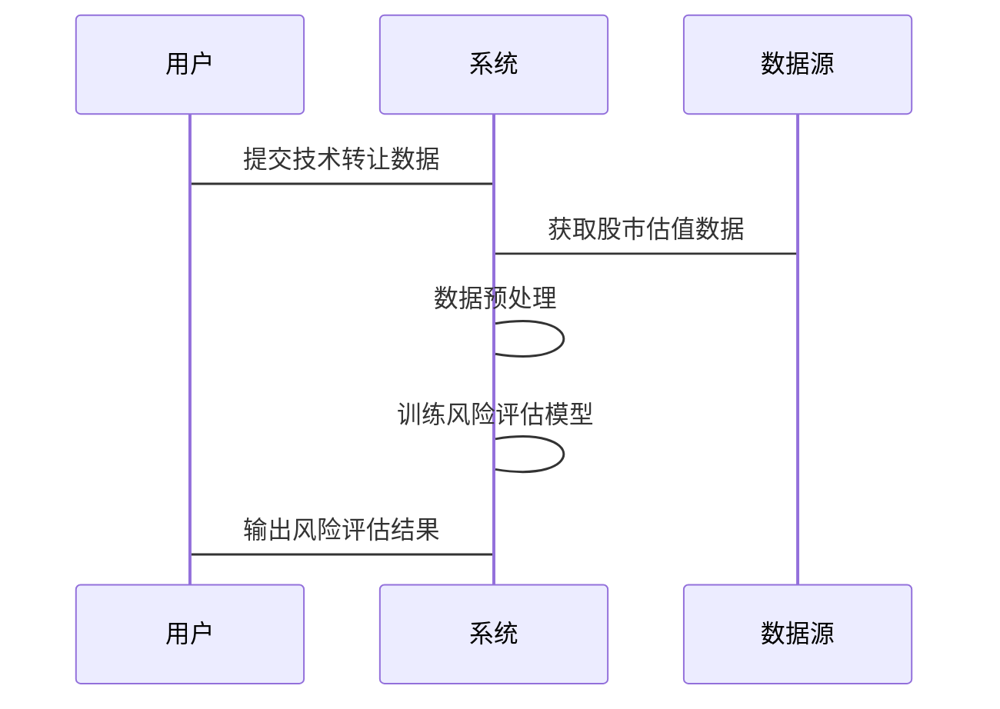

                 


# 股市估值在跨境技术转让风险评估中的应用

## 关键词：股市估值、跨境技术转让、风险评估、技术转让风险、风险评估模型、股市估值模型

## 摘要：本文系统地探讨了股市估值在跨境技术转让风险评估中的应用。通过分析股市估值模型和风险评估模型的结合，提出了一种基于机器学习的算法框架，用于量化技术转让过程中的潜在风险。文章首先介绍了相关背景和核心概念，然后详细讲解了算法原理和数学模型，随后设计了系统的架构方案，并通过具体案例展示了项目的实战应用。最后，总结了研究成果并提出了未来的研究方向。

---

## 第一部分：背景与核心概念

### 第1章：背景介绍

#### 1.1 问题背景

##### 1.1.1 股市估值的基本概念
股市估值是通过分析企业的财务数据、市场表现和行业趋势，对其股票的内在价值进行评估的过程。常用的估值方法包括市盈率（P/E）、市净率（P/B）、现金流折现法（DCF）等。

##### 1.1.2 跨境技术转让的定义与特点
跨境技术转让是指跨国公司之间通过协议进行的技术所有权转移。其特点包括跨国性、法律复杂性和高风险性。技术转让涉及知识产权的保护、市场环境的适应以及文化差异等因素，这些都会影响技术转让的成功率。

##### 1.1.3 技术转让风险评估的重要性
技术转让的风险评估是确保技术能够成功应用于目标市场的重要环节。通过评估潜在风险，企业可以制定应对策略，降低失败的可能性。

#### 1.2 问题描述

##### 1.2.1 股市估值在技术转让中的作用
股市估值可以为技术转让提供市场参考，帮助评估技术的市场价值和潜在收益。

##### 1.2.2 跨境技术转让中的风险来源
风险来源包括市场风险、法律风险、文化风险和操作风险。

##### 1.2.3 股市估值与风险评估的结合点
股市估值提供了企业价值的量化指标，而风险评估则量化了技术转让的不确定性。两者结合可以提供更全面的风险评估。

#### 1.3 问题解决

##### 1.3.1 股市估值模型在风险评估中的应用
通过分析企业的估值指标，可以预测技术转让的市场表现。

##### 1.3.2 技术转让风险的量化方法
利用统计模型和机器学习算法，将风险因素转化为可量化的指标。

##### 1.3.3 股市估值与风险评估的结合方法
将股市估值指标作为输入，构建风险评估模型，输出风险等级。

#### 1.4 边界与外延

##### 1.4.1 股市估值的适用范围
适用于上市公司和成熟市场。

##### 1.4.2 技术转让风险评估的边界
限于可量化的风险因素，如市场、法律和操作风险。

##### 1.4.3 股市估值与风险评估的外延领域
可应用于其他类型的资产估值和风险管理。

#### 1.5 概念结构与核心要素

##### 1.5.1 股市估值的核心要素
- 企业财务数据
- 市场表现
- 行业趋势

##### 1.5.2 技术转让风险的核心要素
- 市场风险
- 法律风险
- 文化风险

##### 1.5.3 两者的关联与协同
通过股市估值指标，量化技术转让的市场价值和潜在风险。

### 第2章：核心概念与联系

#### 2.1 核心概念原理

##### 2.1.1 股市估值模型的原理
通过分析企业的财务数据和市场表现，计算其股票的内在价值。

##### 2.1.2 技术转让风险评估的原理
通过分析风险因素，量化技术转让的不确定性。

##### 2.1.3 两者的结合原理
将股市估值指标作为输入，构建风险评估模型，输出风险等级。

#### 2.2 概念属性特征对比

| 概念 | 属性 | 特征 |
|------|------|------|
| 股市估值模型 | 数据驱动 | 依赖财务数据和市场表现 |
| 技术转让风险评估 | 风险驱动 | 依赖风险因素分析 |

#### 2.3 ER实体关系图
```mermaid
er
  entity 股市估值模型 {
    <属性> 估值指标
    <属性> 估值方法
  }
  entity 技术转让风险评估 {
    <属性> 风险指标
    <属性> 风险评估方法
  }
  relation 股市估值与风险评估的关系 {
    股市估值模型 -> 技术转让风险评估 : 通过估值指标影响风险评估
  }
```

---

## 第二部分：算法原理讲解

### 第3章：算法原理讲解

#### 3.1 算法流程图


#### 3.2 算法实现代码
```python
import pandas as pd
from sklearn.model_selection import train_test_split
from sklearn.ensemble import RandomForestRegressor
from sklearn.metrics import mean_squared_error

# 数据加载与预处理
data = pd.read_csv('trans tech risk.csv')
X = data[['valuation_ratio', 'market_risk', 'legal_risk']]
y = data['risk_score']

# 数据分割
X_train, X_test, y_train, y_test = train_test_split(X, y, test_size=0.2)

# 模型训练
model = RandomForestRegressor(n_estimators=100)
model.fit(X_train, y_train)

# 模型预测
y_pred = model.predict(X_test)

# 模型评估
mse = mean_squared_error(y_test, y_pred)
print(f'Mean Squared Error: {mse}')
```

#### 3.3 数学模型与公式

##### 3.3.1 风险评估模型
$$ \text{风险评分} = \alpha \cdot \text{估值指标} + \beta \cdot \text{风险因素} $$

##### 3.3.2 估值模型
$$ \text{股票价值} = \gamma \cdot \text{净利润} + \delta \cdot \text{市盈率} $$

---

## 第三部分：系统分析与架构设计方案

### 第4章：系统分析与架构设计方案

#### 4.1 项目介绍

##### 4.1.1 项目背景
开发一个基于股市估值的跨境技术转让风险评估系统。

#### 4.2 系统功能设计

##### 4.2.1 领域模型


#### 4.3 系统架构设计

##### 4.3.1 系统架构图


#### 4.4 接口设计

##### 4.4.1 API接口
- 输入接口：技术转让数据和估值指标
- 输出接口：风险评估结果

#### 4.5 系统交互流程图


---

## 第四部分：项目实战

### 第5章：项目实战

#### 5.1 项目环境安装

##### 5.1.1 安装依赖
```bash
pip install pandas scikit-learn mermaid4jupyter
```

#### 5.2 系统核心实现源代码

##### 5.2.1 数据预处理
```python
import pandas as pd

# 加载数据
data = pd.read_csv('trans_tech_risk.csv')

# 数据清洗
data.dropna(inplace=True)
```

##### 5.2.2 模型训练
```python
from sklearn.ensemble import RandomForestRegressor

# 模型训练
model = RandomForestRegressor(n_estimators=100)
model.fit(X_train, y_train)
```

##### 5.2.3 模型评估
```python
from sklearn.metrics import mean_squared_error

# 模型评估
mse = mean_squared_error(y_test, y_pred)
print(f'Mean Squared Error: {mse}')
```

#### 5.3 代码应用解读与分析

##### 5.3.1 代码功能解读
- 数据预处理：清洗和格式化数据
- 模型训练：基于随机森林算法训练风险评估模型
- 模型评估：计算均方误差，评估模型性能

#### 5.4 实际案例分析和详细讲解剖析

##### 5.4.1 案例介绍
某跨国技术转让项目，涉及人工智能技术的转让。

##### 5.4.2 数据分析
通过股市估值模型计算目标公司的估值指标，结合技术转让数据中的风险因素，评估转让风险。

##### 5.4.3 结果分析
模型预测风险评分，帮助决策是否进行技术转让。

#### 5.5 项目小结

##### 5.5.1 成果总结
成功开发了一个基于股市估值的跨境技术转让风险评估系统。

##### 5.5.2 经验总结
数据质量和模型选择对评估结果有重要影响。

##### 5.5.3 问题总结
模型的泛化能力有待提高，数据量不足可能影响评估精度。

---

## 第五部分：总结与展望

### 第6章：总结与展望

#### 6.1 研究成果总结

##### 6.1.1 核心成果
提出了基于股市估值的跨境技术转让风险评估方法。

##### 6.1.2 技术创新点
将股市估值模型与机器学习算法结合，提高了风险评估的准确性。

#### 6.2 研究展望

##### 6.2.1 方法改进
探索更复杂的机器学习模型，如深度学习，以提高评估精度。

##### 6.2.2 应用拓展
将方法应用于其他类型的资产估值和风险管理。

---

## 第六部分：最佳实践 tips、小结、注意事项、拓展阅读

### 6.1 最佳实践 tips

#### 6.1.1 数据收集
确保数据的完整性和准确性，选择可靠的来源。

#### 6.1.2 模型选择
根据具体问题选择合适的算法，避免过度复杂。

#### 6.1.3 模型验证
使用交叉验证和测试集评估模型性能，避免过拟合。

### 6.2 小结

本文系统地探讨了股市估值在跨境技术转让风险评估中的应用，提出了基于机器学习的算法框架，提供了理论和实践指导。

### 6.3 注意事项

#### 6.3.1 数据隐私
确保数据的隐私和安全，遵守相关法律法规。

#### 6.3.2 模型解释性
选择可解释的模型，便于分析和优化。

### 6.4 拓展阅读

#### 6.4.1 推荐书籍
- 《风险管理与金融创新》
- 《机器学习实战》

#### 6.4.2 推荐文章
- 股市估值与风险管理的结合应用
- 机器学习在金融领域的应用

---

## 附录

### 附录A：术语表

| 术语 | 定义 |
|------|------|
| 股市估值 | 通过分析企业财务数据和市场表现，评估股票的内在价值 |
| 技术转让风险 | 技术转让过程中可能面临的各种风险，包括市场、法律和操作风险 |

### 附录B：代码仓库链接
[GitHub代码仓库](https://github.com/yourusername/cross-border-technology-transfer-risk-assessment)

---

## 作者：AI天才研究院/AI Genius Institute & 禅与计算机程序设计艺术 /Zen And The Art of Computer Programming

