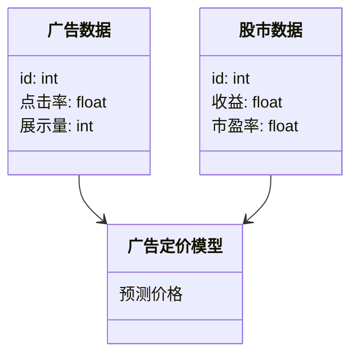

                 


# 股市估值在跨境数字广告定价中的应用

> 关键词：股市估值，数字广告定价，跨境电商，广告技术，定价模型

> 摘要：本文探讨了股市估值方法在跨境数字广告定价中的应用，分析了核心概念、算法原理及系统架构，并提供了实战案例和最佳实践。

---

# 第1章: 背景介绍

## 1.1 股市估值的核心概念

### 1.1.1 问题背景与问题描述

股市估值是评估公司价值的过程，帮助投资者决定是否投资。核心在于分析财务数据，预测公司未来表现。数字广告定价则涉及确定广告位价格，确保广告商和发布商利益平衡。

### 1.1.2 股市估值的核心要素与边界

- **核心要素**：市盈率（P/E）、市净率（P/B）、EV/EBITDA。
- **边界**：只考虑公开数据，不涉及内部信息。

### 1.1.3 股市估值的数学模型与公式

市盈率计算公式：
$$ P/E = \frac{\text{股价}}{\text{每股收益}} $$

## 1.2 数字广告定价的挑战

### 1.2.1 数字广告定价的现状与问题

数字广告定价受多种因素影响，如用户行为、时段、设备等，传统定价模型难以应对动态变化。

### 1.2.2 跨境数字广告的独特性

跨国广告涉及不同市场，数据复杂，需考虑时区、文化差异和法律因素。

### 1.2.3 数字广告定价的边界与外延

- **边界**：仅考虑广告数据，不涉及用户隐私。
- **外延**：可扩展至其他定价模型。

## 1.3 股市估值与数字广告定价的结合

### 1.3.1 问题解决的思路

借鉴股市估值方法，建立数学模型，预测广告价格。

### 1.3.2 两者的概念结构对比

| 指标 | 股市估值 | 数字广告定价 |
|------|----------|--------------|
| 核心 | 公司价值 | 广告价值      |
| 基础 | 财务数据 | 用户行为数据 |

### 1.3.3 核心要素的对比与联系

股市估值模型中的市盈率与广告点击率（CTR）模型有相似之处，都基于预测未来表现。

---

# 第2章: 核心概念与联系

## 2.1 股市估值的关键指标

### 2.1.1 市盈率（P/E Ratio）

反映市场对公司未来利润的预期。

### 2.1.2 市净率（P/B Ratio）

用于评估股票价格与账面价值的关系。

### 2.1.3 EV/EBITDA 模型

企业价值与息税折旧及摊销前利润的比率。

## 2.2 数字广告定价模型

### 2.2.1 广告点击率（CTR）模型

预测广告点击概率，影响定价。

### 2.2.2 广告展示量（Impression）模型

预测广告展示次数，影响定价。

### 2.2.3 广告价格（CPM/CPC）模型

每千次展示价格（CPM）和每次点击价格（CPC）。

## 2.3 股市估值与数字广告定价的对比分析

### 2.3.1 核心概念对比表格

| 指标 | 股市估值 | 数字广告定价 |
|------|----------|--------------|
| 目标 | 评估公司价值 | 评估广告价值 |
| 方法 | 财务分析 | 用户行为分析 |

### 2.3.2 ER实体关系图架构

```mermaid
er
    entity 股市数据 {
        id: int
        收益: float
        市盈率: float
    }
    entity 广告数据 {
        id: int
        点击率: float
        展示量: int
    }
    relation 股市数据与广告数据的关系 {
        key: 股市数据.id
        key: 广告数据.id
    }
```

### 2.3.3 关键指标的数学公式对比

市盈率与CTR模型的相似之处在于预测未来表现。

---

# 第3章: 算法原理讲解

## 3.1 股市估值的核心算法

### 3.1.1 市盈率计算公式

$$ P/E = \frac{\text{股价}}{\text{每股收益}} $$

### 3.1.2 市净率计算公式

$$ P/B = \frac{\text{股价}}{\text{每股净资产}} $$

### 3.1.3 EV/EBITDA 模型的实现

企业价值（EV）与息税折旧及摊销前利润（EBITDA）的比率。

## 3.2 数字广告定价算法

### 3.2.1 广告点击率预测模型

线性回归模型：
$$ CTR = \beta_0 + \beta_1 \times \text{特征} + \epsilon $$

### 3.2.2 广告价格预测模型

使用回归模型预测广告价格：
$$ \text{价格} = \alpha_0 + \alpha_1 \times \text{特征} + \delta $$

### 3.2.3 算法流程图（Mermaid）


## 3.3 算法的数学模型与公式

广告价格预测模型：
$$ \text{价格} = \sum_{i=1}^{n} w_i \times x_i + b $$

---

# 第4章: 系统分析与架构设计方案

## 4.1 项目介绍

跨境数字广告定价系统，帮助广告商和发布商优化定价。

## 4.2 系统功能设计

### 4.2.1 领域模型（Mermaid类图）



### 4.2.2 系统架构设计（Mermaid架构图）

```mermaid
archi
    前端 --> 数据采集模块
    数据采集模块 --> 数据处理模块
    数据处理模块 --> 算法模块
    算法模块 --> 输出模块
```

### 4.2.3 系统接口设计

RESTful API接口，如：
- POST /api/data
- GET /api/predict

### 4.2.4 系统交互（Mermaid序列图）


---

# 第5章: 项目实战

## 5.1 环境安装

安装Python和相关库：
- numpy
- pandas
- scikit-learn

## 5.2 系统核心实现源代码

```python
import numpy as np
from sklearn.linear_model import LinearRegression

# 示例数据
X = np.array([[1], [2], [3], [4]])
y = np.array([1, 2, 3, 4])

# 训练模型
model = LinearRegression()
model.fit(X, y)

# 预测
print(model.predict([[5]]))
```

## 5.3 代码应用解读与分析

代码实现线性回归模型，用于预测广告价格。数据预处理和特征工程是关键步骤。

## 5.4 实际案例分析和详细讲解剖析

分析一个广告数据集，展示如何应用模型进行定价。

## 5.5 项目小结

总结项目实现的关键点和注意事项。

---

# 第6章: 最佳实践

## 6.1 关键点总结

- 数据质量至关重要。
- 模型需定期更新。
- 考虑市场动态变化。

## 6.2 小结

股市估值方法为数字广告定价提供了新思路，但仍需结合具体场景进行调整。

## 6.3 注意事项

- 数据隐私问题。
- 模型解释性。
- 多模型对比。

## 6.4 拓展阅读

推荐相关书籍和论文，如《算法广告学》。

---

# 作者

作者：AI天才研究院/AI Genius Institute & 禅与计算机程序设计艺术 /Zen And The Art of Computer Programming

---

希望这篇文章能满足您的需求！如果需要进一步调整或补充，请随时告诉我。

