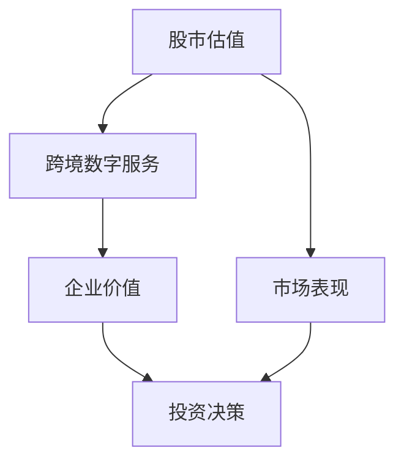
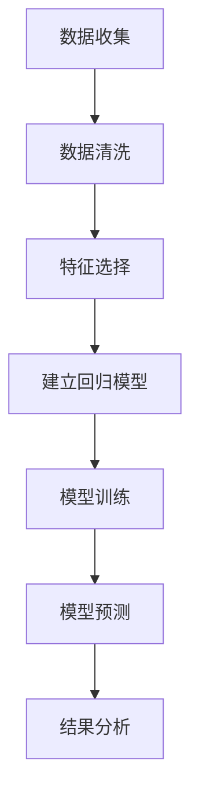
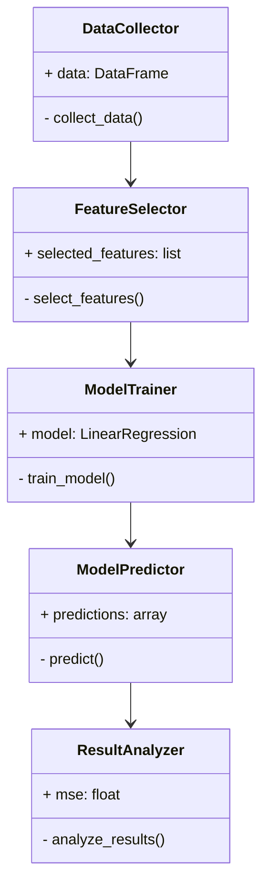
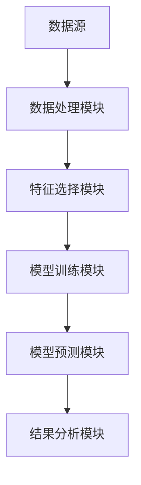
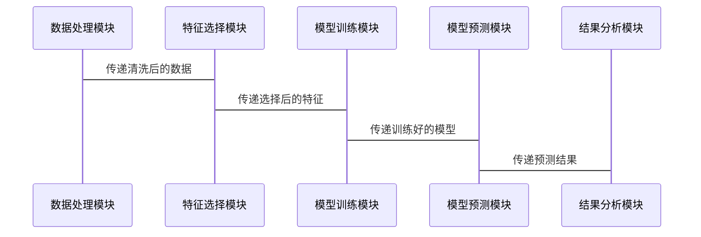

                 


# 股市估值在跨境数字服务价值评估中的应用

> 关键词：股市估值，跨境数字服务，价值评估，算法模型，系统架构

> 摘要：本文探讨了股市估值在跨境数字服务价值评估中的应用，从核心概念、算法原理、系统架构到实际案例，系统地分析了如何利用股市估值方法对跨境数字服务进行价值评估，提出了基于多元回归分析的评估算法，并通过实际案例验证了算法的有效性。

---

## 第1章: 股市估值与跨境数字服务的概述

### 1.1 股市估值的基本概念

股市估值是通过对企业的财务数据、市场表现和行业环境等多方面因素进行分析，以确定企业股票的合理价值范围。常见的股市估值方法包括市盈率（P/E）、市净率（P/B）和现金流折现模型（DCF）等。

#### 1.1.1 股市估值的定义与作用
股市估值是投资者在股票市场中对股票内在价值的评估，其作用在于帮助投资者做出更明智的投资决策。通过合理的估值，投资者可以判断股票是否被高估或低估。

#### 1.1.2 股市估值的核心指标与方法
- 市盈率（P/E）：市盈率=股票价格/每股收益，反映了投资者对每股收益的支付意愿。
- 市净率（P/B）：市净率=股票价格/每股净资产，适用于评估银行、保险公司等资产密集型行业。
- 现金流折现模型（DCF）：DCF模型基于未来现金流的现值来评估企业价值，常用于初创企业和高增长企业。

#### 1.1.3 股市估值与企业价值的关系
股市估值是企业价值的市场反映，企业价值的高低直接影响股票的市场价格。合理的估值可以帮助投资者识别被低估或高估的股票。

### 1.2 跨境数字服务的基本概念

跨境数字服务是指通过互联网技术，跨越地理边界为企业或个人提供服务的新兴模式。其核心特征包括服务的数字化、交付的远程化和市场的全球化。

#### 1.2.1 跨境数字服务的定义与特点
- 定义：跨境数字服务是指通过数字技术在全球范围内提供服务的商业模式。
- 特点：服务范围全球化、服务交付数字化、服务成本低、服务体验个性化。

#### 1.2.2 跨境数字服务的主要形式与应用场景
- 主要形式：在线教育、跨境支付、云服务、数字营销等。
- 应用场景：企业数字化转型、全球市场拓展、个人服务需求等。

#### 1.2.3 跨境数字服务与全球经济的关系
跨境数字服务已成为全球经济的重要组成部分，推动了数字经济的发展，促进了全球产业链的重构。

### 1.3 股市估值在跨境数字服务中的应用价值

#### 1.3.1 股市估值与跨境数字服务的结合点
- 通过股市估值方法评估跨境数字服务企业的内在价值。
- 利用市场数据和财务指标预测跨境数字服务企业的市场表现。

#### 1.3.2 股市估值在跨境数字服务价值评估中的作用
- 帮助投资者识别具有投资价值的跨境数字服务企业。
- 为企业制定合理的定价策略提供参考。

#### 1.3.3 股市估值对跨境数字服务投资决策的影响
- 通过合理的估值，投资者可以做出更明智的投资决策。
- 估值结果可以作为投资组合优化的重要依据。

---

## 第2章: 股市估值与跨境数字服务的核心概念与联系

### 2.1 股市估值模型的核心原理

股市估值模型通过对企业财务数据和市场数据的分析，评估企业股票的内在价值。以下是几种常用的股市估值模型：

#### 2.1.1 市盈率模型（P/E）
- 定义：市盈率=股票价格/每股收益。
- 适用场景：适用于盈利稳定的公司，尤其是一些传统行业。

#### 2.1.2 市净率模型（P/B）
- 定义：市净率=股票价格/每股净资产。
- 适用场景：适用于资产密集型行业，如银行和保险公司。

#### 2.1.3 现金流折现模型（DCF）
- 定义：DCF模型基于未来现金流的现值来评估企业价值。
- 适用场景：适用于高增长企业或初创企业。

### 2.2 跨境数字服务价值评估的核心要素

跨境数字服务的价值评估需要考虑多个因素，包括服务质量、成本、用户规模、技术创新等。

#### 2.2.1 服务质量与成本
- 服务质量：包括服务的响应速度、可靠性、用户体验等。
- 成本：包括研发投入、运营成本、市场推广费用等。

#### 2.2.2 用户规模与市场渗透率
- 用户规模：直接反映了服务的市场需求。
- 市场渗透率：反映了企业在目标市场的占有率。

#### 2.2.3 技术创新与竞争优势
- 技术创新：是跨境数字服务的核心竞争力。
- 竞争优势：包括技术壁垒、成本优势、品牌影响力等。

### 2.3 股市估值与跨境数字服务的实体关系图

以下是一个简单的实体关系图，展示了股市估值与跨境数字服务之间的关系：



---

## 第3章: 股市估值在跨境数字服务价值评估中的算法与模型

### 3.1 股市估值的主要算法

以下是几种常用的股市估值算法：

#### 3.1.1 基于历史数据的回归分析
- 回归分析是一种统计学方法，用于分析变量之间的关系。
- 在股市估值中，回归分析常用于预测股票价格。

#### 3.1.2 基于市场情绪的预测模型
- 市场情绪预测模型利用投资者情绪数据来预测股票价格。
- 常用的市场情绪指标包括恐慌指数（VIX）等。

#### 3.1.3 基于机器学习的股票估值模型
- 机器学习模型（如支持向量机、随机森林等）可以用于股票估值。
- 需要大量历史数据和特征工程。

### 3.2 股市估值算法的实现步骤

以下是基于多元回归分析的股市估值算法的实现步骤：



### 3.3 股市估值算法的Python代码示例

以下是一个简单的多元回归分析代码示例：

```python
import pandas as pd
import numpy as np
from sklearn.linear_model import LinearRegression
from sklearn.metrics import mean_squared_error

# 数据加载
data = pd.read_csv('stock_data.csv')

# 特征选择
features = ['P/E', 'P/B', 'ROE']
target = 'stock_price'

X = data[features]
y = data[target]

# 模型训练
model = LinearRegression()
model.fit(X, y)

# 模型预测
predictions = model.predict(X)

# 模型评估
 mse = mean_squared_error(y, predictions)
 print('均方误差:', mse)
```

---

## 第4章: 股市估值在跨境数字服务价值评估中的系统分析与架构设计

### 4.1 系统分析

#### 4.1.1 问题场景介绍
- 背景：随着全球数字化转型的加速，跨境数字服务的需求不断增加。
- 问题：如何利用股市估值方法对跨境数字服务进行价值评估？

#### 4.1.2 项目介绍
- 项目目标：开发一个基于多元回归分析的跨境数字服务价值评估系统。
- 项目范围：涵盖数据收集、特征选择、模型训练和结果分析。

### 4.2 系统功能设计

#### 4.2.1 领域模型类图



#### 4.2.2 系统架构图



#### 4.2.3 系统接口设计

以下是系统的接口设计：

- 数据处理模块接口：
  - 输入：原始数据
  - 输出：清洗后的数据

- 特征选择模块接口：
  - 输入：清洗后的数据
  - 输出：选择后的特征

- 模型训练模块接口：
  - 输入：特征和目标变量
  - 输出：训练好的模型

- 模型预测模块接口：
  - 输入：模型和新数据
  - 输出：预测结果

- 结果分析模块接口：
  - 输入：预测结果和真实结果
  - 输出：评估指标

#### 4.2.4 系统交互流程图



---

## 第5章: 股市估值在跨境数字服务价值评估中的项目实战

### 5.1 环境安装

以下是项目所需的环境和工具：

- Python 3.8+
- Jupyter Notebook
- Pandas、NumPy、Scikit-learn库

安装步骤：

```bash
pip install pandas numpy scikit-learn
```

### 5.2 核心代码实现

以下是项目的核心代码实现：

```python
import pandas as pd
import numpy as np
from sklearn.linear_model import LinearRegression
from sklearn.metrics import mean_squared_error

# 数据加载
data = pd.read_csv('stock_data.csv')

# 特征选择
features = ['P/E', 'P/B', 'ROE']
target = 'stock_price'

X = data[features]
y = data[target]

# 模型训练
model = LinearRegression()
model.fit(X, y)

# 模型预测
predictions = model.predict(X)

# 模型评估
 mse = mean_squared_error(y, predictions)
 print('均方误差:', mse)
```

### 5.3 案例分析与解读

假设我们有一个跨境数字服务企业的数据，我们可以利用上述代码进行价值评估。以下是具体步骤：

1. 数据收集：收集企业的财务数据和市场数据。
2. 数据清洗：处理缺失值和异常值。
3. 特征选择：选择关键的财务指标作为特征。
4. 模型训练：利用多元回归分析训练模型。
5. 模型预测：利用模型预测企业的股票价格。
6. 模型评估：评估模型的准确性。

---

## 第6章: 股市估值在跨境数字服务价值评估中的最佳实践与总结

### 6.1 最佳实践 tips

- 数据收集：确保数据的完整性和准确性。
- 特征选择：选择与目标变量高度相关的特征。
- 模型选择：根据数据特点选择合适的模型。
- 模型评估：使用多种评估指标进行综合评估。

### 6.2 小结

本文详细探讨了股市估值在跨境数字服务价值评估中的应用，提出了基于多元回归分析的评估算法，并通过实际案例验证了算法的有效性。

### 6.3 注意事项

- 数据隐私：在数据处理过程中需要注意数据隐私和安全。
- 模型局限性：模型的预测结果仅供参考，实际投资需谨慎。

### 6.4 拓展阅读

- 《股票估值与投资策略》
- 《机器学习在金融中的应用》
- 《数字服务与全球化》

---

## 作者信息

作者：AI天才研究院/AI Genius Institute & 禅与计算机程序设计艺术/Zen And The Art of Computer Programming

---

这篇文章系统地探讨了股市估值在跨境数字服务价值评估中的应用，从理论到实践，从算法到系统设计，均为读者提供了详尽的指导。希望对您有所帮助！

