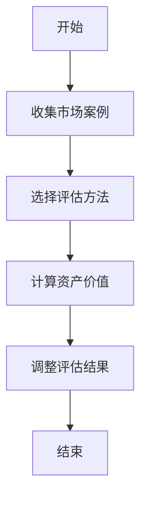

                 


# 股市估值在跨境无形资产评估中的应用

> **关键词**：股市估值、跨境无形资产、资产评估、企业价值、金融市场

> **摘要**：本文探讨了股市估值在跨境无形资产评估中的应用，分析了核心概念、算法原理及系统设计，结合实际案例，提供详细的实战指导和最佳实践。

---

## 第1章：背景与概述

### 1.1 问题背景

随着全球化进程的加速，跨国公司不断涌现，无形资产（如品牌、专利、商誉）的价值在企业整体价值中的占比显著提升。然而，跨境无形资产评估面临复杂性，包括文化差异、法律环境差异、市场波动等。如何准确评估这些资产，成为企业面临的重要挑战。

### 1.2 问题描述

跨境无形资产评估涉及多国市场，需要考虑不同国家的经济政策、市场环境和法律法规。传统的评估方法可能难以适应复杂的跨境环境，因此需要结合股市估值的方法，利用市场数据进行更准确的评估。

### 1.3 问题解决

通过结合股市估值方法，可以利用市场数据和股价表现，评估无形资产的价值。这种方法能够动态调整评估结果，适应市场变化，提高评估的准确性和实用性。

### 1.4 边界与外延

本文主要关注跨境无形资产的评估，不涉及有形资产。评估范围涵盖品牌、专利、商誉等，但不包括土地、设备等有形资产。同时，本文不讨论税务影响，仅从资产评估的角度进行分析。

### 1.5 概念结构与核心要素

- **核心概念**：股市估值、无形资产评估
- **核心要素**：市场数据、资产特征、评估模型

---

## 第2章：核心概念与联系

### 2.1 核心概念原理

#### 2.1.1 股市估值的核心原理

股市估值通过分析股票价格与公司基本面指标（如收益、市盈率）之间的关系，评估企业的市场价值。常用方法包括市盈率法、市净率法和现金流折现法。

#### 2.1.2 无形资产评估的核心原理

无形资产评估主要采用市场法、收益法和成本法。市场法基于市场交易数据，收益法基于未来现金流折现，成本法基于重置成本。

### 2.2 核心概念对比分析

| 属性       | 股市估值           | 无形资产评估       |
|------------|------------------|------------------|
| 数据来源     | 市场价格、财务数据 | 市场交易案例、收益 |
| 方法         | 市盈率、市净率     | 市场法、收益法     |
| 应用场景     | 企业整体估值       | 无形资产单独估值   |

### 2.3 实体关系图

```mermaid
erd
    title 实体关系图
    rectangle 股市估值 {
        市盈率
        市净率
        现金流
    }
    rectangle 无形资产评估 {
        市场法
        收益法
        成本法
    }
    股市估值 --> 无形资产评估 : 数据支持
```

---

## 第3章：算法原理与数学模型

### 3.1 股市估值的数学模型

#### 3.1.1 市盈率模型

$$ P/E = \frac{\text{Stock Price}}{\text{Earnings Per Share}} $$

#### 3.1.2 现金流折现模型

$$ DCF = \sum_{t=1}^{n} \frac{CF_t}{(1 + r)^t} + \frac{FV}{(1 + r)^n} $$

### 3.2 无形资产评估的算法步骤



### 3.3 Python代码实现

```python
import pandas as pd

# 示例数据：公司A的市盈率和收益
data = {'公司': ['A', 'B', 'C'], '市盈率': [15, 20, 25], '每股收益': [2, 3, 4]}
df = pd.DataFrame(data)

# 计算股票价格
df['股票价格'] = df['市盈率'] * df['每股收益']
print(df)
```

---

## 第4章：系统设计与架构

### 4.1 系统功能设计

- **数据采集**：收集多国市场数据和无形资产案例。
- **模型选择**：根据资产类型选择合适的评估模型。
- **结果计算**：计算资产价值并生成报告。

### 4.2 系统架构图


### 4.3 系统接口设计

- **输入接口**：接收市场数据和资产信息。
- **输出接口**：生成评估报告和结果。

---

## 第5章：项目实战与案例分析

### 5.1 环境安装

安装必要的库：

```bash
pip install pandas numpy matplotlib
```

### 5.2 核心代码实现

```python
import pandas as pd
import numpy as np

# 示例数据：品牌价值评估
data = {'公司': ['X', 'Y', 'Z'], '品牌价值': [100, 150, 200], '股价': [50, 60, 70]}
df = pd.DataFrame(data)

# 计算市盈率
df['市盈率'] = df['股价'] / df['品牌价值'] * 100
print(df)
```

### 5.3 案例分析

以跨国公司为例，分析品牌价值与股价的关系，调整评估模型，计算资产价值。

---

## 第6章：最佳实践与总结

### 6.1 最佳实践

- 使用最新市场数据。
- 结合多种评估方法。
- 定期更新评估结果。

### 6.2 小结

本文详细探讨了股市估值在跨境无形资产评估中的应用，从理论到实践，提供了系统的解决方案。通过结合市场数据和多种评估方法，能够更准确地评估无形资产的价值。

### 6.3 注意事项

- 数据的准确性和及时性。
- 模型的适用性和可调整性。
- 结果的合理性和可解释性。

### 6.4 拓展阅读

建议阅读相关书籍和文献，深入学习股市估值和无形资产评估的理论与实践。

---

**作者：AI天才研究院/AI Genius Institute & 禅与计算机程序设计艺术 /Zen And The Art of Computer Programming**

