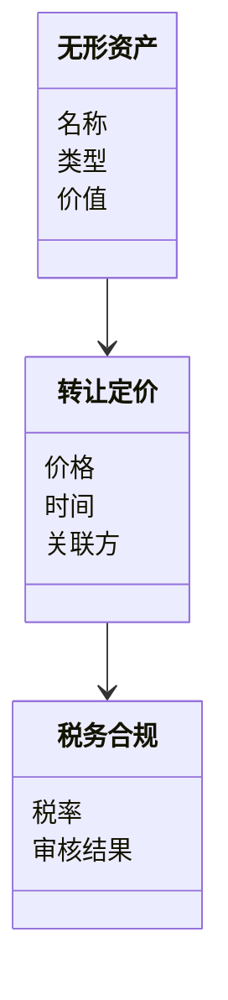
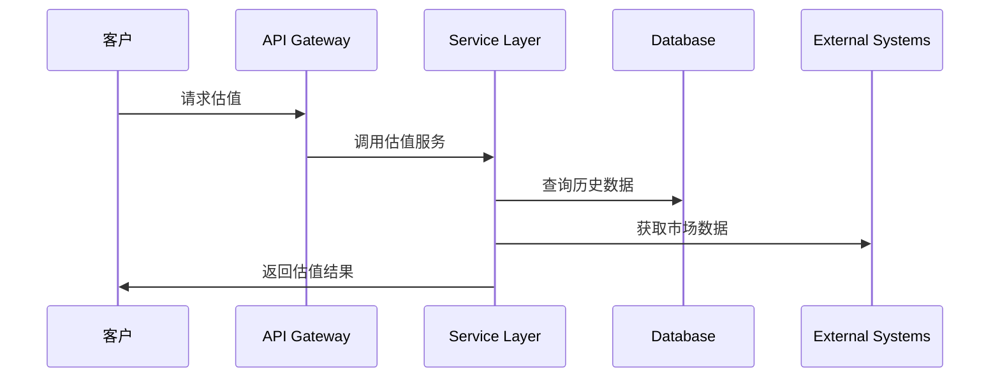

                 


# 股市估值在跨境无形资产转让定价中的应用

## 关键词：跨境无形资产、转让定价、股市估值、税务合规、国际商务、技术分析

## 摘要：本文探讨股市估值在跨境无形资产转让定价中的应用，分析其重要性、方法论和实际案例。通过详细讲解估值方法、系统架构设计和项目实战，帮助读者掌握如何在国际商务中合理评估无形资产价值，确保税务合规和商业利益。

---

## 第一部分：跨境无形资产转让定价概述

### 第1章：跨境无形资产转让定价的基本概念

#### 1.1 无形资产的定义与特点

- **1.1.1 无形资产的定义**  
  无形资产是指企业拥有或控制的、没有实物形态的长期资产，包括专利权、商标权、版权、特许经营权、商誉等。

- **1.1.2 无形资产的分类**  
  - 知识产权类：专利权、商标权、著作权  
  - 资源类：客户关系、供应商关系  
  - 技术类：专有技术、诀窍  

- **1.1.3 无形资产在国际贸易中的重要性**  
  无形资产是企业核心竞争力的体现，直接影响企业价值和跨国交易的税务合规性。

#### 1.2 跨境无形资产转让定价的定义

- **1.2.1 转让定价的定义**  
  转让定价是指跨国企业在关联方之间转让无形资产时，双方约定的价格，用于税务申报和审计。

- **1.2.2 跨境转让定价的特点**  
  - 关联性：发生在关联方之间  
  - 合理性：需符合独立交易原则  
  - 复杂性：涉及多国税务法规  

#### 1.3 股市估值在转让定价中的应用

- **1.3.1 股市估值的定义**  
  股市估值是基于市场数据和公司基本面分析，对上市公司股权进行定价的方法。

- **1.3.2 股市估值与转让定价的关系**  
  股市估值为转让定价提供市场参考，确保定价的合理性和公允性。

- **1.3.3 股市估值在跨境交易中的重要性**  
  帮助企业合理避税，减少税务纠纷，提升企业价值。

---

## 第二部分：股市估值的方法论

### 第2章：无形资产估值的基本方法

#### 2.1 市场法

- **2.1.1 可比公司分析**  
  - 基于可比公司的市场交易数据，分析目标公司的价值。  
  - 例如：分析同行业公司的市盈率（P/E）和市净率（P/B）。

- **2.1.2 交易案例比较**  
  - 基于历史交易案例，调整可比交易数据。  
  - 考虑交易时间、规模和行业差异。

- **2.1.3 市场法的优缺点**  
  - 优点：数据透明，操作简单  
  - 缺点：依赖市场数据，可比性有限  

#### 2.2 收益法

- **2.2.1 现金流折现模型（DCF）**  
  - 通过预测未来现金流，折现到现值。  
  - 公式：$$ NPV = \sum_{t=1}^{n} \frac{CF_t}{(1 + r)^t} $$  

- **2.2.2 内部收益率（IRR）**  
  - IRR是使净现值为零的折现率。  
  - 公式：$$ NPV = \sum_{t=0}^{n} \frac{CF_t}{(1 + IRR)^t} = 0 $$  

- **2.2.3 收益法的适用场景**  
  - 当企业有稳定的现金流和可预测的收益时适用。

#### 2.3 成本法

- **2.3.1 重置成本法**  
  - 计算重新获得相同资产的成本。  
  - 公式：$$ 重置成本 = \sum \text{各项成本} $$  

- **2.3.2 历史成本法**  
  - 以历史成本为基础，调整通货膨胀因素。

- **2.3.3 成本法的局限性**  
  - 未考虑资产的未来收益能力。

### 第3章：股市估值的关键因素分析

#### 3.1 市场条件的影响

- **3.1.1 市场波动对估值的影响**  
  市场波动会导致估值的不确定性。

- **3.1.2 行业趋势对估值的影响**  
  行业增长趋势直接影响估值。

- **3.1.3 宏观经济环境对估值的影响**  
  宏观经济政策、利率变化等影响估值。

#### 3.2 无形资产的生命周期

- **3.2.1 资产形成阶段**  
  早期投入，估值较低。

- **3.2.2 成熟阶段**  
  资产价值稳定，估值较高。

- **3.2.3 衰退阶段**  
  资产价值下降，估值较低。

#### 3.3 企业内部因素

- **3.3.1 管理层决策**  
  管理层的战略决策影响估值。

- **3.3.2 内部研发能力**  
  强大的研发能力提升资产价值。

- **3.3.3 企业战略规划**  
  明确的战略规划帮助合理估值。

---

## 第三部分：跨境无形资产转让定价中的特殊议题

### 第4章：关联方交易与税务合规

#### 4.1 关联方交易的定义与影响

- **4.1.1 关联方交易的定义**  
  关联方交易是指发生在同一企业控制下的关联方之间的交易。

- **4.1.2 关联方交易的影响**  
  - 可能导致税务风险  
  - 影响企业价值评估  

#### 4.2 独立交易原则

- **4.2.1 独立交易原则的定义**  
  假设关联方交易是在独立的市场条件下进行的。

- **4.2.2 独立交易原则的应用**  
  - 用于确定公允价值  
  - 用于税务审计和调整  

### 第5章：转让定价调查与应对策略

#### 5.1 税务机关的调查流程

- **5.1.1 调查启动**  
  税务机关基于合理怀疑启动调查。

- **5.1.2 调查方法**  
  - 文本分析  
  - 数据分析  
  - 实地检查  

#### 5.2 应对策略

- **5.2.1 提供充分的文档支持**  
  - 交易背景、合同条款、定价依据  

- **5.2.2 协商与调整**  
  - 与税务机关协商，调整定价  

- **5.2.3 法律合规**  
  - 遵守相关法律法规  

---

## 第四部分：实际操作中的案例分析

### 第6章：跨境无形资产转让定价的案例分析

#### 6.1 案例背景

- 某跨国企业将一项专利技术转让给子公司，需确定公允价格。

#### 6.2 估值方法选择

- 采用市场法和收益法结合。

#### 6.3 估值结果

- 市场法估值：$$1000万$$  
- 收益法估值：$$1200万$$  
- 最终确定价格：$$1100万$$  

#### 6.4 税务影响

- 减少税务负担，提升企业利润。

---

## 第五部分：系统分析与架构设计方案

### 第7章：系统功能设计

#### 7.1 领域模型（Mermaid 类图）



#### 7.2 系统架构设计（Mermaid 架构图）


#### 7.3 系统接口设计

- API 接口：
  - GET /assets 获取无形资产列表
  - POST /pricing 计算转让定价

#### 7.4 系统交互（Mermaid 序列图）



---

## 第六部分：项目实战

### 第8章：环境安装与核心代码实现

#### 8.1 环境安装

- 安装 Python 和相关库：
  - pip install numpy pandas scikit-learn

#### 8.2 核心代码实现

```python
import numpy as np
from sklearn.linear_model import LinearRegression

def calculate_price(features):
    model = LinearRegression()
    model.fit(features[['size', 'revenue']], features['price'])
    return model.predict([[size, revenue]])

# 示例数据
data = {
    'size': [100, 200, 300],
    'revenue': [50000, 100000, 150000],
    'price': [1000000, 2000000, 3000000]
}
df = pd.DataFrame(data)
print(calculate_price(df))
```

#### 8.3 代码解读与分析

- 使用线性回归模型预测价格，基于资产规模和收入。

---

## 第七部分：总结与展望

### 第9章：总结与展望

#### 9.1 总结

- 股市估值是跨境无形资产转让定价的核心工具。
- 合理应用估值方法，确保税务合规和商业利益。

#### 9.2 展望

- 结合人工智能和大数据技术，提升估值的准确性和效率。

---

## 作者：AI天才研究院/AI Genius Institute & 禅与计算机程序设计艺术/Zen And The Art of Computer Programming

