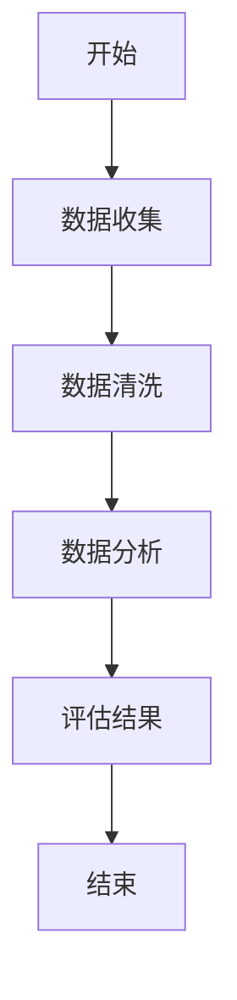
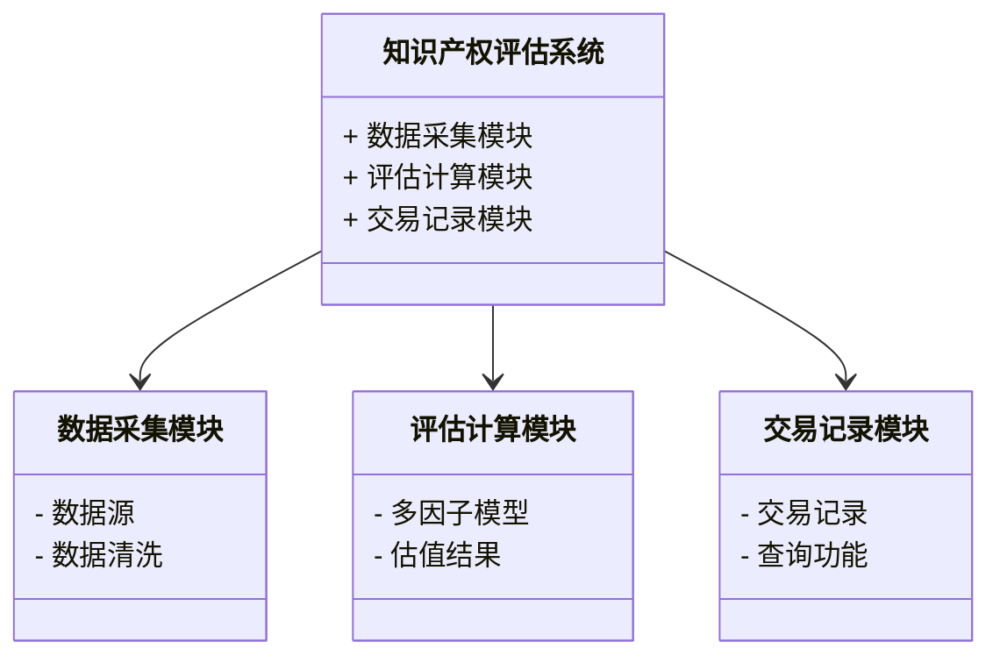

                 


# 股市估值在跨境知识产权交易中的应用

> **关键词**: 股市估值, 知识产权交易, 跨境交易, 估值模型, 金融分析

> **摘要**: 本文探讨了股市估值在跨境知识产权交易中的应用，分析了知识产权的经济价值评估方法、股市估值的核心要素以及两者结合的实际案例。文章从背景介绍、核心概念、算法原理、系统架构到项目实战，详细阐述了如何利用股市估值技术优化知识产权交易的流程与效率。

---

# 第一部分: 股市估值与知识产权交易的背景与基础

## 第1章: 股市估值与知识产权交易的背景介绍

### 1.1 股市估值的基本概念

#### 1.1.1 股市估值的定义与作用
股市估值是指通过对企业的财务数据、市场表现和行业环境等多方面因素的分析，对其股票价值进行评估的过程。其作用在于帮助投资者确定股票的合理价格区间，从而做出投资决策。

#### 1.1.2 股票价值的评估方法
股票价值的评估方法主要包括市盈率（P/E）、市净率（P/B）、股息率等指标。这些指标能够从不同角度反映企业的盈利能力、资产质量及分红能力。

#### 1.1.3 股市估值的核心要素
股市估值的核心要素包括企业财务状况、行业竞争环境、宏观经济政策和市场情绪等。这些因素共同影响着股票的市场价值。

### 1.2 知识产权的基本概念

#### 1.2.1 知识产权的定义与分类
知识产权是指依法保护的创造性成果和符号标识，主要包括专利权、商标权、著作权、版权等。不同类型的知识产权具有不同的法律保护期限和评估标准。

#### 1.2.2 知识产权的保护与交易特点
知识产权的保护主要通过法律手段实现，其交易特点包括无形性、地域性和可分割性。这些特点使得知识产权的评估和交易过程具有一定的复杂性。

### 1.3 股市估值与知识产权交易的关联性

#### 1.3.1 知识产权对企业价值的影响
知识产权是企业核心竞争力的重要组成部分。例如，一项具有市场领先的技术专利能够显著提升企业的盈利能力，从而影响其股票价值。

#### 1.3.2 股市估值在知识产权交易中的作用
股市估值能够为企业知识产权的交易提供参考依据。通过评估知识产权的市场价值，交易双方可以更合理地确定交易价格，降低交易风险。

#### 1.3.3 跨境知识产权交易的特殊性
跨境知识产权交易涉及不同国家的法律、税收政策和市场环境，增加了交易的复杂性和不确定性。股市估值在这一过程中需要考虑更多的外部因素。

---

## 第2章: 股市估值与知识产权交易的核心概念

### 2.1 知识产权评估的核心要素

#### 2.1.1 知识产权的经济价值评估
经济价值评估主要关注知识产权的市场收益能力。例如，一项专利的技术先进性决定了其市场应用前景，从而影响其经济价值。

#### 2.1.2 知识产权的市场价值评估
市场价值评估需要考虑同类知识产权的交易案例和市场供需关系。通过对比分析，可以更准确地评估知识产权的市场价值。

#### 2.1.3 知识产权的法律风险评估
法律风险评估主要关注知识产权的法律保护状态。例如，是否存在侵权风险或法律纠纷，这些都会影响知识产权的交易价值。

### 2.2 股市估值在知识产权交易中的应用

#### 2.2.1 股市估值的基本模型
股市估值的基本模型包括市盈率模型和市净率模型。这些模型可以用于评估企业的整体价值，进而影响其知识产权的交易价值。

#### 2.2.2 知识产权交易中的估值方法
知识产权交易中的估值方法主要包括收益法、市场法和成本法。这些方法各有优缺点，适用于不同的交易场景。

#### 2.2.3 股市估值与知识产权交易的结合点
股市估值与知识产权交易的结合点主要体现在企业价值评估和市场风险分析。通过股市估值，可以更准确地评估知识产权对企业整体价值的贡献。

---

## 第3章: 股市估值与知识产权交易的核心概念联系

### 3.1 知识产权评估的属性特征对比表

| 属性       | 专利       | 商标       | 版权       |
|------------|------------|------------|------------|
| 保护期限   | 20年       | 10年       | 不固定     |
| 保护对象   | 技术方案   | 商标标识   | 创作作品   |
| 评估重点   | 技术先进性 | 市场影响力 | 独创性     |

### 3.2 知识产权交易的ER实体关系图

```mermaid
erDiagram
    actor 交易主体 {
        string 名称
        string 类型
    }
    entity 知识产权 {
        string 名称
        string 类型
        string 状态
    }
    entity 交易记录 {
        int 交易ID
        string 交易时间
        decimal 交易金额
    }
    交易主体 --> 知识产权 : 拥有
    交易主体 --> 交易记录 : 参与
    知识产权 --> 交易记录 : 关联
```

---

# 第二部分: 股市估值与知识产权交易的算法原理

## 第4章: 知识产权的评估算法

### 4.1 知识产权评估的基本流程

#### 4.1.1 数据收集
数据收集是知识产权评估的基础，包括企业的财务数据、市场数据和法律数据等。

#### 4.1.2 数据清洗
数据清洗旨在去除无效数据和异常值，确保数据的准确性和完整性。

#### 4.1.3 数据分析
数据分析通过统计学方法和机器学习算法，对知识产权的市场价值进行评估。

### 4.2 知识产权评估的算法实现



#### 4.2.1 算法原理
知识产权评估的算法原理基于多因子模型，考虑企业的财务指标、市场表现和行业环境等多个因素。

#### 4.2.2 算法实现
以下是Python代码实现：

```python
import pandas as pd
import numpy as np

# 数据预处理
data = pd.read_csv('ip_data.csv')
data.dropna(inplace=True)

# 计算市盈率
data['PE'] = data['市盈率'] = data['股价'] / data['每股收益']

# 计算市净率
data['PB'] = data['股价'] / data['每股净资产']

# 构建评估模型
from sklearn.linear_model import LinearRegression
model = LinearRegression()
model.fit(data[['PE', 'PB']], data['股价'])

# 预测股价
predicted_price = model.predict(data[['PE', 'PB']])
```

---

## 第5章: 知识产权交易中的股市估值模型

### 5.1 估值模型的基本框架

#### 5.1.1 数据预处理
数据预处理包括数据清洗、特征选择和数据标准化。

#### 5.1.2 特征选择
特征选择是通过统计学方法筛选出对股价影响最大的因素。

#### 5.1.3 估值模型
估值模型基于回归分析和机器学习算法，评估知识产权的市场价值。

### 5.2 估值模型的实现

#### 5.2.1 回归分析
回归分析是一种常用的估值方法，可以通过历史数据拟合出股价与知识产权价值的关系。

#### 5.2.2 机器学习模型
机器学习模型（如随机森林）可以用于复杂场景下的知识产权价值评估。

---

# 第三部分: 系统分析与架构设计

## 第6章: 股市估值与知识产权交易的系统分析

### 6.1 业务场景分析

#### 6.1.1 知识产权评估系统
知识产权评估系统需要实现数据采集、评估计算和结果展示功能。

#### 6.1.2 交易记录管理系统
交易记录管理系统用于记录和管理知识产权的交易信息。

### 6.2 系统功能设计

#### 6.2.1 数据采集模块
数据采集模块负责收集企业的财务数据、市场数据和法律数据。

#### 6.2.2 评估计算模块
评估计算模块基于多因子模型计算知识产权的市场价值。

#### 6.2.3 交易记录模块
交易记录模块用于记录知识产权的交易信息，包括交易金额和交易时间。

### 6.3 系统架构设计

#### 6.3.1 系统类图
以下是系统类图：



---

## 第7章: 知识产权交易的系统架构设计

### 7.1 系统架构设计

#### 7.1.1 模块划分
系统分为前端模块和后端模块，前端模块负责用户交互，后端模块负责数据处理和计算。

#### 7.1.2 数据库设计
数据库设计包括知识产权信息表、交易记录表和用户信息表。

#### 7.1.3 接口设计
接口设计通过RESTful API实现前后端的数据交互。

### 7.2 系统交互流程

#### 7.2.1 用户登录
用户通过登录界面输入用户名和密码，系统验证用户身份。

#### 7.2.2 数据查询
用户在前端输入查询条件，系统调用后端接口获取数据并展示。

---

# 第四部分: 项目实战与总结

## 第8章: 项目实战

### 8.1 项目背景

#### 8.1.1 项目目标
项目目标是开发一个基于股市估值的知识产权评估系统。

#### 8.1.2 项目需求
项目需求包括数据采集、评估计算和交易记录管理功能。

### 8.2 项目实现

#### 8.2.1 环境安装
安装Python和相关库（如pandas、numpy、scikit-learn）。

#### 8.2.2 核心代码实现
以下是核心代码实现：

```python
import pandas as pd
from sklearn.linear_model import LinearRegression

# 数据预处理
data = pd.read_csv('ip_data.csv')
data.dropna(inplace=True)

# 特征选择
features = data[['PE', 'PB']]
target = data['股价']

# 构建模型
model = LinearRegression()
model.fit(features, target)

# 预测股价
predicted_price = model.predict(features)
```

#### 8.2.3 实际案例分析
通过实际案例分析，验证模型的准确性和实用性。

### 8.3 项目总结

#### 8.3.1 项目成果
项目成果是一个功能完善的知识产权评估系统，能够帮助企业优化知识产权交易过程。

#### 8.3.2 经验总结
经验总结包括数据处理的关键性、模型选择的重要性以及系统设计的合理性。

---

## 第9章: 总结与展望

### 9.1 总结

#### 9.1.1 核心观点回顾
股市估值在知识产权交易中的应用具有重要意义，能够帮助企业优化资源配置和提高交易效率。

#### 9.1.2 方法总结
通过多因子模型和机器学习算法，可以更准确地评估知识产权的市场价值。

### 9.2 展望

#### 9.2.1 未来研究方向
未来研究方向包括更复杂的模型开发、多维度数据的整合以及跨市场的应用研究。

#### 9.2.2 拓展建议
拓展建议包括进一步优化系统功能、扩大应用范围以及加强国际合作。

---

# 作者：AI天才研究院/AI Genius Institute & 禅与计算机程序设计艺术 /Zen And The Art of Computer Programming

