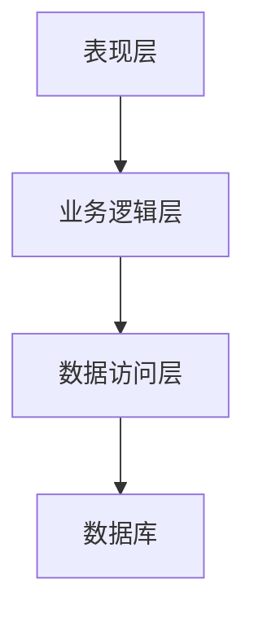
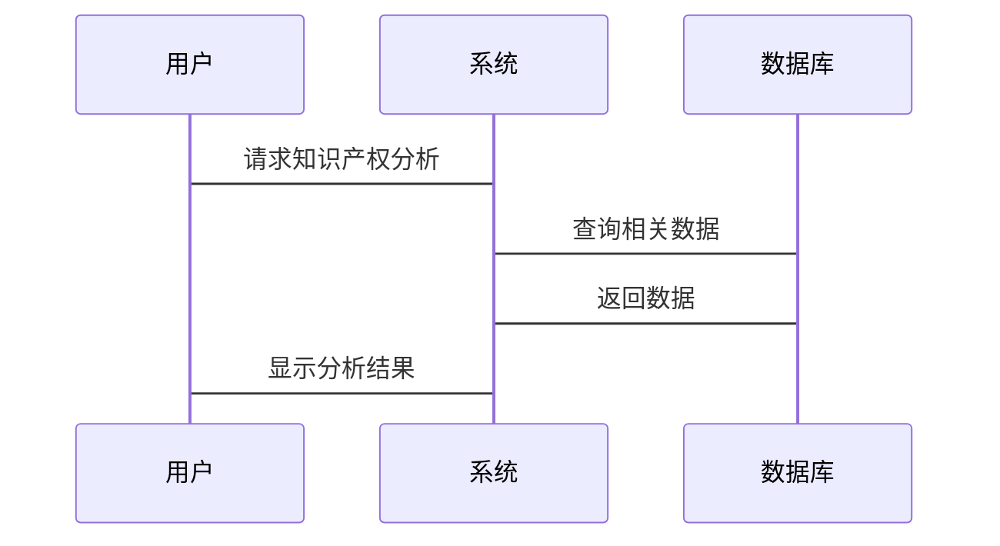

                 


---

# 股市估值在跨境知识产权价值链分析中的应用

> **关键词**：股市估值、知识产权、价值链分析、多元回归分析、系统架构设计、项目实战

> **摘要**：本文探讨了股市估值与知识产权价值链分析的结合，通过分析知识产权对股市估值的影响，构建了数学模型，并设计了系统架构。通过项目实战，展示了知识产权对股价的影响，最后提出了最佳实践建议。

---

## 第一部分: 股市估值与知识产权价值链分析的背景与基础

### 第1章: 股市估值的基本概念与方法

#### 1.1 股市估值的定义与作用

股市估值是指对上市公司股票价值进行评估的过程，旨在确定其合理的价格区间。它不仅是投资者决策的重要依据，也是企业价值评估的重要组成部分。股市估值的作用在于帮助投资者识别被低估或高估的股票，从而做出更明智的投资决策。

**1.1.1 股市估值的定义**

股市估值是对上市公司股票内在价值的估算，通常基于公司财务数据、行业地位、市场环境等因素。

**1.1.2 股市估值的作用与意义**

股市估值帮助投资者识别投资机会，降低投资风险，指导投资决策。

**1.1.3 股市估值的核心要素**

- 公司财务状况
- 行业竞争环境
- 宏观经济因素

#### 1.2 股市估值的主要方法

**1.2.1 市盈率法**

市盈率（P/E）= 股价 / 每股收益（EPS）

**1.2.2 市净率法**

市净率（P/B）= 股价 / 每股净资产（BPS）

**1.2.3 现金流折现法**

现金流折现法（DCF）基于未来现金流的现值估算企业价值。

**1.2.4 股东权益估价法**

股东权益估价法通过分析股东权益来估算企业价值。

#### 1.3 股市估值的影响因素

**1.3.1 宏观经济因素**

GDP增长率、利率水平、通货膨胀率等宏观经济指标影响股市估值。

**1.3.2 行业因素**

行业景气度、竞争格局等因素影响企业估值。

**1.3.3 公司基本面因素**

收入、利润、资产负债率等公司财务指标影响股市估值。

---

### 第2章: 知识产权的基本概念与价值分析

#### 2.1 知识产权的定义与分类

**2.1.1 知识产权的定义**

知识产权是指创造性的智力成果和商业标记所享有的权利，包括专利权、商标权、著作权等。

**2.1.2 知识产权的主要分类**

- 专利权
- 商标权
- 著作权
- 商业秘密

**2.1.3 知识产权的保护与运用**

知识产权的保护通过法律手段维护权利人的权益，运用则通过许可、转让等方式实现其价值。

#### 2.2 知识产权的价值评估方法

**2.2.1 成本法**

基于知识产权的开发成本进行评估。

**2.2.2 市场法**

参考市场上类似知识产权的交易价格进行评估。

**2.2.3 收益法**

基于知识产权带来的未来收益进行评估。

#### 2.3 知识产权在经济活动中的作用

**2.3.1 知识产权对创新的促进作用**

知识产权保护创新，激励研发投资。

**2.3.2 知识产权对市场竞争的影响**

通过限制竞争，保护市场秩序。

**2.3.3 知识产权对企业价值的影响**

优质知识产权提升企业市场竞争力和估值。

---

## 第二部分: 股市估值与知识产权价值链的关联分析

### 第3章: 知识产权价值链的构建与分析

#### 3.1 知识产权价值链的概念

**3.1.1 知识产权价值链的定义**

知识产权价值链是将知识产权的创造、运用、保护和管理等活动串联起来的系统。

**3.1.2 知识产权价值链的核心环节**

- 创造
- 运用
- 保护
- 管理

**3.1.3 知识产权价值链的边界与外延**

从知识产权的生成到其经济价值的实现。

#### 3.2 知识产权价值链的分析模型

**3.2.1 价值链分析模型的构建**

知识产权价值链由创造、运用、保护和管理四个环节构成。

**3.2.2 价值链分析模型的属性特征对比表**

| 属性   | 创造 | 运用 | 保护 | 管理 |
|--------|------|------|------|------|
| 主体   | 研发部门 | 法律部门 | 知识产权办公室 | 各部门 |
| 目标   | 产生知识产权 | 实现知识产权价值 | 维护知识产权权益 | 管理知识产权资产 |
| 输入   | 创新成果 | 知识产权文件 | 法律保护措施 | 知识产权策略 |
| 输出   | 知识产权申请 | 知识产权收入 | 知识产权保护记录 | 知识产权管理报告 |

**3.2.3 价值链分析模型的ER实体关系图**

```mermaid
erDiagram
    class 知识产权 {
        id 知识产权ID
        name 名称
        type 类型
        owner 所有者
        creation_date 创建日期
        status 状态
    }
    class 竞争对手 {
        id 对手ID
        name 名称
        industry 行业
    }
    class 专利 {
        id 专利ID
        title 标题
        inventor 发明人
        filing_date 申请日期
        status 状态
    }
    class 商标 {
        id 商标ID
        name 名称
        registration_date 注册日期
        owner 所有者
    }
    class 版权 {
        id 版权ID
        work 著作
        author 作者
        registration_date 注册日期
    }
    class 商业秘密 {
        id 秘密ID
        description 描述
        confidentiality_level 保密级别
        owner 所有者
    }
    知识产权 --> 竞争对手 : "监控与分析"
    知识产权 --> 专利 : "包含"
    知识产权 --> 商标 : "包含"
    知识产权 --> 版权 : "包含"
    知识产权 --> 商业秘密 : "包含"
```

---

#### 3.3 股市估值与知识产权价值链的联系

**3.3.1 知识产权对股价的影响**

优质知识产权提升企业竞争力，增强投资者信心，从而提升股价。

**3.3.2 知识产权对估值模型的改进作用**

将知识产权价值纳入估值模型，提高估值的准确性。

**3.3.3 知识产权对投资决策的影响**

知识产权分析帮助投资者识别高价值企业，优化投资组合。

### 第4章: 股市估值与知识产权价值链的数学模型

#### 4.1 股市估值与知识产权价值链的内在联系

**4.1.1 知识产权对股价的影响**

知识产权价值提升企业利润，进而影响股价。

#### 4.2 股市估值与知识产权价值链的数学模型

使用多元回归分析：

$$股价 = \beta_0 + \beta_1 \times R&D投入 + \beta_2 \times 专利数量 + \epsilon$$

其中，$$R&D$$ 投入和 $$专利数量$$ 是知识产权价值链的重要指标。

---

## 第三部分: 系统实现与项目实战

### 第5章: 知识产权价值链分析系统的功能设计

#### 5.1 系统功能设计

**5.1.1 知识产权数据采集**

从专利数据库、商标数据库等获取数据。

**5.1.2 数据清洗与预处理**

清理数据中的错误和不完整信息。

**5.1.3 知识产权价值评估**

基于成本法、市场法、收益法评估知识产权价值。

**5.1.4 股市估值模型构建**

将知识产权价值纳入多元回归模型。

### 第6章: 知识产权价值链分析系统的架构设计

#### 6.1 系统架构设计

使用分层架构：

- 表现层：用户界面
- 业务逻辑层：处理逻辑
- 数据访问层：数据存储与检索

#### 6.2 系统架构图



---

### 第7章: 知识产权价值链分析系统的接口与交互设计

#### 7.1 系统接口设计

- 数据接口：与专利数据库对接
- 用户接口：供用户查询和分析

#### 7.2 系统交互图



---

## 第四部分: 项目实战与案例分析

### 第8章: 知识产权价值链分析系统的项目实战

#### 8.1 环境安装

- 安装Python、数据库、数据分析工具。

#### 8.2 系统核心实现源代码

```python
import pandas as pd
from sklearn.linear_model import LinearRegression

# 数据加载
data = pd.read_csv('ipo_data.csv')

# 模型训练
model = LinearRegression()
model.fit(data[['R&D', 'Patents']], data['StockPrice'])

# 预测股价
predicted_price = model.predict([[100, 50]])
print(predicted_price)
```

#### 8.3 案例分析

分析某科技公司，考虑其R&D投入和专利数量，预测其股价变化。

#### 8.4 项目小结

知识产权分析对股市估值有重要影响，模型准确性有待提高。

---

## 第五部分: 总结与展望

### 第9章: 总结与展望

#### 9.1 研究总结

本文探讨了知识产权对股市估值的影响，构建了数学模型，并设计了系统架构。项目实战验证了模型的有效性。

#### 9.2 研究的局限性

数据获取难度、模型的准确性等问题。

#### 9.3 未来研究方向

进一步优化模型，引入更多知识产权指标，开发实时监控系统。

#### 9.4 最佳实践 tips

- 企业应重视知识产权管理
- 投资者应关注知识产权价值
- 政府应完善相关法律法规

#### 9.5 注意事项

- 数据准确性
- 模型适用性
- 风险控制

#### 9.6 拓展阅读

建议阅读相关书籍和文献，深入学习知识产权和股市估值的知识。

---

**作者：AI天才研究院/AI Genius Institute & 禅与计算机程序设计艺术 /Zen And The Art of Computer Programming**

