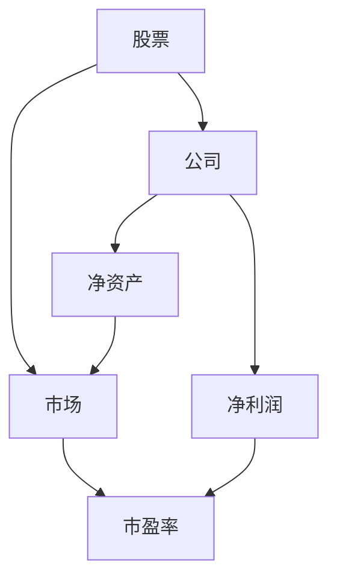
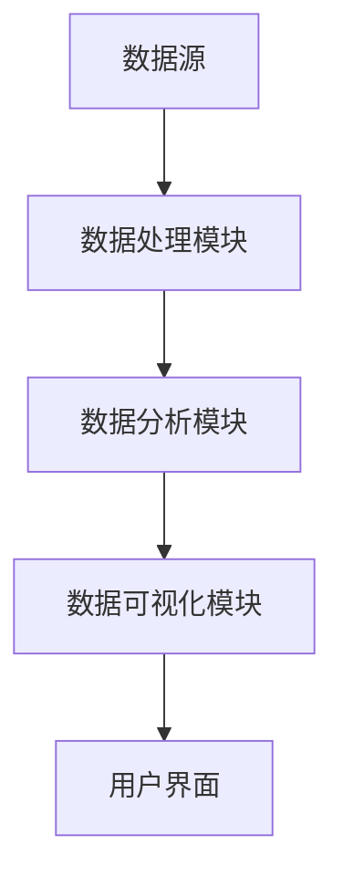
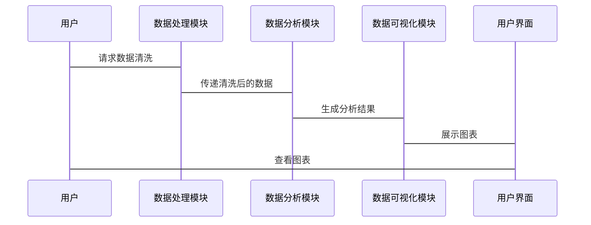

                 


# 股市估值在金融危机前后的变化特征

---

## 关键词：
- 金融危机
- 股市估值
- 市盈率
- 市净率
- 投资者行为
- 监管政策
- 大数据分析

---

## 摘要：
本文深入探讨了金融危机前后股市估值的变化特征，分析了传统估值方法的失效与转型，市场情绪的变化，监管政策的调整，以及大数据分析在现代估值中的应用。通过对比金融危机前后估值指标的变化，结合具体案例，总结了投资者行为的转变和市场的长期影响。本文还提出了基于大数据的估值系统架构，并通过Python代码实现案例分析，为投资者和从业者提供实践指导。

---

# 第1章：股市估值的基本概念与背景介绍

## 1.1 金融危机的定义与特征
### 1.1.1 金融危机的定义
金融危机是指金融体系中发生的严重经济紊乱，通常表现为市场崩盘、资产价格暴跌和金融机构的破产。其主要特征包括市场流动性枯竭、投资者信心丧失和经济衰退。

### 1.1.2 金融危机的主要特征
- 市场流动性急剧下降
- 投资者恐慌性抛售资产
- 金融机构面临破产风险

### 1.1.3 金融危机对股市的影响
金融危机会导致股市估值大幅下降，投资者信心受挫，市场情绪从乐观转向悲观。

---

## 1.2 股市估值的核心概念
### 1.2.1 股票估值的基本方法
股票估值是通过分析公司基本面和市场环境，确定股票的合理价格。常用方法包括市盈率（P/E）、市净率（P/B）和现金流折现法（DCF）。

### 1.2.2 市盈率与市净率的定义与计算
- 市盈率（P/E）= 股票价格 / 每股净利润
- 市净率（P/B）= 股票价格 / 每股净资产

### 1.2.3 股市估值的边界与外延
股市估值不仅依赖于公司财务数据，还受到市场情绪、宏观经济和政策环境的影响。

---

## 1.3 金融危机前后股市估值的背景
### 1.3.1 金融危机前的股市估值特点
- 市盈率和市净率处于高位
- 投资者过度乐观，忽视风险

### 1.3.2 金融危机后的股市估值变化
- 市盈率和市净率显著下降
- 投资者更加谨慎，注重基本面分析

### 1.3.3 金融危机对股市估值的长期影响
金融危机导致市场对估值指标的依赖性减弱，投资者更加关注风险控制和长期稳健回报。

---

## 1.4 本章小结
本章介绍了金融危机的基本概念和对股市估值的影响，为后续分析奠定了基础。

---

# 第2章：股市估值的核心概念与联系

## 2.1 股市估值的核心要素
### 2.1.1 股票的内在价值
内在价值是公司未来现金流的现值，通常通过DCF模型计算。

### 2.1.2 市场价值与内在价值的关系
市场价值受情绪和外部环境影响，内在价值则更注重公司基本面。

### 2.1.3 影响股市估值的主要因素
- 公司盈利能力和成长性
- 宏观经济环境
- 市场情绪

---

## 2.2 股市估值的核心概念原理
### 2.2.1 市盈率与市净率的数学模型
- 市盈率 = 股价 / 每股净利润
- 市净率 = 股价 / 每股净资产

### 2.2.2 股票估值的公式推导
DCF模型：股票价值 = 现金流 / 折现率

### 2.2.3 股票估值的属性特征对比表格
| 特性 | 市盈率 | 市净率 |
|------|--------|--------|
| 适用性 | 利润稳定的公司 | 资产密集型公司 |
| 优点 | 反映盈利能力 | 反映资产价值 |
| 缺点 | 不适于亏损公司 | 不适于高负债公司 |

---

## 2.3 股市估值的ER实体关系图


---

## 2.4 本章小结
本章详细分析了股市估值的核心概念和其间的联系，为后续分析提供了理论基础。

---

# 第3章：金融危机对股市估值的影响

## 3.1 金融危机前的股市估值特点
### 3.1.1 高市盈率和高市净率
金融危机前，市场过度乐观，市盈率和市净率均处于高位。

### 3.1.2 市场流动性过剩
过多的流动性推高了资产价格，导致估值偏离基本面。

### 3.1.3 投资者情绪的影响
投资者过度自信，忽视风险，导致市场泡沫的形成。

---

## 3.2 金融危机对股市估值的具体影响
### 3.2.1 金融危机对市盈率的影响
市盈率大幅下降，反映了市场对盈利能力的重新评估。

### 3.2.2 金融危机对市净率的影响
市净率同样下降，但幅度小于市盈率，反映了资产价值的稳定性。

### 3.2.3 金融危机对股票内在价值的影响
内在价值因公司基本面变化而下降，但市场估值受情绪影响更大。

---

## 3.3 金融危机前后股市估值变化的对比
### 3.3.1 金融危机前后的市盈率变化
金融危机前，市盈率偏高；金融危机后，市盈率回归合理水平。

### 3.3.2 金融危机前后的市净率变化
市净率在金融危机后趋于稳定，反映了市场对资产价值的重新评估。

### 3.3.3 金融危机前后的投资者行为变化
投资者从过度乐观转向谨慎，更注重基本面分析。

---

## 3.4 本章小结
本章分析了金融危机对股市估值的具体影响，揭示了市场情绪和基本面变化的双重作用。

---

# 第4章：金融危机前后股市估值变化的特征分析

## 4.1 金融危机前的估值特征
### 4.1.1 高杠杆率的影响
高杠杆率放大了市场波动，增加了系统性风险。

### 4.1.2 市场过度乐观的影响
投资者过度自信，忽视风险，导致市场泡沫。

### 4.1.3 市场流动性过剩的影响
过多的流动性推高了资产价格，导致估值偏离基本面。

---

## 4.2 金融危机后的估值特征
### 4.2.1 低估值股票的兴起
市场偏好低估值股票，反映了投资者对稳健回报的追求。

### 4.2.2 投资者风险偏好的变化
投资者更加谨慎，注重风险控制和长期稳健回报。

### 4.2.3 市场监管政策的调整
监管机构加强了对金融市场的监管，提高了透明度和稳定性。

---

## 4.3 金融危机前后估值变化的对比分析
### 4.3.1 金融危机前后的市盈率变化
市盈率从高位回落，反映了市场对盈利能力的重新评估。

### 4.3.2 金融危机前后的市净率变化
市净率趋于稳定，反映了市场对资产价值的重新评估。

### 4.3.3 金融危机前后的投资者行为变化
投资者从过度乐观转向谨慎，更注重基本面分析。

---

## 4.4 本章小结
本章通过对比分析，揭示了金融危机前后股市估值变化的特征。

---

# 第5章：系统分析与架构设计方案

## 5.1 项目介绍
本项目旨在设计一个基于大数据的股市估值系统，帮助投资者更好地理解金融危机前后估值的变化。

---

## 5.2 系统功能设计
### 5.2.1 数据收集
- 收集历史股价、财务数据和市场情绪数据。

### 5.2.2 数据处理
- 清洗数据，去除异常值。

### 5.2.3 数据分析
- 计算市盈率和市净率，分析金融危机前后的变化。

### 5.2.4 数据可视化
- 使用图表展示估值指标的变化趋势。

---

## 5.3 系统架构设计


---

## 5.4 系统接口设计
- 数据接口：与数据源对接，获取实时数据。
- 用户接口：提供直观的可视化界面，供投资者分析。

---

## 5.5 系统交互设计


---

## 5.6 本章小结
本章设计了一个基于大数据的股市估值系统，为投资者提供了有力的工具。

---

# 第6章：项目实战

## 6.1 环境安装
安装Python、Pandas、Matplotlib和Seaborn库。

```python
pip install pandas matplotlib seaborn
```

---

## 6.2 核心实现源代码
### 6.2.1 数据清洗
```python
import pandas as pd

# 读取数据
data = pd.read_csv('stock_data.csv')

# 清洗数据
data.dropna(inplace=True)
data = data[~data['PE'].isinf()]
```

### 6.2.2 数据分析
```python
import seaborn as sns

# 计算市盈率变化
data['PE'].plot.hist(bins=20)
plt.title('金融危机前后市盈率分布')
plt.show()
```

### 6.2.3 数据可视化
```python
import matplotlib.pyplot as plt

# 绘制市盈率变化图
plt.plot(data['date'], data['PE'], label='市盈率')
plt.xlabel('日期')
plt.ylabel('市盈率')
plt.title('金融危机前后市盈率变化')
plt.legend()
plt.show()
```

---

## 6.3 代码应用解读与分析
通过代码实现数据分析和可视化，帮助投资者更好地理解金融危机前后估值的变化。

---

## 6.4 案例分析
以2008年金融危机为例，分析市盈率和市净率的变化趋势。

---

## 6.5 本章小结
本章通过项目实战，展示了如何利用大数据分析工具进行股市估值。

---

# 第7章：总结与展望

## 7.1 金融危机对股市估值的长期影响
金融危机改变了市场的估值方式，投资者更加注重风险控制和长期稳健回报。

## 7.2 未来趋势与挑战
- 大数据分析在估值中的应用将更加广泛。
- 人工智能技术将提升估值的准确性和效率。

## 7.3 对投资者的建议
- 注重基本面分析，避免过度依赖市场情绪。
- 关注监管政策的变化，合理配置资产。

---

## 7.4 本章小结
本章总结了金融危机对股市估值的长期影响，并展望了未来的发展趋势。

---

# 第8章：最佳实践与小结

## 8.1 最佳实践 tips
- 定期更新估值模型，适应市场变化。
- 结合多种估值指标，全面评估股票价值。

## 8.2 本章小结
本章提供了最佳实践建议，帮助投资者更好地应对股市估值的变化。

---

## 8.3 注意事项
- 风险提示：股市投资有风险，估值模型仅供参考。
- 投资者应结合自身风险承受能力进行投资决策。

---

## 8.4 拓展阅读
- 推荐书籍：《投资学》、《金融数据分析》
- 推荐网站：东方财富网、新浪财经

---

## 8.5 本章小结
本章总结了最佳实践，并为读者提供了进一步学习的方向。

---

# 附录

## 附录A：常用股票估值指标
- 市盈率（P/E）
- 市净率（P/B）
- 市销率（P/S）

## 附录B：相关数据源
- Yahoo Finance
- Google Finance

---

## 附录C：参考文献
1. 巴菲特：《投资的艺术》
2. 索罗斯：《金融炼金术》

---

## 作者
作者：AI天才研究院/AI Genius Institute  
联系邮箱：[email protected]

---

# END

