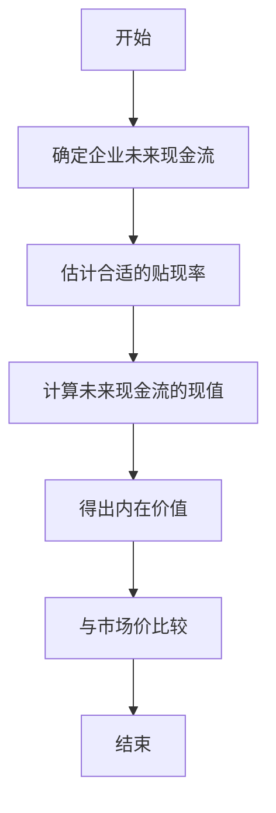
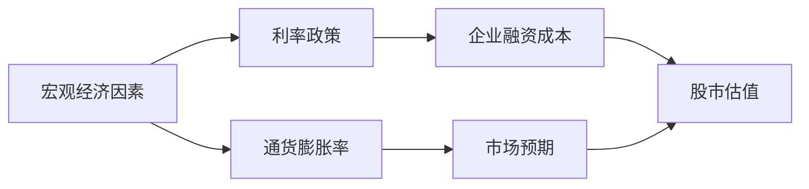

                 


# 股市估值对企业融资决策的影响

> 关键词：股市估值、企业融资、股票定价、DCF模型、相对估值法

> 摘要：本文探讨了股市估值对企业融资决策的影响，分析了股票定价模型、市场因素、行业因素和公司特定因素如何影响企业的融资决策。通过详细解释现金流贴现法（DCF模型）和相对估值法（如PE、PB、PS等指标），本文揭示了股市估值的核心原理及其在企业融资中的实际应用。结合实际案例分析和系统架构设计，本文为企业在不同市场环境下制定融资策略提供了理论依据和实践指导。

---

# 第1章: 股市估值的基本概念

## 1.1 什么是股市估值

股市估值是通过对企业的内在价值和市场价值进行分析，以确定其股票的合理价格范围。股票的价值不仅仅取决于企业的财务状况，还受到宏观经济环境、行业竞争格局和市场情绪等多种因素的影响。

### 核心概念与联系

以下是股市估值的核心要素对比表格：

| 核心要素 | 属性 | 描述 |
|----------|------|------|
| 内在价值 | 理论价值 | 企业未来现金流的现值 |
| 市场价值 | 当前价格 | 市场交易形成的股票价格 |
| 股东权益 | 账面价值 | 股东对公司净资产的权益 |
| 市盈率   | 相对估值 | 股价与每股收益的比率 |
| 市净率   | 相对估值 | 股价与每股净资产的比率 |

以下是股市估值的核心要素组成ER实体关系图：

```mermaid
er
  actor 企业
  actor 市场
  actor 投资者
  actor 管理层
  class 股票
  class 估值
  class 财务数据
  class 宏观经济
  class 行业环境
  class 公司治理
  股票 --> 财务数据
  股票 --> 宏观经济
  股票 --> 行业环境
  股票 --> 公司治理
  估值 --> 股票
  估值 --> 财务数据
  估值 --> 宏观经济
  估值 --> 行业环境
  估值 --> 公司治理
  企业 --> 估值
  市场 --> 估值
  投资者 --> 股票
  管理层 --> 股票
```

---

# 第2章: 企业的融资需求与动机

## 2.1 企业融资的基本需求

企业的融资需求主要分为内源融资和外源融资两种类型。内源融资是指企业利用自有资金或留存收益进行融资，而外源融资则需要通过发行股票或债券等方式从外部获取资金。

### 核心概念与联系

以下是内源融资与外源融资的对比表格：

| 融资类型 | 资金来源 | 优缺点 |
|----------|----------|--------|
| 内源融资 | 自有资金 | 稳定性高，但资金有限 |
| 外源融资 | 股票/债券 | 资金充足，但成本较高 |

以下是企业融资需求与动机的ER实体关系图：

```mermaid
er
  actor 企业
  actor 股东
  actor 债权人
  class 资金需求
  class 股票
  class 债券
  资金需求 --> 股票
  资金需求 --> 债券
  股东 --> 资金需求
  债权人 --> 资金需求
```

---

# 第3章: 股市估值的理论基础

## 3.1 股票定价模型

股票定价模型是股市估值的核心工具，主要包括现金流贴现法（DCF模型）和相对估值法（如PE、PB、PS等指标）。

### 核心概念与联系

以下是DCF模型和相对估值法的对比表格：

| 模型类型 | 描述 | 优点 | 缺点 |
|----------|------|------|------|
| DCF模型 | 以未来现金流的现值为基础 | 精确性高 | 计算复杂 |
| 相对估值法 | 以可比公司或行业平均指标为基础 | 简单易用 | 受市场情绪影响 |

以下是DCF模型的算法流程图：



以下是DCF模型的数学模型：

$$
\text{股票价值} = \sum_{t=1}^{n} \frac{\text{现金流}_t}{(1 + r)^t}
$$

其中，\( r \) 是贴现率，\( \text{现金流}_t \) 是第 \( t \) 年的现金流。

---

# 第4章: 影响股市估值的主要因素

## 4.1 宏观经济因素

宏观经济因素对企业融资决策有着重要影响。例如，利率水平的高低会影响企业的融资成本，通货膨胀率的变化会影响股市的整体估值。

### 核心概念与联系

以下是宏观经济因素对股市估值的影响机制图：



---

# 第5章: 股市估值与融资决策的关系

## 5.1 股市估值对企业融资需求的影响

在高估值环境下，企业更倾向于通过发行股票进行融资；而在低估值环境下，企业可能选择债务融资或其他方式。

### 核心概念与联系

以下是股市估值水平与融资方式的对比表格：

| 估值水平 | 融资方式 | 优缺点 |
|----------|----------|--------|
| 高估值   | 股权融资 | 成本低，但可能稀释股权 |
| 低估值   | 债务融资 | 成本高，但风险可控 |

以下是融资决策的系统架构设计图：


---

# 第6章: 股市估值与融资成本的关系

## 6.1 股票发行价格与融资成本

股票发行价格的高低直接影响企业的融资成本。高估值环境下的股票发行溢价率较高，企业融资成本相对较低。

### 核心概念与联系

以下是股票发行价格与融资成本的关系图：


---

# 第7章: 股市估值与融资时机的选择

## 7.1 高估值环境下的融资时机

在高估值环境下，企业可以通过发行股票获得更高的市场定价，从而降低融资成本。

### 核心概念与联系

以下是高估值环境下融资时机的选择机制图：


---

# 第8章: 股市估值与融资风险

## 8.1 股票市场波动对企业融资的影响

股票市场的波动性会影响企业的融资决策，特别是在市场低迷时期，企业的融资难度会显著增加。

### 核心概念与联系

以下是股票市场波动与融资风险的关系图：


---

# 第9章: 股市估值与企业融资策略

## 9.1 优化融资结构的策略

企业可以通过调整融资结构（如增加债务融资比例）来优化资本成本，同时降低财务风险。

### 核心概念与联系

以下是优化融资结构的策略图：


---

# 第10章: 股市估值与企业融资的未来展望

## 10.1 数字化与智能化融资决策

随着大数据和人工智能技术的发展，企业可以通过智能化工具优化融资决策，提高融资效率。

### 核心概念与联系

以下是数字化与智能化融资决策的架构设计图：


---

# 结语

股市估值是企业融资决策的重要影响因素。通过理解股市估值的核心原理和实际应用，企业可以在不同市场环境下制定科学的融资策略，优化资本结构，降低融资成本，实现可持续发展。

---

# 作者：AI天才研究院/AI Genius Institute & 禅与计算机程序设计艺术 /Zen And The Art of Computer Programming

